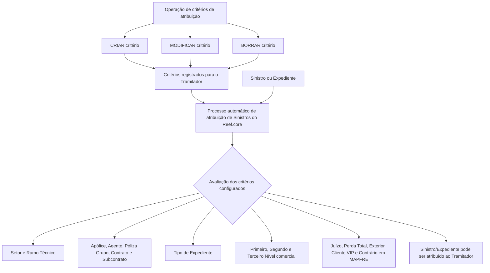

# Critérios de Atribuição de Sinistros/Expedientes do Tramitador no Reef.core

## 1. Metadados do Documento
- **Arquivo de Origem:** Não informado
- **Tipo de Documento:** Especificação Funcional
- **Domínio / Sistema:** Reef.core — atribuição automática de Sinistros/Expedientes
- **Público-Alvo:** Negócio, analistas funcionais, desenvolvedores e operação de sinistros
- **Data/Versão Identificada:** Não identificada
- **Status documental identificado:** Approved Source
- **Owner identificado:** `user:agonzalez_mapfre.com`

---

## 2. Resumo Executivo & Contexto de Negócio

O documento descreve a operação de manutenção dos critérios de atribuição de Sinistros/Expedientes associados a um Tramitador de Sinistros no sistema Reef.core. A operação permite criar novos critérios e modificar, complementar ou excluir critérios previamente registrados.

Os critérios determinam se o processo automático de atribuição de Sinistros do Reef.core pode atribuir determinados sinistros ou expedientes a um Tramitador. A seleção combina características da estrutura de produtos, apólices, intermediários, contratos, estrutura comercial e características específicas do sinistro ou expediente.

A especialização do Tramitador pode ser configurada com diferentes níveis de abrangência. Por exemplo, valores genéricos permitem abranger todos os setores, ramos técnicos ou tipos de expediente configurados, enquanto códigos específicos restringem a atribuição àquela característica.

O documento também prevê critérios condicionais para Sinistros/Expedientes em processo judicial, perda total, ocorrência no exterior, clientes VIP e casos em que o contrário está segurado na MAPFRE. Não são detalhados métodos HTTP, contratos JSON, persistência, prioridades entre critérios nem o algoritmo completo de combinação utilizado pelo Reef.core.

---

## 3. Arquitetura, Componentes & Tecnologias Envolvidas

### Componentes e conceitos identificados

| Componente / Conceito | Função descrita |
| :--- | :--- |
| **Reef.core** | Sistema no qual é implementado o processo automático de atribuição de Sinistros/Expedientes. |
| **Processo de Atribuição automático de Sinistros** | Processo que avalia os critérios registrados para determinar se Sinistros/Expedientes podem ser atribuídos a um Tramitador. |
| **Tramitador de Sinistros** | Responsável pela gestão de Sinistros/Expedientes que atendem aos critérios de atribuição configurados. |
| **Estrutura de Produtos da Companhia** | Origem das chaves de Setor e Ramo Técnico usadas como critérios. |
| **Estrutura Comercial no Sistema** | Origem das chaves de Primeiro, Segundo e Terceiro Nível usadas para especializar a gestão do Tramitador. |
| **Módulo de Juicios** | Módulo associado aos Sinistros e Expedientes em processo judicial. |
| **MAPFRE** | Entidade mencionada no critério para expedientes cujo contrário também esteja assegurado na MAPFRE. |

### Fluxo funcional extraído



> **Nota de Análise:** O documento descreve os atributos avaliados pelo processo automático, mas não informa a ordem lógica de avaliação, prioridade entre critérios, comportamento quando há múltiplos Tramitadores elegíveis ou regra para ausência de correspondência.

---

## 4. Regras de Negócio, Especificações Funcionais & Processos

### Operações habilitadas

A operação permite a manutenção dos critérios de atribuição de Sinistros/Expedientes de um Tramitador já registrado:

1. **CRIAR:** criar novos critérios de atribuição.
2. **MODIFICAR:** alterar critérios de atribuição registrados previamente.
3. **BORRAR:** excluir critérios de atribuição registrados previamente.
4. **Complementar:** complementar critérios previamente registrados.

### Sequência de captura

Os atributos do bloco de informação seguem a sequência de captura da esquerda para a direita e de cima para baixo. Quando não houver indicação expressa em contrário, os atributos são utilizados tanto para Pessoas Físicas quanto para Pessoas Jurídicas.

### Código do Tramitador

O Código do Tramitador é herdado do Tramitador cujos critérios de atribuição estão sendo modificados.

### Regras de especialização por produto

- **Setor:** identifica a chave do Setor da Estrutura de Produtos da Companhia.
  - O código genérico `9999` permite atribuir ao Tramitador sinistros de todos os setores configurados.
  - Um código de setor específico limita a consideração da atribuição aos sinistros daquele setor.
  - Combinações adequadas permitem atribuir sinistros de todos, vários ou apenas um setor ao Tramitador.

- **Ramo Técnico:** identifica a chave do Ramo Técnico da Estrutura de Produtos da Companhia.
  - O código genérico `999` permite atribuir ao Tramitador sinistros de todos os ramos técnicos configurados.
  - Um código de ramo técnico específico limita a consideração da atribuição aos sinistros daquele ramo técnico.

- **Tipo de Expediente:** identifica a chave de um tipo de expediente, incluindo os exemplos `DPM - Daños Materiales Propios`, `RC - Responsabilidad Civil` e `DAP - Lesionados`.
  - O código genérico `ZZZ` permite atribuir ao Tramitador sinistros de todos os tipos de expediente configurados.
  - Um código específico limita a consideração da atribuição aos sinistros daquele tipo de expediente.

### Regras de especialização por vínculo contratual, comercial ou de apólice

- **Número de Póliza:** identifica uma apólice para a qual, devido a características técnicas, comerciais ou experiência do Tramitador, a entidade considera adequado que um Tramitador determinado seja responsável pela gestão de seus Sinistros e/ou expedientes.
- **Clave de Agente:** identifica o intermediário e permite especializar a gestão do Tramitador para Sinistros/Expedientes de apólices intermediadas por aquele Agente.
- **Póliza Grupo:** identifica o código de uma apólice grupo e permite especializar a gestão do Tramitador para Sinistros/Expedientes das apólices associadas à apólice grupo.
- **Contrato:** identifica um código de contrato e permite ao Reef.core especializar a gestão do Tramitador para Sinistros/Expedientes de apólices associadas ao contrato.
- **Subcontrato:** identifica a chave de um subcontrato para determinar se os Sinistros/Expedientes de apólices com essa característica podem ser atribuídos ao Tramitador.
- **Clave del Primer Nivel:** identifica o Primeiro Nível da Estrutura Comercial no Sistema e permite especializar a gestão do Tramitador para Sinistros/Expedientes de apólices associadas àquela chave.
- **Clave del Segundo Nivel:** identifica o Segundo Nível da Estrutura Comercial no Sistema e permite especializar a gestão do Tramitador para Sinistros/Expedientes de apólices associadas àquela chave.
- **Clave del Tercer Nivel:** identifica o Terceiro Nível da Estrutura Comercial no Sistema e permite especializar a gestão do Tramitador para Sinistros/Expedientes de apólices associadas àquela chave.

### Regras condicionais sobre características do Sinistro/Expediente

- **Sinistros/Expedientes em Juicios:** quando ativado, permite atribuir ao Tramitador Sinistros e Expedientes em processo judicial, associados ao módulo de Juicios.
- **Sinistros com Pérdida Total:** quando ativado, permite atribuir ao Tramitador Sinistros e Expedientes identificados como perda total.
- **Sinistros ocorridos no Extranjero:** permite atribuir ao Tramitador Sinistros e Expedientes identificados como ocorridos no exterior.
- **Sinistros de Clientes VIP:** a ativação modula o processo de atribuição implementado no Reef.core, permitindo atribuir ao Tramitador Sinistros e Expedientes pertencentes a apólices de Clientes VIP.
- **Sinistros/Expedientes com Contrario en MAPFRE:** quando ativado, permite atribuir ao Tramitador Expedientes, normalmente de apólices de automóveis, cujo contrário também esteja segurado na MAPFRE.

---

## 5. Tabelas de Parâmetros, Ambientes e Estruturas de Dados

| Item / Parâmetro | Descrição / Função | Tipo / Valores / Formato | Ambiente / Observações |
| :--- | :--- | :--- | :--- |
| Código do Tramitador | Código do Tramitador cujos critérios estão sendo modificados. | Código; formato não informado. | Herdado do Tramitador selecionado. |
| Setor | Chave do Setor da Estrutura de Produtos usada pelo processo automático de atribuição. | Código específico ou genérico `9999`. | `9999` permite todos os setores configurados. |
| Ramo Técnico | Chave do Ramo Técnico da Estrutura de Produtos usada pelo processo automático de atribuição. | Código específico ou genérico `999`. | `999` permite todos os ramos técnicos configurados. |
| Número de Póliza | Chave de uma apólice cuja gestão deve ser atribuída a um Tramitador determinado. | Chave de apólice; formato não informado. | Aplicável por características técnicas, comerciais ou experiência do Tramitador. |
| Clave de Agente | Chave do intermediário para especializar a gestão de apólices intermediadas por esse Agente. | Chave; formato não informado. | Critério de especialização. |
| Póliza Grupo | Código de apólice grupo. | Código; formato não informado. | Abrange apólices associadas à apólice grupo. |
| Contrato | Código de contrato. | Código; formato não informado. | Abrange apólices associadas ao contrato. |
| Subcontrato | Chave de subcontrato. | Chave; formato não informado. | Avalia apólices que tenham essa característica. |
| Tipo de Expediente | Chave do tipo de expediente para especialização da gestão. | Código específico ou genérico `ZZZ`; exemplos: `DPM`, `RC`, `DAP`. | `ZZZ` permite todos os tipos de expediente configurados. |
| Clave del Primer Nivel | Código do Primeiro Nível da Estrutura Comercial. | Código; formato não informado. | Especializa a gestão por apólices associadas à chave. |
| Clave del Segundo Nivel | Código do Segundo Nível da Estrutura Comercial. | Código; formato não informado. | Especializa a gestão por apólices associadas à chave. |
| Clave del Tercer Nivel | Código do Terceiro Nível da Estrutura Comercial. | Código; formato não informado. | Especializa a gestão por apólices associadas à chave. |
| Se contemplan los Siniestros/Expedientes en Juicios | Habilita atribuição de casos em processo judicial. | Campo de ativação; valores não informados. | Relacionado ao módulo de Juicios. |
| Se contemplan los Siniestros con Pérdida Total | Habilita atribuição de casos identificados como perda total. | Campo de ativação; valores não informados. | Sem detalhamento adicional. |
| Se contemplan los Siniestros acaecidos en el Extranjero | Habilita atribuição de casos ocorridos no exterior. | Campo de ativação; valores não informados. | Sem detalhamento adicional. |
| Se contemplan los Siniestros de Clientes VIP | Habilita atribuição de casos associados a apólices de Clientes VIP. | Campo de ativação; valores não informados. | Modula o processo de atribuição do Reef.core. |
| Se contemplan los Siniestros/Expedientes con Contrario en MAPFRE | Habilita atribuição de expedientes cujo contrário é segurado na MAPFRE. | Campo de ativação; valores não informados. | Normalmente relacionado a apólices de automóveis. |

---

## 6. Bateria de Perguntas & Respostas para RAG (FAQ Sintético)

### P1: Qual é o objetivo da operação de critérios de atribuição do Tramitador?
**R:** A operação permite criar, modificar, complementar e excluir critérios de atribuição de Sinistros/Expedientes previamente registrados para um Tramitador de Sinistros no Reef.core.

### P2: O que acontece quando o campo Setor recebe o código genérico 9999?
**R:** O código genérico `9999` permite atribuir ao Tramitador sinistros de todos os setores configurados no sistema. Quando é utilizado um código de setor específico, a atribuição considera exclusivamente sinistros daquele setor.

### P3: Qual código permite considerar todos os ramos técnicos configurados?
**R:** O código genérico `999` no atributo Ramo Técnico permite atribuir ao Tramitador sinistros de todos os ramos técnicos configurados no sistema.

### P4: Como o campo Tipo de Expediente pode ser usado na atribuição?
**R:** O campo Tipo de Expediente permite especializar a gestão do Tramitador por tipo de expediente, com exemplos como DPM, RC e DAP. O código genérico `ZZZ` permite atribuir sinistros de todos os tipos de expediente configurados; um código específico restringe a atribuição ao tipo informado.

### P5: Para que serve o Número de Póliza nos critérios de atribuição?
**R:** O Número de Póliza identifica uma apólice que, por características técnicas, comerciais ou pela experiência do Tramitador, deve ter a gestão de seus Sinistros e/ou expedientes atribuída a um Tramitador determinado.

### P6: Como a Clave de Agente afeta a atribuição de Sinistros/Expedientes?
**R:** A Clave de Agente identifica o intermediário e permite especializar as tarefas de gestão do Tramitador para que Sinistros/Expedientes de apólices intermediadas por esse Agente possam ser atribuídos a ele.

### P7: Quais níveis da Estrutura Comercial podem ser usados como critérios?
**R:** O documento prevê Clave del Primer Nivel, Clave del Segundo Nivel e Clave del Tercer Nivel. Cada chave permite especializar a gestão do Tramitador para Sinistros/Expedientes de apólices associadas ao respectivo nível da Estrutura Comercial no Sistema.

### P8: O que deve ser configurado para atribuir casos em processo judicial a um Tramitador?
**R:** Deve ser ativado o campo “Se contemplan los Siniestros/Expedientes en Juicios”. Com essa ativação, podem ser atribuídos ao Tramitador Sinistros e Expedientes em processo judicial, relacionados ao módulo de Juicios.

### P9: Como habilitar a atribuição de sinistros identificados como perda total?
**R:** Deve ser ativado o campo “Se contemplan los Siniestros con Pérdida Total”. A ativação permite atribuir ao Tramitador os Sinistros e Expedientes identificados como perda total.

### P10: Como o Reef.core trata sinistros de Clientes VIP nesse processo?
**R:** A ativação do campo “Se contemplan los Siniestros de Clientes VIP” modula o processo de atribuição implementado no Reef.core, permitindo atribuir ao Tramitador Sinistros e Expedientes pertencentes a apólices de Clientes VIP.

### P11: Em que condição podem ser atribuídos expedientes cujo contrário também é segurado na MAPFRE?
**R:** Quando o campo “Se contemplan los Siniestros/Expedientes con Contrario en MAPFRE” é ativado, podem ser atribuídos ao Tramitador expedientes — normalmente de apólices de automóveis — cujo contrário esteja também segurado na MAPFRE.

### P12: O documento define a prioridade entre múltiplos critérios ou múltiplos Tramitadores elegíveis?
**R:** Não. O documento descreve os atributos que podem compor os critérios de atribuição, mas não detalha ordem de prioridade, resolução de conflitos, combinação lógica entre critérios ou comportamento quando mais de um Tramitador é elegível.

---

## 7. Glossário de Termos, Siglas & Conceitos-Chave

- **Reef.core:** Sistema que implementa o processo automático de atribuição de Sinistros/Expedientes.
- **Tramitador:** Responsável pela gestão de Sinistros/Expedientes atribuídos conforme critérios configurados.
- **Sinistro:** Ocorrência tratada no contexto de seguros.
- **Expediente:** Registro ou caso de gestão associado ao processo de sinistros.
- **Setor:** Chave da Estrutura de Produtos da Companhia utilizada como critério de atribuição.
- **Ramo Técnico:** Chave da Estrutura de Produtos da Companhia utilizada como critério de atribuição.
- **Póliza:** Apólice de seguro.
- **Póliza Grupo:** Apólice grupo cujas apólices associadas podem ser usadas na especialização da gestão.
- **Agente:** Intermediário identificado pela Clave de Agente.
- **Contrato:** Código de contrato associado a apólices e usado para especialização de gestão.
- **Subcontrato:** Chave de subcontrato usada pelo processo automático de atribuição.
- **DPM:** Daños Materiales Propios.
- **RC:** Responsabilidad Civil.
- **DAP:** Lesionados.
- **Juicios:** Módulo associado a Sinistros/Expedientes em processo judicial.
- **Clientes VIP:** Clientes cujas apólices podem ser consideradas em critério específico de atribuição.
- **Contrario en MAPFRE:** Situação em que o contrário de um expediente está segurado na MAPFRE.

---

## 8. Notas Críticas, Riscos & Limitações

- O documento não especifica a combinação lógica entre os critérios: não informa se os atributos são avaliados com lógica AND, OR ou outra regra.
- O documento não define prioridade, desempate ou resolução de conflitos quando múltiplos Tramitadores atendem aos mesmos critérios.
- Não há detalhamento sobre validações de formato, obrigatoriedade, domínio de valores ou mensagens de erro dos campos.
- Não são descritos métodos HTTP, APIs, contratos JSON, banco de dados, eventos, logs ou rotas operacionais.
- Não há definição explícita dos valores possíveis dos campos de ativação associados a Juicios, Pérdida Total, Extranjero, Clientes VIP e Contrario en MAPFRE.
- O termo “Consejo” aparece repetido no conteúdo extraído, sem orientação adicional associada.
- Não há detalhamento adicional sobre a utilização de critérios para Pessoas Físicas e Pessoas Jurídicas além da indicação de que os atributos se aplicam a ambas quando não houver especificação expressa.

---

## 9. Conteúdo Bruto Estruturado (Referência Fiel)

```text
--- [PÁGINA 1 DE 3] ---

MODIFICAR los Criterios de Asignación de Siniestros del Tramitador
Objetivo
Esta Operación permite Modicar, Complementar y Borrar los criterios de asignación de Siniestros/Expedientes del Tramitador de Siniestros
registrados previamente, además de Crear nuevos criterios de asignación.
Acciones habilitadas
 CREAR ( )
 MODIFICAR ( )
 BORRAR ( )
Criterios de asignación
De Izquierda a Derecha y de Arriba hacia Abajo, los siguientes atributos marcan la secuencia de captura de los Campos en este Bloque de
Información.
Si no se especica o indica expresamente, los Atributos se emplearán tanto en Personas Físicas como en Personas Jurídicas.
Código del Tramitador
Este dato hereda el código del Tramitador cuyos criterios de asignación se están modicando.
Sector (  )
Este campo identica la clave del Sector de la Estructura de Productos de la Compañía para que el Proceso de Asignación automático de
Siniestros de Reef.core determine si los siniestros/expedientes con esta característica puedan serle asignados al Tramitador.
Documentation / DOCUMENTACIÓN Reef
DOCUMENTACIÓN Reef
Mapfredocument
DOCUMENTACIÓN Reef
Owner
user:agonzalez_mapfre.com
Lifecycle
Approved Source
 / 
 VL
Buscar Inicio Soluciones Arquitecturas APIs Componentes Cloud Documentación Zeus Reef Ayuda
ES


--- [PÁGINA 2 DE 3] ---

Utilizando el valor genérico en este campo (código 9999) el sistema permite asignar al tramitador siniestros de todos los sectores
congurados en el sistema o bien, al utilizar el código de un sector en concreto de los existentes, considerar la asignación de siniestros
exclusivamente de este.
De esta manera y realizando las combinaciones adecuadas, al Tramitador se le podrán asignar siniestros de todos, de varios o de un único
Sector.
Ramo Técnico (  )
Este campo identica la clave del Ramo Técnico de la Estructura de Productos de la Compañía para que el Proceso de Asignación automático
de Siniestros de Reef.core determine si los siniestros/expedientes con esta característica puedan serle asignados al Tramitador.
Utilizando el valor genérico en este atributo (código 999) el sistema permite asignar al tramitador siniestros de todos los ramos técnicos
congurados en el sistema o bien, al utilizar el código de un ramo técnico en particular, considerar la asignación de siniestros
exclusivamente de este.
Número de Póliza ( )
Este campo identica la clave de una Póliza en la que por sus especiales características técnicas o comerciales o por la experiencia del
Tramitador, la entidad considere adecuado sea un Tramitador determinado quien se encargue y responsabilice de la Gestión de sus Siniestros
y/o expedientes.
Clave de Agente (   )
Este campo identica la clave del intermediario, clave que permitirá 'especializar' las labores de Gestión del Tramitador para que los
siniestros/expedientes de las pólizas intermediadas por este Agente le puedan ser asignados.
Póliza Grupo (  )
Este dato identica el Código de una póliza Grupo, código que permitirá 'especializar' las labores de Gestión del Tramitador para que los
siniestros/expedientes de las pólizas asociadas a la póliza grupo le puedan ser asignados.
Contrato (  )
Esta otro campo identica el código de un Contrato, código que permite a Reef.core 'especializar' las labores de Gestión del Tramitador para
que los siniestros/expedientes de las pólizas asociadas a dicho Contrato le puedan ser asignados.
Subcontrato (  )
Este campo identica la clave de un Subcontrato para que el Proceso de Asignación automático de Siniestros de Reef.core determine si los
siniestros/expedientes de las pólizas que tengan esta característica puedan serle asignados al Tramitador.
Tipo de Expediente (  )
Esta campo identica la clave de un 'tipo de expediente' determinado (DPM - Daños Materiales Propios,RC - Responsabilidad Civil, DAP -
Lesionados,...) que permite especializar la gestión del Tramitador.
Utilizando el valor genérico en este atributo (código ZZZ) el sistema permite asignar al tramitador siniestros de todos los tipos de
Expedientes congurados en el sistema o bien, al utilizar el código de un tipo de expediente en particular, considerar la asignación de
siniestros exclusivamente de este.
Clave del Primer Nivel (  )
Este dato contiene el código por el que se identica el Primer Nivel de la Estructura Comercial en el Sistema, clave que permite 'especializar'
las labores de Gestión del Tramitador para que los siniestros/expedientes de las pólizas asociadas a dicha Clave puedan serle asignados.
Consejo:
Consejo:
Consejo:


--- [PÁGINA 3 DE 3] ---

Clave del Segundo Nivel (  )
Este dato contiene el código por el que se identicará el Segundo Nivel de la Estructura Comercial en el Sistema que permite 'especializar' las
labores de Gestión del Tramitador para que los siniestros/expedientes de las pólizas asociadas a dicha Clave le sean asignados.
Clave del Tercer Nivel (  )
Este campo contiene el código por el que se identicará el Tercer Nivel de la Estructura Comercial en el Sistema que permite 'especializar' las
labores de Gestión del Tramitador para que los siniestros/expedientes de las pólizas asociadas a dicha Clave puedan serle asignados.
Se contemplan los Siniestros/Expedientes en Juicios ( )
Si se activa este campo al Tramitador se le podrán asignar los Siniestros y Expedientes que estén en proceso Judicial (módulo de Juicios).
Se contemplan los Siniestros con Pérdida Total ( )
De igual forma, si se activa este campo al Tramitador se le podrán asignar los Siniestros y Expedientes que estén identicados como pérdida
total.
Se contemplan los Siniestros acaecidos en el Extranjero ( )
Además, se pueden asignar al Tramitador los Siniestros y Expedientes que estén identicados como que hayan ocurrido en el Extranjero.
Se contemplan los Siniestros de Clientes VIP ( )
La activación de este dato modulará el Proceso de Asignación implementado en Reef.core permitiendo que al Tramitador se le puedan
asignar los Siniestros y Expedientes que pertenezcan a pólizas de Clientes VIP.
Se contemplan los Siniestros/Expedientes con Contrario en MAPFRE ( )
Por último, si se activa este campo al Tramitador se le podrán asignar Expedientes (normalmente de Pólizas de automóviles) cuyo Contrario
esté a su vez asegurado en MAPFRE.
```
