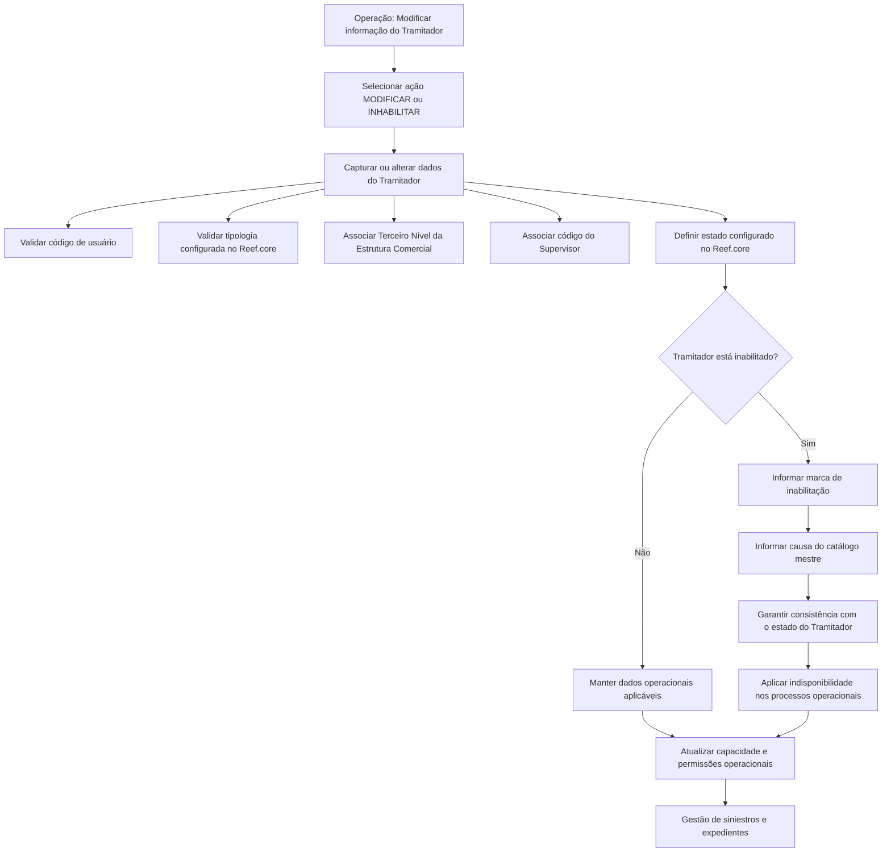

# Operação de Modificação e Inabilitação de Tramitador de Sinistros no Reef.core

## 1. Metadados do Documento
- **Arquivo de Origem:** Não informado no conteúdo extraído
- **Tipo de Documento:** Especificação Técnica / Especificação Funcional
- **Domínio / Sistema:** Reef.core — Gestão de Siniestros e Prestaciones / Mapfre
- **Público-Alvo:** Desenvolvedores, Arquitetos, Operação e Analistas Funcionais
- **Data/Versão Identificada:** Não identificada

---

## 2. Resumo Executivo & Contexto de Negócio

O documento descreve a operação destinada a modificar informações previamente registradas de um **Tramitador de Siniestros** no sistema **Reef.core**. A operação também permite inabilitar o Tramitador de Siniestros, tornando-o indisponível para utilização nos processos operacionais da entidade a partir do momento da inabilitação.

A especificação apresenta ações habilitadas de **MODIFICAR** e **INHABILITAR**, além de detalhar os campos associados ao cadastro, à estrutura organizacional, à supervisão, ao estado e à capacidade operacional do Tramitador de Siniestros. Os atributos devem ser capturados na sequência indicada, da esquerda para a direita e de cima para baixo.

O Tramitador de Siniestros é identificado por um código de usuário usado para conexão ao sistema. A classificação funcional do Tramitador deve estar associada a uma tipologia configurada no Reef.core. A alocação organizacional é representada pelo código do Terceiro Nível da Estrutura Comercial, correspondente à oficina à qual o Tramitador está atribuído.

O documento também estabelece controles para gestão de capacidade e de inabilitação. O número de expedientes pendentes é atualizado quando um expediente é aberto, encerrado, atribuído ou reatribuído, segundo os critérios de atribuição configurados no sistema. Adicionalmente, o número máximo de expedientes ativos e pendentes limita a quantidade que o Tramitador pode gerir simultaneamente.

A inabilitação requer consistência entre a marca de inabilitação, a causa de inabilitação e o estado do Tramitador. O documento não detalha os valores possíveis de estados, tipologias, causas, contratos de integração, métodos HTTP, banco de dados, trilhas de auditoria ou permissões de acesso.

---

## 3. Arquitetura, Componentes & Tecnologias Envolvidas

### Componentes e entidades identificados

| Componente / Entidade | Papel identificado no documento |
| :--- | :--- |
| **Reef.core** | Sistema no qual são configuradas tipologias e estados possíveis do Tramitador, além de suportar o processo de gestão de siniestros e expedientes. |
| **Tramitador de Siniestros** | Usuário ou entidade operacional responsável pela gestão de siniestros e expedientes. |
| **Catálogo de Tramitadores** | Catálogo que apresenta a tipologia do Tramitador. |
| **Estrutura Comercial** | Estrutura organizacional que contém o Terceiro Nível, correspondente à oficina de atribuição do Tramitador. |
| **Supervisor** | Entidade identificada pelo código do Supervisor atribuído ao Tramitador. |
| **Catálogo mestre do Sistema** | Catálogo que contém as causas de inabilitação definidas. |
| **Processo de Gestão de Siniestros y Prestaciones** | Processo operacional no qual o campo “Pregunta Consecuencias?” pode orientar a tomada de decisões do Tramitador. |
| **Planos de Tramitación** | Configuração organizacional ou operacional relacionada ao uso da Fecha de Control. |
| **Compañía** | Nível no qual deve ser indicado se os Planos de Tramitación trabalharão com a Fecha de Control. |
| **Mapfredocument** | Nome exibido no conteúdo de navegação/documentação. Não há detalhamento técnico adicional. |
| **Zeus** | Item exibido na navegação da documentação. Não há relação funcional ou técnica detalhada com a operação. |

### Fluxo funcional identificado



> **Nota de Análise:** O conteúdo não descreve uma arquitetura técnica de software com APIs, microsserviços, protocolos, banco de dados, infraestrutura, ambientes, URLs, portas ou mecanismos de autenticação. O diagrama representa exclusivamente o fluxo funcional explicitamente suportado pelo texto.

---

## 4. Regras de Negócio, Especificações Funcionais & Processos

### 4.1 Objetivo da operação

A operação permite modificar a informação previamente registrada de um Tramitador de Siniestros e permite inabilitar o Tramitador de Siniestros.

### 4.2 Ações habilitadas

- **MODIFICAR:** ação para modificar as informações previamente registradas do Tramitador de Siniestros.
- **INHABILITAR:** ação para marcar o Tramitador de Siniestros como inabilitado no sistema.

### 4.3 Sequência de captura dos campos

- Os atributos do bloco de informação seguem uma sequência de captura:
  1. Da esquerda para a direita.
  2. De cima para baixo.
- Quando não houver especificação ou indicação expressa em contrário, os atributos são utilizados tanto para:
  - Pessoas Físicas.
  - Pessoas Jurídicas.

### 4.4 Identificação e classificação do Tramitador

1. O **Código de Usuario del Tramitador** contém o código de usuário pelo qual o Tramitador se identifica ao conectar-se ao sistema.
2. A **Tipología del Tramitador** é uma propriedade do Catálogo de Tramitadores.
3. A tipologia atribuída deve pertencer a um dos tipos configurados para o Reef.core.
4. O **Tercer Nivel** corresponde ao código do Terceiro Nível da Estrutura Comercial, isto é, à oficina à qual o Tramitador está atribuído.
5. O **Código del Supervisor** contém o código do Supervisor designado ao Tramitador.

### 4.5 Estado e inabilitação

1. O **Estado del Tramitador** registra o estado do Tramitador na data de captura das informações.
2. O estado informado deve corresponder a um dos estados configurados no Reef.core.
3. A marca de **Inhabilitación** indica que o Tramitador de Siniestros está inabilitado no sistema.
4. Após a inabilitação, o Tramitador não deve ser utilizado, contemplado ou considerado nos processos operacionais da entidade.
5. Quando o Tramitador estiver inabilitado, a **Causa de Inhabilitación** deve conter o código de uma causa definida no catálogo mestre do sistema.
6. A marca de inabilitação e o valor da causa de inabilitação devem ser consistentes com o valor informado para o estado do Tramitador.

### 4.6 Gestão de perguntas sobre consequências

1. O campo **Pregunta Consecuencias?** altera o comportamento do Reef.core quando ativado.
2. Para os siniestros atribuídos ao Tramitador, a ativação do campo faz o sistema exibir as possíveis perguntas associadas às consequências.
3. Quando o campo **Pregunta Consecuencias?** não estiver ativado, o comportamento descrito é exibir as descrições das consequências.
4. A funcionalidade pode servir como guia para a tomada de decisões no Processo de Gestão de Siniestros y Prestaciones, conforme o expertise do Tramitador.

### 4.7 Gestão de capacidade de expedientes

1. O **Número de Expedientes Asignados** apresenta a quantidade de expedientes pendentes atribuídos a um Tramitador.
2. O número de expedientes pendentes é atualizado e modificado sempre que um expediente:
   - É aberto.
   - É encerrado.
   - É atribuído.
   - É reatribuído.
3. A atualização do número de expedientes ocorre de acordo com os critérios de atribuição de siniestros e expedientes que tenham sido considerados e configurados no sistema para os Tramitadores.
4. O **Número Máximo de Expedientes Asignados** identifica a quantidade máxima de expedientes ativos e pendentes que o Tramitador pode gerir simultaneamente.

### 4.8 Permissão para modificar a Fecha de Control

1. O campo **Modifica Fecha de Control** identifica se o Tramitador está capacitado ou não para modificar a data de controle durante a gestão de siniestros e expedientes.
2. A possibilidade de trabalhar com a Fecha de Control depende de ter sido indicado, no nível de companhia, que os Planos de Tramitación utilizarão a Fecha de Control.

> **Nota de Análise:** O documento não detalha os valores permitidos para estados, tipologias, causas de inabilitação, número máximo de expedientes, estrutura de permissões, comportamento de validação em caso de inconsistência ou processo de aprovação da modificação.

---

## 5. Tabelas de Parâmetros, Ambientes e Estruturas de Dados

| Item / Parâmetro | Descrição / Função | Tipo / Valores / Formato | Ambiente / Observações |
| :--- | :--- | :--- | :--- |
| Ação MODIFICAR | Permite modificar informações previamente registradas do Tramitador de Siniestros. | Ação habilitada. | Não há detalhamento de interface ou autorização. |
| Ação INHABILITAR | Permite inabilitar o Tramitador de Siniestros. | Ação habilitada. | A inabilitação torna o Tramitador não utilizável nos processos operacionais. |
| Código de Usuario del Tramitador | Código de usuário usado pelo Tramitador para identificar-se ao conectar-se ao sistema. | Código de usuário. | Não há formato ou regra de unicidade especificados. |
| Tipología del Tramitador | Propriedade do Catálogo de Tramitadores que classifica o Tramitador. | Um dos tipos configurados para Reef.core. | Os valores possíveis não são apresentados. |
| Tercer Nivel | Código do Terceiro Nível da Estrutura Comercial, correspondente à oficina do Tramitador. | Código organizacional. | Não há catálogo ou formato descrito. |
| Código del Supervisor | Código do Supervisor atribuído ao Tramitador. | Código de supervisor. | Não há formato ou regras de associação adicionais. |
| Estado del Tramitador | Registra o estado do Tramitador na data de captura das informações. | Um dos estados configurados no Reef.core. | Deve ser consistente com inabilitação e causa de inabilitação. |
| Inhabilitación | Indica que o Tramitador de Siniestros está inabilitado no sistema. | Marca / campo de inabilitação. | O documento não especifica representação técnica, como booleano ou enumerado. |
| Causa de Inhabilitación | Código da causa de inabilitação do Tramitador. | Código de causa definida no catálogo mestre do Sistema. | Aplicável quando o Tramitador estiver inabilitado. |
| Pregunta Consecuencias? | Configura a visualização de perguntas associadas às consequências nos siniestros atribuídos ao Tramitador. | Campo de ativação. | A ativação substitui a exibição de descrições das consequências pela exibição de possíveis perguntas associadas. |
| Número de Expedientes Asignados | Exibe a quantidade de expedientes pendentes atribuídos ao Tramitador. | Número. | Atualizado em abertura, encerramento, atribuição e reatribuição de expedientes. |
| Número Máximo de Expedientes Asignados | Define a quantidade máxima de expedientes ativos e pendentes geridos simultaneamente. | Número. | Não há limite mínimo, máximo ou regra de cálculo especificados. |
| Modifica Fecha de Control | Indica se o Tramitador pode modificar a data de controle na gestão de siniestros e expedientes. | Campo de capacidade ou permissão. | Depende da indicação, no nível de companhia, de uso da Fecha de Control nos Planos de Tramitación. |
| Reef.core | Sistema que contém configurações de tipologias e estados do Tramitador. | Sistema corporativo. | Não há versão, URL ou ambiente identificados. |
| Catálogo de Tramitadores | Catálogo que disponibiliza a tipologia do Tramitador. | Catálogo funcional. | Não há detalhamento de manutenção ou integração. |
| Catálogo mestre do Sistema | Catálogo que contém causas de inabilitação definidas. | Catálogo funcional. | Não há lista de causas no documento. |

---

## 6. Bateria de Perguntas & Respostas para RAG (FAQ Sintético)

### P1: Qual é o objetivo da operação de modificação do Tramitador no Reef.core?
**R:** A operação permite modificar informações previamente registradas de um Tramitador de Siniestros e também permite inabilitar esse Tramitador no sistema Reef.core.

### P2: Quais ações estão habilitadas para o Tramitador de Siniestros?
**R:** O documento identifica duas ações habilitadas: **MODIFICAR**, para alterar as informações do Tramitador de Siniestros, e **INHABILITAR**, para tornar o Tramitador inabilitado no sistema.

### P3: Como o Tramitador de Siniestros é identificado ao conectar-se ao sistema?
**R:** O Tramitador de Siniestros é identificado pelo campo **Código de Usuario del Tramitador**, que contém o código de usuário usado pelo Tramitador para identificar-se ao conectar-se ao sistema.

### P4: Qual é a regra para a Tipología del Tramitador?
**R:** A Tipología del Tramitador é uma propriedade do Catálogo de Tramitadores. A tipologia atribuída ao Tramitador deve corresponder a um dos tipos configurados para o Reef.core.

### P5: O que representa o campo Tercer Nivel?
**R:** O campo **Tercer Nivel** contém o código do Terceiro Nível da Estrutura Comercial, isto é, o código da oficina à qual o Tramitador está atribuído.

### P6: O que ocorre quando um Tramitador de Siniestros é inabilitado?
**R:** Quando a inabilitação é indicada, o Tramitador de Siniestros fica inabilitado no sistema e, a partir desse momento, não deve ser utilizado, contemplado ou considerado nos processos operacionais da entidade.

### P7: Como a causa de inabilitação deve se relacionar ao estado do Tramitador?
**R:** Quando o Tramitador estiver inabilitado, a Causa de Inhabilitación deve conter o código de uma causa definida no catálogo mestre do sistema. Tanto a marca de inabilitação quanto o valor da causa devem estar em consonância com o estado do Tramitador.

### P8: Qual é o efeito de ativar o campo Pregunta Consecuencias?
**R:** A ativação do campo **Pregunta Consecuencias?** altera o comportamento do Reef.core para que, nos siniestros atribuídos ao Tramitador, sejam visualizadas as possíveis perguntas associadas às consequências, em vez de serem exibidas as descrições das consequências.

### P9: Como o Número de Expedientes Asignados é atualizado?
**R:** O número de expedientes atribuídos representa os expedientes pendentes do Tramitador e é atualizado sempre que um expediente é aberto, encerrado, atribuído ou reatribuído. A atualização segue os critérios de atribuição de siniestros e expedientes configurados no sistema para os Tramitadores.

### P10: O que limita o Número Máximo de Expedientes Asignados?
**R:** O campo identifica o número máximo de expedientes ativos e pendentes que o Tramitador poderá gerir ao mesmo tempo. O documento não informa valores máximos concretos nem regras adicionais de cálculo.

### P11: Em que condição o Tramitador pode modificar a Fecha de Control?
**R:** O campo **Modifica Fecha de Control** identifica se o Tramitador está capacitado para modificar a data de controle na gestão de siniestros e expedientes. Essa possibilidade depende de ter sido indicado, no nível de companhia, que os Planos de Tramitación trabalharão com a Fecha de Control.

### P12: Os atributos da operação se aplicam a pessoas físicas e jurídicas?
**R:** Sim. Quando não houver especificação ou indicação expressa em contrário, os atributos descritos são utilizados tanto para Pessoas Físicas quanto para Pessoas Jurídicas.

---

## 7. Glossário de Termos, Siglas & Conceitos-Chave

- **Reef.core:** Sistema citado como responsável pela configuração de tipologias e estados possíveis do Tramitador e pelo suporte à gestão de siniestros e expedientes.
- **Tramitador de Siniestros:** Entidade ou usuário operacional responsável pela gestão de siniestros e expedientes.
- **Siniestro:** Termo utilizado no documento para o processo ou ocorrência gerida pelo Tramitador. O documento não fornece definição adicional.
- **Expediente:** Registro ou caso pendente, ativo, aberto, encerrado, atribuído ou reatribuído no processo de gestão.
- **Catálogo de Tramitadores:** Catálogo no qual é apresentada a tipologia do Tramitador.
- **Tipología del Tramitador:** Classificação do Tramitador que deve corresponder a um tipo configurado no Reef.core.
- **Tercer Nivel:** Código do Terceiro Nível da Estrutura Comercial, correspondente à oficina de atribuição do Tramitador.
- **Estructura Comercial:** Estrutura organizacional da qual faz parte o Terceiro Nível atribuído ao Tramitador.
- **Supervisor:** Entidade cujo código é atribuído ao Tramitador.
- **Inhabilitación:** Condição que torna o Tramitador indisponível para uso, consideração ou contemplação nos processos operacionais da entidade.
- **Causa de Inhabilitación:** Código de causa de inabilitação definida no catálogo mestre do sistema.
- **Pregunta Consecuencias?:** Campo que, quando ativado, exibe possíveis perguntas associadas às consequências nos siniestros atribuídos ao Tramitador.
- **Fecha de Control:** Data de controle que pode ser modificada pelo Tramitador se ele estiver capacitado e se os Planos de Tramitación estiverem configurados para utilizá-la.
- **Planes de Tramitación:** Planos mencionados como dependentes da indicação no nível de companhia para trabalhar com a Fecha de Control.
- **Mapfredocument:** Nome apresentado na navegação da documentação, sem explicação funcional ou técnica adicional.
- **Zeus:** Item apresentado na navegação da documentação, sem explicação funcional ou técnica adicional.

---

## 8. Notas Críticas, Riscos & Limitações

- O documento não informa o nome do arquivo de origem, versão, data de publicação ou data de vigência.
- O documento não apresenta métodos HTTP, contratos JSON, APIs, microsserviços, URLs, ambientes, portas, banco de dados, logs ou mecanismos de autenticação.
- Os valores permitidos para **Tipología del Tramitador**, **Estado del Tramitador** e **Causa de Inhabilitación** não são listados; apenas é informado que devem existir configurações ou catálogos no sistema.
- Não há definição técnica do formato dos campos, como tipo de dado, tamanho, obrigatoriedade, máscara, valores padrão ou tratamento de erro.
- O documento exige consistência entre estado, marca de inabilitação e causa de inabilitação, mas não descreve as combinações válidas nem o comportamento do sistema em caso de inconsistência.
- O documento não define os critérios concretos de atribuição e reatribuição de siniestros ou expedientes; apenas informa que esses critérios são configurados no sistema.
- Não há detalhamento sobre permissões, papéis de usuário ou quem pode executar as ações de modificar e inabilitar.
- Não há detalhamento adicional após as linhas identificadas como “Consejo:”.

---

## 9. Conteúdo Bruto Estruturado (Referência Fiel)

```text
--- [PÁGINA 1 DE 2] ---

MODIFICAR Información especíca del Tramitador
Objetivo
Esta Operación permite Modicar la información del Tramitador de Siniestros registrada previamente además de poder Inhabilitarlo.
Acciones habilitadas
 MODIFICAR ( )
 INHABILITAR ( )
Datos Tramitador
De Izquierda a Derecha y de Arriba hacia Abajo, los siguientes atributos marcan la secuencia de captura de los Campos en este Bloque de
Información.
Si no se especica o indica expresamente, los Atributos se emplearán tanto en Personas Físicas como en Personas Jurídicas.
Código de Usuario del Tramitador (  )
Este campo del bloque de información contiene el código del usuario con el que el Tramitador se va a identicar al conectarse al sistema.
Tipología del Tramitador (  )
Esta propiedad del Catálogo de Tramitadores muestra la Tipología del mismo, tipología que tiene que tener uno de los posibles tipos
congurados para Reef.core.
Tercer Nivel (  )
Este dato es el código del Tercer Nivel de la Estructura Comercial (ocina) al que está asignado el Tramitador.
Documentation / DOCUMENTACIÓN Reef
DOCUMENTACIÓN Reef
Mapfredocument
DOCUMENTACIÓN Reef
Owner
user:agonzalez_mapfre.com
Lifecycle
Approved Source
 / 
 VL
Buscar Inicio Soluciones Arquitecturas APIs Componentes Cloud Documentación Zeus Reef Ayuda
ES


--- [PÁGINA 2 DE 2] ---

Código del Supervisor (  )
Este dato contiene el código del Supervisor que tendrá asignado el Tramitador.
Estado del Tramitador (  )
Este campo registra el estado en el que se encuentra el Tramitador a la fecha de captura de su información, estado que tiene que tener uno
de los posibles estados congurados en Reef.core.
Inhabilitación ( )
Este Campo le indica al Sistema que el Tramitador de Siniestros está inhabilitado en el Sistema por lo que a partir del momento de su
inhabilitación no debería ser empleado, contemplado o considerado en los procesos operativos de la entidad.
Causa de Inhabilitación (   )
En el supuesto que el Tramitador estuviera Inhabilitado, este campo va a contener el código de una causa de Inhabilitación denida en el
catálogo maestro del Sistema.
Tanto la marca de inhabilitación como el valor de la causa de inhabilitación del Tramitador deben estar en consonancia con el valor que
indica el estado de tramitador.
Pregunta Consecuencias? ( )
La activación de este campo hace que el comportamiento de Reef.core varíe para que en los siniestros que tenga asignados el Tramitador se
visualicen las posibles preguntas asociadas a las consecuencias en vez de mostrar las descripciones de las mismas.
De acuerdo con el expertise del Tramitador, la activación de este campo le puede servir de guía en la toma de decisiones del Proceso de
Gestión de Siniestros y Prestaciones.
Número de Expedientes Asignados
Este dato muestra el número de expedientes pendientes que tiene asignado un Tramitador, sabiendo que cada vez que se abre, se termina, se
asigna o se reasigna un expediente, se actualiza y modica su contenido (Todo ello de acuerdo con los criterios de asignación de
siniestros/expedientes que se hayan considerado y congurado en el sistema para los tramitadores).
Número Máximo de Expedientes Asignados ( )
Este campo identica el número máximo de expedientes activos y pendientes que podrá tener gestionando el tramitador al mismo tiempo.
Modica Fecha de Control ( )
Este campo identica si el Tramitador está o no capacitado para modicar la fecha de control en la gestión de los siniestros/expedientes
(siempre y cuando se haya indicado a nivel de compañía que en los Planes de Tramitación se vaya a trabajar con la Fecha de Control).
Consejo:
Consejo:
```
