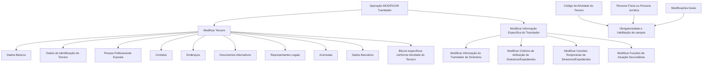

# Operação MODIFICAR Tramitador — Documentação Reef / Mapfre

## 1. Metadados do Documento
- **Arquivo de Origem:** Não informado; conteúdo extraído de 2 páginas.
- **Tipo de Documento:** Procedimento funcional.
- **Domínio / Sistema:** REEF / Mapfredocument / operação de Tramitador de Siniestros.
- **Público-Alvo:** Usuários do sistema, analistas funcionais e operação.
- **Data/Versão Identificada:** Não identificada.
- **Owner identificado:** `user:agonzalez_mapfre.com`
- **Lifecycle identificado:** `Approved Source / VL`

---

## 2. Resumo Executivo & Contexto de Negócio

O documento descreve a operação **MODIFICAR Tramitador**, destinada a complementar, modificar e/ou inabilitar informações associadas a um **Tramitador de Siniestros**. A alteração pode ocorrer tanto em blocos de informação compartilhados com a operação **MODIFICAR TERCERO** quanto em blocos específicos do Tramitador.

A obrigatoriedade e a habilitação dos campos não são constantes. O comportamento de preenchimento pode variar conforme o **código de atividade do Tercero**, conforme o Tercero seja uma **Persona Física** ou uma **Persona Jurídica**, e conforme modificações implementadas localmente na aplicação.

O documento também informa que a ordem de captura dos dados nos blocos de informação pode variar conforme o critério seguido pelo usuário no sistema. Portanto, o fluxo apresentado representa os grupos funcionais disponíveis, sem estabelecer uma sequência obrigatória única de navegação ou preenchimento.

A operação específica do Tramitador abrange quatro áreas: modificação das informações do Tramitador de Siniestros, critérios de atribuição de sinistros/expedientes, cessões temporárias de sinistros/expedientes e funções de atuação secundárias. O material não detalha campos, contratos, validações específicas por atributo, métodos HTTP, integrações técnicas ou mecanismos de persistência.

---

## 3. Arquitetura, Componentes & Tecnologias Envolvidas

Os elementos identificados no conteúdo são:

- **Operação MODIFICAR Tramitador:** operação funcional para complementar, modificar ou inabilitar informações do Tramitador de Siniestros.
- **MODIFICAR TERCERO:** operação relacionada aos blocos de informação compartilhados.
- **Tramitador de Siniestros:** entidade funcional que possui informações compartilhadas e específicas.
- **Tercero:** entidade cuja atividade e natureza — Persona Física ou Persona Jurídica — influenciam obrigatoriedade e habilitação de campos.
- **REEF:** referência de documentação exibida como “Documentation / DOCUMENTACIÓN Reef”.
- **Mapfredocument:** referência exibida na área de documentação.
- **Blocos de Informação Compartidos:** conjuntos de dados tratados no contexto de MODIFICAR TERCERO.
- **Blocos de Informação Específicos:** conjuntos de dados próprios da atividade do Tercero e da informação do Tramitador.



**Nota de Análise:** o documento apresenta relações funcionais entre a operação MODIFICAR Tramitador, MODIFICAR TERCERO e blocos de informação. Não detalha arquitetura física, microsserviços, bancos de dados, APIs, protocolos, URLs, ambientes, portas ou tecnologias de implementação.

---

## 4. Regras de Negócio, Especificações Funcionais & Processos

### 4.1 Finalidade da operação

A operação **MODIFICAR Tramitador** permite:

1. Complementar informações do Tramitador de Siniestros.
2. Modificar informações do Tramitador de Siniestros.
3. Inabilitar informações do Tramitador de Siniestros.
4. Alterar informações em quaisquer blocos ou estruturas de dados que contenham e agrupem informações do Tramitador.

### 4.2 Regras de obrigatoriedade e habilitação de campos

| Regra | Descrição |
| :--- | :--- |
| Variação por código de atividade | A obrigatoriedade e/ou habilitação dos campos pode variar conforme o código de atividade do Tercero. |
| Variação por tipo de Tercero | A obrigatoriedade e/ou habilitação dos campos pode variar quando o Tercero é uma Persona Física ou uma Persona Jurídica. |
| Impacto de modificações locais | Modificações implementadas localmente podem afetar o comportamento da aplicação quanto à obrigatoriedade do registro dos Dados do Tercero. |
| Ordem de captura variável | A ordem de captura dos dados nos diferentes blocos de informação pode variar conforme o critério seguido pelo usuário no sistema. |

### 4.3 Processo funcional identificado

1. O usuário acessa a operação **MODIFICAR Tramitador**.
2. O usuário pode alterar blocos de informação compartilhados por meio de **MODIFICAR TERCERO**.
3. O usuário pode modificar informações específicas do Tramitador.
4. O preenchimento, habilitação e obrigatoriedade de campos dependem de fatores associados ao Tercero.
5. O usuário pode navegar pelos blocos de informação segundo o critério adotado no sistema, pois o documento não determina uma ordem obrigatória de captura.

### 4.4 Blocos compartilhados de MODIFICAR TERCERO

Os blocos de informação compartilhados apresentados são:

- Dados Básicos.
- Dados de Identificação do Tercero.
- Pessoa Politicamente Exposta.
- Contatos.
- Endereços.
- Documentos Alternativos.
- Representantes Legais.
- Acionistas.
- Dados Bancários.
- Blocos de Informação Específicos de acordo com a Atividade do Tercero.

### 4.5 Modificações específicas do Tramitador

A área **MODIFICAR INFORMAÇÃO ESPECÍFICA DEL TRAMITADOR** inclui:

1. Modificar Informação do Tramitador de Siniestros.
2. Modificar Critérios de Atribuição de Siniestros/Expedientes.
3. Modificar Cessões Temporárias de Siniestros/Expedientes.
4. Modificar funções de Atuação Secundárias.

**Nota de Análise:** o documento lista as operações específicas, mas não informa os campos manipulados, regras de validação, critérios de atribuição, duração das cessões temporárias, efeitos das funções secundárias ou regras de auditoria.

---

## 5. Tabelas de Parâmetros, Ambientes e Estruturas de Dados

| Item / Parâmetro | Descrição / Função | Tipo / Valores / Formato | Ambiente / Observações |
| :--- | :--- | :--- | :--- |
| Operação | MODIFICAR Tramitador | Operação funcional | Permite complementar, modificar e/ou inabilitar informações. |
| Entidade principal | Tramitador de Siniestros | Entidade funcional | Possui blocos compartilhados e informações específicas. |
| Operação relacionada | MODIFICAR TERCERO | Operação funcional relacionada | Agrupa blocos de informação compartilhados. |
| Código de atividade do Tercero | Fator que influencia campos | Código não detalhado | Pode alterar obrigatoriedade e/ou habilitação dos campos. |
| Tipo de Tercero | Classificação do Tercero | Persona Física ou Persona Jurídica | Pode alterar obrigatoriedade e/ou habilitação dos campos. |
| Modificações locais | Alterações implementadas localmente | Não detalhado | Podem afetar a obrigatoriedade de registro dos Dados do Tercero. |
| Ordem de captura | Sequência de preenchimento dos blocos | Variável | Pode variar conforme o critério do usuário no sistema. |
| Dados Básicos | Bloco compartilhado | Estrutura de dados não detalhada | Disponível em MODIFICAR TERCERO. |
| Dados de Identificação do Tercero | Bloco compartilhado | Estrutura de dados não detalhada | Disponível em MODIFICAR TERCERO. |
| Pessoa Politicamente Exposta | Bloco compartilhado | Estrutura de dados não detalhada | Disponível em MODIFICAR TERCERO. |
| Contatos | Bloco compartilhado | Estrutura de dados não detalhada | Disponível em MODIFICAR TERCERO. |
| Endereços | Bloco compartilhado | Estrutura de dados não detalhada | Disponível em MODIFICAR TERCERO. |
| Documentos Alternativos | Bloco compartilhado | Estrutura de dados não detalhada | Disponível em MODIFICAR TERCERO. |
| Representantes Legais | Bloco compartilhado | Estrutura de dados não detalhada | Disponível em MODIFICAR TERCERO. |
| Acionistas | Bloco compartilhado | Estrutura de dados não detalhada | Disponível em MODIFICAR TERCERO. |
| Dados Bancários | Bloco compartilhado | Estrutura de dados não detalhada | Disponível em MODIFICAR TERCERO. |
| Blocos específicos por atividade | Estruturas ligadas à atividade do Tercero | Não detalhado | Disponibilidade ou composição não informada. |
| Informação do Tramitador | Informação específica do Tramitador de Siniestros | Não detalhado | Pode ser modificada. |
| Critérios de atribuição | Critérios de atribuição de Siniestros/Expedientes | Não detalhado | Pode ser modificada. |
| Cessões temporárias | Cessões temporárias de Siniestros/Expedientes | Não detalhado | Pode ser modificada. |
| Funções de atuação secundárias | Funções atribuídas para atuação secundária | Não detalhado | Pode ser modificada. |
| Documentação | Documentation / DOCUMENTACIÓN Reef | Repositório ou área documental identificada | Exibe também a referência “Mapfredocument”. |
| Owner | `user:agonzalez_mapfre.com` | Identificador textual | Exibido no conteúdo bruto. |
| Lifecycle | `Approved Source / VL` | Estado/classificação textual | Exibido no conteúdo bruto. |

---

## 6. Bateria de Perguntas & Respostas para RAG (FAQ Sintético)

### P1: Em que consiste a operação MODIFICAR Tramitador?
**R:** A operação MODIFICAR Tramitador consiste em complementar, modificar e/ou inabilitar as informações do Tramitador de Siniestros presentes em quaisquer blocos ou estruturas de dados que contenham e agrupem essas informações.

### P2: Quais fatores podem alterar a obrigatoriedade ou habilitação dos campos do Tercero?
**R:** A obrigatoriedade e/ou habilitação dos campos pode variar conforme o código de atividade do Tercero, conforme o Tercero seja Persona Física ou Persona Jurídica e conforme modificações implementadas localmente que afetem o comportamento da aplicação.

### P3: A ordem de captura dos dados é fixa na operação MODIFICAR Tramitador?
**R:** Não. O documento informa que a ordem de captura de dados nos diferentes blocos de informação pode variar de acordo com o critério seguido pelo usuário no sistema.

### P4: Quais blocos compartilhados podem ser tratados por MODIFICAR TERCERO?
**R:** MODIFICAR TERCERO inclui Dados Básicos, Dados de Identificação do Tercero, Pessoa Politicamente Exposta, Contatos, Endereços, Documentos Alternativos, Representantes Legais, Acionistas, Dados Bancários e blocos específicos de acordo com a Atividade do Tercero.

### P5: Quais operações fazem parte da modificação de informação específica do Tramitador?
**R:** A modificação de informação específica do Tramitador inclui modificar a Informação do Tramitador de Siniestros, os Critérios de Atribuição de Siniestros/Expedientes, as Cessões Temporárias de Siniestros/Expedientes e as Funções de Atuação Secundárias.

### P6: As modificações locais podem afetar o cadastro do Tercero?
**R:** Sim. O documento informa que modificações implementadas localmente podem afetar o comportamento da aplicação relacionado à obrigatoriedade do registro dos Dados do Tercero.

### P7: O documento detalha os campos existentes em Dados Bancários e Contatos?
**R:** Não. O documento somente lista Dados Bancários e Contatos como blocos compartilhados de MODIFICAR TERCERO; não apresenta os atributos, formatos, validações ou regras específicas desses blocos.

### P8: O que significa a relação entre MODIFICAR Tramitador e MODIFICAR TERCERO?
**R:** MODIFICAR Tramitador utiliza blocos de informação compartilhados identificados como pertencentes a MODIFICAR TERCERO e, adicionalmente, disponibiliza blocos específicos para a informação do Tramitador de Siniestros.

### P9: O documento especifica APIs, métodos HTTP ou contratos JSON da operação?
**R:** Não. O conteúdo não detalha APIs, métodos HTTP, contratos JSON, integrações técnicas, bancos de dados, URLs, portas ou tecnologias de implementação.

### P10: Quais tipos de Tercero são explicitamente mencionados?
**R:** O documento menciona Tercero do tipo Persona Física e Tercero do tipo Persona Jurídica, indicando que essa classificação pode influenciar a obrigatoriedade e/ou habilitação dos campos.

---

## 7. Glossário de Termos, Siglas & Conceitos-Chave

- **Tramitador de Siniestros:** entidade funcional cujas informações podem ser complementadas, modificadas ou inabilitadas pela operação MODIFICAR Tramitador.
- **Siniestros:** termo presente no documento em “Tramitador de Siniestros”, critérios de atribuição e cessões temporárias. O documento não fornece definição adicional.
- **Expedientes:** termo associado a critérios de atribuição e cessões temporárias junto de Siniestros. O documento não fornece definição adicional.
- **Tercero:** entidade cujos dados compartilhados são tratados por MODIFICAR TERCERO; seu código de atividade e tipo podem influenciar o comportamento dos campos.
- **Persona Física:** tipo de Tercero mencionado como fator de variação para obrigatoriedade e habilitação de campos.
- **Persona Jurídica:** tipo de Tercero mencionado como fator de variação para obrigatoriedade e habilitação de campos.
- **Persona Políticamente Expuesta:** bloco de informação compartilhado listado no processo MODIFICAR TERCERO.
- **MODIFICAR TERCERO:** operação associada aos blocos de informação compartilhados do Tercero.
- **REEF:** referência apresentada como “Documentation / DOCUMENTACIÓN Reef”; o documento não expande a sigla.
- **Mapfredocument:** referência de documentação apresentada no conteúdo; o documento não fornece descrição adicional.
- **VL:** valor apresentado em “Approved Source / VL”; o documento não define seu significado.

---

## 8. Notas Críticas, Riscos & Limitações

- O conteúdo não detalha os campos de cada bloco de informação, seus tipos, formatos, valores permitidos ou validações.
- O conteúdo não define quais códigos de atividade do Tercero afetam quais campos.
- O conteúdo não especifica as diferenças concretas de comportamento entre Persona Física e Persona Jurídica.
- As “modificações implementadas localmente” são citadas como fator de impacto, mas não são enumeradas nem vinculadas a versões, ambientes ou responsáveis.
- Não há definição de sequência obrigatória de preenchimento; a ordem pode variar conforme o critério do usuário.
- O documento não apresenta integrações, contratos de API, serviços, bancos de dados, mecanismos de autenticação, perfis de acesso ou trilhas de auditoria.
- Os critérios de atribuição, cessões temporárias e funções de atuação secundárias são apenas listados; não há detalhamento funcional adicional.
- **Nota de Análise:** a extração contém caracteres corrompidos em termos como “Modicar”, “Identicación” e “Especícos”. Esses caracteres foram preservados na referência bruta para fidelidade de auditoria.

---

## 9. Conteúdo Bruto Estruturado (Referência Fiel)

```text
--- [PÁGINA 1 DE 2] ---

OPERACIÓN MODIFICAR Tramitador
¿En que consiste?
Esta operación consiste en Complementar, Modicar y/o Inhabilitar la información del Tramitador de Siniestros en cualquiera de los bloques
o estructuras de datos que la contienen y agrupan.
Premisas
La obligatoriedad y/o la habilitación de los campos en el registro de los datos de cada uno de los bloques o estructuras de información
compartidas puede variar de acuerdo con el código de actividad del Tercero:
La obligatoriedad y/o la habilitación de los campos en el registro de los datos de cada uno de los bloques o estructuras de información
pueden variar si el tipo de Tercero es una Persona Física o una Persona Jurídica:
Las modicaciones que se hubieran podido implementar localmente a su vez pueden afectar el comportamiento de la aplicación en
relación con la obligatoriedad en el registro de los Datos del Tercero.
Por último, el orden de captura de los datos en los distintos bloques de Información puede variar de acuerdo con el criterio seguido por el
Usuario en el Sistema.
Proceso
MODIFICAR
TERCERO
Modificar Información
Específica del Tramitador
Bloques de Información Compartidos (MODIFICAR TERCERO)
 Datos Básicos ( )
 Datos Identicación Tercero ( )
 Persona Políticamente Expuesta(   )
 Contactos (   )
 Direcciones (   )
 Documentos Alternativos (   )
Ejemplo:
Ejemplo:
Documentation / DOCUMENTACIÓN Reef
DOCUMENTACIÓN Reef
Mapfredocument
DOCUMENTACIÓN Reef
Owner
user:agonzalez_mapfre.com
Lifecycle
Approved Source
 / 
 VL
Buscar Inicio Soluciones Arquitecturas APIs Componentes Cloud Documentación Zeus Reef Ayuda
ES


--- [PÁGINA 2 DE 2] ---

Representantes Legales (   )
 Accionistas (   )
 Datos Bancarios (   )
Bloques de Información Especícos de acuerdo con la Actividad del Tercero.
MODIFICAR INFORMACIÓN
ESPECÍFICA DEL TRAMITADOR
Modificar Información
del Tramitador
Modificar Criterios de Asignación
de Siniestros/Expedientes
Modificar Cesiones Temporales de
Siniestros/Expedientes
Modificar Roles de
Actuación Secundarios
 Modicar Información del Tramitador de Siniestros (   )
 Modicar Criterios de Asignación (   )
 Modicar Cesiones Temporales de Siniestros/Expedientes (   )
 Modicar roles de Actuación Secundarios (  )
Checking links...
```
