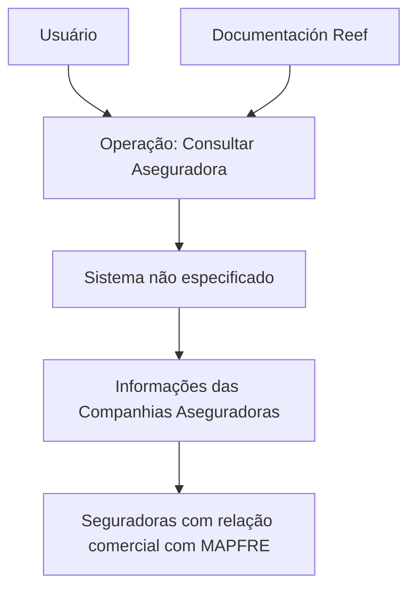

# Operação “Consultar Aseguradora” — Documentação Reef para MAPFRE

## 1. Metadados do Documento
- **Arquivo de Origem:** `Não identificado no conteúdo fornecido`
- **Tipo de Documento:** `Procedimento`
- **Domínio / Sistema:** `Reef / MAPFRE`
- **Público-Alvo:** `Não identificado no conteúdo fornecido`
- **Data/Versão Identificada:** `Não identificada`

---

## 2. Resumo Executivo & Contexto de Negócio

O documento descreve a operação **“Consultar Aseguradora”**, destinada à consulta, no Sistema, das informações de companhias seguradoras que possuem relação comercial com a entidade MAPFRE.

A relação comercial mencionada pode ocorrer em qualquer processo operacional da MAPFRE. O conteúdo não detalha quais processos operacionais são abrangidos, quais atributos das seguradoras são retornados nem quais critérios de busca estão disponíveis.

A operação está catalogada no contexto de **Documentación Reef** e apresenta referências de navegação para áreas como Soluções, Arquiteturas, APIs, Componentes, Cloud, Documentação, Zeus, Reef e Ajuda.

O registro de documentação informa o proprietário como `user:agonzalez_mapfre.com` e apresenta o ciclo de vida como **Approved Source / VL**. O documento não explica o significado de `VL`, o mecanismo de aprovação ou responsabilidades operacionais associadas ao proprietário.

---

## 3. Arquitetura, Componentes & Tecnologias Envolvidas

Os únicos elementos explicitamente citados são o **Sistema** onde a consulta é realizada, a entidade **MAPFRE**, as **Compañías Aseguradoras** e o repositório/contexto documental **Reef**.



> **Nota de Análise:** O documento não identifica o nome do Sistema, APIs, métodos HTTP, bancos de dados, contratos de integração, tecnologias, ambientes ou mecanismos de autenticação envolvidos na operação.

---

## 4. Regras de Negócio, Especificações Funcionais & Processos

1. A operação possui o nome **“Consultar Aseguradora”**.
2. A finalidade declarada da operação é consultar, no Sistema, informações das **Compañías Aseguradoras**.
3. A consulta se limita às companhias seguradoras que mantêm uma **relação comercial** com a entidade **MAPFRE**.
4. A relação comercial pode estar associada a qualquer processo operacional da MAPFRE.
5. O documento não apresenta:
   - Campos de entrada da consulta.
   - Filtros disponíveis.
   - Critérios de elegibilidade de uma companhia seguradora.
   - Campos retornados pelo Sistema.
   - Regras de autorização ou perfis de acesso.
   - Tratamento de erros.
   - Etapas detalhadas de execução.
   - Contratos técnicos ou funcionais.

> **Nota de Análise:** O conteúdo caracteriza a finalidade da operação, mas não detalha o fluxo funcional necessário para executar a consulta nem os dados apresentados ao usuário.

---

## 5. Tabelas de Parâmetros, Ambientes e Estruturas de Dados

| Item / Parâmetro | Descrição / Função | Tipo / Valores / Formato | Ambiente / Observações |
| :--- | :--- | :--- | :--- |
| Operação | Consulta de informações de companhias seguradoras | `Consultar Aseguradora` | Realizada no Sistema não identificado |
| Entidade | Organização com a qual as seguradoras mantêm relação comercial | `MAPFRE` | Citada como entidade de referência |
| Objeto consultado | Companhias seguradoras com relação comercial com MAPFRE | `Compañías Aseguradoras` | Não há campos ou estrutura de dados especificados |
| Repositório documental | Contexto documental associado à operação | `Documentation / DOCUMENTACIÓN Reef` | Referência a Reef |
| Proprietário | Identificação de proprietário exibida no documento | `user:agonzalez_mapfre.com` | Sem descrição de responsabilidades |
| Ciclo de vida | Estado documental exibido | `Approved Source / VL` | O significado de `VL` não foi detalhado |
| Idioma de interface | Idioma indicado no cabeçalho | `ES` | Indicação exibida na navegação |
| Navegação disponível | Áreas exibidas na interface documental | `Buscar`, `Inicio`, `Soluciones`, `Arquitecturas`, `APIs`, `Componentes`, `Cloud`, `Documentación`, `Zeus`, `Reef`, `Ayuda` | Não há descrição funcional dessas áreas |

---

## 6. Bateria de Perguntas & Respostas para RAG (FAQ Sintético)

### P1: Qual é a finalidade da operação “Consultar Aseguradora”?
**R:** A operação “Consultar Aseguradora” permite consultar, no Sistema, informações sobre companhias seguradoras que possuem relação comercial com a entidade MAPFRE.

### P2: Quais seguradoras podem ser consultadas pela operação?
**R:** Podem ser consultadas as companhias seguradoras com as quais a entidade MAPFRE mantém uma relação comercial em qualquer um de seus processos operacionais.

### P3: O documento informa quais dados de uma companhia seguradora são retornados?
**R:** Não. O documento informa apenas que a operação consulta informações das companhias seguradoras, sem especificar os campos, atributos ou estrutura dos dados retornados.

### P4: Qual Sistema executa a operação “Consultar Aseguradora”?
**R:** O documento afirma que a consulta é realizada “no Sistema”, mas não identifica o nome, a arquitetura, a URL ou a tecnologia desse Sistema.

### P5: A documentação detalha filtros ou parâmetros de busca de seguradoras?
**R:** Não. Não são apresentados filtros, parâmetros de entrada, critérios de pesquisa ou regras de ordenação para a operação “Consultar Aseguradora”.

### P6: Qual é o domínio documental associado à operação?
**R:** A operação está associada ao contexto “Documentation / DOCUMENTACIÓN Reef”, também referido como “DOCUMENTACIÓN Reef”.

### P7: Quem é o proprietário indicado na documentação?
**R:** O proprietário exibido no documento é `user:agonzalez_mapfre.com`. O conteúdo não detalha o nome da pessoa, a área responsável ou as atribuições desse proprietário.

### P8: Qual ciclo de vida é exibido para o documento?
**R:** O ciclo de vida exibido é `Approved Source / VL`. O documento não define o significado de `VL` nem descreve os critérios para o estado “Approved Source”.

### P9: A operação se aplica a um processo operacional específico da MAPFRE?
**R:** Não. O documento declara que a relação comercial pode existir em qualquer processo operacional da MAPFRE, sem enumerar processos específicos.

### P10: Existem detalhes técnicos sobre APIs, endpoints ou contratos JSON?
**R:** Não. O documento não apresenta APIs, endpoints, métodos HTTP, contratos JSON, tecnologias, bancos de dados ou integrações técnicas.

---

## 7. Glossário de Termos, Siglas & Conceitos-Chave

- **Consultar Aseguradora:** Operação para consultar informações de companhias seguradoras com relação comercial com MAPFRE.
- **Compañías Aseguradoras:** Companhias seguradoras que constituem o objeto da consulta descrita.
- **MAPFRE:** Entidade mencionada como mantenedora de relação comercial com as companhias seguradoras consultadas.
- **Reef:** Contexto ou área de documentação citada como `Documentation / DOCUMENTACIÓN Reef`.
- **Approved Source:** Estado de ciclo de vida exibido para o documento; não definido adicionalmente no conteúdo.
- **VL:** Sigla exibida junto de `Approved Source`; significado não identificado no conteúdo.
- **Zeus:** Item listado na navegação da documentação; não possui definição no conteúdo fornecido.

---

## 8. Notas Críticas, Riscos & Limitações

- O nome do arquivo de origem não foi fornecido.
- O documento não identifica o Sistema no qual a consulta é executada.
- Não existem detalhes sobre campos de entrada, campos de saída, filtros, regras de validação, permissões ou mensagens de erro.
- Não há especificação de APIs, endpoints, contratos de dados, integrações, bancos de dados, URLs ou ambientes.
- O significado de `VL`, `Approved Source`, `Reef` e `Zeus` não é explicado pelo conteúdo.
- A documentação descreve apenas o propósito geral da operação; não há detalhamento adicional para implementação, suporte operacional ou validação funcional.

---

## 9. Conteúdo Bruto Estruturado (Referência Fiel)

```text
--- [PÁGINA 1 DE 1] ---

OPERACIÓN CONSULTAR Aseguradora
Esta operación permite consultar en el Sistema la Información de las Compañías Aseguradoras con las que la entidad MAPFRE tiene una
relación comercial en cualquiera de sus procesos operativos.
Documentation / DOCUMENTACIÓN Reef
DOCUMENTACIÓN Reef
Mapfredocument
DOCUMENTACIÓN Reef
Owner
user:agonzalez_mapfre.com
Lifecycle
Approved Source
 / 
 VL
Buscar Inicio Soluciones Arquitecturas APIs Componentes Cloud Documentación Zeus Reef Ayuda
ES
```
