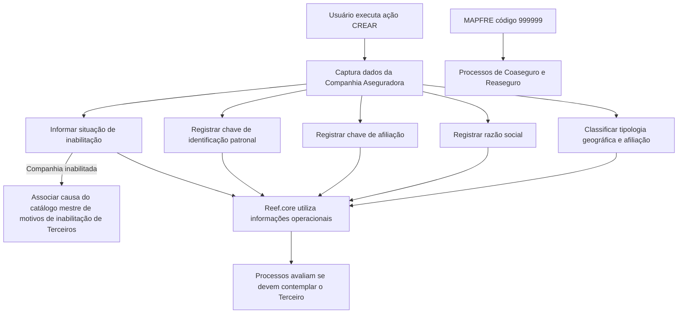

# Cadastro de Informações Específicas para Companhia Aseguradora no Reef.core

## 1. Metadados do Documento
- **Arquivo de Origem:** Não identificado no conteúdo fornecido
- **Tipo de Documento:** Especificação Funcional
- **Domínio / Sistema:** Reef.core / Companhia Aseguradora / MAPFRE
- **Público-Alvo:** Desenvolvedores, Arquitetos, Operação e Negócio
- **Data/Versão Identificada:** Não identificada

---

## 2. Resumo Executivo & Contexto de Negócio

O documento descreve a criação e a captura de informações específicas para uma Companhia Aseguradora em uma estrutura de dados do sistema Reef.core. O propósito declarado é identificar e classificar informações operacionais da Companhia Aseguradora para que processos da entidade possam decidir se um Terceiro deve ou não ser considerado.

A estrutura cadastral contém atributos relacionados à tipologia geográfica e de afiliação da companhia, razão social, retenções, identificação patronal e situação de inabilitação. A sequência de captura dos campos deve seguir a ordem visual estabelecida no bloco de informação: da esquerda para a direita e de cima para baixo.

O documento estabelece uma referência específica para a companhia MAPFRE: o Reef.core identifica MAPFRE pelo código `999999` para o funcionamento correto dos processos de Coaseguro e Reaseguro.

O único tipo de ação explicitamente habilitado é **CREAR**. Não há detalhamento sobre ações de consulta, alteração, exclusão, APIs, persistência, validações técnicas, perfis de acesso ou contratos de integração.

---

## 3. Arquitetura, Componentes & Tecnologias Envolvidas

### Componentes e conceitos identificados

| Componente / Termo | Papel descrito no documento |
| :--- | :--- |
| Reef.core | Sistema que identifica, classifica e utiliza dados de Companhias Aseguradoras em processos operacionais. |
| Estrutura de dados | Estrutura usada para capturar informações operacionais da Companhia Aseguradora. |
| Companhia Aseguradora | Entidade cadastrada e classificada pelos atributos apresentados. |
| Terceiro | Entidade cuja consideração nos processos operacionais pode depender das informações cadastradas para a Companhia Aseguradora. |
| MAPFRE | Companhia identificada pelo código `999999` no Reef.core para processos de Coaseguro e Reaseguro. |
| Catálogo de Companhias Aseguradoras | Catálogo no qual a Clave de Identificación Patronal é identificada, conforme legislação do país da companhia. |
| Catálogo mestre de motivos de inabilitação de Terceiros | Fonte do código de causa de inabilitação quando uma Companhia Aseguradora é inabilitada. |
| Coaseguro / Reaseguro | Processos que dependem da identificação de MAPFRE pelo código `999999`. |



> **Nota de Análise:** O documento não descreve uma arquitetura técnica de software com serviços, APIs, bancos de dados, protocolos, ambientes, endpoints ou tecnologias de infraestrutura.

---

## 4. Regras de Negócio, Especificações Funcionais & Processos

### 4.1 Objetivo da captura de informações

A captura de informações na estrutura de dados atende à necessidade de:

1. Identificar informações de âmbito operacional da Companhia Aseguradora.
2. Classificar informações de âmbito operacional da Companhia Aseguradora.
3. Permitir que processos da entidade seguradora considerem ou não um Terceiro quando esses processos exigirem essa decisão.

### 4.2 Ação habilitada

A ação habilitada no documento é:

- **CREAR**

> **Nota de Análise:** O documento mostra a ação `CREAR`, porém não detalha o comportamento de criação, critérios de sucesso, mensagens de erro, persistência de dados ou permissões necessárias.

### 4.3 Ordem de captura dos campos

Os atributos do bloco de informações devem obedecer à seguinte sequência de captura:

1. Da esquerda para a direita.
2. De cima para baixo.

### 4.4 Regra específica para MAPFRE

O Reef.core identifica a companhia MAPFRE com o código `999999`.

A finalidade explicitamente indicada para esse código é assegurar o funcionamento correto dos processos de:

- Coaseguro.
- Reaseguro.

### 4.5 Tipologia de Companhia Aseguradora

O campo **Tipología de Compañía Aseguradora** classifica geograficamente a Companhia Aseguradora.

A classificação permite saber:

- Se a Companhia Aseguradora é local ou estrangeira.
- Se a Companhia Aseguradora é afiliada localmente ou não afiliada localmente.

Quando o idioma empregado na definição é espanhol, os valores apresentados são:

- `(AL) Afiliada (Local)`
- `(NL) No Afiliada (Local)`
- `(AE) Afiliada (Extranjera)`
- `(NE) No Afiliada (Extranjera)`

### 4.6 Razão Social

O campo **Razón Social** indica o nome pelo qual a entidade ou sociedade mercantil está registrada local e legalmente.

### 4.7 Chave de Afiliação

O atributo **Clave de Afiliación** identifica se a companhia deve ou não aplicar retenções.

Quando o idioma empregado na definição é espanhol, os valores apresentados são:

- `(RE) Retención`
- `(NR) No Retención`
- `(OT) Otros`

### 4.8 Chave de Identificação Patronal

O campo **Clave de Identificación Patronal** identifica, no catálogo de Companhias Aseguradoras, a chave de identificação patronal de acordo com a legislação do país onde a Companhia Aseguradora está localizada.

### 4.9 Inabilitação

A propriedade **Inhabilitación** indica ao sistema que a Companhia Aseguradora está inabilitada no sistema.

Esse fato deve ser contemplado pelos processos operacionais da entidade.

### 4.10 Causa de Inabilitação

Quando uma Companhia Aseguradora for inabilitada, o atributo **Causa de Inhabilitación** deve conter:

- O código de uma causa de inabilitação.
- Uma causa definida no catálogo mestre de motivos de inabilitação de Terceiros do sistema.

> **Nota de Análise:** O documento não apresenta a lista de códigos de causa de inabilitação nem define se o preenchimento do campo é obrigatório, mas relaciona explicitamente o campo ao cenário de inabilitação da Companhia Aseguradora.

---

## 5. Tabelas de Parâmetros, Ambientes e Estruturas de Dados

### 5.1 Campos da estrutura de dados

| Item / Parâmetro | Descrição / Função | Tipo / Valores / Formato | Ambiente / Observações |
| :--- | :--- | :--- | :--- |
| Tipología de Compañía Aseguradora | Classifica geograficamente a Companhia Aseguradora e identifica se a companhia é local ou estrangeira, afiliada ou não afiliada localmente. | `AL`, `NL`, `AE`, `NE` | Os significados apresentados aplicam-se quando o idioma da definição é espanhol. |
| Razón Social | Indica o nome com que a entidade ou sociedade mercantil está registrada local e legalmente. | Não especificado | Não há formato, tamanho ou regra de validação informados. |
| Clave de Afiliación | Identifica se a companhia deve aplicar retenções. | `RE`, `NR`, `OT` | Os significados apresentados aplicam-se quando o idioma da definição é espanhol. |
| Clave de Identificación Patronal | Identifica no catálogo de Companhias Aseguradoras a chave patronal conforme a legislação do país da companhia. | Não especificado | Depende da legislação do país onde a companhia está localizada. |
| Inhabilitación | Informa ao sistema que a Companhia Aseguradora está inabilitada. | Não especificado | A inabilitação deve ser considerada nos processos operacionais. |
| Causa de Inhabilitación | Armazena o código da causa de inabilitação da Companhia Aseguradora. | Código do catálogo mestre | Aplicável no cenário em que a Companhia Aseguradora é inabilitada. |

### 5.2 Valores da Tipologia de Companhia Aseguradora

| Código | Valor em espanhol | Classificação |
| :--- | :--- | :--- |
| `AL` | Afiliada (Local) | Companhia afiliada e local |
| `NL` | No Afiliada (Local) | Companhia não afiliada e local |
| `AE` | Afiliada (Extranjera) | Companhia afiliada e estrangeira |
| `NE` | No Afiliada (Extranjera) | Companhia não afiliada e estrangeira |

### 5.3 Valores da Chave de Afiliação

| Código | Valor em espanhol | Função |
| :--- | :--- | :--- |
| `RE` | Retención | Indica retenção |
| `NR` | No Retención | Indica ausência de retenção |
| `OT` | Otros | Indica outros casos |

### 5.4 Identificação especial

| Item / Parâmetro | Descrição / Função | Tipo / Valores / Formato | Ambiente / Observações |
| :--- | :--- | :--- | :--- |
| Código MAPFRE | Identifica a companhia MAPFRE no Reef.core. | `999999` | Necessário para o funcionamento correto dos processos de Coaseguro e Reaseguro. |

### 5.5 Ambientes, URLs e logs

| Item / Parâmetro | Descrição / Função | Tipo / Valores / Formato | Ambiente / Observações |
| :--- | :--- | :--- | :--- |
| Ambientes | Não detalhados | Não informado | O conteúdo fornecido não identifica ambientes técnicos. |
| URLs | Não detalhadas | Não informado | Não há URLs de aplicação, API ou infraestrutura. |
| Rotas de logs | Não detalhadas | Não informado | Não há caminhos, variáveis ou configurações de logs. |

---

## 6. Bateria de Perguntas & Respostas para RAG (FAQ Sintético)

### P1: Qual é o objetivo do cadastro de informações específicas de uma Companhia Aseguradora no Reef.core?
**R:** O objetivo é identificar e classificar informações operacionais da Companhia Aseguradora em uma estrutura de dados. Essas informações permitem que os processos da entidade seguradora decidam se devem ou não contemplar um Terceiro quando o processo exigir essa avaliação.

### P2: Qual ação está habilitada para a estrutura de dados de Companhia Aseguradora?
**R:** O documento apresenta somente a ação **CREAR** como ação habilitada. Não há descrição de ações de alteração, consulta, exclusão ou aprovação.

### P3: Em que ordem os campos da Companhia Aseguradora devem ser capturados?
**R:** A sequência de captura dos atributos deve seguir a disposição visual do bloco de informações: da esquerda para a direita e de cima para baixo.

### P4: Qual código o Reef.core utiliza para identificar MAPFRE?
**R:** O Reef.core identifica a companhia MAPFRE pelo código `999999`. O documento informa que essa identificação é necessária para o funcionamento correto dos processos de Coaseguro e Reaseguro.

### P5: O que o campo Tipología de Compañía Aseguradora classifica?
**R:** O campo classifica geograficamente a Companhia Aseguradora. A classificação informa se a companhia é local ou estrangeira e se é afiliada ou não afiliada localmente.

### P6: Quais são os valores permitidos para Tipología de Compañía Aseguradora em espanhol?
**R:** Os valores apresentados são `AL` para Afiliada (Local), `NL` para No Afiliada (Local), `AE` para Afiliada (Extranjera) e `NE` para No Afiliada (Extranjera).

### P7: Qual é a finalidade do campo Razón Social?
**R:** O campo Razón Social indica o nome pelo qual a entidade ou sociedade mercantil está registrada local e legalmente.

### P8: Para que serve a Clave de Afiliación?
**R:** A Clave de Afiliación identifica se a Companhia Aseguradora deve aplicar retenções. Os valores apresentados em espanhol são `RE` para Retención, `NR` para No Retención e `OT` para Otros.

### P9: Qual é o propósito da Clave de Identificación Patronal?
**R:** A Clave de Identificación Patronal permite identificar, no catálogo de Companhias Aseguradoras, a chave de identificação patronal de acordo com a legislação do país onde a Companhia Aseguradora está localizada.

### P10: O que significa marcar uma Companhia Aseguradora como inabilitada?
**R:** A propriedade Inhabilitación informa ao sistema que a Companhia Aseguradora está inabilitada. Os processos operacionais da entidade devem contemplar essa condição.

### P11: De onde vem a Causa de Inhabilitación de uma Companhia Aseguradora?
**R:** Quando a Companhia Aseguradora for inabilitada, a Causa de Inhabilitación deve conter um código definido no catálogo mestre de motivos de inabilitação de Terceiros do sistema.

### P12: O documento especifica APIs, métodos HTTP ou contratos JSON para o cadastro de Companhia Aseguradora?
**R:** Não. O documento descreve atributos funcionais e códigos de classificação, mas não detalha APIs, métodos HTTP, contratos JSON, endpoints, protocolos de integração ou estruturas de persistência.

---

## 7. Glossário de Termos, Siglas & Conceitos-Chave

- **Reef.core:** Sistema citado como responsável por identificar MAPFRE pelo código `999999` e utilizar dados operacionais de Companhias Aseguradoras.
- **Companhia Aseguradora:** Entidade seguradora cujas informações operacionais são capturadas e classificadas na estrutura de dados.
- **Terceiro:** Entidade que pode ou não ser contemplada pelos processos da entidade seguradora com base nas informações cadastradas.
- **Coaseguro:** Processo mencionado como dependente da identificação correta de MAPFRE no Reef.core.
- **Reaseguro:** Processo mencionado como dependente da identificação correta de MAPFRE no Reef.core.
- **MAPFRE:** Companhia identificada no Reef.core pelo código `999999`.
- **AL:** `Afiliada (Local)`.
- **NL:** `No Afiliada (Local)`.
- **AE:** `Afiliada (Extranjera)`.
- **NE:** `No Afiliada (Extranjera)`.
- **RE:** `Retención`.
- **NR:** `No Retención`.
- **OT:** `Otros`.
- **Razón Social:** Nome pelo qual uma entidade ou sociedade mercantil está registrada local e legalmente.
- **Clave de Afiliación:** Atributo que identifica se a companhia deve aplicar retenções.
- **Clave de Identificación Patronal:** Atributo relacionado à identificação patronal conforme a legislação do país da companhia.
- **Inhabilitación:** Propriedade que informa que a Companhia Aseguradora está inabilitada no sistema.
- **Causa de Inhabilitación:** Código de motivo de inabilitação proveniente do catálogo mestre de motivos de inabilitação de Terceiros.

---

## 8. Notas Críticas, Riscos & Limitações

- O conteúdo fornecido não identifica o nome do arquivo de origem, a data, a versão ou o autor técnico do documento.
- O documento apresenta uma especificação predominantemente funcional; não há detalhamento de arquitetura de software, banco de dados, APIs, serviços, integrações, ambientes ou monitoramento.
- Não são fornecidos tipos de dados, tamanhos máximos, obrigatoriedade, regras de unicidade ou validações formais para os campos.
- A ação `CREAR` é exibida, mas seu fluxo operacional não é descrito.
- Não há lista de valores para causas de inabilitação; o documento apenas informa que o código deve vir do catálogo mestre de motivos de inabilitação de Terceiros.
- Não há definição sobre o comportamento dos processos quando a Companhia Aseguradora estiver inabilitada; apenas é indicado que essa condição deve ser contemplada.
- O código `999999` para MAPFRE é uma dependência funcional crítica para Coaseguro e Reaseguro.
- **Nota de Análise:** O documento lista campos e códigos funcionais, porém não detalha métodos HTTP, contratos JSON, permissões, perfis de usuário, logs ou mecanismos técnicos de integração.

---

## 9. Conteúdo Bruto Estruturado (Referência Fiel)

```text
--- [PÁGINA 1 DE 2] ---

CREAR Información específica para la Compañía Aseguradora

Objetivo

La captura de la información en esta Estructura de datos obedece a la necesidad de identificar y clasificar la información de ámbito operativo de la Compañía Aseguradora para poder contemplar o no al Tercero en los procesos de la entidad Aseguradora que así lo demanden.

Reef.core identifica a la compañía MAPFRE con el código 999999 para el correcto funcionamiento de los procesos de Coaseguro/Reaseguro.

Acciones habilitadas

 CREAR ( )

Datos Compañía Aseguradora

De Izquierda a Derecha y de Arriba hacia Abajo, los siguientes atributos marcan la secuencia de captura de los Campos en este Bloque de Información.

Tipología de Compañía Aseguradora ( )

Este campo clasifica a la Compañía Aseguradora identificándola geográficamente para conocer si es una Compañía Local o Extranjera y si está o no afiliada localmente.

Si el idioma empleado en la definición es el español, sus valores serían...

(AL) Afiliada (Local)
(NL) No Afiliada (Local)
(AE) Afiliada (Extranjera)
(NE) No Afiliada (Extranjera)

Razón Social ( )

Este campo indicará el nombre con que la entidad o sociedad mercantil está registrada local y legalmente.

Documentation / DOCUMENTACIÓN Reef
DOCUMENTACIÓN Reef
Mapfredocument
DOCUMENTACIÓN Reef
Owner
user:agonzalez_mapfre.com
Lifecycle
Approved Source
 /
 VL
Buscar Inicio Soluciones Arquitecturas APIs Componentes Cloud Documentación Zeus Reef Ayuda
ES


--- [PÁGINA 2 DE 2] ---

Clave de Afiliación ( )

Este atributo sirve para identificar si la compañía tiene o no que aplicar retenciones.

Si el idioma empleado en la definición es el español, sus valores serían...

(RE) Retención
(NR) No Retención
(OT) Otros

Clave de Identificación Patronal ( )

Este campo sirve para identificar en el catálogo de Compañías Aseguradoras la clave de identificación patronal de acuerdo con la legislación del país en el que se ubica la compañía.

Inhabilitación ( )

Esta propiedad le indica al Sistema que la compañía aseguradora está inhabilitada en el Sistema por lo que este hecho debería ser contemplado en los procesos operativos de la entidad.

Causa de Inhabilitación ( )

En el supuesto que se inhabilitara a la Compañía Aseguradora, este dato contendrá el código de una causa de inhabilitación definida en el catálogo maestro de motivos de inhabilitación de Terceros del Sistema.
```
