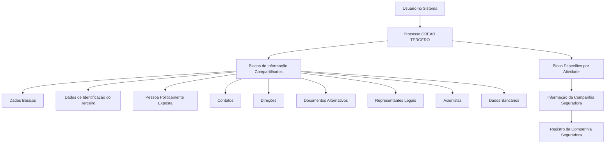

# Operação Criar Companhia Seguradora — Documentação Reef / MAPFRE

## 1. Metadados do Documento
- **Arquivo de Origem:** Não informado
- **Tipo de Documento:** Procedimento
- **Domínio / Sistema:** Reef / MAPFRE
- **Público-Alvo:** Usuários operacionais e equipes de negócio
- **Data/Versão Identificada:** Não identificada

---

## 2. Resumo Executivo & Contexto de Negócio

O documento descreve a operação **“CREAR Compañía Aseguradora”**, destinada ao registro, no Sistema, das informações de Companhias Seguradoras que possuem relação comercial com a entidade MAPFRE em qualquer processo operacional.

O cadastro da Companhia Seguradora é realizado no contexto do processo **CREAR TERCERO**. O processo utiliza blocos compartilhados de informações de terceiro e um bloco específico para a atividade de Companhia Seguradora.

A obrigatoriedade e a habilitação dos campos podem variar conforme o código de atividade do Terceiro. A obrigatoriedade e a habilitação também podem variar conforme o Terceiro seja classificado como Pessoa Física ou Pessoa Jurídica.

O comportamento da aplicação pode ser afetado por modificações implementadas localmente. Além disso, a ordem de preenchimento dos blocos de informação pode variar de acordo com o critério seguido pelo usuário no Sistema.

---

## 3. Arquitetura, Componentes & Tecnologias Envolvidas

Os elementos identificados no documento são:

- **Sistema:** Sistema não nomeado explicitamente no conteúdo extraído.
- **Operação:** CREAR Compañía Aseguradora.
- **Processo relacionado:** CREAR TERCERO.
- **Entidade de negócio:** Companhia Seguradora.
- **Entidade corporativa mencionada:** MAPFRE.
- **Portal/documentação mencionada:** Documentation / DOCUMENTACIÓN Reef, Mapfredocument.
- **Estruturas funcionais:** blocos de informação compartilhados e blocos específicos conforme a atividade do Terceiro.



> **Nota de Análise:** O conteúdo não detalha arquitetura técnica, tecnologias de implementação, APIs, contratos JSON, métodos HTTP, banco de dados, URLs de ambiente ou integrações sistêmicas.

---

## 4. Regras de Negócio, Especificações Funcionais & Processos

### Objetivo funcional

A operação **CREAR Compañía Aseguradora** permite registrar no Sistema as informações das Companhias Seguradoras com as quais a entidade MAPFRE possui uma relação comercial em qualquer um dos seus processos operacionais.

### Premissas de preenchimento

1. A obrigatoriedade e/ou a habilitação dos campos registrados em cada bloco ou estrutura de informação compartilhada podem variar conforme o **código de atividade do Terceiro**.
2. A obrigatoriedade e/ou a habilitação dos campos registrados em cada bloco ou estrutura de informação podem variar caso o Terceiro seja uma **Pessoa Física** ou uma **Pessoa Jurídica**.
3. Modificações implementadas localmente podem afetar o comportamento da aplicação, incluindo a obrigatoriedade de registro dos Dados do Terceiro.
4. A ordem de captura dos dados nos diferentes blocos de informação pode variar de acordo com o critério seguido pelo usuário no Sistema.

### Fluxo funcional identificado

1. O usuário inicia o processo **CREAR TERCERO**.
2. O usuário registra informações nos blocos de informação compartilhados aplicáveis ao Terceiro.
3. A aplicação determina a obrigatoriedade e/ou habilitação de campos conforme o código de atividade do Terceiro.
4. A aplicação considera o tipo de Terceiro, Pessoa Física ou Pessoa Jurídica, para determinar possíveis variações de obrigatoriedade e habilitação.
5. O usuário registra informações nos blocos específicos correspondentes à atividade do Terceiro.
6. Para a atividade de Companhia Seguradora, o usuário registra a **Informação da Companhia Seguradora**.
7. O resultado esperado é a criação da informação da Companhia Seguradora no Sistema.

> **Nota de Análise:** O documento não especifica critérios de validação por campo, códigos de atividade aceitos, campos obrigatórios concretos, mensagens de erro, permissões, responsáveis por aprovação ou condições de conclusão do cadastro.

---

## 5. Tabelas de Parâmetros, Ambientes e Estruturas de Dados

| Item / Parâmetro | Descrição / Função | Tipo / Valores / Formato | Ambiente / Observações |
| :--- | :--- | :--- | :--- |
| Operação | Registro de informações de Companhia Seguradora no Sistema | CREAR Compañía Aseguradora | Aplicável às Companhias Seguradoras com relação comercial com MAPFRE |
| Processo base | Processo no qual o cadastro é realizado | CREAR TERCERO | Contém blocos compartilhados de informação |
| Código de atividade do Terceiro | Condiciona a obrigatoriedade e/ou habilitação de campos | Código de atividade | Valores não detalhados |
| Tipo de Terceiro | Pode alterar a obrigatoriedade e/ou habilitação de campos | Pessoa Física ou Pessoa Jurídica | Regras específicas não detalhadas |
| Modificações locais | Podem alterar o comportamento da aplicação | Implementações locais | Podem afetar a obrigatoriedade dos Dados do Terceiro |
| Ordem de captura | Sequência de preenchimento dos blocos de informação | Critério do usuário | Pode variar no Sistema |
| Dados Básicos | Bloco compartilhado de informação de Terceiro | Bloco de informação | Conteúdo interno não detalhado |
| Dados de Identificação do Terceiro | Bloco compartilhado de identificação | Bloco de informação | Conteúdo interno não detalhado |
| Pessoa Politicamente Exposta | Bloco compartilhado de informação | Bloco de informação | Conteúdo interno não detalhado |
| Contatos | Bloco compartilhado de informação de Terceiro | Bloco de informação | Conteúdo interno não detalhado |
| Direções | Bloco compartilhado de informação de Terceiro | Bloco de informação | Conteúdo interno não detalhado |
| Documentos Alternativos | Bloco compartilhado de informação de Terceiro | Bloco de informação | Conteúdo interno não detalhado |
| Representantes Legais | Bloco compartilhado de informação de Terceiro | Bloco de informação | Conteúdo interno não detalhado |
| Acionistas | Bloco compartilhado de informação de Terceiro | Bloco de informação | Conteúdo interno não detalhado |
| Dados Bancários | Bloco compartilhado de informação de Terceiro | Bloco de informação | Conteúdo interno não detalhado |
| Informação da Companhia Seguradora | Bloco específico de acordo com a atividade do Terceiro | Bloco específico | Aplicável à atividade de Companhia Seguradora |
| Documentation / DOCUMENTACIÓN Reef | Referência documental apresentada no conteúdo | Portal ou repositório documental | Também são mencionados “Mapfredocument” e “DOCUMENTACIÓN Reef” |
| Owner | Proprietário apresentado na interface documental | `user:agonzalez_mapfre.com` | Exibido no conteúdo bruto |
| Lifecycle | Estado apresentado na interface documental | `Approved Source` | Exibido no conteúdo bruto |

---

## 6. Bateria de Perguntas & Respostas para RAG (FAQ Sintético)

### P1: Qual é o objetivo da operação CREAR Compañía Aseguradora?
**R:** A operação CREAR Compañía Aseguradora permite registrar no Sistema as informações das Companhias Seguradoras com as quais a entidade MAPFRE mantém uma relação comercial em qualquer um dos seus processos operacionais.

### P2: Em qual processo é realizado o cadastro de uma Companhia Seguradora?
**R:** O cadastro é realizado no processo CREAR TERCERO. Esse processo inclui blocos de informação compartilhados e blocos específicos definidos de acordo com a atividade do Terceiro.

### P3: Quais fatores podem alterar a obrigatoriedade ou a habilitação de campos?
**R:** A obrigatoriedade e/ou habilitação de campos pode variar conforme o código de atividade do Terceiro, conforme o tipo de Terceiro — Pessoa Física ou Pessoa Jurídica — e conforme modificações implementadas localmente.

### P4: A ordem de preenchimento dos blocos de informação é fixa?
**R:** Não. O documento informa que a ordem de captura dos dados nos diferentes blocos de informação pode variar de acordo com o critério seguido pelo usuário no Sistema.

### P5: Quais são os blocos de informação compartilhados no processo CREAR TERCERO?
**R:** Os blocos compartilhados identificados são Dados Básicos, Dados de Identificação do Terceiro, Pessoa Politicamente Exposta, Contatos, Direções, Documentos Alternativos, Representantes Legais, Acionistas e Dados Bancários.

### P6: Qual bloco específico deve ser utilizado para uma Companhia Seguradora?
**R:** O bloco específico identificado para a atividade de Companhia Seguradora é **Informação da Companhia Seguradora**.

### P7: O documento define quais campos são obrigatórios para cada bloco?
**R:** Não. O documento afirma que a obrigatoriedade pode variar conforme o código de atividade, o tipo de Terceiro e modificações locais, mas não detalha quais campos são obrigatórios em cada cenário.

### P8: O documento descreve APIs, métodos HTTP ou contratos de integração da operação?
**R:** Não. O conteúdo extraído não apresenta métodos HTTP, APIs, contratos JSON, endpoints, portas, integrações técnicas ou estruturas de banco de dados.

### P9: O que são modificações locais no contexto da operação?
**R:** Modificações locais são implementações que podem afetar o comportamento da aplicação, particularmente a obrigatoriedade exigida no registro dos Dados do Terceiro. O documento não detalha quais modificações locais existem.

### P10: A operação CREAR Compañía Aseguradora é restrita a algum processo operacional específico da MAPFRE?
**R:** Não. O documento estabelece que a operação se aplica às Companhias Seguradoras com as quais a entidade MAPFRE tenha relação comercial em qualquer um de seus processos operacionais.

---

## 7. Glossário de Termos, Siglas & Conceitos-Chave

- **MAPFRE:** Entidade mencionada como a organização que mantém relação comercial com as Companhias Seguradoras registradas.
- **CREAR Compañía Aseguradora:** Operação para registrar informações de uma Companhia Seguradora no Sistema.
- **CREAR TERCERO:** Processo utilizado para criar e registrar informações de um Terceiro.
- **Terceiro:** Entidade cadastrada no processo CREAR TERCERO; pode ser Pessoa Física ou Pessoa Jurídica.
- **Pessoa Física:** Tipo de Terceiro mencionado como fator que pode alterar obrigatoriedade e habilitação de campos.
- **Pessoa Jurídica:** Tipo de Terceiro mencionado como fator que pode alterar obrigatoriedade e habilitação de campos.
- **Pessoa Politicamente Exposta:** Bloco de informação compartilhado listado no processo CREAR TERCERO.
- **Reef:** Nome presente nas referências de documentação exibidas no conteúdo extraído.
- **Mapfredocument:** Nome presente nas referências documentais exibidas no conteúdo extraído.

---

## 8. Notas Críticas, Riscos & Limitações

- A obrigatoriedade e a habilitação dos campos não são estáticas; elas podem depender do código de atividade do Terceiro, do tipo de Terceiro e de modificações locais.
- A flexibilidade na ordem de preenchimento dos blocos exige que operadores conheçam os blocos aplicáveis ao cadastro em execução.
- O documento não informa campos específicos, formatos, valores permitidos, regras de validação, condições de erro ou mensagens do Sistema.
- O documento não apresenta detalhes sobre permissões, perfis de acesso, trilha de auditoria, aprovação, persistência dos dados ou integrações.
- O conteúdo não fornece arquitetura técnica, ambientes, URLs, logs, endpoints, tecnologias, versões ou contratos de API.
- **Nota de Análise:** O documento lista blocos funcionais do processo CREAR TERCERO, porém não detalha a estrutura interna ou os atributos de cada bloco.

---

## 9. Conteúdo Bruto Estruturado (Referência Fiel)

```text
--- [PÁGINA 1 DE 2] ---

OPERACIÓN CREAR Compañía Aseguradora
¿En que consiste?
Esta operación permite registrar en el Sistema la Información de las Compañías Aseguradoras con las que la entidad MAPFRE tiene una
relación comercial en cualquiera de sus procesos operativos.
Premisas
La obligatoriedad y/o la habilitación de los campos en el registro de los datos de cada uno de los bloques o estructuras de información
compartidas puede variar de acuerdo con el código de actividad del Tercero:
La obligatoriedad y/o la habilitación de los campos en el registro de los datos de cada uno de los bloques o estructuras de información
pueden variar si el tipo de Tercero es una Persona Física o una Persona Jurídica:
Las modicaciones que se hubieran podido implementar localmente a su vez pueden afectar el comportamiento de la aplicación en
relación con la obligatoriedad en el registro de los Datos del Tercero.
Por último, el orden de captura de los datos en los distintos bloques de Información puede variar de acuerdo con el criterio seguido por el
Usuario en el Sistema.
Proceso
CREAR
TERCERO
Crear Información de la
Compañía Aseguradora
Bloques de Información Compartidos (CREAR TERCERO)
 Datos Básicos ( )
 Datos Identicación del Tercero ( )
 Persona Políticamente Expuesta ( )
 Contactos ( )
 Direcciones ( )
 Documentos Alternativos ( )
Ejemplo:
Ejemplo:
Documentation / DOCUMENTACIÓN Reef
DOCUMENTACIÓN Reef
Mapfredocument
DOCUMENTACIÓN Reef
Owner
user:agonzalez_mapfre.com
Lifecycle
Approved Source
 /
VL
Buscar Inicio Soluciones Arquitecturas APIs Componentes Cloud Documentación Zeus Reef Ayuda
ES

--- [PÁGINA 2 DE 2] ---

Representantes Legales ( )
 Accionistas ( )
 Datos Bancarios ( )
Bloques de Información Especícicos de acuerdo con la Actividad del Tercero.
 Información de la Compañía Aseguradora ( )
```
