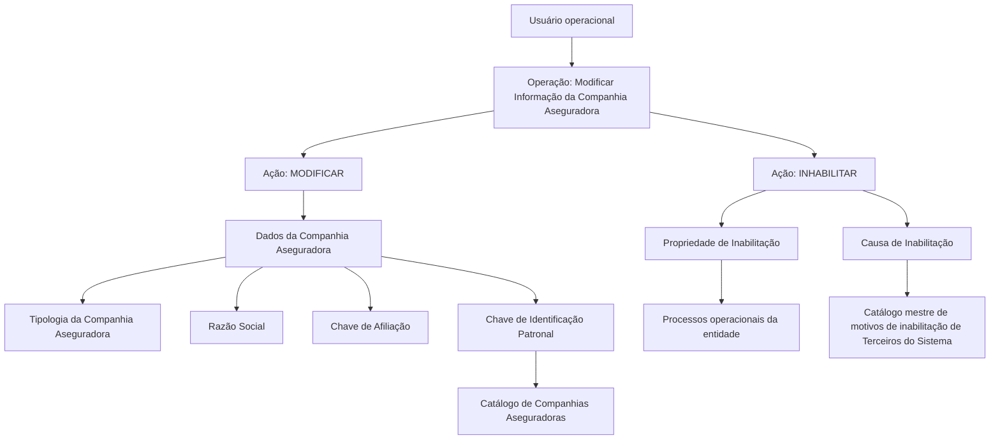

# Operação de Modificação e Inabilitação de Companhia Aseguradora

## 1. Metadados do Documento
- **Arquivo de Origem:** Não identificado no conteúdo fornecido
- **Tipo de Documento:** Especificação Funcional / Procedimento
- **Domínio / Sistema:** DOCUMENTACIÓN Reef / Mapfre
- **Público-Alvo:** Analistas funcionais, desenvolvedores, operação e áreas de negócio responsáveis pelo cadastro de Companhias Aseguradoras
- **Data/Versão Identificada:** Não identificada
- **Owner identificado:** `user:agonzalez_mapfre.com`
- **Lifecycle identificado:** `Approved Source`

---

## 2. Resumo Executivo & Contexto de Negócio

O documento descreve a operação **“Modificar Información específica de la Compañía Aseguradora”**, destinada a complementar e modificar informações previamente registradas para uma Companhia Aseguradora. A mesma operação também permite inabilitar uma Companhia Aseguradora no sistema.

A operação disponibiliza duas ações habilitadas: **MODIFICAR** e **INHABILITAR**. O conteúdo descreve atributos do bloco de informações da Companhia Aseguradora e informa que a sequência de captura dos campos deve ser interpretada da esquerda para a direita e de cima para baixo.

A especificação apresenta critérios de classificação geográfica e de afiliação da Companhia Aseguradora, identificação legal da entidade, aplicação de retenções, identificação patronal conforme a legislação do país e controle de inabilitação. A inabilitação deve ser considerada nos processos operacionais da entidade.

O documento também estabelece que a causa de inabilitação deve corresponder a um código definido no catálogo mestre de motivos de inabilitação de Terceiros do Sistema. Não são detalhados métodos de integração, contratos de API, persistência de dados, perfis de autorização ou regras de validação técnica de campos.

---

## 3. Arquitetura, Componentes & Tecnologias Envolvidas

Os elementos explicitamente identificados no conteúdo são:

- **DOCUMENTACIÓN Reef:** contexto de documentação em que a especificação está publicada.
- **Mapfredocument:** elemento textual de navegação ou identificação documental.
- **Sistema:** aplicação não nomeada que registra, processa e identifica a inabilitação de Companhias Aseguradoras.
- **Catálogo de Compañías Aseguradoras:** catálogo utilizado para identificar a chave de identificação patronal.
- **Catálogo mestre de motivos de inhabilitación de Terceros del Sistema:** catálogo mestre utilizado para selecionar o código da causa de inabilitação.
- **Companhia Aseguradora:** entidade de negócio administrada pela operação.
- **Processos operacionais da entidade:** processos que devem considerar o estado de inabilitação da Companhia Aseguradora.



> **Nota de Análise:** O documento não detalha arquitetura de software, camadas técnicas, bancos de dados, APIs, métodos HTTP, eventos, protocolos, servidores, URLs, autenticação ou mecanismos de auditoria.

---

## 4. Regras de Negócio, Especificações Funcionais & Processos

### 4.1 Objetivo da operação

A operação permite:

1. Complementar informações de uma Companhia Aseguradora previamente registrada.
2. Modificar informações de uma Companhia Aseguradora previamente registrada.
3. Inabilitar uma Companhia Aseguradora no Sistema.

### 4.2 Ações habilitadas

As ações habilitadas pelo documento são:

- **MODIFICAR**
- **INHABILITAR**

O documento não especifica se as duas ações podem ser executadas simultaneamente, se são mutuamente exclusivas ou quais condições determinam sua disponibilidade.

### 4.3 Sequência de captura dos campos

No bloco **Datos Compañía Aseguradora**, a sequência de captura dos campos deve seguir a disposição visual:

1. Da esquerda para a direita.
2. De cima para baixo.

### 4.4 Tipologia da Companhia Aseguradora

O campo **Tipología de Compañía Aseguradora** classifica geograficamente a Companhia Aseguradora e permite identificar:

- Se a Companhia Aseguradora é **Local** ou **Extranjera**.
- Se a Companhia Aseguradora é **Afiliada** ou **No Afiliada** localmente.

Quando a definição utiliza o idioma espanhol, os valores apresentados são:

- **AL — Afiliada (Local)**
- **NL — No Afiliada (Local)**
- **AE — Afiliada (Extranjera)**
- **NE — No Afiliada (Extranjera)**

### 4.5 Razão Social

O campo **Razón Social** deve indicar o nome sob o qual a entidade ou sociedade mercantil está registrada local e legalmente.

### 4.6 Chave de Afiliação

O atributo **Clave de Afiliación** identifica se a Companhia Aseguradora deve aplicar retenções.

Quando a definição utiliza o idioma espanhol, os valores apresentados são:

- **RE — Retención**
- **NR — No Retención**
- **OT — Otros**

O documento não define o significado operacional específico de **OT — Otros**, nem detalha cálculos, alíquotas, impostos ou processos de retenção associados.

### 4.7 Chave de Identificação Patronal

O campo **Clave de Identificación Patronal** serve para identificar, no catálogo de Companhias Aseguradoras, a chave de identificação patronal aplicável conforme a legislação do país em que a Companhia Aseguradora está localizada.

### 4.8 Inabilitação

A propriedade **Inhabilitación** informa ao Sistema que a Companhia Aseguradora está inabilitada. Esse estado deve ser contemplado nos processos operacionais da entidade.

O documento não detalha:

- O efeito exato da inabilitação em operações existentes.
- Se a inabilitação impede novas operações.
- Se existe reabilitação.
- Os critérios, autorizações ou validações necessários para inabilitar uma Companhia Aseguradora.

### 4.9 Causa de Inabilitação

Quando uma Companhia Aseguradora for inabilitada, o campo **Causa de Inhabilitación** deve conter o código de uma causa de inabilitação definida no catálogo mestre de motivos de inabilitação de Terceiros do Sistema.

---

## 5. Tabelas de Parâmetros, Ambientes e Estruturas de Dados

| Item / Parâmetro | Descrição / Função | Tipo / Valores / Formato | Ambiente / Observações |
| :--- | :--- | :--- | :--- |
| Operação | Complementa, modifica ou inabilita uma Companhia Aseguradora previamente registrada | Operação funcional | Sistema não nomeado |
| Ação | Modifica dados da Companhia Aseguradora | `MODIFICAR` | Ação habilitada |
| Ação | Inabilita a Companhia Aseguradora no Sistema | `INHABILITAR` | Ação habilitada |
| Tipologia de Companhia Aseguradora | Classifica geograficamente a Companhia Aseguradora e identifica afiliação local | `AL`, `NL`, `AE`, `NE` | Valores apresentados para definição em espanhol |
| `AL` | Companhia Aseguradora Afiliada e Local | Código | `Afiliada (Local)` |
| `NL` | Companhia Aseguradora Não Afiliada e Local | Código | `No Afiliada (Local)` |
| `AE` | Companhia Aseguradora Afiliada e Estrangeira | Código | `Afiliada (Extranjera)` |
| `NE` | Companhia Aseguradora Não Afiliada e Estrangeira | Código | `No Afiliada (Extranjera)` |
| Razão Social | Nome com o qual a entidade ou sociedade mercantil está registrada local e legalmente | Texto | Não há formato, tamanho ou regra de obrigatoriedade informados |
| Chave de Afiliação | Identifica se a Companhia Aseguradora deve aplicar retenções | `RE`, `NR`, `OT` | Valores apresentados para definição em espanhol |
| `RE` | Retenção | Código | `Retención` |
| `NR` | Não retenção | Código | `No Retención` |
| `OT` | Outros | Código | `Otros`; sem detalhamento adicional |
| Chave de Identificação Patronal | Identifica a chave de identificação patronal no catálogo de Companhias Aseguradoras | Código não especificado | Deve estar de acordo com a legislação do país de localização da Companhia Aseguradora |
| Inabilitação | Indica que a Companhia Aseguradora está inabilitada no Sistema | Propriedade; valores não informados | Deve ser considerada pelos processos operacionais da entidade |
| Causa de Inabilitação | Contém o código do motivo da inabilitação | Código não especificado | Deve ser definido no catálogo mestre de motivos de inabilitação de Terceiros do Sistema |
| Catálogo de Companhias Aseguradoras | Referência para identificação da chave de identificação patronal | Catálogo mestre | Estrutura não detalhada |
| Catálogo mestre de motivos de inabilitação de Terceiros do Sistema | Fonte dos códigos de causas de inabilitação | Catálogo mestre | Estrutura e códigos não detalhados |
| Owner | Proprietário identificado na documentação | `user:agonzalez_mapfre.com` | Metadado documental |
| Lifecycle | Estado de ciclo de vida identificado | `Approved Source` | Metadado documental |

---

## 6. Bateria de Perguntas & Respostas para RAG (FAQ Sintético)

### P1: Qual é o objetivo da operação de modificação da Companhia Aseguradora?
**R:** A operação permite complementar e modificar informações de uma Companhia Aseguradora previamente registrada. A operação também permite inabilitar a Companhia Aseguradora no Sistema.

### P2: Quais ações estão habilitadas para a operação de Companhia Aseguradora?
**R:** O documento identifica duas ações habilitadas: `MODIFICAR` e `INHABILITAR`. Não são informadas condições de uso, permissões ou exclusividade entre essas ações.

### P3: Em que ordem os campos do bloco de dados da Companhia Aseguradora devem ser capturados?
**R:** A sequência de captura deve seguir a ordem visual do bloco de informação: da esquerda para a direita e de cima para baixo.

### P4: Para que serve a Tipologia de Companhia Aseguradora?
**R:** A Tipologia de Companhia Aseguradora classifica a Companhia Aseguradora geograficamente para identificar se ela é Local ou Estrangeira e se é Afiliada ou Não Afiliada localmente.

### P5: Quais são os valores possíveis para a Tipologia de Companhia Aseguradora em espanhol?
**R:** Os valores apresentados são `AL — Afiliada (Local)`, `NL — No Afiliada (Local)`, `AE — Afiliada (Extranjera)` e `NE — No Afiliada (Extranjera)`.

### P6: O que representa o campo Razão Social da Companhia Aseguradora?
**R:** O campo Razão Social informa o nome sob o qual a entidade ou sociedade mercantil está registrada local e legalmente.

### P7: Qual é a finalidade da Chave de Afiliação?
**R:** A Chave de Afiliação identifica se a Companhia Aseguradora deve aplicar retenções. Os valores apresentados em espanhol são `RE — Retención`, `NR — No Retención` e `OT — Otros`.

### P8: Como a Chave de Identificação Patronal é determinada?
**R:** A Chave de Identificação Patronal serve para identificar, no catálogo de Companhias Aseguradoras, a chave de identificação patronal conforme a legislação do país em que a Companhia Aseguradora está localizada.

### P9: O que acontece quando uma Companhia Aseguradora é marcada como inabilitada?
**R:** A propriedade de Inabilitação informa ao Sistema que a Companhia Aseguradora está inabilitada. Esse fato deve ser considerado nos processos operacionais da entidade. O documento não detalha quais operações são bloqueadas ou alteradas pelo estado de inabilitação.

### P10: De onde deve vir a Causa de Inabilitação?
**R:** Quando uma Companhia Aseguradora for inabilitada, a Causa de Inabilitação deve conter um código definido no catálogo mestre de motivos de inabilitação de Terceiros do Sistema.

### P11: O documento especifica APIs ou contratos técnicos para modificar a Companhia Aseguradora?
**R:** Não. O documento descreve campos e regras funcionais, mas não detalha APIs, métodos HTTP, contratos JSON, banco de dados, integrações, autenticação ou mecanismos técnicos de implementação.

### P12: O documento informa os códigos disponíveis para causas de inabilitação?
**R:** Não. O documento apenas estabelece que a causa deve ser um código definido no catálogo mestre de motivos de inabilitação de Terceiros do Sistema; os códigos desse catálogo não são apresentados.

---

## 7. Glossário de Termos, Siglas & Conceitos-Chave

- **AL:** `Afiliada (Local)`, código de tipologia para Companhia Aseguradora afiliada e local.
- **NL:** `No Afiliada (Local)`, código de tipologia para Companhia Aseguradora não afiliada e local.
- **AE:** `Afiliada (Extranjera)`, código de tipologia para Companhia Aseguradora afiliada e estrangeira.
- **NE:** `No Afiliada (Extranjera)`, código de tipologia para Companhia Aseguradora não afiliada e estrangeira.
- **RE:** `Retención`, código da Chave de Afiliação que indica retenção.
- **NR:** `No Retención`, código da Chave de Afiliação que indica não retenção.
- **OT:** `Otros`, código da Chave de Afiliação para outros casos não detalhados no documento.
- **Compañía Aseguradora:** entidade seguradora cujas informações podem ser complementadas, modificadas ou inabilitadas no Sistema.
- **Razón Social:** nome legal e localmente registrado de uma entidade ou sociedade mercantil.
- **Clave de Afiliación:** atributo que identifica a aplicação ou não de retenções pela Companhia Aseguradora.
- **Clave de Identificación Patronal:** atributo usado para identificar a chave de identificação patronal no catálogo de Companhias Aseguradoras, conforme a legislação do país.
- **Inhabilitación:** propriedade que informa que uma Companhia Aseguradora está inabilitada no Sistema.
- **Causa de Inhabilitación:** código do motivo de inabilitação, definido no catálogo mestre de motivos de inabilitação de Terceiros do Sistema.
- **DOCUMENTACIÓN Reef:** contexto documental identificado no conteúdo fornecido.
- **Approved Source:** estado de ciclo de vida identificado no conteúdo documental.

---

## 8. Notas Críticas, Riscos & Limitações

- O documento não identifica o nome do arquivo de origem, data, versão, autoria formal ou sistema transacional específico.
- Não há detalhamento de APIs, endpoints, métodos HTTP, payloads, integrações, banco de dados, logs, URLs ou ambientes.
- Não são informadas regras de obrigatoriedade, formato, tamanho, unicidade ou validação dos campos.
- Não são detalhadas permissões, perfis de usuários ou responsabilidades para executar as ações `MODIFICAR` e `INHABILITAR`.
- O valor `OT — Otros` da Chave de Afiliação é listado sem definição funcional adicional.
- Os códigos do catálogo mestre de motivos de inabilitação de Terceiros do Sistema não são fornecidos.
- Não há definição do comportamento operacional concreto após a inabilitação, incluindo bloqueios, efeitos em processos existentes ou reabilitação.
- **Nota de Análise:** O conteúdo apresenta uma especificação funcional de campos e regras de cadastro, mas não fornece detalhamento técnico suficiente para implementação de interfaces, contratos de serviço ou validações sistêmicas completas.

---

## 9. Conteúdo Bruto Estruturado (Referência Fiel)

```text
--- [PÁGINA 1 DE 2] ---

MODIFICAR Información especíca de la Compañía Aseguradora
Objetivo
Esta Operación permite Complementar y Modicar la información de la Compañía Aseguradora registrada previamente además de poder
Inhabilitarla.
Acciones habilitadas
 MODIFICAR ( )
 INHABILITAR ( )
Datos Compañía Aseguradora
De Izquierda a Derecha y de Arriba hacia Abajo, los siguientes atributos marcan la secuencia de captura de los Campos en este Bloque de
Información.
Tipología de Compañía Aseguradora (  )
Este campo clasica a la Compañía Aseguradora identicándola geográcamente para conocer si es una Compañía Local o Extranjera y si
está o no aliada localmente.
Si el idioma empleado en la denición es el español, sus valores serían...
(AL) Aliada (Local)
(NL) No Aliada (Local)
(AE) Aliada (Extranjera)
(NE) No Aliada (Extranjera)
Razón Social ( )
Este campo indicará el nombre con que la entidad o sociedad mercantil está registrada local y legalmente.
Clave de Aliación (  )
Este atributo sirve para identicar si la compañía tiene o no que aplicar retenciones
Documentation / DOCUMENTACIÓN Reef
DOCUMENTACIÓN Reef
Mapfredocument
DOCUMENTACIÓN Reef
Owner
user:agonzalez_mapfre.com
Lifecycle
Approved Source
 / 
 VL
Buscar Inicio Soluciones Arquitecturas APIs Componentes Cloud Documentación Zeus Reef Ayuda
ES


--- [PÁGINA 2 DE 2] ---

Si el idioma empleado en la denición es el español, sus valores serían...
(RE) Retención
(NR) No Retención
(OT) Otros
Clave de Identicación Patronal ( )
Este campo sirve para identicar en el catálogo de Compañías Aseguradoras la clave de identicación patronal de acuerdo con la legislación
del país en el que se ubica la compañía.
Inhabilitación ( )
Esta propiedad le indica al Sistema que la compañía aseguradora está inhabilitada en el Sistema por lo que este hecho debería ser
contemplado en los procesos operativos de la entidad.
Causa de Inhabilitación (   )
En el supuesto que se inhabilitara a la Compañía Aseguradora, este dato contendrá el código de una causa de inhabilitación denida en el
catálogo maestro de motivos de inhabilitación de Terceros del Sistema.
```
