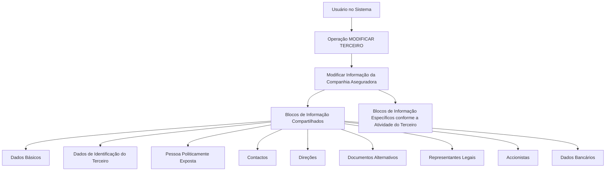

# Operação MODIFICAR Terceiro — Companhia Aseguradora: Blocos de Informação Compartilhados e Específicos

## 1. Metadados do Documento
- **Arquivo de Origem:** `Não identificado — conteúdo bruto fornecido em conversa`
- **Tipo de Documento:** Procedimento
- **Domínio / Sistema:** REEF / Mapfre — operação **MODIFICAR TERCEIRO** para Companhia Aseguradora
- **Público-Alvo:** Usuários do sistema, analistas funcionais e equipes de operação
- **Data/Versão Identificada:** Não identificada

---

## 2. Resumo Executivo & Contexto de Negócio

O documento descreve a operação **MODIFICAR TERCEIRO** aplicada ao cadastro de uma **Compañía Aseguradora**. A operação permite complementar, modificar e/ou inabilitar informações da companhia seguradora nos blocos ou estruturas de dados que concentram essas informações.

A obrigatoriedade e a habilitação dos campos não são fixas para todos os registros. Esses comportamentos podem variar conforme o código de atividade do terceiro e conforme o tipo de terceiro, especificamente quando o terceiro é uma **Pessoa Física** ou uma **Pessoa Jurídica**.

O documento também estabelece que modificações implementadas localmente podem afetar o comportamento da aplicação, especialmente quanto à obrigatoriedade de preenchimento dos dados do terceiro. Portanto, a operação deve considerar configurações ou adaptações locais existentes.

A captura ou alteração de dados nos blocos de informação pode ocorrer em ordens diferentes, de acordo com o critério adotado pelo usuário no sistema. O conteúdo fornecido não detalha telas, campos individuais, validações técnicas, métodos HTTP, contratos de integração ou regras específicas por atividade.

---

## 3. Arquitetura, Componentes & Tecnologias Envolvidas

Os elementos identificados no conteúdo são:

- Operação **MODIFICAR TERCEIRO**.
- Entidade de negócio **Compañía Aseguradora**.
- Blocos de informação compartilhados.
- Blocos de informação específicos conforme a atividade do terceiro.
- Ambiente ou repositório documental referido como **REEF**, **DOCUMENTACIÓN Reef** e **Mapfredocument**.
- Referência de navegação documental com categorias como Soluções, Arquiteturas, APIs, Componentes, Cloud, Documentação, Zeus, Reef e Ajuda.

O fluxo funcional identificado representa a alteração de informações da companhia seguradora através de blocos compartilhados e blocos específicos relacionados à atividade do terceiro.



> **Nota de Análise:** O documento não apresenta uma arquitetura técnica de sistemas, integrações, bancos de dados, serviços, APIs, protocolos, URLs de ambiente ou contratos JSON.

---

## 4. Regras de Negócio, Especificações Funcionais & Processos

### Operação MODIFICAR TERCEIRO

A operação consiste em:

1. Complementar informações da **Compañía Aseguradora**.
2. Modificar informações da **Compañía Aseguradora**.
3. Inabilitar informações da **Compañía Aseguradora**.
4. Realizar essas ações em qualquer bloco ou estrutura de dados que contenha e agrupe as informações da companhia seguradora.

### Premissas identificadas

1. A obrigatoriedade e/ou habilitação dos campos em cada bloco ou estrutura de informação compartilhada pode variar de acordo com o **código de atividade do terceiro**.
2. A obrigatoriedade e/ou habilitação dos campos pode variar quando o tipo de terceiro for:
   - Pessoa Física.
   - Pessoa Jurídica.
3. Modificações implementadas localmente podem afetar o comportamento da aplicação relativo à obrigatoriedade de registro dos dados do terceiro.
4. A ordem de captura dos dados nos blocos de informação pode variar conforme o critério utilizado pelo usuário no sistema.
5. A operação abrange blocos de informação compartilhados e blocos específicos relacionados à atividade do terceiro.

### Blocos de informação compartilhados

A operação MODIFICAR TERCEIRO relaciona os seguintes blocos de informação compartilhados:

- Dados Básicos.
- Dados de Identificação do Terceiro.
- Pessoa Politicamente Exposta.
- Contactos.
- Direções.
- Documentos Alternativos.
- Representantes Legais.
- Accionistas.
- Dados Bancários.

### Blocos de informação específicos

O documento menciona a existência de blocos de informação específicos de acordo com a atividade do terceiro, mas não identifica quais são esses blocos, seus campos, regras de preenchimento ou critérios de seleção.

> **Nota de Análise:** O documento não detalha quais campos são obrigatórios para cada código de atividade, para Pessoa Física ou para Pessoa Jurídica.

---

## 5. Tabelas de Parâmetros, Ambientes e Estruturas de Dados

| Item / Parâmetro | Descrição / Função | Tipo / Valores / Formato | Ambiente / Observações |
| :--- | :--- | :--- | :--- |
| Operação | MODIFICAR TERCEIRO | Operação funcional | Permite complementar, modificar e/ou inabilitar informações. |
| Entidade | Compañía Aseguradora | Terceiro | Entidade cuja informação é alterada pela operação. |
| Código de atividade do terceiro | Critério que pode alterar obrigatoriedade e habilitação de campos | Código não especificado | O documento não informa códigos possíveis ou regras por código. |
| Tipo de terceiro | Critério que pode alterar obrigatoriedade e habilitação de campos | Pessoa Física ou Pessoa Jurídica | Não há detalhamento dos campos condicionados por tipo. |
| Modificações locais | Alterações locais que podem afetar o comportamento da aplicação | Não especificado | Podem afetar a obrigatoriedade no registro dos dados do terceiro. |
| Ordem de captura | Sequência de preenchimento ou alteração dos blocos | Variável | Pode variar conforme o critério do usuário no sistema. |
| Dados Básicos | Bloco de informação compartilhado | Bloco de dados | Campos não detalhados. |
| Dados de Identificação do Terceiro | Bloco de informação compartilhado | Bloco de dados | Campos não detalhados. |
| Pessoa Politicamente Exposta | Bloco de informação compartilhado | Bloco de dados | O documento não define critérios ou campos. |
| Contactos | Bloco de informação compartilhado | Bloco de dados | Campos não detalhados. |
| Direções | Bloco de informação compartilhado | Bloco de dados | Campos não detalhados. |
| Documentos Alternativos | Bloco de informação compartilhado | Bloco de dados | Campos não detalhados. |
| Representantes Legais | Bloco de informação compartilhado | Bloco de dados | Campos não detalhados. |
| Accionistas | Bloco de informação compartilhado | Bloco de dados | Campos não detalhados. |
| Dados Bancários | Bloco de informação compartilhado | Bloco de dados | Campos não detalhados. |
| Blocos específicos por atividade | Estruturas de dados dependentes da atividade do terceiro | Não especificado | O documento confirma sua existência, mas não os enumera. |
| REEF / DOCUMENTACIÓN Reef | Referência documental apresentada no conteúdo | Repositório ou área documental, não confirmado | Também são citados Mapfredocument e categorias de navegação. |

---

## 6. Bateria de Perguntas & Respostas para RAG (FAQ Sintético)

### P1: Em que consiste a operação MODIFICAR TERCEIRO para uma Companhia Aseguradora?
**R:** A operação MODIFICAR TERCEIRO consiste em complementar, modificar e/ou inabilitar as informações da Companhia Aseguradora em qualquer bloco ou estrutura de dados que contenha e agrupe essas informações.

### P2: Quais fatores podem alterar a obrigatoriedade ou a habilitação dos campos?
**R:** A obrigatoriedade e/ou habilitação dos campos pode variar conforme o código de atividade do terceiro e conforme o tipo de terceiro, quando classificado como Pessoa Física ou Pessoa Jurídica.

### P3: Quais tipos de terceiro são citados como critérios para variação de campos?
**R:** O documento cita Pessoa Física e Pessoa Jurídica como tipos de terceiro que podem influenciar a obrigatoriedade e/ou habilitação dos campos de informação.

### P4: As modificações locais podem impactar a operação MODIFICAR TERCEIRO?
**R:** Sim. O documento informa que modificações implementadas localmente podem afetar o comportamento da aplicação em relação à obrigatoriedade no registro dos dados do terceiro.

### P5: A captura dos dados deve seguir uma sequência obrigatória entre os blocos?
**R:** Não. O documento informa que a ordem de captura dos dados nos diversos blocos de informação pode variar conforme o critério seguido pelo usuário no sistema.

### P6: Quais são os blocos de informação compartilhados identificados para modificar uma Companhia Aseguradora?
**R:** Os blocos identificados são Dados Básicos, Dados de Identificação do Terceiro, Pessoa Politicamente Exposta, Contactos, Direções, Documentos Alternativos, Representantes Legais, Accionistas e Dados Bancários.

### P7: O documento especifica os campos presentes no bloco Dados Bancários?
**R:** Não. O documento apenas lista Dados Bancários como um bloco de informação compartilhado, sem detalhar campos, formatos, obrigatoriedades ou regras de validação.

### P8: Existem blocos de informação específicos para a atividade do terceiro?
**R:** Sim. O documento menciona blocos de informação específicos de acordo com a atividade do terceiro. Entretanto, não identifica esses blocos nem explica seus campos ou critérios de uso.

### P9: O documento informa quais códigos de atividade exigem determinados campos?
**R:** Não. O conteúdo afirma que o código de atividade do terceiro pode alterar obrigatoriedade e habilitação dos campos, mas não fornece a lista de códigos de atividade nem o mapeamento de regras associado.

### P10: O documento apresenta APIs, métodos HTTP ou contratos de integração para MODIFICAR TERCEIRO?
**R:** Não. O conteúdo fornecido não descreve APIs, métodos HTTP, contratos JSON, integrações, tecnologias de implementação ou endereços de ambiente.

### P11: Onde o conteúdo faz referência à documentação relacionada?
**R:** O conteúdo apresenta referências a “Documentation / DOCUMENTACIÓN Reef”, “DOCUMENTACIÓN Reef” e “Mapfredocument”, além de opções de navegação como Soluções, Arquiteturas, APIs, Componentes, Cloud, Documentação, Zeus, Reef e Ajuda.

---

## 7. Glossário de Termos, Siglas & Conceitos-Chave

- **MODIFICAR TERCEIRO:** Operação destinada a complementar, modificar e/ou inabilitar informações de um terceiro, neste caso uma Companhia Aseguradora.
- **Compañía Aseguradora:** Entidade de terceiro cuja informação é tratada na operação descrita.
- **Terceiro:** Entidade cujos dados são registrados e modificados no sistema.
- **Pessoa Física:** Tipo de terceiro citado como fator que pode alterar obrigatoriedade e habilitação de campos.
- **Pessoa Jurídica:** Tipo de terceiro citado como fator que pode alterar obrigatoriedade e habilitação de campos.
- **Pessoa Politicamente Exposta:** Bloco de informação compartilhado citado no processo MODIFICAR TERCEIRO.
- **Representantes Legais:** Bloco de informação compartilhado citado no processo MODIFICAR TERCEIRO.
- **Accionistas:** Bloco de informação compartilhado citado no processo MODIFICAR TERCEIRO.
- **REEF:** Termo apresentado em referências de documentação; o significado da sigla não é definido no conteúdo.
- **Mapfredocument:** Nome apresentado como referência documental; sua função técnica não é detalhada no conteúdo.

---

## 8. Notas Críticas, Riscos & Limitações

- O conteúdo não detalha os campos existentes em cada bloco de informação.
- O conteúdo não informa regras específicas de obrigatoriedade para cada código de atividade.
- O conteúdo não apresenta a lista de códigos de atividade aplicáveis.
- O conteúdo não define os blocos específicos associados a cada atividade do terceiro.
- O conteúdo não apresenta validações, mensagens de erro, permissões, perfis de acesso ou trilhas de auditoria.
- O conteúdo não descreve APIs, integrações, serviços, bancos de dados, URLs, ambientes, portas ou tecnologias de implementação.
- Alterações locais podem modificar o comportamento da aplicação quanto à obrigatoriedade de dados, criando risco de comportamento divergente entre instalações ou contextos locais.
- A ordem variável de captura de dados exige que usuários e processos operacionais não assumam uma sequência fixa entre os blocos.
- Parte do texto bruto apresenta caracteres de codificação corrompidos, como “Modicar”, “Identicación” e “Especícos”. A interpretação foi preservada com base no contexto textual disponível.

---

## 9. Conteúdo Bruto Estruturado (Referência Fiel)

```text
--- [PÁGINA 1 DE 2] ---

OPERACIÓN MODIFICAR Compañía Aseguradora
¿En que consiste?
Esta operación consiste en Complementar, Modicar y/o Inhabilitar la información de la Compañía Aseguradora en cualquiera de los
bloques o estructuras de datos que la contienen y agrupan.
Premisas
La obligatoriedad y/o la habilitación de los campos en el registro de los datos de cada uno de los bloques o estructuras de información
compartidas puede variar de acuerdo con el código de actividad del Tercero:
La obligatoriedad y/o la habilitación de los campos en el registro de los datos de cada uno de los bloques o estructuras de información
pueden variar si el tipo de Tercero es una Persona Física o una Persona Jurídica:
Las modicaciones que se hubieran podido implementar localmente a su vez pueden afectar el comportamiento de la aplicación en
relación con la obligatoriedad en el registro de los Datos del Tercero.
Por último, el orden de captura de los datos en los distintos bloques de Información puede variar de acuerdo con el criterio seguido por el
Usuario en el Sistema.
Proceso
MODIFICAR
TERCERO
Modificar Información de la
Compañía Aseguradora
Bloques de Información Compartidos (MODIFICAR TERCERO)
 Datos Básicos ( )
 Datos Identicación Tercero ( )
 Persona Políticamente Expuesta(   )
 Contactos (   )
 Direcciones (   )
 Documentos Alternativos (   )
Ejemplo:
Ejemplo:
Documentation / DOCUMENTACIÓN Reef
DOCUMENTACIÓN Reef
Mapfredocument
DOCUMENTACIÓN Reef
Owner
user:agonzalez_mapfre.com
Lifecycle
Approved Source
 / 
 VL
Buscar Inicio Soluciones Arquitecturas APIs Componentes Cloud Documentación Zeus Reef Ayuda
ES

--- [PÁGINA 2 DE 2] ---

Representantes Legales (   )
 Accionistas (   )
 Datos Bancarios (   )
Bloques de Información Especícos de acuerdo con la Actividad del Tercero.
 Modicar Información de la Compañía Aseguradora(  )
```
