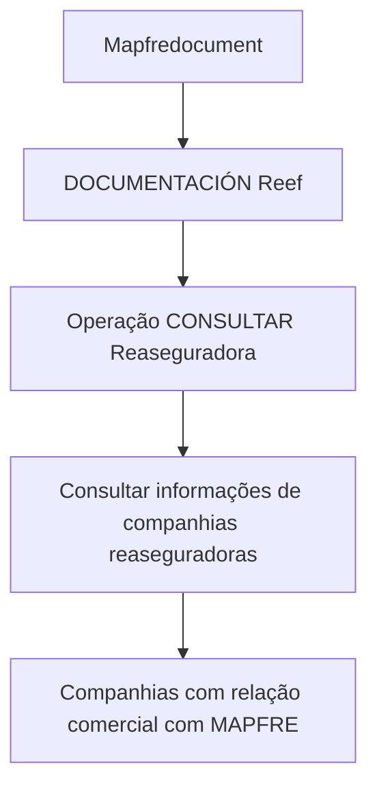

# Consulta de Compañías Reaseguradoras no Sistema MAPFRE — Documentação Reef

## 1. Metadados do Documento
- **Arquivo de Origem:** Não identificado
- **Tipo de Documento:** Procedimento
- **Domínio / Sistema:** MAPFRE / Reef
- **Público-Alvo:** Operação, negócio e usuários de documentação
- **Data/Versão Identificada:** Não identificada

---

## 2. Resumo Executivo & Contexto de Negócio

O documento descreve a operação **“CONSULTAR Reaseguradora”**, destinada à consulta, no sistema, de informações sobre companhias resseguradoras.

A operação cobre companhias resseguradoras com as quais a entidade MAPFRE mantém relação comercial em qualquer um de seus processos operacionais. O texto não especifica filtros, campos retornados, permissões, métodos de acesso ou regras de atualização da informação.

O conteúdo está associado à documentação Reef, apresentada em uma interface de navegação corporativa que inclui áreas como Soluções, Arquiteturas, APIs, Componentes, Cloud, Documentação, Zeus e Reef.

---

## 3. Arquitetura, Componentes & Tecnologias Envolvidas

Os elementos identificados no conteúdo são:

- **Sistema:** Sistema não nomeado no trecho, responsável por permitir a consulta de resseguradoras.
- **Entidade corporativa:** MAPFRE.
- **Domínio documental:** Reef.
- **Portal ou navegação documental:** Mapfredocument.
- **Seções de navegação visíveis:** Buscar, Inicio, Soluciones, Arquitecturas, APIs, Componentes, Cloud, Documentación, Zeus, Reef e Ayuda.
- **Registro de governança documental:** Owner `user:agonzalez_mapfre.com`, Lifecycle `Approved Source`, marcação `VL`.



**Nota de Análise:** o trecho não detalha arquitetura de software, integrações, APIs, microsserviços, bancos de dados, protocolos, métodos HTTP ou contratos de dados.

---

## 4. Regras de Negócio, Especificações Funcionais & Processos

1. A operação documentada é denominada **CONSULTAR Reaseguradora**.
2. A operação permite consultar informações de companhias resseguradoras no sistema.
3. As companhias resseguradoras elegíveis para consulta são aquelas que mantêm relação comercial com a entidade MAPFRE.
4. A relação comercial pode ocorrer em qualquer processo operacional da entidade MAPFRE.
5. O conteúdo não descreve critérios para identificar uma relação comercial ativa, encerrada ou pendente.
6. O conteúdo não informa quais atributos da companhia resseguradora são disponibilizados pela consulta.
7. O conteúdo não detalha autenticação, autorização, perfis de acesso, tratamento de erros ou procedimento operacional passo a passo.

---

## 5. Tabelas de Parâmetros, Ambientes e Estruturas de Dados

| Item / Parâmetro | Descrição / Função | Tipo / Valores / Formato | Ambiente / Observações |
| :--- | :--- | :--- | :--- |
| Operação | Consulta de companhias resseguradoras | `CONSULTAR Reaseguradora` | Executada no sistema não identificado pelo trecho |
| Objeto consultado | Informações de companhias resseguradoras | Informação corporativa | Restrita a companhias com relação comercial com MAPFRE |
| Entidade relacionada | Organização que mantém relação comercial com as resseguradoras | MAPFRE | Citada no contexto dos processos operacionais |
| Domínio documental | Área de documentação associada ao conteúdo | Reef | Exibido como `DOCUMENTACIÓN Reef` |
| Portal documental | Identificação visual do ambiente documental | Mapfredocument | O trecho não informa URL |
| Owner | Responsável indicado na documentação | `user:agonzalez_mapfre.com` | Valor literal apresentado no conteúdo |
| Lifecycle | Estado de ciclo de vida indicado | `Approved Source` | Sem detalhamento adicional |
| Marcação adicional | Identificador ou sigla exibida junto ao ciclo de vida | `VL` | Significado não definido |
| Idioma da interface | Idioma indicado no portal | `ES` | O conteúdo principal está em espanhol |

---

## 6. Bateria de Perguntas & Respostas para RAG (FAQ Sintético)

### P1: Qual é a finalidade da operação CONSULTAR Reaseguradora?
**R:** A operação CONSULTAR Reaseguradora permite consultar, no sistema, informações sobre companhias resseguradoras com as quais a entidade MAPFRE possui relação comercial.

### P2: Quais companhias resseguradoras podem ser consultadas?
**R:** Podem ser consultadas as companhias resseguradoras que tenham relação comercial com a entidade MAPFRE em qualquer um de seus processos operacionais.

### P3: O documento informa quais dados são retornados na consulta de resseguradoras?
**R:** Não. O documento informa que a operação consulta informações de companhias resseguradoras, mas não especifica campos, estrutura de resposta, filtros ou formatos de dados.

### P4: A operação CONSULTAR Reaseguradora está vinculada a qual domínio documental?
**R:** A operação está vinculada ao domínio `DOCUMENTACIÓN Reef`, conforme a identificação exibida no conteúdo.

### P5: O documento detalha uma API ou métodos HTTP para consultar reasseguradoras?
**R:** Não. Embora a navegação do portal mencione a seção `APIs`, o trecho não apresenta endpoint, método HTTP, contrato JSON, autenticação ou qualquer especificação de API para a operação CONSULTAR Reaseguradora.

### P6: Qual entidade corporativa é mencionada na relação comercial com as resseguradoras?
**R:** A entidade corporativa mencionada é MAPFRE. O texto afirma que as companhias resseguradoras consultadas mantêm relação comercial com a entidade MAPFRE.

### P7: A relação comercial com a MAPFRE é limitada a um processo operacional específico?
**R:** Não. O texto estabelece que a relação comercial pode ocorrer em qualquer um dos processos operacionais da entidade MAPFRE.

### P8: Quem aparece como owner da documentação?
**R:** O owner exibido no conteúdo é `user:agonzalez_mapfre.com`.

### P9: Qual é o status de ciclo de vida informado para a documentação?
**R:** O status de ciclo de vida apresentado é `Approved Source`. O documento não explica o significado operacional desse status.

### P10: O documento contém instruções passo a passo para executar a consulta?
**R:** Não. O conteúdo descreve somente o propósito da operação CONSULTAR Reaseguradora e o escopo das companhias consultáveis, sem detalhar etapas de execução.

---

## 7. Glossário de Termos, Siglas & Conceitos-Chave

- **CONSULTAR Reaseguradora:** Operação para consultar informações de companhias resseguradoras no sistema.
- **Compañías Reaseguradoras:** Companhias resseguradoras que possuem relação comercial com a entidade MAPFRE.
- **MAPFRE:** Entidade citada como mantenedora de relação comercial com as companhias resseguradoras.
- **Reef:** Domínio ou área de documentação exibida como `DOCUMENTACIÓN Reef`.
- **Mapfredocument:** Identificação exibida para o ambiente ou portal documental.
- **Owner:** Campo que identifica o responsável pela documentação; o valor exibido é `user:agonzalez_mapfre.com`.
- **Lifecycle:** Campo de ciclo de vida documental; o valor exibido é `Approved Source`.
- **VL:** Sigla ou marcação exibida no conteúdo, sem definição fornecida.
- **ES:** Indicador de idioma exibido na interface, correspondente ao espanhol.

---

## 8. Notas Críticas, Riscos & Limitações

- O arquivo de origem, a data e a versão do documento não foram identificados no conteúdo fornecido.
- O documento não detalha os campos consultáveis, filtros disponíveis, critérios de ordenação ou formato de retorno.
- Não há informação sobre autenticação, autorização, perfis de acesso ou trilha de auditoria.
- Não são descritos endpoints, contratos de integração, tecnologias, componentes técnicos ou ambientes.
- A sigla `VL` aparece no conteúdo, mas não possui definição.
- **Nota de Análise:** o documento lista a operação `CONSULTAR Reaseguradora`, porém não detalha métodos HTTP, contratos JSON, regras de validação ou procedimentos de uso.

---

## 9. Conteúdo Bruto Estruturado (Referência Fiel)

```text
--- [PÁGINA 1 DE 1] ---

OPERACIÓN CONSULTAR Reaseguradora
Esta operación permite consultar en el Sistema la Información de las Compañías Reaseguradoras con las que la entidad MAPFRE tiene una
relación comercial en cualquiera de sus procesos operativos.
Documentation / DOCUMENTACIÓN Reef
DOCUMENTACIÓN Reef
Mapfredocument
DOCUMENTACIÓN Reef
Owner
user:agonzalez_mapfre.com
Lifecycle
Approved Source
 / 
 VL
Buscar Inicio Soluciones Arquitecturas APIs Componentes Cloud Documentación Zeus Reef Ayuda
ES
```
