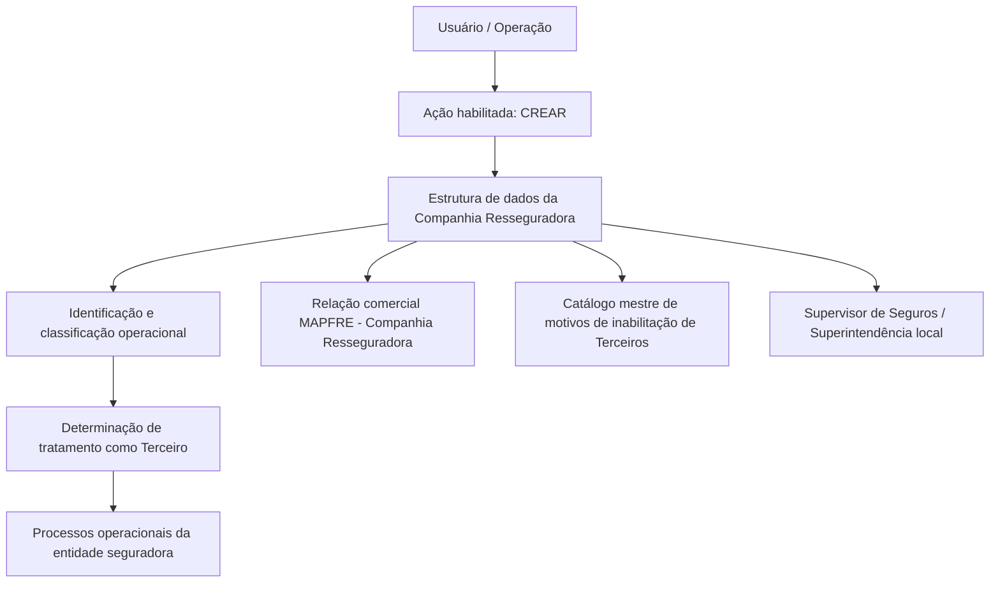

# Cadastro de Informações Específicas para Companhia Resseguradora

## 1. Metadados do Documento
- **Arquivo de Origem:** Não identificado no conteúdo fornecido
- **Tipo de Documento:** Manual Operacional / Especificação Funcional de Estrutura de Dados
- **Domínio / Sistema:** Reef / MAPFRE / gestão de Companhias Resseguradoras
- **Público-Alvo:** Negócio, analistas funcionais, operação e desenvolvedores
- **Data/Versão Identificada:** Não identificada
- **Owner identificado:** `user:agonzalez_mapfre.com`
- **Lifecycle identificado:** `Approved Source`
- **Idioma predominante:** Espanhol

---

## 2. Resumo Executivo & Contexto de Negócio

O documento descreve a criação de informações específicas para uma Companhia Resseguradora em uma estrutura de dados corporativa. O objetivo declarado é capturar, identificar e classificar informações de âmbito operacional sobre a Companhia Resseguradora.

A classificação permite que processos da entidade seguradora determinem se a Companhia Resseguradora deve, ou não, ser considerada como um Terceiro. O conteúdo relaciona o cadastro da Companhia Resseguradora a processos operacionais da entidade seguradora, sem detalhar quais processos consomem esses dados.

A estrutura de captura possui uma ação habilitada denominada `CREAR`. Os atributos devem ser preenchidos em uma sequência visual definida: da esquerda para a direita e de cima para baixo dentro do bloco de informação.

Os dados abrangem classificação geográfica e de afiliação, identificação, rating, broker, país de origem, vigência da relação comercial com a MAPFRE, tributos, plano de pagamento, capital subscrito, identificação regulatória e inabilitação operacional.

---

## 3. Arquitetura, Componentes & Tecnologias Envolvidas

O conteúdo não apresenta arquitetura técnica de software, APIs, métodos HTTP, contratos JSON, bancos de dados, microsserviços, servidores, URLs ou tecnologias de implementação.

Os componentes funcionais explicitamente citados são:

- **Estrutura de dados:** local de captura das informações da Companhia Resseguradora.
- **Companhia Resseguradora:** entidade cujos dados operacionais são cadastrados.
- **Entidade Seguradora / MAPFRE:** entidade que mantém a relação comercial e pode tratar a Companhia Resseguradora como Terceiro.
- **Processos operacionais da entidade seguradora:** processos que devem considerar a condição da Companhia Resseguradora.
- **Catálogo mestre de motivos de inabilitação de Terceiros:** catálogo que fornece o código da causa de inabilitação.
- **Supervisor de Seguros / Superintendência de Seguros local:** órgão ou referência regulatória associado à chave da Companhia Resseguradora.
- **Broker de Seguros:** principal broker com o qual a Companhia Resseguradora habitualmente opera, quando aplicável.



> **Nota de Análise:** O documento descreve o fluxo funcional de captura e uso de dados, mas não detalha a implementação tecnológica, persistência, integrações, serviços ou regras de autorização.

---

## 4. Regras de Negócio, Especificações Funcionais & Processos

### 4.1 Objetivo funcional

A captura dos dados da Companhia Resseguradora visa identificar e classificar informações operacionais dessa entidade. A classificação deve suportar a decisão de contemplar ou não a Companhia Resseguradora como Terceiro nos processos da entidade seguradora que demandem essa informação.

### 4.2 Ação habilitada

A única ação explicitamente habilitada é:

- `CREAR`

O documento não descreve ações de alteração, consulta, exclusão, aprovação, rejeição ou inativação de registros.

### 4.3 Sequência de captura

Os atributos do bloco de informação devem ser capturados na sequência visual:

1. Da esquerda para a direita.
2. De cima para baixo.

O conteúdo não especifica quais campos são obrigatórios, quais são opcionais, regras de formato, máscaras, tamanhos máximos, tipos de dados técnicos ou validações de consistência.

### 4.4 Regras para Tipologia de Companhia Resseguradora

A **Tipologia de Companhia Resseguradora** classifica geograficamente a Companhia Resseguradora para identificar:

- Se a Companhia Resseguradora é local ou estrangeira.
- Se a Companhia Resseguradora é afiliada localmente ou não.

Quando o idioma empregado na definição é espanhol, os valores apresentados são:

| Código | Valor em espanhol | Interpretação funcional |
| :--- | :--- | :--- |
| `AL` | Afiliada (Local) | Companhia afiliada e local |
| `NL` | No Afiliada (Local) | Companhia não afiliada e local |
| `AE` | Afiliada (Extranjera) | Companhia afiliada e estrangeira |
| `NE` | No Afiliada (Extranjera) | Companhia não afiliada e estrangeira |

### 4.5 Regras de vigência da relação comercial

- **Fecha de Efecto:** determina a data de efeito que estabelece a relação entre a Companhia MAPFRE e a Companhia Resseguradora.
- **Fecha de Vencimiento:** determina a data de vencimento que distingue o fim da relação comercial entre a Companhia MAPFRE e a Companhia Resseguradora.

O documento não estabelece validações entre as datas, tais como obrigatoriedade, formato, fuso horário ou regra que exija que a data de vencimento seja posterior à data de efeito.

### 4.6 Regras tributárias e econômicas

- **Impuesto sobre Intereses de los Depósitos de Reaseguro:** contém o código do imposto a ser aplicado sobre os juros gerados pelos depósitos de resseguro.
- **Código de Impuesto sobre la Renta:** contém o código de imposto que a entidade MAPFRE aplicará como retenção nas operações econômicas com a Companhia Resseguradora.
- **Plan de Pago:** identifica a temporalidade que deve ser considerada na relação econômica com a Companhia Resseguradora.
- **Capital suscrito:** contém o capital subscrito pela Companhia Resseguradora.

O documento não informa alíquotas tributárias, moedas, fórmulas de cálculo, periodicidades aceitas ou catálogos de planos de pagamento.

### 4.7 Regras de inabilitação

A propriedade **Inhabilitación** informa ao sistema que a Companhia Resseguradora está inabilitada no sistema. Esse estado deve ser contemplado nos processos operacionais da entidade seguradora.

Quando uma Companhia Resseguradora for inabilitada:

- O campo **Causa de Inhabilitación** deve conter o código de uma causa de inabilitação.
- A causa deve estar definida no catálogo mestre de motivos de inabilitação de Terceiros do sistema.

O documento não define o comportamento dos processos operacionais diante de uma Companhia Resseguradora inabilitada, nem informa se a causa de inabilitação é obrigatória somente nesse estado ou em qualquer situação.

---

## 5. Tabelas de Parâmetros, Ambientes e Estruturas de Dados

| Item / Parâmetro | Descrição / Função | Tipo / Valores / Formato | Ambiente / Observações |
| :--- | :--- | :--- | :--- |
| Ação habilitada | Permite a criação de informações específicas da Companhia Resseguradora. | `CREAR` | Nenhuma outra ação é documentada. |
| Ordem de captura | Define a sequência de preenchimento dos atributos do bloco de informação. | Da esquerda para a direita; de cima para baixo. | O documento não apresenta identificação de tela, posição ou ordem numérica dos campos. |
| Tipologia de Companhia Resseguradora | Classifica geograficamente a Companhia Resseguradora e identifica se ela é local ou estrangeira, afiliada localmente ou não. | `AL`, `NL`, `AE`, `NE`, quando o idioma da definição é espanhol. | Os valores são apresentados apenas para a definição em espanhol. |
| `AL` | Afiliada (Local). | Código de tipologia. | Valor apresentado para idioma espanhol. |
| `NL` | No Afiliada (Local). | Código de tipologia. | Valor apresentado para idioma espanhol. |
| `AE` | Afiliada (Extranjera). | Código de tipologia. | Valor apresentado para idioma espanhol. |
| `NE` | No Afiliada (Extranjera). | Código de tipologia. | Valor apresentado para idioma espanhol. |
| Nombre Abreviado de la Compañía Reaseguradora | Armazena o nome curto ou abreviado que identificará a Companhia Resseguradora. | Não especificado. | Não há regra de unicidade, tamanho ou formato. |
| Código de Rating | Determina o código de rating atribuído à Companhia Resseguradora. | Não especificado. | Não há catálogo de ratings informado. |
| Código de Broker de Seguros | Identifica, quando procedente, o principal Broker de Seguros com o qual a Companhia Resseguradora habitualmente opera. | Não especificado. | O documento condiciona o preenchimento a “si es procedente”. |
| País de Origen | Identifica o país de origem no qual a entidade resseguradora foi constituída. | Não especificado. | Não há catálogo de países informado. |
| Fecha de Efecto | Determina a data de efeito que estabelece a relação entre a Companhia MAPFRE e a Companhia Resseguradora. | Data; formato não especificado. | Relacionada ao início da relação comercial. |
| Fecha de Vencimiento | Determina a data de vencimento que distingue o fim da relação comercial entre a Companhia MAPFRE e a Companhia Resseguradora. | Data; formato não especificado. | Relacionada ao término da relação comercial. |
| Impuesto sobre Intereses de los Depósitos de Reaseguro | Contém o código do imposto aplicado sobre juros gerados pelos depósitos de resseguro. | Código de imposto; formato não especificado. | Não há alíquota ou catálogo apresentado. |
| Código de Impuesto sobre la Renta | Contém o código de imposto que a MAPFRE aplicará como retenção em operações econômicas com a Companhia Resseguradora. | Código de imposto; formato não especificado. | Não há regra de cálculo ou alíquota apresentada. |
| Plan de Pago | Identifica a temporalidade a considerar na relação econômica com a Companhia Resseguradora. | Não especificado. | Não há catálogo de planos ou periodicidades apresentado. |
| Capital suscrito | Contém o capital subscrito pela Companhia Resseguradora. | Não especificado. | Não há moeda, precisão ou formato informado. |
| Clave en la Superintendencia | Identifica a chave da Companhia Resseguradora para o Supervisor de Seguros ou Superintendência de Seguros local. | Não especificado. | Referência regulatória local. |
| Inhabilitación | Indica que a Companhia Resseguradora está inabilitada no sistema. | Propriedade; valores não especificados. | O estado deve ser considerado nos processos operacionais. |
| Causa de Inhabilitación | Contém o código de uma causa de inabilitação quando a Companhia Resseguradora é inabilitada. | Código de catálogo mestre. | Vinculada ao catálogo mestre de motivos de inabilitação de Terceiros. |
| Owner | Proprietário identificado na documentação. | `user:agonzalez_mapfre.com` | Metadado exibido no conteúdo bruto. |
| Lifecycle | Estado de ciclo de vida identificado na documentação. | `Approved Source` | Metadado exibido no conteúdo bruto. |
| Ambiente | Não documentado. | Não aplicável. | O documento não fornece URLs, servidores, portas ou ambientes. |

---

## 6. Bateria de Perguntas & Respostas para RAG (FAQ Sintético)

### P1: Qual é o objetivo do cadastro de informações específicas da Companhia Resseguradora?
**R:** O objetivo é capturar, identificar e classificar informações de âmbito operacional da Companhia Resseguradora para que a entidade seguradora possa contemplar ou não essa companhia como Terceiro nos processos que demandem esse tratamento.

### P2: Qual ação está habilitada para a estrutura de dados da Companhia Resseguradora?
**R:** A ação habilitada explicitamente no documento é `CREAR`. O documento não descreve ações de consulta, alteração, exclusão ou aprovação.

### P3: Em que ordem os atributos da Companhia Resseguradora devem ser capturados?
**R:** Os atributos devem ser capturados da esquerda para a direita e de cima para baixo no bloco de informação.

### P4: O que representa a Tipologia de Companhia Resseguradora?
**R:** A Tipologia de Companhia Resseguradora classifica geograficamente a entidade, permitindo identificar se a companhia é local ou estrangeira e se está afiliada localmente ou não.

### P5: Quais códigos de tipologia são apresentados quando a definição utiliza o idioma espanhol?
**R:** Os códigos apresentados são `AL` para Afiliada (Local), `NL` para No Afiliada (Local), `AE` para Afiliada (Extranjera) e `NE` para No Afiliada (Extranjera).

### P6: Qual informação é armazenada no Nome Abreviado da Companhia Resseguradora?
**R:** O campo Nome Abreviado contém o nome curto ou abreviado que identificará a Companhia Resseguradora.

### P7: Qual é a finalidade da Fecha de Efecto?
**R:** A Fecha de Efecto determina a data de efeito que estabelece a relação entre a Companhia MAPFRE e a Companhia Resseguradora.

### P8: Qual é a finalidade da Fecha de Vencimiento?
**R:** A Fecha de Vencimiento determina a data de vencimento que distingue o fim da relação comercial entre a Companhia MAPFRE e a Companhia Resseguradora.

### P9: Como o imposto sobre juros de depósitos de resseguro é representado?
**R:** O campo Impuesto sobre Intereses de los Depósitos de Reaseguro contém o código de imposto que será aplicado sobre os juros gerados pelos depósitos de resseguro. O documento não informa alíquota, fórmula ou catálogo de impostos.

### P10: O que acontece quando a Companhia Resseguradora está inabilitada?
**R:** A propriedade Inhabilitación informa ao sistema que a Companhia Resseguradora está inabilitada. Esse fato deve ser contemplado nos processos operacionais da entidade seguradora.

### P11: De onde deve vir a causa de inabilitação da Companhia Resseguradora?
**R:** Se a Companhia Resseguradora for inabilitada, o campo Causa de Inhabilitación deve conter o código de uma causa definida no catálogo mestre de motivos de inabilitação de Terceiros do sistema.

### P12: Que dado identifica a Companhia Resseguradora perante a Superintendência de Seguros?
**R:** O campo Clave en la Superintendencia identifica a chave que a Companhia Resseguradora possui perante o Supervisor de Seguros ou a Superintendência de Seguros local.

---

## 7. Glossário de Termos, Siglas & Conceitos-Chave

- **AL:** `Afiliada (Local)`, código de tipologia apresentado para uma Companhia Resseguradora afiliada e local.
- **NL:** `No Afiliada (Local)`, código de tipologia apresentado para uma Companhia Resseguradora não afiliada e local.
- **AE:** `Afiliada (Extranjera)`, código de tipologia apresentado para uma Companhia Resseguradora afiliada e estrangeira.
- **NE:** `No Afiliada (Extranjera)`, código de tipologia apresentado para uma Companhia Resseguradora não afiliada e estrangeira.
- **Broker de Seguros:** principal Broker de Seguros com o qual a Companhia Resseguradora habitualmente opera, quando procedente.
- **Capital suscrito:** capital subscrito pela Companhia Resseguradora.
- **Catálogo mestre de motivos de inabilitação de Terceiros:** catálogo do sistema que define causas de inabilitação para Terceiros.
- **Código de Rating:** código de rating atribuído à Companhia Resseguradora.
- **Companhia Resseguradora:** entidade cujas informações específicas são capturadas na estrutura de dados.
- **Inhabilitación:** propriedade que indica que a Companhia Resseguradora está inabilitada no sistema.
- **MAPFRE:** entidade mencionada como parte da relação comercial com a Companhia Resseguradora.
- **Plan de Pago:** informação que identifica a temporalidade aplicável à relação econômica com a Companhia Resseguradora.
- **Supervisor de Seguros / Superintendência de Seguros local:** referência supervisora ou regulatória associada à chave da Companhia Resseguradora.
- **Terceiro:** classificação que pode ou não ser atribuída à Companhia Resseguradora nos processos da entidade seguradora.

---

## 8. Notas Críticas, Riscos & Limitações

- O documento não identifica o nome do arquivo de origem, data, versão, autor formal, produto técnico ou identificação de tela.
- Não são informados os tipos técnicos, obrigatoriedade, formatos, tamanhos, máscaras ou regras de validação para os campos.
- Não há especificação de persistência de dados, serviços, APIs, integrações, bancos de dados, logs, trilhas de auditoria, autenticação ou autorização.
- O documento não informa os comportamentos operacionais exatos aplicáveis quando a Companhia Resseguradora está inabilitada.
- Não há regra documentada para validar a relação entre Fecha de Efecto e Fecha de Vencimiento.
- Os valores da Tipologia de Companhia Resseguradora são explicitamente apresentados para definições no idioma espanhol; não há equivalentes documentados para outros idiomas.
- Não são fornecidos catálogos de rating, países, brokers, planos de pagamento, impostos, causas de inabilitação ou entidades supervisoras.
- Não há URLs, servidores, portas, ambientes, rotas de logs ou variáveis de configuração.
- **Nota de Análise:** O conteúdo descreve atributos funcionais de cadastro, mas não detalha contratos de integração, métodos HTTP ou estruturas JSON relacionadas à Companhia Resseguradora.

---

## 9. Conteúdo Bruto Estruturado (Referência Fiel)

```text
--- [PÁGINA 1 DE 2] ---

CREAR Información especíca para la Compañía Reaseguradora
Objetivo
La captura de la información en esta Estructura de datos obedece a la necesidad de identicar y clasicar la información de ámbito operativo
de la Compañía Reaseguradora para poder contemplarla o no como Tercero en los procesos de la entidad Aseguradora que así lo demanden.
Acciones habilitadas
 CREAR ( )
Datos Compañía Reaseguradora
De Izquierda a Derecha y de Arriba hacia Abajo, los siguientes atributos marcan la secuencia de captura en este Bloque de Información.
Tipología de Compañía Reaseguradora (  )
Este campo clasica a la Compañía Reaseguradora identicándola geográcamente para conocer si es una compañía local o extranjera y si
está o no aliada localmente.
Si el idioma empleado en la denición es el español, sus valores serían...
(AL) Aliada (Local)
(NL) No Aliada (Local)
(AE) Aliada (Extranjera)
(NE) No Aliada (Extranjera)
Nombre Abreviado de la Compañía Reaseguradora ( )
Este Dato contiene el nombre corto o abreviado que identicará a la compañía reaseguradora.
Código de Rating (  )
Documentation / DOCUMENTACIÓN Reef
DOCUMENTACIÓN Reef
Mapfredocument
DOCUMENTACIÓN Reef
Owner
user:agonzalez_mapfre.com
Lifecycle
Approved Source
 / 
 VL
Buscar Inicio Soluciones Arquitecturas APIs Componentes Cloud Documentación Zeus Reef Ayuda
ES


--- [PÁGINA 2 DE 2] ---

Este dato determina el código de rating que tiene asignado la compañía reaseguradora.
Código de Broker de Seguros (  )
Este dato si es procedente identicará al principal Broker de Seguros con el que habitualmente opera la compañía reaseguradora.
País de Origen (  )
Este dato identica el País Origen en el que se constituyó la entidad reaseguradora.
Fecha de Efecto ( )
Este campo determina la fecha de efecto que establece la relación entre la compañía MAPFRE y la compañía reaseguradora.
Fecha de Vencimiento ( )
Este campo determina la fecha de vencimiento que distingue el n de la relación comercial entre la compañía MAPFRE y la compañía
reaseguradora.
Impuesto sobre Intereses de los Depósitos de Reaseguro (  )
Este Dato contiene el código de Impuesto que se va a aplicar sobre los intereses generados por los depósitos del reaseguro.
Código de Impuesto sobre la Renta (  )
Este Dato contiene el código de Impuesto que la entidad MAPFRE va a aplicar como retención en las operaciones económicas con la
reaseguradora.
Plan de Pago (  )
Este Dato identica la temporalidad que se debe considerar en la relación económica con la compañía reaseguradora.
Capital suscrito ( )
Este Dato contiene el Capital suscrito por la compañía reaseguradora.
Clave en la Superintendencia ( )
Este dato identica la clave que tiene la compañía reaseguradora para el Supervisor de Seguros/Superintendencia de Seguros local.
Inhabilitación ( )
Esta propiedad le indica al Sistema que la compañía reaseguradora está inhabilitada en el Sistema por lo que este hecho debería ser
contemplado en los procesos operativos de la entidad.
Causa de Inhabilitación (  )
En el supuesto que se inhabilitara a la Compañía reaseguradora, este campo contendrá el código de una de las causas de inhabilitación
denidas en el catálogo maestro de motivos de inhabilitación de Terceros del Sistema.
```
