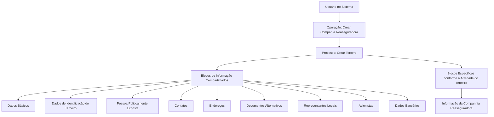

# Operação Criar Companhia Reaseguradora — Registro de Terceiros no Sistema MAPFRE

## 1. Metadados do Documento
- **Arquivo de Origem:** Não identificado
- **Tipo de Documento:** Procedimento
- **Domínio / Sistema:** MAPFRE — operação de criação de Companhia Reaseguradora / Criar Terceiro
- **Público-Alvo:** Operação, Negócio, Analistas Funcionais e Usuários do Sistema
- **Data/Versão Identificada:** Não identificada

---

## 2. Resumo Executivo & Contexto de Negócio

O documento descreve a operação **“Crear Compañía Reaseguradora”**, destinada ao registro, no sistema, das informações das companhias reaseguradoras com as quais a entidade MAPFRE mantém relacionamento comercial em quaisquer de seus processos operacionais.

O registro da Companhia Reaseguradora é tratado como um processo de **criação de terceiro**. A operação envolve blocos de informação compartilhados, aplicáveis ao cadastro de terceiros, e um bloco específico para informações da Companhia Reaseguradora.

A obrigatoriedade e a habilitação de campos podem variar conforme o código de atividade do terceiro. O documento também estabelece que o comportamento dos campos pode variar conforme o terceiro seja uma pessoa física ou uma pessoa jurídica.

Modificações implementadas localmente podem afetar a obrigatoriedade do registro dos dados do terceiro. Além disso, a ordem de captura dos dados nos blocos de informação pode variar conforme o critério adotado pelo usuário no sistema.

---

## 3. Arquitetura, Componentes & Tecnologias Envolvidas

O conteúdo descreve uma operação funcional no sistema, sem detalhar arquitetura técnica, tecnologias, integrações, métodos HTTP, contratos JSON, bancos de dados, URLs de ambiente ou infraestrutura.

Os componentes funcionais explicitamente citados são:

- Operação **Crear Compañía Reaseguradora**.
- Processo **Crear Tercero**.
- Blocos de informação compartilhados de terceiros.
- Blocos de informação específicos conforme a atividade do terceiro.
- Bloco específico **Información de la Compañía Reaseguradora**.
- Referências de navegação documental: **Documentation / DOCUMENTACIÓN Reef**, **Mapfredocument**, **Zeus**, **Reef**, **Cloud**, **APIs** e **Componentes**.

> *Nota de Análise: o documento contém referências de navegação para documentação, incluindo “Reef”, “Mapfredocument” e “Zeus”, mas não detalha a função técnica, integração ou arquitetura desses elementos.*



---

## 4. Regras de Negócio, Especificações Funcionais & Processos

### Objetivo da operação

A operação **Crear Compañía Reaseguradora** permite registrar no sistema as informações das Companhias Reaseguradoras com as quais a entidade MAPFRE possui relação comercial em qualquer um de seus processos operacionais.

### Premissas de cadastro

1. A obrigatoriedade e/ou habilitação dos campos de registro pode variar conforme o **código de atividade do terceiro**.
2. A obrigatoriedade e/ou habilitação dos campos pode variar conforme o terceiro seja:
   - Pessoa Física.
   - Pessoa Jurídica.
3. Modificações implementadas localmente podem afetar o comportamento da aplicação quanto à obrigatoriedade do registro dos dados do terceiro.
4. A ordem de captura dos dados nos diferentes blocos de informação pode variar conforme o critério seguido pelo usuário no sistema.

### Processo funcional

1. O usuário inicia a operação **Crear Compañía Reaseguradora**.
2. A operação utiliza o processo **Crear Tercero**.
3. O usuário registra informações nos blocos compartilhados de criação de terceiro.
4. O usuário registra informações nos blocos específicos definidos conforme a atividade do terceiro.
5. Para a atividade de Companhia Reaseguradora, o documento indica o bloco específico **Información de la Compañía Reaseguradora**.

### Blocos de informação compartilhados

O documento lista os seguintes blocos de informação compartilhados no processo **Crear Tercero**:

- Datos Básicos.
- Datos Identificación del Tercero.
- Persona Políticamente Expuesta.
- Contactos.
- Direcciones.
- Documentos Alternativos.
- Representantes Legales.
- Accionistas.
- Datos Bancarios.

### Bloco específico da Companhia Reaseguradora

- Información de la Compañía Reaseguradora.

> *Nota de Análise: o documento lista os blocos de informação, porém não detalha os campos internos, formatos, critérios de preenchimento, validações, mensagens de erro ou condições de persistência de cada bloco.*

---

## 5. Tabelas de Parâmetros, Ambientes e Estruturas de Dados

| Item / Parâmetro | Descrição / Função | Tipo / Valores / Formato | Ambiente / Observações |
| :--- | :--- | :--- | :--- |
| Operação | Registro de informação de Companhia Reaseguradora no sistema | `Crear Compañía Reaseguradora` | Aplicável à entidade MAPFRE |
| Processo base | Processo de criação utilizado pela operação | `Crear Tercero` | Contém blocos compartilhados e específicos |
| Código de atividade do terceiro | Pode influenciar obrigatoriedade e habilitação de campos | Não detalhado | Regra explicitamente informada |
| Tipo de terceiro | Pode influenciar obrigatoriedade e habilitação de campos | Pessoa Física ou Pessoa Jurídica | Regra explicitamente informada |
| Modificações locais | Podem afetar o comportamento de obrigatoriedade dos dados | Não detalhado | Dependência de implementação local |
| Ordem de captura | Pode variar entre blocos de informação | Conforme critério do usuário | Não é apresentada uma sequência obrigatória |
| Dados Básicos | Bloco compartilhado de criação de terceiro | Campos não detalhados | `Crear Tercero` |
| Dados Identificação do Terceiro | Bloco compartilhado de criação de terceiro | Campos não detalhados | `Crear Tercero` |
| Pessoa Politicamente Exposta | Bloco compartilhado de criação de terceiro | Campos não detalhados | `Crear Tercero` |
| Contatos | Bloco compartilhado de criação de terceiro | Campos não detalhados | `Crear Tercero` |
| Direções | Bloco compartilhado de criação de terceiro | Campos não detalhados | `Crear Tercero` |
| Documentos Alternativos | Bloco compartilhado de criação de terceiro | Campos não detalhados | `Crear Tercero` |
| Representantes Legais | Bloco compartilhado de criação de terceiro | Campos não detalhados | `Crear Tercero` |
| Acionistas | Bloco compartilhado de criação de terceiro | Campos não detalhados | `Crear Tercero` |
| Dados Bancários | Bloco compartilhado de criação de terceiro | Campos não detalhados | `Crear Tercero` |
| Informação da Companhia Reaseguradora | Bloco específico da atividade do terceiro | Campos não detalhados | Aplicável à Companhia Reaseguradora |
| Documentation / DOCUMENTACIÓN Reef | Referência apresentada na interface documental | Não detalhado | Relação técnica não especificada |
| Mapfredocument | Referência apresentada na interface documental | Não detalhado | Relação técnica não especificada |
| Zeus | Referência apresentada na interface documental | Não detalhado | Relação técnica não especificada |

---

## 6. Bateria de Perguntas & Respostas para RAG (FAQ Sintético)

### P1: Qual é o objetivo da operação “Crear Compañía Reaseguradora”?
**R:** A operação permite registrar no sistema a informação das Companhias Reaseguradoras com as quais a entidade MAPFRE mantém relacionamento comercial em qualquer um de seus processos operacionais.

### P2: Qual processo é utilizado para cadastrar uma Companhia Reaseguradora?
**R:** O documento indica que a operação de criação da Companhia Reaseguradora utiliza o processo **Crear Tercero**.

### P3: Os campos do cadastro de Companhia Reaseguradora possuem obrigatoriedade fixa?
**R:** Não necessariamente. A obrigatoriedade e/ou habilitação dos campos pode variar conforme o código de atividade do terceiro, o tipo de terceiro — pessoa física ou pessoa jurídica — e modificações implementadas localmente.

### P4: O tipo de terceiro influencia o comportamento dos campos do cadastro?
**R:** Sim. O documento informa que a obrigatoriedade e/ou habilitação dos campos pode variar se o terceiro for uma Pessoa Física ou uma Pessoa Jurídica.

### P5: Quais blocos compartilhados fazem parte do processo “Crear Tercero”?
**R:** Os blocos compartilhados listados são: Dados Básicos, Dados de Identificação do Terceiro, Pessoa Politicamente Exposta, Contatos, Direções, Documentos Alternativos, Representantes Legais, Acionistas e Dados Bancários.

### P6: Qual bloco específico deve ser usado para a atividade de Companhia Reaseguradora?
**R:** O documento indica o bloco específico **Información de la Compañía Reaseguradora**, aplicável de acordo com a atividade do terceiro.

### P7: A ordem de preenchimento dos blocos de informação é obrigatória?
**R:** O documento informa que a ordem de captura dos dados nos distintos blocos de informação pode variar conforme o critério seguido pelo usuário no sistema. Não é definida uma sequência obrigatória.

### P8: Modificações locais podem alterar o cadastro de terceiros?
**R:** Sim. As modificações que possam ter sido implementadas localmente podem afetar o comportamento da aplicação em relação à obrigatoriedade do registro dos dados do terceiro.

### P9: O documento detalha os campos existentes em “Información de la Compañía Reaseguradora”?
**R:** Não. O documento identifica o bloco específico de informação da Companhia Reaseguradora, mas não apresenta os seus campos internos, formatos, validações ou regras de preenchimento.

### P10: O documento define APIs, métodos HTTP ou contratos de integração para a operação?
**R:** Não. Apesar de a interface documental mencionar “APIs”, o conteúdo não detalha APIs, métodos HTTP, endpoints, contratos JSON, tecnologias ou integrações técnicas da operação.

---

## 7. Glossário de Termos, Siglas & Conceitos-Chave

- **MAPFRE:** Entidade citada como mantenedora de relação comercial com as Companhias Reaseguradoras cadastradas.
- **Companhia Reaseguradora:** Organização cujas informações são registradas pela operação descrita.
- **Tercero:** Termo usado pelo documento para a entidade cadastrada no processo `Crear Tercero`.
- **Crear Tercero:** Processo de criação de terceiro utilizado pela operação de criação da Companhia Reaseguradora.
- **Persona Física:** Tipo de terceiro mencionado como fator que pode influenciar a obrigatoriedade e a habilitação de campos.
- **Persona Jurídica:** Tipo de terceiro mencionado como fator que pode influenciar a obrigatoriedade e a habilitação de campos.
- **Persona Políticamente Expuesta:** Bloco de informação compartilhado no processo de criação de terceiro.
- **Representantes Legales:** Bloco de informação compartilhado relativo a representantes legais.
- **Accionistas:** Bloco de informação compartilhado relativo a acionistas.
- **Reef:** Nome presente nas referências de documentação e navegação; sem detalhamento adicional no conteúdo.
- **Zeus:** Nome presente nas referências de navegação documental; sem detalhamento adicional no conteúdo.
- **Mapfredocument:** Referência apresentada na interface documental; sem detalhamento adicional no conteúdo.

---

## 8. Notas Críticas, Riscos & Limitações

- O documento não identifica o arquivo de origem, versão, data de publicação ou autor responsável.
- O documento não apresenta campos, tipos, tamanhos, formatos ou validações de dados para os blocos de informação.
- O documento não descreve regras específicas de obrigatoriedade por código de atividade, tipo de terceiro ou modificação local.
- O documento não fornece sequência obrigatória de preenchimento dos blocos; a ordem pode variar conforme o critério do usuário.
- Não há detalhamento de arquitetura de software, serviços, banco de dados, APIs, integrações, URLs, ambientes, logs, autenticação ou mecanismos de erro.
- As referências a Reef, Zeus, Mapfredocument, Cloud, APIs e Componentes aparecem na navegação documental, mas suas relações com a operação não são explicadas.
- A extração bruta contém caracteres possivelmente corrompidos, como `modicaciones`, `especícos` e `Identicación`; a estrutura semântica foi preservada sem inferir conteúdo ausente.

---

## 9. Conteúdo Bruto Estruturado (Referência Fiel)

```text
--- [PÁGINA 1 DE 2] ---

OPERACIÓN CREAR Compañía Reaseguradora
¿En que consiste?
Esta operación permite registrar en el Sistema la Información de las Compañías Reaseguradoras con las que la entidad MAPFRE tiene una
relación comercial en cualquiera de sus procesos operativos.
Premisas
La obligatoriedad y/o la habilitación de los campos en el registro de los datos de cada uno de los bloques o estructuras de información
compartidas puede variar de acuerdo con el código de actividad del Tercero:
La obligatoriedad y/o la habilitación de los campos en el registro de los datos de cada uno de los bloques o estructuras de información
pueden variar si el tipo de Tercero es una Persona Física o una Persona Jurídica:
Las modicaciones que se hubieran podido implementar localmente a su vez pueden afectar el comportamiento de la aplicación en
relación con la obligatoriedad en el registro de los Datos del Tercero.
Por último, el orden de captura de los datos en los distintos bloques de Información puede variar de acuerdo con el criterio seguido por el
Usuario en el Sistema.
Proceso
CREAR
TERCERO
Crear Información de la
Compañía Reaseguradora
Bloques de Información Compartidos (CREAR TERCERO)
 Datos Básicos ( )
 Datos Identicación del Tercero ( )
 Persona Políticamente Expuesta ( )
 Contactos ( )
 Direcciones ( )
 Documentos Alternativos ( )
Ejemplo:
Ejemplo:
Documentation / DOCUMENTACIÓN Reef
DOCUMENTACIÓN Reef
Mapfredocument
DOCUMENTACIÓN Reef
Owner
user:agonzalez_mapfre.com
Lifecycle
Approved Source
 / 
 VL
Buscar Inicio Soluciones Arquitecturas APIs Componentes Cloud Documentación Zeus Reef Ayuda
ES


--- [PÁGINA 2 DE 2] ---

Representantes Legales ( )
 Accionistas ( )
 Datos Bancarios ( )
Bloques de Información Especícos de acuerdo con la Actividad del Tercero.
 Información de la Compañía Reaseguradora( )
```
