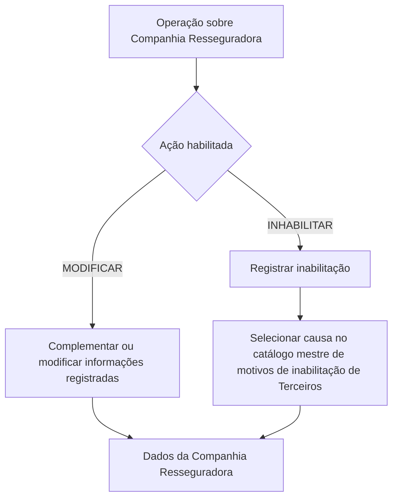

# Modificação e Inabilitação de Informações da Companhia Resseguradora

## 1. Metadados do Documento
- **Arquivo de Origem:** `Não identificado — conteúdo bruto fornecido pelo usuário`
- **Tipo de Documento:** Especificação Técnica / Procedimento Funcional
- **Domínio / Sistema:** Reef / MAPFRE — cadastro de Companhia Resseguradora
- **Público-Alvo:** Desenvolvedores, Analistas Funcionais, Operação e Negócio
- **Data/Versão Identificada:** Não identificada

---

## 2. Resumo Executivo & Contexto de Negócio

O documento descreve uma operação destinada a complementar e modificar informações previamente registradas de uma Companhia Resseguradora. A mesma operação também permite inabilitar a Companhia Resseguradora no sistema, tornando essa condição relevante para os processos operacionais da entidade.

As ações explicitamente habilitadas são `MODIFICAR` e `INHABILITAR`. A especificação organiza os atributos do bloco “Datos Compañía Reaseguradora” em uma sequência de captura indicada como da esquerda para a direita e de cima para baixo.

Os dados tratados abrangem classificação geográfica e de afiliação, identificação abreviada, rating, broker de seguros, país de origem, vigência da relação comercial com a companhia MAPFRE, impostos aplicáveis, plano de pagamento, capital subscrito e identificação perante a Superintendência de Seguros local.

A operação de inabilitação exige o registro da condição de inabilitação e, quando a Companhia Resseguradora for inabilitada, a associação de uma causa existente no catálogo mestre de motivos de inabilitação de Terceiros do Sistema. O documento não detalha interfaces, serviços, contratos de integração, persistência de dados ou validações técnicas adicionais.

> **Nota de Análise:** O título extraído menciona “Compañía Aseguradora”, enquanto o objetivo, o bloco de dados e os atributos descrevem uma “Compañía Reaseguradora”. O conteúdo não esclarece se essa divergência terminológica é intencional ou editorial.

---

## 3. Arquitetura, Componentes & Tecnologias Envolvidas

O conteúdo fornecido não descreve arquitetura de software, microsserviços, APIs, bancos de dados, integrações, protocolos, ambientes técnicos, URLs ou ferramentas de desenvolvimento.

Os elementos corporativos e funcionais identificados são:

- **Reef:** local indicado no conteúdo como documentação.
- **MAPFRE:** entidade cuja relação comercial com a Companhia Resseguradora possui data de efeito e data de vencimento.
- **Catálogo mestre de motivos de inabilitação de Terceiros do Sistema:** catálogo de origem para a causa de inabilitação.
- **Supervisor de Seguros / Superintendência de Seguros local:** entidade externa ou regulatória associada à “Clave en la Superintendencia”.
- **Broker de Seguros:** entidade que pode ser identificada caso opere habitualmente com a Companhia Resseguradora.



> **Nota de Análise:** O diagrama representa somente o fluxo funcional inferido diretamente das ações e atributos citados. O documento não especifica componentes técnicos responsáveis pela execução da operação.

---

## 4. Regras de Negócio, Especificações Funcionais & Processos

### 4.1 Objetivo da operação

A operação permite:

1. Complementar a informação da Companhia Resseguradora registrada anteriormente.
2. Modificar a informação da Companhia Resseguradora registrada anteriormente.
3. Inabilitar a Companhia Resseguradora.

### 4.2 Ações habilitadas

- **MODIFICAR:** ação destinada à complementação ou alteração de dados previamente registrados da Companhia Resseguradora.
- **INHABILITAR:** ação destinada a indicar que a Companhia Resseguradora está inabilitada no Sistema.

### 4.3 Sequência de captura

O documento determina que os atributos do bloco de informação “Datos Compañía Reaseguradora” devem seguir uma sequência de captura:

- Da esquerda para a direita.
- De cima para baixo.

### 4.4 Classificação da Companhia Resseguradora

A **Tipología de Compañía Reaseguradora** classifica a Companhia Resseguradora geograficamente para identificar:

- Se a Companhia Resseguradora é local ou estrangeira.
- Se a Companhia Resseguradora é afiliada localmente ou não afiliada localmente.

Quando o idioma usado na definição for espanhol, os valores apresentados são:

- `(AL)` Afiliada (Local).
- `(NL)` No Afiliada (Local).
- `(AE)` Afiliada (Extranjera).
- `(NE)` No Afiliada (Extranjera).

### 4.5 Vigência da relação comercial

- A **Fecha de Efecto** estabelece a data de início de efeito da relação entre a companhia MAPFRE e a Companhia Resseguradora.
- A **Fecha de Vencimiento** estabelece a data de vencimento que distingue o fim da relação comercial entre a companhia MAPFRE e a Companhia Resseguradora.

### 4.6 Impostos e relação econômica

- O **Impuesto sobre Intereses de los Depósitos de Reaseguro** define o código de imposto aplicado sobre os juros gerados pelos depósitos de resseguro.
- O **Código de Impuesto sobre la Renta** define o código de imposto que a entidade MAPFRE aplicará como retenção nas transações econômicas com a Companhia Resseguradora.
- O **Plan de Pago** identifica a temporalidade a considerar na relação econômica com a Companhia Resseguradora.

### 4.7 Regra de inabilitação

Quando a propriedade **Inhabilitación** indicar que a Companhia Resseguradora está inabilitada:

1. A Companhia Resseguradora deve ser considerada inabilitada no Sistema.
2. Essa condição deve ser contemplada nos processos operacionais da entidade.
3. O campo **Causa de Inhabilitación** deve conter o código de uma causa de inabilitação definida no catálogo mestre de motivos de inabilitação de Terceiros do Sistema.

> **Nota de Análise:** O documento não especifica quais processos operacionais devem reagir à inabilitação, nem define efeitos transacionais, bloqueios, permissões ou critérios de reabilitação.

---

## 5. Tabelas de Parâmetros, Ambientes e Estruturas de Dados

| Item / Parâmetro | Descrição / Função | Tipo / Valores / Formato | Ambiente / Observações |
| :--- | :--- | :--- | :--- |
| Ação `MODIFICAR` | Complementa ou modifica dados previamente registrados da Companhia Resseguradora. | Ação habilitada. | Não há detalhamento de permissões ou condições de execução. |
| Ação `INHABILITAR` | Inabilita a Companhia Resseguradora no Sistema. | Ação habilitada. | Deve ser contemplada pelos processos operacionais da entidade. |
| Tipología de Compañía Reaseguradora | Classifica a Companhia Resseguradora geograficamente e quanto à afiliação local. | `(AL)`, `(NL)`, `(AE)`, `(NE)`. | Valores apresentados para definição em idioma espanhol. |
| `(AL)` | Afiliada local. | Valor da tipologia. | Denominação: `Afiliada (Local)`. |
| `(NL)` | Não afiliada local. | Valor da tipologia. | Denominação: `No Afiliada (Local)`. |
| `(AE)` | Afiliada estrangeira. | Valor da tipologia. | Denominação: `Afiliada (Extranjera)`. |
| `(NE)` | Não afiliada estrangeira. | Valor da tipologia. | Denominação: `No Afiliada (Extranjera)`. |
| Nombre Abreviado de la Compañía Reaseguradora | Armazena o nome curto ou abreviado que identifica a Companhia Resseguradora. | Não especificado. | Não há limite, máscara ou regra de unicidade descritos. |
| Código de Rating | Determina o código de rating atribuído à Companhia Resseguradora. | Não especificado. | Não há catálogo de ratings descrito. |
| Código de Broker de Seguros | Identifica, quando aplicável, o Broker de Seguros com o qual a Companhia Resseguradora opera habitualmente. | Não especificado. | O preenchimento é condicional: “si procede”. |
| País de Origen | Identifica o país de origem no qual a entidade resseguradora foi constituída. | Não especificado. | Não há catálogo de países descrito. |
| Fecha de Efecto | Determina a data de efeito que estabelece a relação entre a companhia MAPFRE e a Companhia Resseguradora. | Data; formato não especificado. | Início da relação entre MAPFRE e a resseguradora. |
| Fecha de Vencimiento | Determina a data de vencimento que distingue o fim da relação comercial entre a companhia MAPFRE e a Companhia Resseguradora. | Data; formato não especificado. | Fim da relação comercial. |
| Impuesto sobre Intereses de los Depósitos de Reaseguro | Contém o código de imposto aplicado sobre juros gerados pelos depósitos de resseguro. | Código de imposto; formato não especificado. | Identificador técnico associado: `{#cod_imptos_dep}`. |
| Código de Impuesto sobre la Renta | Contém o código de imposto aplicado pela entidade MAPFRE como retenção nas transações econômicas com a Companhia Resseguradora. | Código de imposto; formato não especificado. | Não há catálogo de impostos descrito. |
| Plan de Pago | Identifica a temporalidade a considerar na relação econômica com a Companhia Resseguradora. | Não especificado. | Não há valores de plano de pagamento descritos. |
| Capital suscrito | Contém o capital subscrito pela Companhia Resseguradora. | Não especificado. | Não há moeda, precisão ou regra de cálculo descritas. |
| Clave en la Superintendencia | Identifica a chave da Companhia Resseguradora perante o Supervisor de Seguros ou Superintendência de Seguros local. | Não especificado. | Referência a órgão supervisor local. |
| Inhabilitación | Indica ao Sistema que a Companhia Resseguradora está inabilitada. | Não especificado. | Deve impactar processos operacionais da entidade. |
| Causa de Inhabilitación | Contém o código de uma causa de inabilitação. | Código de catálogo mestre. | Aplicável quando a Companhia Resseguradora for inabilitada. |

---

## 6. Bateria de Perguntas & Respostas para RAG (FAQ Sintético)

### P1: Qual é o objetivo da operação de modificação da Companhia Resseguradora?
**R:** A operação permite complementar e modificar informações previamente registradas da Companhia Resseguradora. A operação também permite inabilitar a Companhia Resseguradora no Sistema.

### P2: Quais ações estão habilitadas para a Companhia Resseguradora?
**R:** O documento habilita as ações `MODIFICAR` e `INHABILITAR`. A ação `MODIFICAR` trata da complementação ou alteração de informações registradas, enquanto `INHABILITAR` indica que a Companhia Resseguradora está inabilitada no Sistema.

### P3: Como a tipologia da Companhia Resseguradora é classificada?
**R:** A tipologia classifica a Companhia Resseguradora geograficamente e identifica se a companhia é local ou estrangeira e se é afiliada localmente. Os valores apresentados em espanhol são `(AL) Afiliada (Local)`, `(NL) No Afiliada (Local)`, `(AE) Afiliada (Extranjera)` e `(NE) No Afiliada (Extranjera)`.

### P4: Qual é a finalidade do campo Nombre Abreviado de la Compañía Reaseguradora?
**R:** O campo contém o nome curto ou abreviado que identificará a Companhia Resseguradora. O documento não informa tamanho máximo, obrigatoriedade ou regras de unicidade para esse nome abreviado.

### P5: O que o Código de Broker de Seguros representa?
**R:** O Código de Broker de Seguros identifica, quando aplicável, o Broker de Seguros com o qual a Companhia Resseguradora opera habitualmente. O documento não define o formato do código nem o catálogo de brokers.

### P6: Para que servem a Fecha de Efecto e a Fecha de Vencimiento?
**R:** A Fecha de Efecto estabelece a data de início de efeito da relação entre a companhia MAPFRE e a Companhia Resseguradora. A Fecha de Vencimiento determina a data de vencimento que distingue o fim da relação comercial entre MAPFRE e a Companhia Resseguradora.

### P7: Qual imposto é aplicado sobre os juros de depósitos de resseguro?
**R:** O campo “Impuesto sobre Intereses de los Depósitos de Reaseguro” contém o código de imposto que será aplicado sobre os juros gerados pelos depósitos de resseguro. O identificador técnico associado apresentado no documento é `{#cod_imptos_dep}`.

### P8: Qual é a finalidade do Código de Impuesto sobre la Renta?
**R:** O Código de Impuesto sobre la Renta contém o código de imposto que a entidade MAPFRE aplicará como retenção nas transações econômicas com a Companhia Resseguradora.

### P9: O que é definido pelo Plan de Pago?
**R:** O Plan de Pago identifica a temporalidade que deve ser considerada na relação econômica com a Companhia Resseguradora. O conteúdo não detalha os valores permitidos, periodicidades ou critérios de seleção.

### P10: O que acontece quando uma Companhia Resseguradora é inabilitada?
**R:** A propriedade Inhabilitación informa ao Sistema que a Companhia Resseguradora está inabilitada. Essa condição deve ser considerada nos processos operacionais da entidade. O documento não detalha quais processos são afetados ou quais bloqueios operacionais são executados.

### P11: Quando o campo Causa de Inhabilitación deve ser utilizado?
**R:** Quando a Companhia Resseguradora for inabilitada, o campo Causa de Inhabilitación deve conter o código de uma das causas de inabilitação definidas no catálogo mestre de motivos de inabilitação de Terceiros do Sistema.

### P12: O que identifica a Clave en la Superintendencia?
**R:** A Clave en la Superintendencia identifica a chave que a Companhia Resseguradora possui perante o Supervisor de Seguros ou a Superintendência de Seguros local.

---

## 7. Glossário de Termos, Siglas & Conceitos-Chave

- **MAPFRE:** Entidade mencionada como parte da relação comercial com a Companhia Resseguradora e como entidade aplicadora de retenção de imposto de renda em transações econômicas.
- **Reef:** Nome presente no cabeçalho de documentação fornecido.
- **Companhia Resseguradora / Compañía Reaseguradora:** Entidade cujas informações podem ser complementadas, modificadas ou inabilitadas no Sistema.
- **Broker de Seguros:** Entidade com a qual a Companhia Resseguradora pode operar habitualmente.
- **Rating:** Classificação cujo código é atribuído à Companhia Resseguradora.
- **Superintendência de Seguros:** Supervisor de Seguros ou órgão supervisor local associado à chave da Companhia Resseguradora.
- **Plan de Pago:** Temporalidade considerada na relação econômica com a Companhia Resseguradora.
- **Inhabilitación:** Propriedade que informa que a Companhia Resseguradora está inabilitada no Sistema.
- **Causa de Inhabilitación:** Código de motivo de inabilitação proveniente do catálogo mestre de motivos de inabilitação de Terceiros do Sistema.
- **`AL`:** Afiliada (Local).
- **`NL`:** No Afiliada (Local).
- **`AE`:** Afiliada (Extranjera).
- **`NE`:** No Afiliada (Extranjera).

---

## 8. Notas Críticas, Riscos & Limitações

- O conteúdo não apresenta data, versão, autor formal, aprovação ou identificador único do documento.
- Há divergência entre o título extraído, que menciona “Compañía Aseguradora”, e o conteúdo funcional, que se refere sistematicamente a “Compañía Reaseguradora”.
- O documento não especifica obrigatoriedade de campos, tipos técnicos, formatos de datas, tamanhos de texto, regras de validação, catálogos de referência ou mensagens de erro.
- Não são descritos métodos HTTP, APIs, contratos JSON, interfaces de usuário, banco de dados, serviços, integrações ou mecanismos de auditoria.
- O documento não especifica o comportamento detalhado de processos operacionais quando uma Companhia Resseguradora é inabilitada.
- Não há definição de regras para reabilitação de uma Companhia Resseguradora.
- A causa de inabilitação depende do catálogo mestre de motivos de inabilitação de Terceiros do Sistema, mas o catálogo e seus códigos não foram fornecidos.
- A documentação exibida contém caracteres de extração corrompidos, como `informacin`, `clasica` e `denidas`; o significado foi preservado conforme o contexto textual disponível.

---

## 9. Conteúdo Bruto Estruturado (Referência Fiel)

```text
--- [PÁGINA 1 DE 2] ---

MODIFICAR Información especíca de la Compañía Aseguradora
Objetivo
Esta Operación permite Complementar y Modicar la información de la Compañía Reaseguradora registrada anteriormente además de poder
Inhabilitarla.
Acciones habilitadas
 MODIFICAR ( )
 INHABILITAR ( )
Datos Compañía Reaseguradora
De Izquierda a Derecha y de Arriba hacia Abajo, los siguientes atributos marcan la secuencia de captura en este Bloque de Información.
Tipología de Compañía Reaseguradora (  )
Este campo clasica a la Compañía Reaseguradora identicándola geográcamente para conocer si es una compañía local o extranjera y si
está o no aliada localmente.
Si el idioma empleado en la denición es el español, sus valores serían...
(AL) Aliada (Local)
(NL) No Aliada (Local)
(AE) Aliada (Extranjera)
(NE) No Aliada (Extranjera)
Nombre Abreviado de la Compañía Reaseguradora ( )
Este Dato contiene el nombre corto o abreviado que identicará a la compañía reaseguradora.
Código de Rating (  )
Documentation / DOCUMENTACIÓN Reef
DOCUMENTACIÓN Reef
Mapfredocument
DOCUMENTACIÓN Reef
Owner
user:agonzalez_mapfre.com
Lifecycle
Approved Source
 / 
 VL
Buscar Inicio Soluciones Arquitecturas APIs Componentes Cloud Documentación Zeus Reef Ayuda
ES


--- [PÁGINA 2 DE 2] ---

Este dato determina el código de rating que tiene asignado la compañía reaseguradora.
Código de Broker de Seguros (  )
Este dato, si procede, identica al Broker de Seguros con el que habitualmente opera la compañía reaseguradora.
País de Origen (  )
Este dato identica el País Origen en el que se constituyó la entidad reaseguradora.
Fecha de Efecto ( )
Este campo determina la fecha de efecto que establece la relación entre la compañía MAPFRE y la reaseguradora.
Fecha de Vencimiento ( )
Este campo determina la fecha de vencimiento que distingue el n de la relación comercial entre la compañía MAPFRE y la reaseguradora.
Impuesto sobre Intereses de los Depósitos de Reaseguro (  ){#cod_imptos_dep}
Este Dato contiene el código de Impuesto que se va a aplicar sobre los intereses generados por los depósitos del reaseguro.
Código de Impuesto sobre la Renta (  )
Este Dato contiene el código de Impuesto que la entidad MAPFRE va a aplicar como retención en las transacciones económicas con la
reaseguradora.
Plan de Pago (  )
Este Dato identica la temporalidad que se debe considerar en la relación económica con la compañía reaseguradora.
Capital suscrito ( )
Este Dato contiene el Capital suscrito por la compañía reaseguradora.
Clave en la Superintendencia ( )
Este dato identica la clave que tiene la compañía reaseguradora para el Supervisor de Seguros/Superintendencia de Seguros local.
Inhabilitación ( )
Esta propiedad le indica al Sistema que la compañía reaseguradora está inhabilitada en el Sistema por lo que este hecho debería ser
contemplado en los procesos operativos de la entidad.
Causa de Inhabilitación (   )
En el supuesto que se inhabilitara a la Compañía reaseguradora, este campo contendrá el código de una de las causas de inhabilitación
denidas en el catálogo maestro de motivos de inhabilitación de Terceros del Sistema.
```
