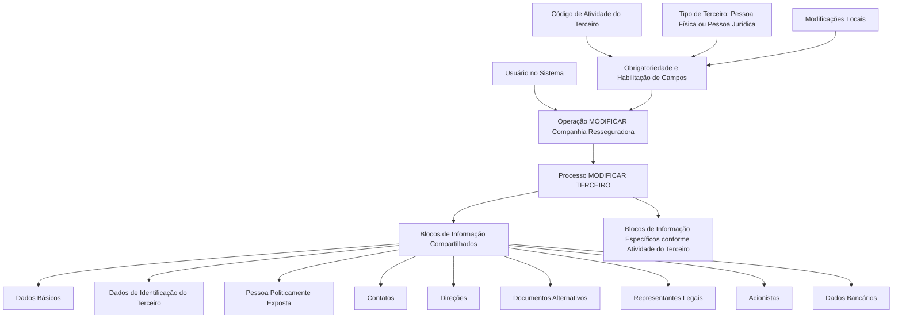

# Operação MODIFICAR Companhia Resseguradora — Processo e Blocos de Informação Compartilhados

## 1. Metadados do Documento
- **Arquivo de Origem:** Não identificado no conteúdo fornecido
- **Tipo de Documento:** Procedimento / Manual Operacional
- **Domínio / Sistema:** Reef / Mapfre — gestão de dados de Terceiros e Companhia Resseguradora
- **Público-Alvo:** Usuários do sistema, analistas funcionais e equipes de operação
- **Data/Versão Identificada:** Não identificada

---

## 2. Resumo Executivo & Contexto de Negócio

O documento descreve a operação **MODIFICAR Companhia Resseguradora**, destinada a complementar, modificar e/ou inabilitar informações de uma Companhia Resseguradora registrada no sistema. A manutenção pode ocorrer em qualquer bloco ou estrutura de dados que contenha informações da entidade.

A operação utiliza blocos de informação compartilhados, associados ao processo **MODIFICAR TERCEIRO**, e blocos específicos definidos conforme a atividade do Terceiro. Entre os blocos compartilhados citados estão dados básicos, identificação, pessoa politicamente exposta, contatos, direções, documentos alternativos, representantes legais, acionistas e dados bancários.

A obrigatoriedade e a habilitação dos campos não são fixas. O documento estabelece que essas condições podem variar conforme o código de atividade do Terceiro e conforme o Terceiro seja uma Pessoa Física ou uma Pessoa Jurídica.

O comportamento da aplicação também pode ser influenciado por modificações implementadas localmente. Além disso, a ordem de captura dos dados nos blocos de informação pode variar segundo o critério adotado pelo usuário no sistema.

---

## 3. Arquitetura, Componentes & Tecnologias Envolvidas

O conteúdo fornecido menciona os seguintes elementos:

- **Operação MODIFICAR Companhia Resseguradora:** operação de manutenção das informações da Companhia Resseguradora.
- **MODIFICAR TERCEIRO:** processo que agrupa os blocos de informação compartilhados.
- **Terceiro:** entidade cuja atividade e tipo — Pessoa Física ou Pessoa Jurídica — influenciam a obrigatoriedade e habilitação dos campos.
- **Reef / DOCUMENTACIÓN Reef:** ambiente ou repositório de documentação citado no rodapé do conteúdo.
- **Mapfre / Mapfredocument:** referências corporativas presentes na interface de documentação exibida.
- **Blocos de Informação Específicos:** blocos aplicáveis conforme a atividade do Terceiro.



> **Nota de Análise:** O documento não detalha tecnologias de implementação, contratos de integração, métodos HTTP, estruturas JSON, banco de dados, URLs de ambiente ou responsabilidades dos componentes Reef e Mapfre.

---

## 4. Regras de Negócio, Especificações Funcionais & Processos

### Objetivo da operação

A operação **MODIFICAR Companhia Resseguradora** permite:

1. Complementar informações da Companhia Resseguradora.
2. Modificar informações da Companhia Resseguradora.
3. Inabilitar informações da Companhia Resseguradora.
4. Executar essas ações em qualquer bloco ou estrutura de dados que contenha e agrupe as informações da Companhia Resseguradora.

### Premissas de obrigatoriedade e habilitação

1. A obrigatoriedade e/ou habilitação dos campos de cada bloco ou estrutura de informação compartilhada pode variar conforme o **código de atividade do Terceiro**.
2. A obrigatoriedade e/ou habilitação dos campos pode variar quando o tipo de Terceiro for:
   - Pessoa Física.
   - Pessoa Jurídica.
3. Modificações implementadas localmente podem afetar o comportamento da aplicação em relação à obrigatoriedade do registro dos Dados do Terceiro.
4. A ordem de captura dos dados nos blocos de informação pode variar de acordo com o critério do usuário no sistema.

### Processo funcional identificado

1. O usuário inicia a operação **MODIFICAR**.
2. O usuário acessa o processo **MODIFICAR TERCEIRO**.
3. O usuário seleciona os blocos de informação compartilhados aplicáveis à Companhia Resseguradora.
4. O usuário pode atuar sobre blocos de informação específicos, definidos conforme a atividade do Terceiro.
5. O comportamento dos campos deve respeitar regras de obrigatoriedade e habilitação condicionadas pelo código de atividade, tipo do Terceiro e possíveis modificações locais.
6. O usuário registra as informações na ordem que considerar adequada, pois o documento indica que a sequência de captura pode variar.

> **Nota de Análise:** O documento não descreve critérios de autorização, validações detalhadas por campo, telas, mensagens de erro, persistência, auditoria ou etapas de confirmação da modificação.

---

## 5. Tabelas de Parâmetros, Ambientes e Estruturas de Dados

| Item / Parâmetro | Descrição / Função | Tipo / Valores / Formato | Ambiente / Observações |
| :--- | :--- | :--- | :--- |
| Operação | Manutenção de informações de Companhia Resseguradora | Complementar, modificar e/ou inabilitar | Denominada MODIFICAR Companhia Resseguradora |
| Entidade principal | Registro cuja informação é alterada | Companhia Resseguradora | O documento a trata no contexto de Terceiro |
| Processo associado | Agrupa blocos de informação compartilhados | MODIFICAR TERCEIRO | Referenciado como processo de modificação |
| Código de atividade do Terceiro | Condiciona obrigatoriedade e habilitação dos campos | Código de atividade | Valores não detalhados |
| Tipo de Terceiro | Condiciona obrigatoriedade e habilitação dos campos | Pessoa Física ou Pessoa Jurídica | Regras específicas não detalhadas |
| Modificações locais | Podem afetar a obrigatoriedade do registro de dados | Implementações locais | Sem detalhamento técnico |
| Ordem de captura | Sequência de preenchimento dos blocos de informação | Variável | Definida conforme critério do usuário |
| Dados Básicos | Bloco de informação compartilhado | Bloco funcional | Referência: `01-Comun/MODIFICAR-Tercero-Datos-Basicos.md#titulo` |
| Dados de Identificação do Terceiro | Bloco de informação compartilhado | Bloco funcional | Regras de campos não detalhadas |
| Pessoa Politicamente Exposta | Bloco de informação compartilhado | Bloco funcional | Critérios de enquadramento não detalhados |
| Contatos | Bloco de informação compartilhado | Bloco funcional | Estrutura não detalhada |
| Direções | Bloco de informação compartilhado | Bloco funcional | O documento usa o termo “Direcciones” |
| Documentos Alternativos | Bloco de informação compartilhado | Bloco funcional | Tipos documentais não detalhados |
| Representantes Legais | Bloco de informação compartilhado | Bloco funcional | Relação com a Companhia Resseguradora não detalhada |
| Acionistas | Bloco de informação compartilhado | Bloco funcional | Estrutura societária não detalhada |
| Dados Bancários | Bloco de informação compartilhado | Bloco funcional | Dados, formatos e validações não detalhados |
| Blocos específicos | Informações definidas conforme atividade do Terceiro | Blocos funcionais | Conteúdo não especificado |
| Reef | Referência de documentação/interface | DOCUMENTACIÓN Reef | Sem URL identificada |
| Mapfre | Referência corporativa exibida na interface | Mapfre / Mapfredocument | Sem especificação funcional adicional |

---

## 6. Bateria de Perguntas & Respostas para RAG (FAQ Sintético)

### P1: Em que consiste a operação MODIFICAR Companhia Resseguradora?
**R:** A operação MODIFICAR Companhia Resseguradora consiste em complementar, modificar e/ou inabilitar as informações da Companhia Resseguradora em qualquer bloco ou estrutura de dados que contenha e agrupe essas informações.

### P2: Quais fatores podem alterar a obrigatoriedade dos campos no processo MODIFICAR TERCEIRO?
**R:** A obrigatoriedade dos campos pode variar de acordo com o código de atividade do Terceiro, com o tipo de Terceiro — Pessoa Física ou Pessoa Jurídica — e com modificações que tenham sido implementadas localmente.

### P3: O tipo de Terceiro influencia a habilitação dos campos?
**R:** Sim. O documento informa que a obrigatoriedade e/ou a habilitação dos campos podem variar quando o tipo de Terceiro é Pessoa Física ou Pessoa Jurídica. As regras específicas aplicáveis a cada tipo não foram detalhadas.

### P4: Quais blocos de informação compartilhados podem ser usados para modificar uma Companhia Resseguradora?
**R:** Os blocos citados são Dados Básicos, Dados de Identificação do Terceiro, Pessoa Politicamente Exposta, Contatos, Direções, Documentos Alternativos, Representantes Legais, Acionistas e Dados Bancários.

### P5: A ordem de preenchimento dos blocos de informação é fixa?
**R:** Não. O documento informa que a ordem de captura dos dados nos diferentes blocos de informação pode variar conforme o critério adotado pelo usuário no sistema.

### P6: Modificações locais podem afetar o comportamento da aplicação?
**R:** Sim. O documento afirma que modificações implementadas localmente podem afetar o comportamento da aplicação, especialmente em relação à obrigatoriedade do registro dos Dados do Terceiro.

### P7: Existem blocos de informação específicos para a Companhia Resseguradora?
**R:** O documento menciona a existência de blocos de informação específicos de acordo com a atividade do Terceiro. Entretanto, não descreve quais blocos específicos existem nem quais atividades os determinam.

### P8: O documento especifica validações para Dados Bancários, Acionistas ou Representantes Legais?
**R:** Não. O conteúdo apenas lista Dados Bancários, Acionistas e Representantes Legais como blocos de informação compartilhados. Não há detalhamento de campos, formatos, validações ou regras de negócio específicas para esses blocos.

### P9: O que é o processo MODIFICAR TERCEIRO no contexto do documento?
**R:** MODIFICAR TERCEIRO é o processo associado à modificação das informações da Companhia Resseguradora. O processo reúne os blocos de informação compartilhados nos quais a manutenção de dados pode ser executada.

### P10: O documento define APIs, URLs, ambientes ou tecnologias usadas pela operação?
**R:** Não. Embora o conteúdo apresente referências a Reef, DOCUMENTACIÓN Reef, Mapfre e Mapfredocument, ele não especifica APIs, URLs, ambientes, protocolos, tecnologias de desenvolvimento ou detalhes de infraestrutura.

---

## 7. Glossário de Termos, Siglas & Conceitos-Chave

- **Companhia Resseguradora:** entidade cujas informações podem ser complementadas, modificadas ou inabilitadas pela operação descrita.
- **MODIFICAR:** operação funcional de manutenção das informações da Companhia Resseguradora.
- **MODIFICAR TERCEIRO:** processo que concentra os blocos de informação compartilhados relacionados aos Dados do Terceiro.
- **Terceiro:** entidade cujo código de atividade e tipo influenciam a obrigatoriedade e habilitação dos campos.
- **Pessoa Física:** tipo de Terceiro citado como fator de variação das regras de campos.
- **Pessoa Jurídica:** tipo de Terceiro citado como fator de variação das regras de campos.
- **Pessoa Politicamente Exposta:** bloco de informação compartilhado listado no processo; o documento não apresenta definição ou critérios de classificação.
- **Blocos de Informação Compartilhados:** estruturas de dados utilizadas no processo MODIFICAR TERCEIRO.
- **Blocos de Informação Específicos:** estruturas aplicáveis conforme a atividade do Terceiro; o conteúdo não detalha sua composição.
- **Reef:** referência presente na documentação/interface exibida; o papel técnico não é descrito.
- **Mapfre / Mapfredocument:** referências corporativas presentes no conteúdo; sem detalhamento adicional.

---

## 8. Notas Críticas, Riscos & Limitações

- O documento não informa o nome do arquivo de origem, versão, data de publicação ou responsável técnico.
- Não há detalhamento dos códigos de atividade do Terceiro nem do impacto de cada código sobre os campos.
- Não foram fornecidas regras específicas de obrigatoriedade ou habilitação para Pessoa Física e Pessoa Jurídica.
- As modificações locais são mencionadas como fator de impacto, mas o documento não define quais modificações existem, onde são configuradas ou como são governadas.
- Não há detalhamento dos blocos específicos por atividade do Terceiro.
- Não há contratos de integração, métodos HTTP, payloads, APIs, URLs, autenticação, logs, rastreabilidade ou tratamento de erros.
- Alguns caracteres do conteúdo bruto apresentam codificação irregular, como `Modicar`, `Identicación` e `Especícos`; a transcrição foi preservada para fidelidade de auditoria.

---

## 9. Conteúdo Bruto Estruturado (Referência Fiel)

```text
--- [PÁGINA 1 DE 2] ---

OPERACIÓN MODIFICAR Compañía Reaseguradora
¿En que consiste?
Esta operación consiste en Complementar, Modicar y/o Inhabilitar la información de la Compañía Reaseguradora en cualquiera de los
bloques o estructuras de datos que la contienen y agrupan.
Premisas
La obligatoriedad y/o la habilitación de los campos en el registro de los datos de cada uno de los bloques o estructuras de información
compartidas puede variar de acuerdo con el código de actividad del Tercero:
La obligatoriedad y/o la habilitación de los campos en el registro de los datos de cada uno de los bloques o estructuras de información
pueden variar si el tipo de Tercero es una Persona Física o una Persona Jurídica:
Las modicaciones que se hubieran podido implementar localmente a su vez pueden afectar el comportamiento de la aplicación en
relación con la obligatoriedad en el registro de los Datos del Tercero.
Por último, el orden de captura de los datos en los distintos bloques de Información puede variar de acuerdo con el criterio seguido por el
Usuario en el Sistema.
Proceso
MODIFICAR
TERCERO
Modificar Información de la
Compañía Reaseguradora
Bloques de Información Compartidos (MODIFICAR TERCERO)
01-Comun/MODIFICAR-Tercero-Datos-Basicos.md#titulo) ( )
 Datos Identicación Tercero ( )
 Persona Políticamente Expuesta(   )
 Contactos (   )
 Direcciones (   )
 Documentos Alternativos (   )
Ejemplo:
Ejemplo:
Documentation / DOCUMENTACIÓN Reef
DOCUMENTACIÓN Reef
Mapfredocument
DOCUMENTACIÓN Reef
Owner
user:agonzalez_mapfre.com
Lifecycle
Approved Source
 / 
 VL
Buscar Inicio Soluciones Arquitecturas APIs Componentes Cloud Documentación Zeus Reef Ayuda
ES


--- [PÁGINA 2 DE 2] ---

Representantes Legales (   )
 Accionistas (   )
 Datos Bancarios (   )
Bloques de Información Especícos de acuerdo con la Actividad del Tercero.
 Modicar Información de la Compañía Reaseguradora(  )
```
