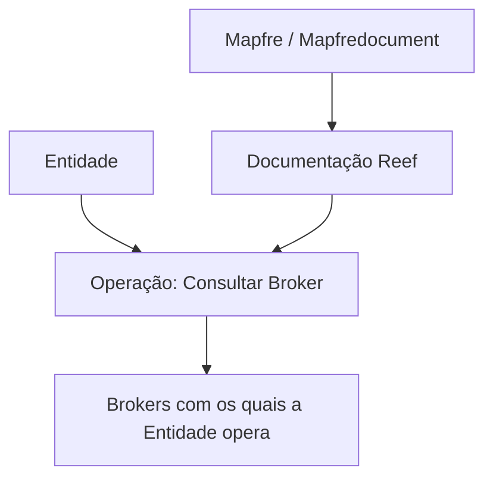

# Operação Consultar Broker — Documentação Reef

## 1. Metadados do Documento
- **Arquivo de Origem:** Não identificado
- **Tipo de Documento:** Documentação
- **Domínio / Sistema:** Reef / Mapfre
- **Público-Alvo:** Não identificado
- **Data/Versão Identificada:** Não identificada

---

## 2. Resumo Executivo & Contexto de Negócio

O conteúdo descreve a operação **“Consultar Broker”**, cujo objetivo declarado é consultar os Brokers com os quais uma Entidade opera.

A documentação está associada ao contexto **Reef** e apresenta referências a **Mapfre**, incluindo o identificador `Mapfredocument`. O registro possui ciclo de vida indicado como **Approved Source**.

O conteúdo extraído é resumido e não detalha fluxos operacionais, critérios de consulta, campos retornados, contratos de API, métodos HTTP, autenticação ou regras de negócio adicionais.

---

## 3. Arquitetura, Componentes & Tecnologias Envolvidas

Componentes e referências identificados:

- **Operação:** Consultar Broker
- **Domínio documental:** Reef
- **Referência organizacional:** Mapfre
- **Entidade consultada:** Broker
- **Owner:** `user:agonzalez_mapfre.com`
- **Lifecycle:** `Approved Source`
- **Navegação documental:** Soluções, Arquiteturas, APIs, Componentes, Cloud, Documentação, Zeus, Reef e Ajuda.



> **Nota de Análise:** O documento não detalha interfaces técnicas, integrações, protocolos, métodos HTTP, estruturas JSON, bancos de dados ou tecnologias de implementação.

---

## 4. Regras de Negócio, Especificações Funcionais & Processos

1. A operação identificada é **Consultar Broker**.
2. A finalidade declarada da operação é consultar os **Brokers com os quais a Entidade opera**.
3. O conteúdo está inserido na documentação Reef.
4. O ciclo de vida informado para o conteúdo é **Approved Source**.

> **Nota de Análise:** Não foram identificadas condições de entrada, validações, filtros, regras de elegibilidade, comportamento em erro ou sequência operacional detalhada.

---

## 5. Tabelas de Parâmetros, Ambientes e Estruturas de Dados

| Item / Parâmetro | Descrição / Função | Tipo / Valores / Formato | Ambiente / Observações |
| :--- | :--- | :--- | :--- |
| Operação | Consulta de Brokers associados à operação de uma Entidade | `Consultar Broker` | Não informado |
| Entidade | Contexto cuja relação operacional com Brokers deve ser consultada | Não especificado | Não informado |
| Broker | Entidade consultada pela operação | Não especificado | Não informado |
| Documentação | Área documental indicada no conteúdo | `Reef` | Referência: `DOCUMENTACIÓN Reef` |
| Referência documental | Identificador textual apresentado | `Mapfredocument` | Sem detalhamento adicional |
| Owner | Proprietário indicado no documento | `user:agonzalez_mapfre.com` | Valor literal extraído |
| Lifecycle | Estado de ciclo de vida do conteúdo | `Approved Source` | Sem detalhamento adicional |
| Idioma de navegação | Idioma mostrado na interface documental | `ES` | Interface em espanhol |

---

## 6. Bateria de Perguntas & Respostas para RAG (FAQ Sintético)

### P1: Qual é o objetivo da operação Consultar Broker?
**R:** A operação **Consultar Broker** tem como objetivo consultar os Brokers com os quais uma Entidade opera.

### P2: O que a operação Consultar Broker retorna?
**R:** O conteúdo apenas informa que a operação consulta Brokers relacionados à atuação de uma Entidade. O documento não descreve campos, estrutura de resposta ou formato de retorno.

### P3: Em qual domínio documental a operação Consultar Broker está registrada?
**R:** A operação está registrada no contexto da **Documentação Reef**.

### P4: Qual sistema ou referência corporativa aparece associada à documentação?
**R:** O conteúdo cita **Mapfre** e o identificador textual **Mapfredocument**.

### P5: Quem é o owner identificado para o conteúdo?
**R:** O owner literal informado no conteúdo é `user:agonzalez_mapfre.com`.

### P6: Qual é o lifecycle informado para a documentação?
**R:** O lifecycle indicado é **Approved Source**.

### P7: O documento informa quais métodos HTTP são usados na operação Consultar Broker?
**R:** Não. O conteúdo não informa métodos HTTP, endpoints, URLs, contratos de API ou protocolos técnicos.

### P8: O documento descreve critérios ou filtros para consultar Brokers?
**R:** Não. O documento declara somente a finalidade de consultar Brokers com os quais uma Entidade opera, sem apresentar filtros, critérios ou parâmetros de consulta.

### P9: A documentação apresenta detalhes sobre autenticação ou autorização?
**R:** Não. Não há informações sobre autenticação, autorização, credenciais ou matriz de permissões.

### P10: Quais áreas aparecem na navegação da documentação?
**R:** A navegação apresenta as áreas: Início, Soluções, Arquiteturas, APIs, Componentes, Cloud, Documentação, Zeus, Reef e Ajuda.

---

## 7. Glossário de Termos, Siglas & Conceitos-Chave

- **Broker:** Entidade consultada pela operação “Consultar Broker”; o documento não fornece definição adicional.
- **Entidade:** Contexto cuja relação operacional com Brokers é objeto da consulta; o documento não especifica sua natureza.
- **Reef:** Domínio ou área de documentação citada no conteúdo.
- **Lifecycle:** Campo que indica o ciclo de vida do conteúdo; o valor apresentado é `Approved Source`.
- **Owner:** Campo que identifica o proprietário do conteúdo; o valor apresentado é `user:agonzalez_mapfre.com`.
- **Mapfredocument:** Identificador textual associado ao conteúdo, sem definição adicional no material extraído.

---

## 8. Notas Críticas, Riscos & Limitações

- O conteúdo extraído é extremamente resumido e não descreve a implementação técnica da operação.
- Não há endpoint, URL, método HTTP, payload, contrato de resposta, código de erro, autenticação ou autorização documentados.
- Não há detalhamento sobre filtros, parâmetros, regras de associação entre Entidade e Broker ou comportamento de exceção.
- O termo **Broker** é citado, mas não possui definição funcional ou técnica adicional.
- O status **Approved Source** é apresentado sem explicação sobre seu significado operacional ou governança documental.

---

## 9. Conteúdo Bruto Estruturado (Referência Fiel)

```text
--- [PÁGINA 1 DE 1] ---

OPERACIÓN CONSULTAR Broker
Consulta de los Brokers con las que opera la Entidad.
Documentation / DOCUMENTACIÓN Reef
DOCUMENTACIÓN Reef
Mapfredocument
DOCUMENTACIÓN Reef
Owner
user:agonzalez_mapfre.com
Lifecycle
Approved Source
 / 
 VL
Buscar Inicio Soluciones Arquitecturas APIs Componentes Cloud Documentación Zeus Reef Ayuda
ES
```
