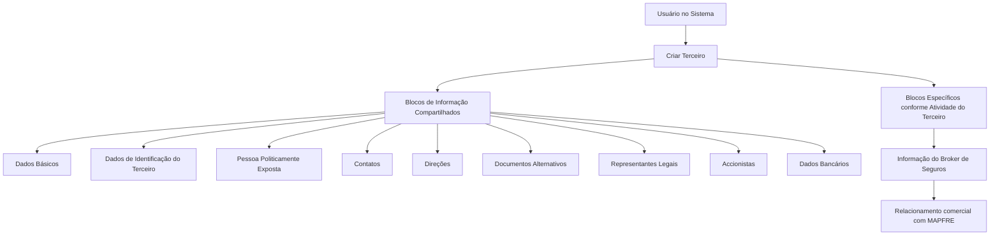

# Operação Criar Broker de Seguros — Registro de Terceiro no Sistema MAPFRE

## 1. Metadados do Documento
- **Arquivo de Origem:** `Não identificado — conteúdo bruto fornecido na solicitação`
- **Tipo de Documento:** `Procedimento`
- **Domínio / Sistema:** `MAPFRE / Reef / Operação Criar Broker`
- **Público-Alvo:** `Usuários operacionais, analistas funcionais e equipes responsáveis pelo cadastro de Terceiros`
- **Data/Versão Identificada:** `Não identificada`

---

## 2. Resumo Executivo & Contexto de Negócio

O documento descreve a operação **Criar Broker**, destinada ao registro, no Sistema, das informações de Brokers de Seguros com os quais a entidade MAPFRE mantém relacionamento comercial pontual ou total em processos operativos.

O Broker de Seguros é caracterizado como intermediário entre o cliente final e a companhia seguradora. Conforme o conteúdo fornecido, o Broker de Seguros assessora o cliente e recomenda a companhia, o tipo de seguro e as cláusulas de apólice mais adequadas para contratação. O documento também o caracteriza como profissional qualificado, com experiência e conhecimentos do setor de seguros.

A criação das informações do Broker de Seguros depende do processo compartilhado **Criar Terceiro**. O cadastro é organizado em blocos de informação compartilhados e em um bloco específico denominado **Informação do Broker de Seguros**.

A obrigatoriedade e a habilitação dos campos podem variar conforme o código de atividade do Terceiro, conforme a classificação do Terceiro como Pessoa Física ou Pessoa Jurídica e conforme modificações implementadas localmente. O documento também informa que a ordem de captura dos blocos pode variar de acordo com o critério adotado pelo usuário no Sistema.

---

## 3. Arquitetura, Componentes & Tecnologias Envolvidas

Os componentes e conceitos explicitamente citados são:

- **Sistema:** Sistema não nomeado no conteúdo bruto; utilizado para registrar informações de Brokers de Seguros.
- **MAPFRE:** entidade que mantém relação comercial pontual ou total com Brokers de Seguros.
- **Criar Terceiro:** processo compartilhado que concentra blocos comuns de cadastro.
- **Criar Informação do Broker de Seguros:** operação específica para registrar dados do Broker de Seguros.
- **Reef:** repositório ou contexto documental citado como `DOCUMENTACIÓN Reef`.
- **Mapfredocument:** termo exibido na referência documental.
- **Zeus:** item de navegação citado na referência documental.
- **Blocos de Informação Compartilhados:** estruturas utilizadas no processo Criar Terceiro.
- **Blocos de Informação Específicos:** estruturas aplicáveis de acordo com a atividade do Terceiro.



**Nota de Análise:** o conteúdo não detalha arquitetura de software, APIs, protocolos, bancos de dados, métodos HTTP, contratos JSON, URLs de ambiente, ferramentas de implantação ou tecnologias de infraestrutura.

---

## 4. Regras de Negócio, Especificações Funcionais & Processos

### 4.1 Objetivo da operação

A operação **Criar Broker** permite registrar no Sistema as informações de Brokers de Seguros que possuem relação comercial pontual ou total com a entidade MAPFRE em qualquer processo operacional.

### 4.2 Definição funcional de Broker de Seguros

O Broker de Seguros é um intermediário entre o cliente final e a companhia seguradora. O Broker de Seguros:

1. Assessora o cliente final.
2. Recomenda a companhia seguradora.
3. Recomenda o tipo de seguro.
4. Recomenda cláusulas de apólice que mais convenham ao cliente para contratação.
5. É caracterizado como profissional qualificado, com ampla experiência e alto conhecimento do setor de seguros.

### 4.3 Processo de cadastro

O processo apresentado possui os seguintes elementos:

1. O usuário executa a operação **Criar Terceiro**.
2. O Sistema apresenta ou permite a captura de dados em blocos de informação compartilhados.
3. O Sistema utiliza blocos específicos de acordo com a atividade do Terceiro.
4. Para o caso de Broker de Seguros, deve existir o bloco **Informação do Broker de Seguros**.
5. A sequência de captura dos blocos pode variar conforme o critério seguido pelo usuário no Sistema.

### 4.4 Regras de obrigatoriedade e habilitação

A obrigatoriedade e/ou a habilitação de campos no registro dos dados podem variar segundo os critérios abaixo:

| Regra | Critério que influencia o comportamento |
| :--- | :--- |
| Obrigatoriedade e habilitação por atividade | O código de atividade do Terceiro pode alterar quais campos são obrigatórios ou habilitados em cada bloco ou estrutura compartilhada. |
| Obrigatoriedade e habilitação por natureza do Terceiro | O tipo de Terceiro, Pessoa Física ou Pessoa Jurídica, pode alterar quais campos são obrigatórios ou habilitados. |
| Impacto de modificações locais | Modificações implementadas localmente podem afetar o comportamento da aplicação relativo à obrigatoriedade de registro dos Dados do Terceiro. |
| Ordem de captura | A ordem de captura de dados nos diferentes blocos de informação pode variar segundo o critério do usuário no Sistema. |

**Nota de Análise:** o conteúdo não informa códigos de atividade específicos, campos obrigatórios concretos, critérios de validação, mensagens de erro, regras de persistência ou permissões de usuário.

---

## 5. Tabelas de Parâmetros, Ambientes e Estruturas de Dados

### 5.1 Blocos de informação compartilhados

| Item / Parâmetro | Descrição / Função | Tipo / Valores / Formato | Ambiente / Observações |
| :--- | :--- | :--- | :--- |
| Dados Básicos | Bloco de informação compartilhado no processo Criar Terceiro. | Bloco de cadastro. | Conteúdo de campos não detalhado. |
| Dados de Identificação do Terceiro | Bloco de identificação do Terceiro. | Bloco de cadastro. | Obrigatoriedade/habilitação pode variar. |
| Pessoa Politicamente Exposta | Bloco de informação compartilhado. | Bloco de cadastro. | Não são apresentados campos ou critérios. |
| Contatos | Bloco de informação de contatos. | Bloco de cadastro. | Não são apresentados campos ou formatos. |
| Direções | Bloco de informação de direções. | Bloco de cadastro. | O documento usa o termo `Direcciones`. |
| Documentos Alternativos | Bloco para documentos alternativos. | Bloco de cadastro. | Sem detalhamento adicional. |
| Representantes Legais | Bloco para representantes legais. | Bloco de cadastro. | Sem detalhamento adicional. |
| Accionistas | Bloco para acionistas. | Bloco de cadastro. | O documento usa o termo `Accionistas`. |
| Dados Bancários | Bloco de dados bancários. | Bloco de cadastro. | Sem detalhamento de conta, banco ou formato. |

### 5.2 Blocos de informação específicos

| Item / Parâmetro | Descrição / Função | Tipo / Valores / Formato | Ambiente / Observações |
| :--- | :--- | :--- | :--- |
| Blocos de Informação Específicos de acordo com a Atividade do Terceiro | Estruturas de informação aplicáveis conforme a atividade do Terceiro. | Blocos específicos. | Critérios de seleção não detalhados. |
| Informação do Broker de Seguros | Bloco específico associado ao cadastro do Broker de Seguros. | Bloco de cadastro específico. | Campos, formatos e validações não detalhados. |

### 5.3 Critérios que podem alterar o cadastro

| Item / Parâmetro | Descrição / Função | Tipo / Valores / Formato | Ambiente / Observações |
| :--- | :--- | :--- | :--- |
| Código de atividade do Terceiro | Pode determinar obrigatoriedade e/ou habilitação de campos nos blocos compartilhados. | Código de atividade. | Valores não informados. |
| Tipo de Terceiro | Pode alterar obrigatoriedade e/ou habilitação de campos. | Pessoa Física ou Pessoa Jurídica. | Regras específicas não informadas. |
| Modificações locais | Podem afetar a obrigatoriedade do registro dos Dados do Terceiro. | Implementações locais. | Não são identificadas no documento. |
| Critério do usuário | Pode influenciar a ordem de captura dos blocos de informação. | Critério operacional do usuário. | Ordem fixa não foi definida. |

### 5.4 Referências documentais citadas

| Item / Parâmetro | Descrição / Função | Tipo / Valores / Formato | Ambiente / Observações |
| :--- | :--- | :--- | :--- |
| DOCUMENTACIÓN Reef | Referência documental exibida no conteúdo bruto. | Documentação. | Sem URL ou identificador de documento detalhado. |
| Mapfredocument | Termo exibido na área de referência documental. | Referência documental. | Finalidade não detalhada. |
| Owner | Proprietário exibido na referência documental. | `user:agonzalez_mapfre.com` | Valor reproduzido conforme conteúdo fornecido. |
| Lifecycle | Ciclo de vida da referência documental. | `Approved Source` | Exibido no conteúdo bruto. |
| VL | Termo exibido junto da referência documental. | `VL` | Significado não detalhado. |
| Zeus | Item citado na navegação documental. | Referência de navegação. | Relação técnica com Criar Broker não detalhada. |

---

## 6. Bateria de Perguntas & Respostas para RAG (FAQ Sintético)

### P1: Qual é a finalidade da operação Criar Broker?
**R:** A operação Criar Broker permite registrar no Sistema as informações dos Brokers de Seguros com os quais a entidade MAPFRE possui relação comercial pontual ou total em qualquer um de seus processos operativos.

### P2: Como o documento define um Broker de Seguros?
**R:** O documento define o Broker de Seguros como um intermediário entre o cliente final e a companhia seguradora. O Broker de Seguros assessora o cliente e recomenda a companhia, o tipo de seguro e as cláusulas de apólice mais convenientes para contratação.

### P3: O cadastro de Broker de Seguros utiliza qual processo compartilhado?
**R:** O cadastro utiliza o processo compartilhado **Criar Terceiro**, que contém os blocos de informação comuns para o registro do Terceiro.

### P4: Qual é o bloco específico associado ao cadastro de um Broker de Seguros?
**R:** O bloco específico associado ao cadastro é **Informação do Broker de Seguros**. O documento não detalha os campos, formatos ou validações existentes dentro desse bloco.

### P5: Quais fatores podem alterar a obrigatoriedade ou a habilitação de campos no cadastro?
**R:** A obrigatoriedade e/ou habilitação de campos pode variar conforme o código de atividade do Terceiro, o tipo de Terceiro — Pessoa Física ou Pessoa Jurídica — e modificações implementadas localmente que afetem o comportamento da aplicação.

### P6: O processo possui uma sequência fixa para preenchimento dos blocos de informação?
**R:** Não. O documento informa que a ordem de captura de dados nos distintos blocos de informação pode variar de acordo com o critério seguido pelo usuário no Sistema.

### P7: Quais blocos de informação compartilhados são citados no processo Criar Terceiro?
**R:** São citados Dados Básicos, Dados de Identificação do Terceiro, Pessoa Politicamente Exposta, Contatos, Direções, Documentos Alternativos, Representantes Legais, Accionistas e Dados Bancários.

### P8: O documento especifica campos obrigatórios concretos para Pessoa Física e Pessoa Jurídica?
**R:** Não. O documento somente estabelece que a obrigatoriedade e/ou habilitação de campos pode variar conforme o Terceiro seja uma Pessoa Física ou uma Pessoa Jurídica. Não são apresentados os campos específicos nem as regras detalhadas para cada tipo.

### P9: Existem APIs, métodos HTTP ou contratos JSON descritos para a operação Criar Broker?
**R:** Não. O conteúdo fornecido não descreve APIs, métodos HTTP, contratos JSON, serviços técnicos, tecnologias de integração ou endpoints relacionados à operação Criar Broker.

### P10: As modificações locais podem impactar o cadastro de Terceiros?
**R:** Sim. O documento informa que modificações implementadas localmente podem afetar o comportamento da aplicação em relação à obrigatoriedade de registro dos Dados do Terceiro.

### P11: O documento apresenta URLs, servidores, portas ou ambientes de execução?
**R:** Não. O conteúdo fornecido não apresenta URLs de ambientes, nomes de servidores, portas, credenciais, rotas de log ou configurações de infraestrutura.

### P12: Qual é o status de ciclo de vida indicado na referência documental?
**R:** A referência documental apresenta o campo **Lifecycle** com o valor **Approved Source**.

---

## 7. Glossário de Termos, Siglas & Conceitos-Chave

- **Accionistas:** termo apresentado no documento para o bloco de informação referente a acionistas.
- **Broker de Seguros:** intermediário entre cliente final e companhia seguradora; assessora o cliente e recomenda companhia, tipo de seguro e cláusulas de apólice.
- **Criar Broker:** operação destinada ao registro das informações de Brokers de Seguros no Sistema.
- **Criar Terceiro:** processo compartilhado que reúne blocos de informação comuns ao cadastro de Terceiros.
- **Dados do Terceiro:** dados registrados nos blocos ou estruturas de informação do Terceiro.
- **DOCUMENTACIÓN Reef:** referência documental citada no conteúdo fornecido.
- **MAPFRE:** entidade mencionada como possuidora de relacionamento comercial pontual ou total com os Brokers de Seguros cadastrados.
- **Pessoa Física:** tipo de Terceiro que pode influenciar obrigatoriedade e habilitação de campos.
- **Pessoa Jurídica:** tipo de Terceiro que pode influenciar obrigatoriedade e habilitação de campos.
- **Pessoa Politicamente Exposta:** bloco de informação compartilhado citado no processo Criar Terceiro.
- **Reef:** contexto ou repositório documental citado como `DOCUMENTACIÓN Reef`.
- **VL:** termo exibido na referência documental; o significado não é detalhado.
- **Zeus:** item mencionado na navegação documental; sua função não é detalhada.

---

## 8. Notas Críticas, Riscos & Limitações

- A obrigatoriedade e a habilitação de campos não são fixas no documento: dependem do código de atividade, do tipo de Terceiro e de possíveis modificações locais.
- A ordem de preenchimento dos blocos de informação não é determinística, pois pode variar de acordo com o critério utilizado pelo usuário.
- O conteúdo não informa quais códigos de atividade existem, nem como cada código afeta os campos do cadastro.
- O conteúdo não detalha os campos do bloco **Informação do Broker de Seguros**, seus formatos, validações, regras de persistência ou exceções.
- Não há especificação de APIs, contratos de integração, banco de dados, autenticação, autorização, trilhas de auditoria, URLs, servidores, portas ou procedimentos operacionais de suporte.
- **Nota de Análise:** o documento lista a operação Criar Broker e seus blocos de informação, porém não detalha métodos técnicos, contratos de dados ou regras específicas de preenchimento para cada bloco.

---

## 9. Conteúdo Bruto Estruturado (Referência Fiel)

```text
--- [PÁGINA 1 DE 2] ---

OPERACIÓN CREAR Broker
Un Broker de Seguros es un intermediario entre el cliente nal y la compañía aseguradora, asesorándole y recomendando la compañía, tipo de
seguros y cláusulas de la póliza que más le conviene contratar.
El bróker, por tanto, es un profesional cualicado con amplia experiencia y altos conocimientos del sector de los seguros.
¿En que consiste?
Esta operación permite registrar en el Sistema la Información de los Brokers de Seguros, con los que la entidad MAPFRE tiene una relación
comercial puntual o total en cualquiera de sus procesos operativos.
Premisas
La obligatoriedad y/o la habilitación de los campos en el registro de los datos de cada uno de los bloques o estructuras de información
compartidas puede variar de acuerdo con el código de actividad del Tercero:
La obligatoriedad y/o la habilitación de los campos en el registro de los datos de cada uno de los bloques o estructuras de información
pueden variar si el tipo de Tercero es una Persona Física o una Persona Jurídica:
Las modicaciones que se hubieran podido implementar localmente a su vez pueden afectar el comportamiento de la aplicación en
relación con la obligatoriedad en el registro de los Datos del Tercero.
Por último, el orden de captura de los datos en los distintos bloques de Información puede variar de acuerdo con el criterio seguido por el
Usuario en el Sistema.
Proceso
CREAR
TERCERO
Crear Información del
Broker de Seguros
Bloques de Información Compartidos (CREAR TERCERO)
Ejemplo:
Ejemplo:
Documentation / DOCUMENTACIÓN Reef
DOCUMENTACIÓN Reef
Mapfredocument
DOCUMENTACIÓN Reef
Owner
user:agonzalez_mapfre.com
Lifecycle
Approved Source
 / 
 VL
Buscar Inicio Soluciones Arquitecturas APIs Componentes Cloud Documentación Zeus Reef Ayuda
ES

--- [PÁGINA 2 DE 2] ---

Datos Básicos ( )
 Datos Identicación del Tercero ( )
 Persona Políticamente Expuesta ( )
 Contactos ( )
 Direcciones ( )
 Documentos Alternativos ( )
 Representantes Legales ( )
 Accionistas ( )
 Datos Bancarios ( )
Bloques de Información Especícos de acuerdo con la Actividad del Tercero.
 Información del Broker de Seguros ( )
```
