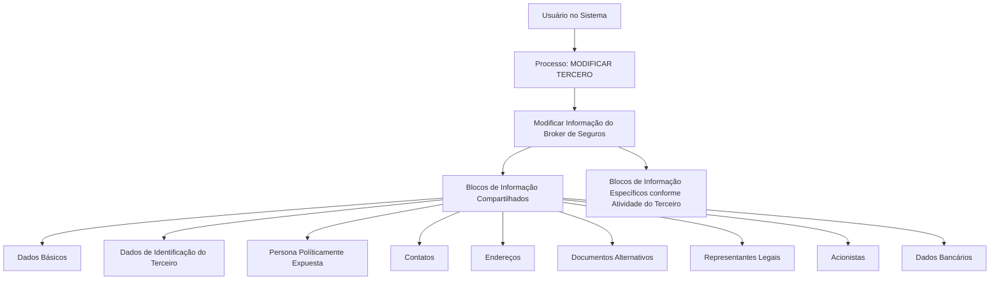

# Operação “Modificar Broker” — Gestão de Dados de Broker de Seguros e Resseguros

## 1. Metadados do Documento
- **Arquivo de Origem:** `Não identificado`
- **Tipo de Documento:** Procedimento
- **Domínio / Sistema:** Reef / Mapfre — operação de gestão de Terceiros
- **Público-Alvo:** Usuários do sistema, analistas funcionais e equipes de operação
- **Data/Versão Identificada:** Não identificada

---

## 2. Resumo Executivo & Contexto de Negócio

O documento descreve a operação **Modificar Broker**, destinada ao complemento, à modificação e/ou à inabilitação das informações de um Broker de Seguros e Resseguros. A alteração pode ocorrer em qualquer bloco ou estrutura de dados que contenha e agrupe informações do Broker conforme sua natureza.

A operação está associada ao processo **Modificar Tercero** e abrange blocos de informação compartilhados, como dados básicos, identificação, contatos, endereços, documentos alternativos, representantes legais, acionistas e dados bancários. Também contempla blocos específicos definidos conforme a atividade do Terceiro.

A obrigatoriedade e a habilitação dos campos não são fixas. Elas podem variar conforme o código de atividade do Terceiro e conforme o Terceiro seja uma Pessoa Física ou uma Pessoa Jurídica. Modificações implementadas localmente também podem afetar o comportamento da aplicação quanto à obrigatoriedade de registro dos dados do Terceiro.

O documento informa ainda que a sequência de captura de dados nos diferentes blocos de informação pode variar segundo o critério adotado pelo usuário no sistema. Não são detalhados contratos técnicos, serviços, APIs, métodos HTTP, validações de campo individuais ou regras para persistência dos dados.

---

## 3. Arquitetura, Componentes & Tecnologias Envolvidas

Os componentes e contextos explicitamente citados são:

- **Sistema/processo:** Modificar Tercero.
- **Operação funcional:** Modificar Informação del Broker de Seguros.
- **Entidade de negócio:** Broker de Seguros e Reaseguros.
- **Estruturas funcionais:** blocos de informação compartilhados e blocos específicos conforme a atividade do Terceiro.
- **Repositório/documentação referenciada:** DOCUMENTACIÓN Reef / Mapfredocument.
- **Owner indicado no conteúdo:** `user:agonzalez_mapfre.com`.
- **Lifecycle indicado:** `Approved`.
- **Fonte indicada:** `VL`.



**Nota de Análise:** o documento apresenta um fluxo funcional de alteração de dados, mas não detalha arquitetura de software, camadas técnicas, bancos de dados, APIs, microsserviços, protocolos, ambientes de execução ou mecanismos de integração.

---

## 4. Regras de Negócio, Especificações Funcionais & Processos

### Operação Modificar Broker

A operação consiste em realizar uma ou mais das seguintes ações sobre a informação do Broker de Seguros e Resseguros:

1. **Complementar** informações existentes.
2. **Modificar** informações existentes.
3. **Inabilitar** informações existentes.

As alterações podem ser realizadas em qualquer bloco ou estrutura de dados que contenha informações do Broker de Seguros e Resseguros, agrupadas de acordo com a natureza da informação.

### Premissas de obrigatoriedade e habilitação

1. A obrigatoriedade e/ou a habilitação dos campos registrados em cada bloco ou estrutura de informação compartilhada podem variar conforme o **código de atividade do Terceiro**.
2. A obrigatoriedade e/ou a habilitação dos campos também podem variar quando o tipo de Terceiro for:
   - Pessoa Física.
   - Pessoa Jurídica.
3. Modificações implementadas localmente podem afetar o comportamento da aplicação em relação à obrigatoriedade de registro dos Dados do Terceiro.
4. A ordem de captura dos dados nos diferentes blocos de informação pode variar conforme o critério adotado pelo usuário no sistema.

### Processo funcional identificado

1. O usuário acessa o processo **MODIFICAR TERCERO**.
2. O usuário seleciona ou executa a ação **Modificar Información del Broker de Seguros**.
3. O usuário registra, complementa, modifica ou inabilita informações em blocos de informação compartilhados.
4. O usuário pode atuar em blocos de informação específicos conforme a atividade do Terceiro.
5. A aplicação aplica regras de obrigatoriedade e habilitação condicionadas ao código de atividade, ao tipo de Terceiro e a possíveis modificações locais.

**Nota de Análise:** o documento não detalha quais campos são obrigatórios para cada código de atividade, quais condições definem a habilitação, nem quais alterações locais existem.

---

## 5. Tabelas de Parâmetros, Ambientes e Estruturas de Dados

| Item / Parâmetro | Descrição / Função | Tipo / Valores / Formato | Ambiente / Observações |
| :--- | :--- | :--- | :--- |
| Operação | Gestão das informações do Broker | Complemento, modificação e/ou inabilitação | Operação “Modificar Broker” |
| Processo associado | Processo que agrupa a modificação das informações | MODIFICAR TERCERO | Contém blocos de informação compartilhados |
| Entidade principal | Broker de Seguros e Resseguros | Terceiro | A informação pode ser alterada em estruturas que a contenham |
| Código de atividade do Terceiro | Critério que influencia obrigatoriedade e habilitação de campos | Não detalhado | Regras específicas não foram fornecidas |
| Tipo de Terceiro | Critério que influencia obrigatoriedade e habilitação de campos | Pessoa Física ou Pessoa Jurídica | Não detalha campos aplicáveis por tipo |
| Modificações locais | Alterações implementadas localmente que podem afetar o comportamento da aplicação | Não detalhado | Podem afetar obrigatoriedade de registro dos Dados do Terceiro |
| Ordem de captura | Sequência de preenchimento dos blocos de informação | Variável | Pode variar conforme o critério do usuário |
| Dados Básicos | Bloco de informação compartilhado | Não detalhado | Integrante de MODIFICAR TERCERO |
| Dados Identificação Tercero | Bloco de informação compartilhado | Não detalhado | Integrante de MODIFICAR TERCERO |
| Persona Políticamente Expuesta | Bloco de informação compartilhado | Não detalhado | Integrante de MODIFICAR TERCERO |
| Contatos | Bloco de informação compartilhado | Não detalhado | Integrante de MODIFICAR TERCERO |
| Direções | Bloco de informação compartilhado | Não detalhado | Integrante de MODIFICAR TERCERO |
| Documentos Alternativos | Bloco de informação compartilhado | Não detalhado | Integrante de MODIFICAR TERCERO |
| Representantes Legais | Bloco de informação compartilhado | Não detalhado | Integrante de MODIFICAR TERCERO |
| Acionistas | Bloco de informação compartilhado | Não detalhado | Integrante de MODIFICAR TERCERO |
| Dados Bancários | Bloco de informação compartilhado | Não detalhado | Integrante de MODIFICAR TERCERO |
| Blocos específicos | Estruturas de informação conforme a atividade do Terceiro | Não detalhado | Associados à modificação do Broker de Seguros |
| Documentação referenciada | Área ou repositório de documentação | DOCUMENTACIÓN Reef / Mapfredocument | Conteúdo exibido como referência |
| Owner | Responsável indicado na documentação | `user:agonzalez_mapfre.com` | Conforme conteúdo extraído |
| Lifecycle | Estado de ciclo de vida indicado | `Approved` | Conforme conteúdo extraído |
| Source | Fonte indicada | `VL` | Conforme conteúdo extraído |

---

## 6. Bateria de Perguntas & Respostas para RAG (FAQ Sintético)

### P1: Em que consiste a operação Modificar Broker?
**R:** A operação Modificar Broker consiste no complemento, na modificação e/ou na inabilitação da informação de um Broker de Seguros e Resseguros em blocos ou estruturas de dados que contenham e agrupem essas informações conforme sua natureza.

### P2: Qual processo do sistema contém a alteração das informações do Broker?
**R:** A alteração das informações do Broker está vinculada ao processo **MODIFICAR TERCERO**, no qual é disponibilizada a ação “Modificar Información del Broker de Seguros”.

### P3: Quais ações podem ser executadas sobre os dados de um Broker de Seguros e Resseguros?
**R:** O documento identifica três ações possíveis: complementar informações, modificar informações e inabilitar informações do Broker de Seguros e Resseguros.

### P4: Quais fatores podem alterar a obrigatoriedade ou a habilitação de campos?
**R:** A obrigatoriedade e a habilitação podem variar conforme o código de atividade do Terceiro, conforme o Terceiro seja Pessoa Física ou Pessoa Jurídica e conforme modificações implementadas localmente que afetem o comportamento da aplicação.

### P5: A ordem de preenchimento dos blocos de informação é obrigatória?
**R:** Não. O documento informa que a ordem de captura dos dados nos diferentes blocos de informação pode variar conforme o critério seguido pelo usuário no sistema.

### P6: Quais blocos compartilhados podem conter informações para alteração no processo Modificar Tercero?
**R:** Os blocos compartilhados listados são Dados Básicos, Dados de Identificação do Terceiro, Persona Políticamente Expuesta, Contatos, Direções, Documentos Alternativos, Representantes Legais, Acionistas e Dados Bancários.

### P7: Existem blocos de informação específicos para o Broker?
**R:** Sim. O documento menciona blocos de informação específicos de acordo com a atividade do Terceiro, incluindo a ação “Modificar Informação do Broker de Seguros”. Os campos e critérios desses blocos não são detalhados.

### P8: O documento define quais campos são obrigatórios para Pessoa Física e Pessoa Jurídica?
**R:** Não. O documento afirma que a obrigatoriedade e/ou habilitação dos campos pode variar para Pessoa Física e Pessoa Jurídica, mas não apresenta a lista de campos, regras de validação ou condições específicas para cada tipo.

### P9: O documento descreve APIs, métodos HTTP ou contratos JSON da operação Modificar Broker?
**R:** Não. O conteúdo descreve o processo funcional e os blocos de informação relacionados, mas não apresenta APIs, métodos HTTP, URLs, contratos JSON, serviços técnicos ou estruturas de banco de dados.

### P10: Qual é o estado de ciclo de vida indicado para a documentação Reef?
**R:** O conteúdo extraído apresenta o valor `Approved` para o campo Lifecycle da documentação Reef.

---

## 7. Glossário de Termos, Siglas & Conceitos-Chave

- **Broker de Seguros e Reasseguros:** Entidade cujas informações podem ser complementadas, modificadas ou inabilitadas pela operação descrita.
- **Modificar Tercero:** Processo do sistema associado à alteração de informações de um Terceiro, incluindo dados relacionados ao Broker.
- **Terceiro:** Entidade cujos dados são registrados em blocos de informação compartilhados e específicos conforme sua atividade.
- **Pessoa Física:** Tipo de Terceiro mencionado como critério que pode afetar a obrigatoriedade ou habilitação de campos.
- **Pessoa Jurídica:** Tipo de Terceiro mencionado como critério que pode afetar a obrigatoriedade ou habilitação de campos.
- **Persona Políticamente Expuesta:** Bloco de informação compartilhado listado no processo Modificar Tercero.
- **DOCUMENTACIÓN Reef:** Referência documental exibida no conteúdo extraído.
- **Mapfredocument:** Nome exibido no contexto da documentação referenciada.
- **Lifecycle:** Campo exibido na documentação, com valor `Approved`.
- **VL:** Valor exibido no campo Source da documentação.

---

## 8. Notas Críticas, Riscos & Limitações

- O documento não identifica o arquivo de origem, a data, a versão ou o autor formal do procedimento.
- Não há detalhamento dos campos existentes em cada bloco de informação.
- Não há matriz que relacione código de atividade do Terceiro, tipo de Terceiro e obrigatoriedade/habilitação de campos.
- As “modificações locais” são mencionadas como fator de impacto, mas não são descritas.
- Não são apresentados fluxos de aprovação, persistência, auditoria, tratamento de erro, perfis de acesso ou regras de autorização.
- Não são detalhadas APIs, integrações, ambientes, URLs, tecnologias, servidores, logs ou contratos de dados.
- O conteúdo cita a documentação Reef e Mapfredocument, mas não fornece links navegáveis, identificadores documentais ou instruções de acesso.
- **Nota de Análise:** o documento lista a operação de modificação de informação do Broker, porém não detalha campos, validações específicas, métodos técnicos ou contratos expostos.

---

## 9. Conteúdo Bruto Estruturado (Referência Fiel)

```text
--- [PÁGINA 1 DE 2] ---

OPERACIÓN MODIFICAR Broker
¿En que consiste?
Esta operación consiste en el Complemento, Modicación y/o Inhabilitación de la información del Broker de Seguros y Reaseguros en
cualquiera de los bloques o estructuras de datos que la contienen y agrupan de acuerdo con su naturaleza.
Premisas
La obligatoriedad y/o la habilitación de los campos en el registro de los datos de cada uno de los bloques o estructuras de información
compartidas puede variar de acuerdo con el código de actividad del Tercero:
La obligatoriedad y/o la habilitación de los campos en el registro de los datos de cada uno de los bloques o estructuras de información
pueden variar si el tipo de Tercero es una Persona Física o una Persona Jurídica:
Las modicaciones que se hubieran podido implementar localmente a su vez pueden afectar el comportamiento de la aplicación en
relación con la obligatoriedad en el registro de los Datos del Tercero.
Por último, el orden de captura de los datos en los distintos bloques de Información puede variar de acuerdo con el criterio seguido por el
Usuario en el Sistema.
Proceso
MODIFICAR
TERCERO
Modificar Información
del Broker de Seguros
Bloques de Información Compartidos (MODIFICAR TERCERO)
 Datos Básicos ( )
 Datos Identicación Tercero ( )
 Persona Políticamente Expuesta(   )
 Contactos (   )
 Direcciones (   )
 Documentos Alternativos (   )
Ejemplo:
Ejemplo:
Documentation / DOCUMENTACIÓN Reef
DOCUMENTACIÓN Reef
Mapfredocument
DOCUMENTACIÓN Reef
Owner
user:agonzalez_mapfre.com
Lifecycle
Approved Source
 / 
 VL
Buscar Inicio Soluciones Arquitecturas APIs Componentes Cloud Documentación Zeus Reef Ayuda
ES


--- [PÁGINA 2 DE 2] ---

Representantes Legales (   )
 Accionistas (   )
 Datos Bancarios (   )
Bloques de Información Especícos de acuerdo con la Actividad del Tercero.
 Modicar Información del Broker de Seguros (  )
```
