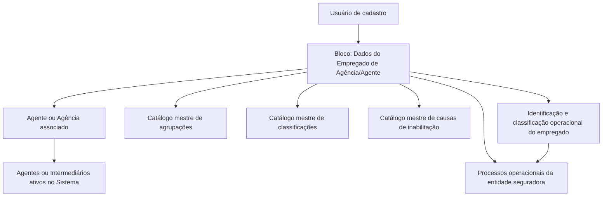

# Dados do Empregado de Agência/Agente — Criação e Configuração Operacional no Reef

## 1. Metadados do Documento
- **Arquivo de Origem:** Não identificado no conteúdo fornecido
- **Tipo de Documento:** Especificação Funcional
- **Domínio / Sistema:** Reef / Mapfredocument — gestão de dados de Empregado de Agência/Agente
- **Público-Alvo:** Analistas funcionais, desenvolvedores, arquitetos, operação e usuários de cadastro
- **Data/Versão Identificada:** Não identificada
- **Owner identificado:** `user:agonzalez_mapfre.com`
- **Lifecycle identificado:** Approved Source
- **Idioma predominante:** Espanhol

---

## 2. Resumo Executivo & Contexto de Negócio

O documento descreve o bloco de informação destinado à criação e manutenção de dados operacionais de um **Empregado de Agência/Agente**. O objetivo declarado é identificar informações de âmbito operacional do empregado e classificá-lo adequadamente, permitindo que processos da entidade seguradora considerem essa circunstância quando necessário.

A ação habilitada explicitamente é **CREAR**, indicando que o conteúdo se concentra na captura inicial dos dados do empregado. Os atributos devem ser preenchidos em uma sequência de leitura da esquerda para a direita e de cima para baixo. Quando não houver indicação expressa em contrário, os campos aplicam-se tanto a **Pessoas Físicas** quanto a **Pessoas Jurídicas**.

A configuração relaciona cada empregado a um agente ativo no sistema, registra sua agrupação comercial e classificação conforme catálogos mestres, e armazena dados profissionais, como o número de colegiação. Também contempla o estado de inabilitação do empregado, sua causa e o percentual de participação sobre o total do agente.

A data de validade é apresentada como mecanismo para determinar a partir de quando o agente está plenamente operacional e para manter histórico das alterações de configuração dos agentes na entidade seguradora. O texto, porém, não detalha comportamentos técnicos, contratos de integração, validações obrigatórias, formatos de data, limites de percentual ou regras de atualização.

---

## 3. Arquitetura, Componentes & Tecnologias Envolvidas

O conteúdo fornecido não descreve arquitetura de software, microsserviços, APIs, bancos de dados, protocolos, tecnologias de implementação ou ambientes técnicos. A relação funcional explícita ocorre entre o bloco de cadastro de empregado, o agente/agência associado e os catálogos mestres do sistema.



### Componentes e conceitos identificados

| Componente / Conceito | Papel descrito no documento | Detalhamento disponível |
| :--- | :--- | :--- |
| Bloco de Informação | Área destinada à captura de informações do Empregado de Agência/Agente. | Funcional |
| Dados Empregado de Agência/Agente | Conjunto de atributos cadastrais e operacionais do empregado. | Funcional |
| Agente / Agência | Entidade à qual o empregado está relacionado e da qual depende. | Funcional |
| Agentes ou Intermediários ativos | Relação de entidades ativas no sistema usada para associação do empregado. | Funcional |
| Catálogo mestre de agrupações | Fonte de valores para a Agrupação Comercial do Empregado. | Sem valores detalhados |
| Catálogo mestre de classificações | Fonte de valores para a Classificação do Empregado. | Sem valores detalhados |
| Catálogo mestre de causas de inabilitação | Fonte de valores para a causa de inabilitação. | Sem valores detalhados |
| Reef / Mapfredocument | Contexto documental identificado no rodapé/cabeçalho da extração. | Não há arquitetura técnica detalhada |

> **Nota de Análise:** O documento não detalha métodos HTTP, contratos JSON, persistência de dados, integrações, permissões, trilhas de auditoria ou componentes técnicos do sistema Reef.

---

## 4. Regras de Negócio, Especificações Funcionais & Processos

### 4.1 Objetivo do bloco de informação

A captura dos dados no bloco de informação existe para:

1. Identificar a informação de âmbito operacional do Empregado de Agência/Agente.
2. Classificar adequadamente o Empregado de Agência/Agente.
3. Permitir que processos da entidade seguradora considerem ou não essa condição quando a situação for demandada.

### 4.2 Ação habilitada

A ação habilitada é:

- **CREAR:** criação do registro de informações do Empregado de Agência/Agente.

O documento não descreve ações de alteração, consulta, exclusão, aprovação, cancelamento ou reativação.

### 4.3 Ordem de captura

Os atributos do bloco devem seguir a sequência de captura:

1. Da esquerda para a direita.
2. De cima para baixo.

### 4.4 Escopo por tipo de pessoa

Salvo quando houver indicação expressa em contrário, os campos do bloco devem ser usados para:

- Pessoas Físicas.
- Pessoas Jurídicas.

### 4.5 Regras por atributo

#### Agente

- O atributo deve conter o código do agente com o qual o empregado está relacionado.
- O empregado depende do agente indicado.
- O agente deve pertencer à relação de agentes ou intermediários ativos no sistema.

#### Agrupamento Comercial do Empregado

- O campo deve conter a Agrupação Comercial do Empregado do Agente/Agência.
- O valor deve seguir a relação de valores definida no catálogo mestre de agrupações existente no sistema.

#### Classificação do Empregado

- O campo deve conter a classificação do Empregado do Agente/Agência.
- O valor deve seguir a relação de valores existente no catálogo mestre de classificações configurado no sistema.

#### Número de Colegiação

- O campo contém a chave ou código da cédula profissional.
- A cédula profissional decorre da pertença do empregado a um colégio profissional ou associação oficial semelhante.
- Essa habilitação profissional permite o exercício da profissão pelo Empregado do Agente/Agência.

#### Inabilitação

- A propriedade informa ao sistema que o Empregado do Agente/Agência está inabilitado no sistema.
- A situação de inabilitação deve ser contemplada ou considerada nos processos operacionais da entidade.

#### Causa de Inabilitação

- O campo é aplicável no caso de o empregado estar inabilitado.
- O valor deve conter o código de uma causa de inabilitação.
- A causa deve pertencer ao catálogo mestre do sistema definido para essa atividade.

#### Porcentagem de Participação

- O campo contém a porcentagem de participação do empregado sobre o total do agente.
- O valor dessa porcentagem deve proceder do Agente/Agência ao qual o empregado está associado.

#### Data de Validade

- A propriedade informa ao sistema a data a partir da qual o agente está plenamente operacional no sistema.
- O uso correto da data permite manter, na entidade seguradora, um histórico das alterações realizadas na configuração dos agentes.

> **Nota de Análise:** Embora a Data de Validade esteja apresentada no contexto do cadastro de empregado, a redação fornecida refere-se explicitamente ao momento em que o **Agente** está plenamente operacional. O documento não esclarece se a data pertence ao empregado, ao agente ou ao vínculo entre ambos.

---

## 5. Tabelas de Parâmetros, Ambientes e Estruturas de Dados

| Item / Parâmetro | Descrição / Função | Tipo / Valores / Formato | Ambiente / Observações |
| :--- | :--- | :--- | :--- |
| Ação habilitada | Permite criar informações no bloco de Dados do Empregado de Agência/Agente. | `CREAR` | Nenhuma outra ação é descrita. |
| Agente | Código do agente relacionado ao empregado e do qual o empregado depende. | Código de agente | Deve existir na relação de Agentes ou Intermediários ativos no Sistema. |
| Agrupamento Comercial do Empregado | Agrupação comercial atribuída ao empregado do agente/agência. | Valor de catálogo mestre | Deve seguir o catálogo mestre de agrupações existente no Sistema. |
| Classificação do Empregado | Classificação atribuída ao empregado do agente/agência. | Valor de catálogo mestre | Deve seguir o catálogo mestre de classificações configurado no Sistema. |
| Número de Colegiação | Chave ou código da cédula profissional que habilita o empregado a exercer sua profissão. | Chave/código | Associado à pertença a colégio profissional ou associação semelhante de caráter oficial. |
| Inabilitação | Indica que o empregado está inabilitado no sistema. | Propriedade; valores não especificados | A situação deve ser considerada nos processos operacionais da entidade. |
| Causa de Inabilitação | Código que identifica o motivo da inabilitação do empregado. | Código de catálogo mestre | Aplicável quando o empregado estiver inabilitado. |
| Porcentagem de Participação | Participação do empregado sobre o total do agente. | Porcentagem; formato e limites não especificados | O valor deve proceder do Agente/Agência associado ao empregado. |
| Data de Validade | Data a partir da qual o agente está plenamente operacional no sistema. | Data; formato não especificado | Permite histórico de alterações da configuração dos agentes. |
| Aplicabilidade dos campos | Define a abrangência dos campos do bloco. | Pessoas Físicas e Pessoas Jurídicas | Aplicável quando não houver especificação expressa em contrário. |
| Sistema documental | Referência presente no conteúdo de origem. | Reef / Mapfredocument | Não há configuração técnica de ambiente informada. |
| Owner | Proprietário identificado na fonte documental. | `user:agonzalez_mapfre.com` | Associado à documentação Reef. |
| Lifecycle | Estado de ciclo de vida identificado na fonte documental. | `Approved Source` | Não há explicação adicional sobre o processo de aprovação. |

---

## 6. Bateria de Perguntas & Respostas para RAG (FAQ Sintético)

### P1: Qual é o objetivo do bloco de Dados do Empregado de Agência/Agente?
**R:** O bloco existe para capturar e identificar informações de âmbito operacional do Empregado de Agência/Agente, classificá-lo adequadamente e permitir que os processos da entidade seguradora considerem essa condição quando necessário.

### P2: Qual ação está habilitada para os Dados do Empregado de Agência/Agente?
**R:** A única ação explicitamente habilitada no documento é `CREAR`, destinada à criação das informações do Empregado de Agência/Agente. O texto não descreve ações de consulta, alteração ou exclusão.

### P3: Como deve ser definido o agente associado a um empregado?
**R:** O atributo Agente deve conter o código do agente ao qual o empregado está relacionado e do qual depende. O agente informado deve constar na relação de Agentes ou Intermediários ativos no sistema.

### P4: De onde deve vir o valor do Agrupamento Comercial do Empregado?
**R:** O Agrupamento Comercial do Empregado deve ser selecionado conforme a relação de valores definida no catálogo mestre de agrupações existente no sistema.

### P5: Qual é a fonte válida para a Classificação do Empregado?
**R:** A classificação deve seguir os valores existentes no catálogo mestre de classificações configurado no sistema. O documento não apresenta a lista desses valores.

### P6: O que representa o Número de Colegiação do empregado?
**R:** O Número de Colegiação contém a chave ou código da cédula profissional que habilita o Empregado do Agente/Agência a exercer sua profissão em decorrência de sua pertença a um colégio profissional ou associação oficial semelhante.

### P7: Como o sistema deve tratar um empregado marcado como inabilitado?
**R:** A propriedade de Inabilitação informa que o Empregado do Agente/Agência está inabilitado no sistema. Essa circunstância deve ser contemplada ou considerada nos processos operacionais da entidade seguradora.

### P8: Quando a Causa de Inabilitação deve ser preenchida?
**R:** A Causa de Inabilitação deve ser informada quando o empregado estiver inabilitado. O campo deve conter o código de uma das causas definidas no catálogo mestre do sistema para essa atividade.

### P9: Como deve ser obtida a Porcentagem de Participação do empregado?
**R:** A Porcentagem de Participação representa a participação do empregado sobre o total do agente. O valor deve proceder do Agente/Agência ao qual o empregado está associado.

### P10: Qual é a finalidade da Data de Validade?
**R:** A Data de Validade informa ao sistema a partir de que data o agente está plenamente operacional. Seu uso permite manter um histórico das alterações efetuadas na configuração dos agentes na entidade seguradora.

### P11: Os campos são aplicáveis a Pessoas Físicas e Pessoas Jurídicas?
**R:** Sim. Quando o documento não indicar ou especificar expressamente uma exceção, os campos devem ser empregados tanto para Pessoas Físicas quanto para Pessoas Jurídicas.

### P12: Quais detalhes técnicos de integração são definidos para o cadastro de empregados?
**R:** O documento não define detalhes técnicos de integração. Não há métodos HTTP, APIs, contratos JSON, eventos, banco de dados, formatos de payload, mecanismos de autenticação ou endpoints descritos.

---

## 7. Glossário de Termos, Siglas & Conceitos-Chave

- **Agente:** Entidade cujo código é associado ao empregado e da qual o empregado depende.
- **Agência:** Contexto organizacional associado ao agente e ao empregado; o documento utiliza “Agente/Agência”.
- **Agrupamento Comercial:** Classificação comercial do empregado, definida a partir do catálogo mestre de agrupações.
- **Catálogo mestre:** Relação de valores configurados no sistema utilizada para preencher determinados atributos.
- **Causa de Inabilitação:** Motivo codificado que explica a inabilitação de um empregado.
- **Cédula profissional:** Chave ou código profissional associado à habilitação do empregado para exercer sua profissão.
- **Classificação do Empregado:** Classificação do empregado conforme catálogo mestre de classificações configurado no sistema.
- **Empregado de Agência/Agente:** Pessoa cujas informações operacionais são capturadas pelo bloco descrito.
- **Inabilitação:** Estado que informa que o empregado está inabilitado no sistema.
- **Intermediário:** Entidade presente na relação de Agentes ou Intermediários ativos no sistema.
- **Lifecycle:** Estado de ciclo de vida do conteúdo documental; o valor identificado é `Approved Source`.
- **Mapfredocument:** Nome apresentado no conteúdo de origem como referência documental.
- **Reef:** Nome apresentado no conteúdo de origem como contexto de documentação.
- **Porcentagem de Participação:** Percentual de participação do empregado sobre o total do agente.

---

## 8. Notas Críticas, Riscos & Limitações

- O conteúdo não informa o nome do arquivo original, data, versão formal, autor documental completo ou histórico de revisões.
- O documento habilita somente a ação `CREAR`; não há especificação para atualização, exclusão, consulta, aprovação ou reativação de registros.
- Não são definidos quais campos são obrigatórios, opcionais, condicionais ou exclusivos de Pessoas Físicas ou Pessoas Jurídicas.
- Não há descrição dos valores permitidos nos catálogos mestres de agrupações, classificações e causas de inabilitação.
- O atributo Inabilitação não especifica tipo de dado, valores possíveis, efeitos concretos em cada processo operacional ou procedimento de reversão.
- A Causa de Inabilitação é condicional à inabilitação, mas não há regra explícita que proíba seu preenchimento quando o empregado não estiver inabilitado.
- A Porcentagem de Participação não define formato, precisão, faixa de valores, arredondamento, nem validações sobre soma de participações.
- A Data de Validade não informa formato, fuso horário, obrigatoriedade, tratamento de datas futuras ou comportamento para datas retroativas.
- Há ambiguidade semântica na Data de Validade: o cadastro é de empregado, mas a explicação cita a operacionalidade e o histórico de configuração do agente.
- Não há detalhes sobre APIs, integrações, segurança, autenticação, autorização, persistência, auditoria, logs, monitoramento ou recuperação de falhas.
- Não há ambientes técnicos, URLs, nomes de servidores, portas, caminhos de logs ou variáveis de configuração documentados.

---

## 9. Conteúdo Bruto Estruturado (Referência Fiel)

```text
--- [PÁGINA 1 DE 2] ---

CREAR Información especíca del Empleado de Agente
Objetivo
La captura de la información en este Bloque de Información obedece a la necesidad de tener identicada la información de ámbito operativo
del Empleado de Agencia/Agente además de clasicarlo adecuadamente para poder contemplar o no, en los procesos de la entidad
Aseguradora que así lo demanden, esta circunstancia.
Acciones habilitadas
 CREAR ( )
Datos Empleado de Agencia/Agente
De Izquierda a Derecha y de Arriba hacia Abajo, los siguientes atributos marcan la secuencia de captura en este Bloque de Información.
(Si no se especica o indica expresamente, los campos se emplearán tanto en Personas Físicas como en Personas Jurídicas).
Agente (  )
Este atributo debe contener el código del Agente con el que está relacionado y del que depende el Empleado de acuerdo con la relación de
Agentes o Intermediarios que se encuentren activos en el Sistema.
Agrupamiento Comercial del Empleado (  )
Este Campo contendrá la Agrupación Comercial del Empleado del Agente/Agencia de acuerdo con la relación de valores denidos en el
catálogo maestro de agrupaciones existente en el Sistema.
Clasicación del Empleado (  )
Este dato contendrá la clasicación del Empleado del Agente/Agencia de acuerdo con la relación de valores existentes en el catálogo
maestro de clasicaciones congurado en el Sistema.
Número de Colegiación ( )
Este campo contiene la clave/código de la cédula profesional por la que el Empleado del Agente/Agencia, por su pertenencia a un colegio
profesional o asociación semejante de carácter ocial, está habilitado para ejercer en el desempeño de su Profesión.
Documentation / DOCUMENTACIÓN Reef
DOCUMENTACIÓN Reef
Mapfredocument
DOCUMENTACIÓN Reef
Owner
user:agonzalez_mapfre.com
Lifecycle
Approved Source
 / 
 VL
Buscar Inicio Soluciones Arquitecturas APIs Componentes Cloud Documentación Zeus Reef Ayuda
ES


--- [PÁGINA 2 DE 2] ---

Inhabilitación ( )
Esta propiedad le indica al Sistema que el Empleado del Agente/Agencia está inhabilitado en el Sistema y por ello esta circunstancia debería
estar contemplada o considerada en los procesos operativos de la entidad.
Causa de Inhabilitación (  )
En el supuesto que el Empleado estuviera inhabilitado, este dato contendrá el código de una de las causas de inhabilitación denidas en el
catálogo maestro del Sistema para esta actividad.
Porcentaje de Participación ( )
Este campo contiene el porcentaje de participación del empleado sobre el total del Agente.
El valor de este porcentaje debe proceder del Agente/Agencia al que está asociado el empleado.
Fecha de Validez ( )
Esta propiedad le indica al Sistema la fecha a partir de la cual el Agente está plenamente operativo en el sistema por lo que su empleo y
correcta utilización permite tener en la entidad Aseguradora un histórico de los cambios efectuados en la conguración de los Agentes.
```
