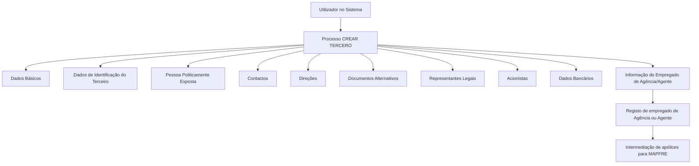

# Operação Criar Empregado de Agência/Agente — Documentação REEF / MAPFRE

## 1. Metadados do Documento
- **Arquivo de Origem:** `Não identificado`
- **Tipo de Documento:** `Procedimento`
- **Domínio / Sistema:** `REEF / MAPFRE — gestão de Terceiros`
- **Público-Alvo:** `Operação, negócio e utilizadores do sistema`
- **Data/Versão Identificada:** `Não identificada`

---

## 2. Resumo Executivo & Contexto de Negócio

O documento descreve a operação **“CREAR Empleado de Agente”**, destinada ao registo, no sistema, das informações de empregados de Agências ou Agentes que possuem uma relação comercial com a entidade MAPFRE para intermediação de apólices.

O processo utiliza informações partilhadas da operação **CREAR TERCERO**, incluindo dados básicos, identificação, contactos, endereços e documentos alternativos. Além dos blocos comuns, o processo requer o bloco específico **“Información del Empleado de Agencia/Agente”**.

A obrigatoriedade e a habilitação dos campos não são fixas: podem variar conforme o código de atividade do Terceiro, a classificação do Terceiro como Pessoa Física ou Pessoa Jurídica e modificações implementadas localmente.

O documento também estabelece que a sequência de recolha de dados nos blocos de informação pode variar conforme o critério seguido pelo utilizador no sistema. Não são apresentados detalhes sobre campos individuais, validações técnicas, integrações, métodos HTTP ou contratos de dados.

---

## 3. Arquitetura, Componentes & Tecnologias Envolvidas

Os elementos identificados no documento são:

- **MAPFRE:** entidade com a qual Agências ou Agentes mantêm relação comercial para intermediação de apólices.
- **Sistema:** aplicação onde ocorre o registo das informações do empregado.
- **CREAR TERCERO:** processo de criação de Terceiro que disponibiliza blocos de informação partilhados.
- **CREAR Empleado de Agente:** operação específica para criação de informação de empregado de Agência/Agente.
- **REEF:** referência presente na documentação e na navegação apresentada.
- **Mapfredocument:** referência presente na navegação da documentação.



> **Nota de Análise:** O documento não descreve arquitetura de infraestrutura, serviços, bases de dados, APIs, protocolos, ambientes ou tecnologias de implementação.

---

## 4. Regras de Negócio, Especificações Funcionais & Processos

### Objetivo da operação

A operação permite registar no sistema a informação dos empregados de Agências ou Agentes com os quais a MAPFRE tem uma relação comercial para a intermediação das respetivas apólices.

### Premissas de preenchimento

1. A obrigatoriedade e/ou habilitação dos campos nos blocos ou estruturas de informação partilhadas podem variar conforme o **código de atividade do Terceiro**.
2. A obrigatoriedade e/ou habilitação dos campos podem variar caso o Terceiro seja uma **Pessoa Física** ou uma **Pessoa Jurídica**.
3. Modificações implementadas localmente podem afetar o comportamento da aplicação relativamente à obrigatoriedade de registo dos dados do Terceiro.
4. A ordem de captura dos dados nos diferentes blocos de informação pode variar conforme o critério adotado pelo utilizador no sistema.

### Processo identificado

1. O utilizador inicia a operação **CREAR**.
2. O processo utiliza o contexto de **CREAR TERCERO**.
3. O utilizador regista os blocos de informação partilhados aplicáveis.
4. O utilizador regista os blocos específicos de acordo com a atividade do Terceiro.
5. Para esta operação, deve ser utilizada a estrutura **Información del Empleado de Agencia/Agente**.

> **Nota de Análise:** O documento não informa a sequência obrigatória entre os blocos, os campos internos de cada bloco, regras de persistência, mensagens de erro ou critérios de conclusão bem-sucedida do registo.

---

## 5. Tabelas de Parâmetros, Ambientes e Estruturas de Dados

| Item / Parâmetro | Descrição / Função | Tipo / Valores / Formato | Ambiente / Observações |
| :--- | :--- | :--- | :--- |
| Operação | Criação de empregado de Agência/Agente | `CREAR Empleado de Agente` | Registo no sistema |
| Processo base | Criação de Terceiro | `CREAR TERCERO` | Disponibiliza blocos de informação partilhados |
| Entidade comercial | Entidade relacionada com Agências ou Agentes | `MAPFRE` | Intermediação de apólices |
| Critério de obrigatoriedade | Pode alterar obrigatoriedade/habilitação de campos | Código de atividade do Terceiro | Não são detalhados códigos ou valores |
| Tipo de Terceiro | Pode alterar obrigatoriedade/habilitação de campos | Pessoa Física ou Pessoa Jurídica | Não são detalhadas diferenças de campos |
| Modificações locais | Podem influenciar o comportamento da aplicação | Implementações locais | Podem afetar a obrigatoriedade dos dados |
| Ordem de captura | Sequência de preenchimento dos blocos | Variável | Definida conforme critério do utilizador |
| Dados Básicos | Bloco de informação partilhado | Não detalhado | Associado a `CREAR TERCERO` |
| Dados de Identificação do Terceiro | Bloco de informação partilhado | Não detalhado | Associado a `CREAR TERCERO` |
| Pessoa Politicamente Exposta | Bloco de informação partilhado | Não detalhado | Associado a `CREAR TERCERO` |
| Contactos | Bloco de informação partilhado | Não detalhado | Associado a `CREAR TERCERO` |
| Direções | Bloco de informação partilhado | Não detalhado | Associado a `CREAR TERCERO` |
| Documentos Alternativos | Bloco de informação partilhado | Não detalhado | Associado a `CREAR TERCERO` |
| Representantes Legais | Bloco de informação partilhado | Não detalhado | Associado a `CREAR TERCERO` |
| Acionistas | Bloco de informação partilhado | Não detalhado | Associado a `CREAR TERCERO` |
| Dados Bancários | Bloco de informação partilhado | Não detalhado | Associado a `CREAR TERCERO` |
| Informação do Empregado de Agência/Agente | Bloco específico conforme atividade do Terceiro | Não detalhado | Aplicável à operação descrita |
| REEF | Referência documental e de navegação | Não expandido no texto | Aparece como “DOCUMENTACIÓN Reef” |

---

## 6. Bateria de Perguntas & Respostas para RAG (FAQ Sintético)

### P1: Qual é o objetivo da operação “CREAR Empleado de Agente”?
**R:** A operação permite registar no sistema as informações dos empregados de Agências ou de Agentes que mantêm uma relação comercial com a MAPFRE para intermediação de apólices.

### P2: A operação de criação de empregado utiliza qual processo base?
**R:** A operação utiliza o processo **CREAR TERCERO**, que contém blocos de informação partilhados aplicáveis ao registo do Terceiro.

### P3: Quais fatores podem alterar a obrigatoriedade dos campos do Terceiro?
**R:** A obrigatoriedade e/ou habilitação dos campos podem variar conforme o código de atividade do Terceiro, o tipo de Terceiro — Pessoa Física ou Pessoa Jurídica — e modificações implementadas localmente.

### P4: A ordem de preenchimento dos blocos de informação é fixa?
**R:** Não. O documento indica que a ordem de captura de dados nos diferentes blocos de informação pode variar conforme o critério seguido pelo utilizador no sistema.

### P5: Qual bloco específico deve ser utilizado para registar empregados de Agência ou Agente?
**R:** O bloco específico indicado é **“Información del Empleado de Agencia/Agente”**, classificado como um bloco de informação específico conforme a atividade do Terceiro.

### P6: Quais blocos partilhados de informação são citados no processo CREAR TERCERO?
**R:** O documento cita Dados Básicos, Dados de Identificação do Terceiro, Pessoa Politicamente Exposta, Contactos, Direções, Documentos Alternativos, Representantes Legais, Acionistas e Dados Bancários.

### P7: O documento define os campos internos da estrutura “Información del Empleado de Agencia/Agente”?
**R:** Não. O documento apenas identifica a existência do bloco “Información del Empleado de Agencia/Agente”; não detalha os seus campos, formatos, obrigatoriedades individuais ou validações.

### P8: O documento informa APIs, métodos HTTP ou contratos JSON para a operação?
**R:** Não. Não há informação sobre APIs, métodos HTTP, contratos JSON, endpoints, protocolos ou integrações técnicas.

### P9: Qual é a relação da MAPFRE com as Agências ou Agentes mencionados?
**R:** A MAPFRE possui uma relação comercial com as Agências ou Agentes para a intermediação das suas apólices.

### P10: As modificações locais podem influenciar o comportamento do registo?
**R:** Sim. O documento informa que modificações implementadas localmente podem afetar o comportamento da aplicação relativamente à obrigatoriedade do registo dos dados do Terceiro.

---

## 7. Glossário de Termos, Siglas & Conceitos-Chave

- **MAPFRE:** entidade mencionada como detentora de relação comercial com Agências ou Agentes para intermediação de apólices.
- **REEF:** termo presente como referência na documentação; o documento não apresenta a expansão ou definição da sigla.
- **CREAR TERCERO:** processo de criação de Terceiro que contém blocos de informação partilhados.
- **CREAR Empleado de Agente:** operação para registar informação de empregado de Agência ou Agente.
- **Terceiro:** entidade cuja informação é criada no processo; pode ser Pessoa Física ou Pessoa Jurídica.
- **Pessoa Física:** classificação possível para o tipo de Terceiro.
- **Pessoa Jurídica:** classificação possível para o tipo de Terceiro.
- **Pessoa Politicamente Exposta:** bloco de informação partilhado citado no processo.
- **Intermediação de apólices:** relação comercial associada às Agências ou Agentes no contexto da MAPFRE.

---

## 8. Notas Críticas, Riscos & Limitações

- O documento não identifica o arquivo de origem, data, versão ou responsável técnico.
- Não há detalhamento de campos, tipos de dados, formatos, valores permitidos ou regras de validação por bloco.
- Não há matriz explícita que relacione códigos de atividade do Terceiro aos campos obrigatórios ou habilitados.
- Modificações locais podem alterar a obrigatoriedade dos dados, criando potencial variação de comportamento entre implantações.
- O documento não define critérios de sucesso, tratamento de erros, perfis de acesso, auditoria ou regras de aprovação.
- Não são descritas APIs, integrações, tecnologias, ambientes, URLs, servidores ou caminhos de logs.
- A sequência de preenchimento depende do critério do utilizador, sem uma ordem operacional obrigatória documentada.

---

## 9. Conteúdo Bruto Estruturado (Referência Fiel)

```text
--- [PÁGINA 1 DE 2] ---

OPERACIÓN CREAR Empleado de Agente
¿En que consiste?
Esta operación permite registrar en el Sistema la Información de los Empleados de las Agencias o de los Agentes, con los que la entidad
MAPFRE tiene una relación comercial para la intermediación de sus pólizas.
Premisas
La obligatoriedad y/o la habilitación de los campos en el registro de los datos de cada uno de los bloques o estructuras de información
compartidas puede variar de acuerdo con el código de actividad del Tercero:
La obligatoriedad y/o la habilitación de los campos en el registro de los datos de cada uno de los bloques o estructuras de información
pueden variar si el tipo de Tercero es una Persona Física o una Persona Jurídica:
Las modicaciones que se hubieran podido implementar localmente a su vez pueden afectar el comportamiento de la aplicación en
relación con la obligatoriedad en el registro de los Datos del Tercero.
Por último, el orden de captura de los datos en los distintos bloques de Información puede variar de acuerdo con el criterio seguido por el
Usuario en el Sistema.
Proceso
CREAR
TERCERO
Crear Información
del Empleado de Agente
Bloques de Información Compartidos (CREAR TERCERO)
 Datos Básicos ( )
 Datos Identicación del Tercero ( )
 Persona Políticamente Expuesta ( )
 Contactos ( )
 Direcciones ( )
 Documentos Alternativos ( )
Ejemplo:
Ejemplo:
Documentation / DOCUMENTACIÓN Reef
DOCUMENTACIÓN Reef
Mapfredocument
DOCUMENTACIÓN Reef
Owner
user:agonzalez_mapfre.com
Lifecycle
Approved Source
 / 
 VL
Buscar Inicio Soluciones Arquitecturas APIs Componentes Cloud Documentación Zeus Reef Ayuda
ES


--- [PÁGINA 2 DE 2] ---

Representantes Legales ( )
 Accionistas ( )
 Datos Bancarios ( )
Bloques de Información Especícos de acuerdo con la Actividad del Tercero.
 Información del Empleado de Agencia/Agente ( )
```
