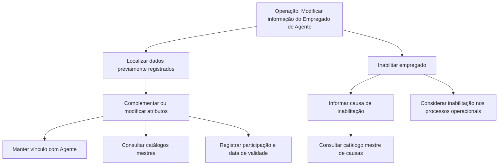

# Operação de Modificação e Inabilitação de Empregado de Agente/Agência

## 1. Metadados do Documento
- **Arquivo de Origem:** Não identificado no conteúdo fornecido
- **Tipo de Documento:** Especificação Técnica
- **Domínio / Sistema:** Reef / Mapfre
- **Público-Alvo:** Negócio, Desenvolvedores e Operação
- **Data/Versão Identificada:** Não identificada

---

## 2. Resumo Executivo & Contexto de Negócio

O documento descreve a operação **“Modificar Información específica del Empleado de Agente”**, destinada a complementar ou modificar dados previamente registrados para um Empregado de Agente/Agência. A operação também permite inabilitar esse empregado no sistema.

O escopo funcional concentra-se na manutenção de atributos de vínculo, classificação, agrupamento comercial, habilitação profissional, participação e validade operacional do Empregado de Agente/Agência. Os atributos devem ser capturados em uma sequência visual indicada como “da esquerda para a direita e de cima para baixo”.

A especificação declara que, salvo indicação expressa em contrário, os campos são aplicáveis tanto a **Pessoas Físicas** quanto a **Pessoas Jurídicas**. Alguns atributos dependem de catálogos mestres existentes no sistema, como agrupamentos comerciais, classificações e causas de inabilitação.

A inabilitação possui impacto operacional explícito: quando um Empregado de Agente/Agência estiver inabilitado, essa circunstância deve ser considerada pelos processos operacionais da entidade. A data de validade suporta o histórico de mudanças na configuração dos agentes na entidade seguradora.

---

## 3. Arquitetura, Componentes & Tecnologias Envolvidas

Os elementos identificados no conteúdo são:

- **Reef:** contexto de documentação indicado por “DOCUMENTACIÓN Reef”.
- **Mapfre / Mapfredocument:** referências presentes na navegação e identificação documental.
- **Sistema:** repositório operacional onde empregados, agentes, intermediários e catálogos mestres são registrados e consultados.
- **Empregado de Agente/Agência:** entidade funcional tratada pela operação.
- **Agente:** entidade à qual o empregado está relacionado e da qual depende.
- **Intermediários:** entidades cuja relação ativa no sistema é usada para determinar o agente relacionado.
- **Catálogo mestre de agrupações:** origem dos valores de agrupamento comercial.
- **Catálogo mestre de classificações:** origem dos valores de classificação do empregado.
- **Catálogo mestre de causas de inabilitação:** origem dos códigos de causa de inabilitação.

> **Nota de Análise:** O conteúdo não informa arquitetura técnica de software, protocolos, APIs, métodos HTTP, contratos JSON, bancos de dados, ambientes, URLs técnicas ou tecnologias de implementação.



---

## 4. Regras de Negócio, Especificações Funcionais & Processos

### Operação disponível

A operação permite:

1. Complementar dados previamente registrados para um Empregado de Agente/Agência.
2. Modificar dados previamente registrados para um Empregado de Agente/Agência.
3. Inabilitar um Empregado de Agente/Agência.

As ações habilitadas explicitamente no documento são:

- **MODIFICAR**
- **INHABILITAR**

### Aplicabilidade dos campos

- Os atributos do bloco **Dados Pessoa — Pessoa Física/Jurídica** seguem uma sequência de captura da esquerda para a direita e de cima para baixo.
- Caso não exista indicação expressa em contrário, os campos devem ser utilizados para **Pessoas Físicas** e **Pessoas Jurídicas**.

### Vínculo com agente

- O atributo **Agente** contém o código do agente ao qual o Empregado de Agente/Agência está relacionado.
- O Empregado de Agente/Agência depende desse agente conforme a relação de agentes ou intermediários que estejam ativos no sistema.

### Agrupamento e classificação

- O **Agrupamento Comercial do Empregado** identifica a agrupação comercial à qual o empregado pertence.
- Os valores de agrupamento comercial são definidos no catálogo mestre de agrupações existente no sistema.
- A **Classificação do Empregado** identifica a classificação do empregado do agente/agência.
- Os valores de classificação são definidos no catálogo mestre de classificações configurado no sistema.

### Habilitação profissional

- O **Número de Colegiación** contém a chave ou código da cédula profissional.
- A cédula profissional representa a habilitação do empregado para exercer sua profissão em razão de pertencer a um colégio profissional ou associação semelhante de caráter oficial.

### Inabilitação

- A propriedade **Inhabilitación** informa ao sistema que o Empregado de Agente/Agência está inabilitado.
- Quando houver inabilitação, essa condição deve ser contemplada ou considerada nos processos operacionais da entidade.
- A **Causa de Inhabilitación** somente é aplicável no caso de o empregado estar inabilitado.
- A causa de inabilitação contém o código de uma causa definida no catálogo mestre do sistema.

### Participação e vigência

- O **Porcentaje de Participación** contém o percentual de participação do empregado sobre o total do agente.
- A **Fecha de Validez** informa a data a partir da qual o agente está plenamente operativo no sistema.
- O uso correto da data de validade permite à entidade seguradora manter um histórico das mudanças realizadas na configuração dos agentes.

---

## 5. Tabelas de Parâmetros, Ambientes e Estruturas de Dados

| Item / Parâmetro | Descrição / Função | Tipo / Valores / Formato | Ambiente / Observações |
| :--- | :--- | :--- | :--- |
| Operação | Complementar ou modificar dados previamente registrados do Empregado de Agente/Agência; também permite inabilitação. | Ações: `MODIFICAR` e `INHABILITAR` | Sistema não especificado no conteúdo. |
| Dados Pessoa | Bloco de informações para Pessoa Física/Jurídica. | Aplicável a Pessoas Físicas e Jurídicas, salvo indicação expressa em contrário. | A sequência de captura é da esquerda para a direita e de cima para baixo. |
| Agente | Código do agente relacionado ao Empregado de Agente/Agência. | Código do agente | O empregado depende do agente conforme relações de agentes ou intermediários ativos no sistema. |
| Agrupamento Comercial do Empregado | Identifica a agrupação comercial à qual pertence o empregado. | Valor definido no catálogo mestre de agrupações | Catálogo mestre existente no sistema. |
| Classificação do Empregado | Identifica a classificação do empregado do agente/agência. | Valor definido no catálogo mestre de classificações | Catálogo mestre configurado no sistema. |
| Número de Colegiación | Chave ou código da cédula profissional do empregado. | Chave/código | Relacionado à habilitação profissional decorrente de colégio profissional ou associação oficial semelhante. |
| Inhabilitación | Indica ao sistema que o Empregado de Agente/Agência está inabilitado. | Propriedade de inabilitação | Deve ser considerada nos processos operacionais da entidade. |
| Causa de Inhabilitación | Código da causa de inabilitação do empregado. | Código de causa | Aplicável quando o empregado estiver inabilitado; valor definido no catálogo mestre do sistema. |
| Porcentaje de Participación | Percentual de participação do empregado sobre o total do agente. | Percentual | O documento não especifica escala, precisão ou regras de validação. |
| Fecha de Validez | Data a partir da qual o agente está plenamente operativo no sistema. | Data | Permite manter histórico de alterações na configuração dos agentes. |
| Reef | Referência de documentação. | `DOCUMENTACIÓN Reef` | Não há detalhamento técnico adicional. |
| Mapfredocument | Referência presente no conteúdo de navegação. | Texto de identificação | Não há detalhamento funcional adicional. |
| Owner | Proprietário indicado no conteúdo. | `user:agonzalez_mapfre.com` | Conforme extração bruta. |
| Lifecycle | Estado do ciclo de vida indicado. | `Approved Source` | Conforme extração bruta. |

---

## 6. Bateria de Perguntas & Respostas para RAG (FAQ Sintético)

### P1: Qual é o objetivo da operação “Modificar Información específica del Empleado de Agente”?
**R:** A operação permite complementar ou modificar dados que já estejam registrados para um Empregado de Agente/Agência. A mesma operação também permite inabilitar o empregado no sistema.

### P2: Quais ações estão habilitadas para o Empregado de Agente/Agência?
**R:** O documento apresenta duas ações habilitadas: `MODIFICAR` e `INHABILITAR`. A ação MODIFICAR é destinada à manutenção das informações registradas, enquanto INHABILITAR indica que o empregado passa a estar inabilitado no sistema.

### P3: O campo Agente representa qual informação?
**R:** O campo Agente contém o código do agente ao qual o Empregado de Agente/Agência está relacionado. O empregado depende desse agente de acordo com a relação de agentes ou intermediários ativos no sistema.

### P4: De onde vêm os valores possíveis para o Agrupamento Comercial do Empregado?
**R:** O Agrupamento Comercial do Empregado corresponde à agrupação comercial à qual o empregado pertence. Os valores disponíveis são definidos no catálogo mestre de agrupações existente no sistema.

### P5: Como é determinada a Classificação do Empregado?
**R:** A Classificação do Empregado contém a classificação aplicável ao empregado do agente/agência. Os valores devem ser obtidos da relação existente no catálogo mestre de classificações configurado no sistema.

### P6: O que representa o Número de Colegiación?
**R:** O Número de Colegiación contém a chave ou código da cédula profissional do Empregado de Agente/Agência. Essa cédula demonstra que o empregado está habilitado a exercer sua profissão devido à sua vinculação a um colégio profissional ou associação semelhante de caráter oficial.

### P7: Qual é o impacto operacional da inabilitação de um empregado?
**R:** A propriedade Inhabilitación informa ao sistema que o Empregado de Agente/Agência está inabilitado. O documento determina que essa circunstância deve ser contemplada ou considerada nos processos operacionais da entidade.

### P8: Quando a Causa de Inhabilitación deve ser informada?
**R:** A Causa de Inhabilitación deve ser informada quando o empregado estiver inabilitado. O campo contém o código de uma causa de inabilitação definida no catálogo mestre do sistema.

### P9: O que o Porcentaje de Participación mede?
**R:** O Porcentaje de Participación contém o percentual de participação do empregado em relação ao total do agente. O conteúdo não especifica formato numérico, faixa permitida ou regras de arredondamento para esse percentual.

### P10: Para que serve a Fecha de Validez?
**R:** A Fecha de Validez informa ao sistema a data a partir da qual o agente está plenamente operativo. A utilização correta desse campo permite à entidade seguradora manter um histórico das mudanças realizadas na configuração dos agentes.

### P11: Os atributos são aplicáveis apenas a Pessoas Físicas?
**R:** Não. O documento informa que, salvo quando houver indicação expressa em contrário, os campos são utilizados tanto para Pessoas Físicas quanto para Pessoas Jurídicas.

### P12: O documento especifica APIs, URLs, métodos HTTP ou contratos de integração?
**R:** Não. O conteúdo fornecido descreve a operação funcional e seus atributos, mas não detalha APIs, métodos HTTP, URLs, contratos JSON, tecnologias de implementação ou mecanismos de integração.

---

## 7. Glossário de Termos, Siglas & Conceitos-Chave

- **Agente:** Entidade cujo código identifica a relação e dependência do Empregado de Agente/Agência.
- **Agrupamento Comercial:** Agrupação comercial à qual o Empregado de Agente/Agência pertence.
- **Catálogo Mestre:** Repositório de valores definidos no sistema para agrupamentos, classificações e causas de inabilitação.
- **Causa de Inhabilitación:** Código de uma causa de inabilitação definida no catálogo mestre do sistema.
- **Classificação do Empregado:** Classificação atribuída ao empregado de agente/agência conforme catálogo mestre configurado.
- **Empregado de Agente/Agência:** Entidade funcional cujas informações podem ser complementadas, modificadas ou inabilitadas.
- **Fecha de Validez:** Data a partir da qual o agente está plenamente operativo no sistema.
- **Inhabilitación:** Propriedade que indica que o Empregado de Agente/Agência está inabilitado no sistema.
- **Número de Colegiación:** Chave ou código da cédula profissional associada à habilitação profissional do empregado.
- **Porcentaje de Participación:** Percentual de participação do empregado sobre o total do agente.
- **Reef:** Referência documental identificada como “DOCUMENTACIÓN Reef”.

---

## 8. Notas Críticas, Riscos & Limitações

- O conteúdo não identifica o nome do arquivo de origem, data, versão ou autor formal do documento.
- O documento não apresenta requisitos técnicos de integração, APIs, contratos de dados, métodos HTTP, tecnologias, servidores, URLs ou ambientes.
- Não são especificadas validações de formato, obrigatoriedade, unicidade ou faixa de valores para os campos descritos.
- O campo **Causa de Inhabilitación** depende de o empregado estar inabilitado, mas o documento não detalha regras de bloqueio, persistência ou comportamento do sistema quando a causa não for informada.
- O campo **Porcentaje de Participación** é descrito como percentual sobre o total do agente, porém não há detalhamento de precisão, soma máxima, mínimo ou política de arredondamento.
- A validade operacional é descrita para o agente, embora a operação seja referente ao Empregado de Agente/Agência; o conteúdo não esclarece eventuais distinções adicionais entre a vigência do agente e a vigência do empregado.
- **Nota de Análise:** O documento lista Reef, Mapfredocument, proprietário e estado de ciclo de vida, mas não detalha a função técnica desses elementos na operação.

---

## 9. Conteúdo Bruto Estruturado (Referência Fiel)

```text
--- [PÁGINA 1 DE 2] ---

MODIFICAR Información especíca del Empleado de Agente
Objetivo
Esta Operación permite Complementar y Modicar los datos que se encontraran registrados previamente en el Empleado de Agente/Agencia
además de poder Inhabilitarlo.
Acciones habilitadas
 MODIFICAR ( )
 INHABILITAR ( )
Datos Persona Persona Física/Jurídica
De Izquierda a Derecha y de Arriba hacia Abajo, los siguientes atributos marcan la secuencia de captura en este Bloque de Información.
(Si no se especica o indica expresamente, los campos se emplearán tanto en Personas Físicas como en Personas Jurídicas).
Agente (  )
Este atributo contiene el código del Agente con el que está relacionado y del que depende el Empleado de acuerdo con la relación de Agentes
o Intermediarios que se encuentren activos en el Sistema
Agrupamiento Comercial del Empleado (  )
Este Campo incluye la Agrupación Comercial al que pertenece el Empleado del Agente/Agencia, de acuerdo con la relación de valores
denidos en el catálogo maestro de agrupaciones existente en el Sistema.
Clasicación del Empleado (  )
Este dato contiene la clasicación del Empleado del Agente/Agencia de acuerdo con la relación de valores existentes en el catálogo maestro
de clasicaciones congurado en el Sistema.
Número de Colegiación ( )
Documentation / DOCUMENTACIÓN Reef
DOCUMENTACIÓN Reef
Mapfredocument
DOCUMENTACIÓN Reef
Owner
user:agonzalez_mapfre.com
Lifecycle
Approved Source
 / 
 VL
Buscar Inicio Soluciones Arquitecturas APIs Componentes Cloud Documentación Zeus Reef Ayuda
ES


--- [PÁGINA 2 DE 2] ---

Este campo contiene la clave/código de la cédula profesional por la que el Empleado del Agente/Agencia, por su pertenencia a un colegio
profesional o asociación semejante de carácter ocial, está habilitado para ejercer en el desempeño de su Profesión.
Inhabilitación ( )
Esta propiedad le indica al Sistema que el Empleado del Agente/Agencia está inhabilitado en el Sistema y por ello esta circunstancia debería
estar contemplada o considerada en los procesos operativos de la entidad.
Causa de Inhabilitación (   )
En el supuesto que el Empleado estuviera inhabilitado, este dato contendrá el código de una de las causas de inhabilitación denidas en el
catálogo maestro del Sistema.
Porcentaje de Participación ( )
Este campo contiene el porcentaje de participación del empleado sobre el total del Agente.
Fecha de Validez ( )
Esta propiedad le indica al Sistema la fecha a partir de la cual el Agente está plenamente operativo en el sistema por lo que su empleo y
correcta utilización permite tener en la entidad Aseguradora un histórico de los cambios efectuados en la conguración de los Agentes.
```
