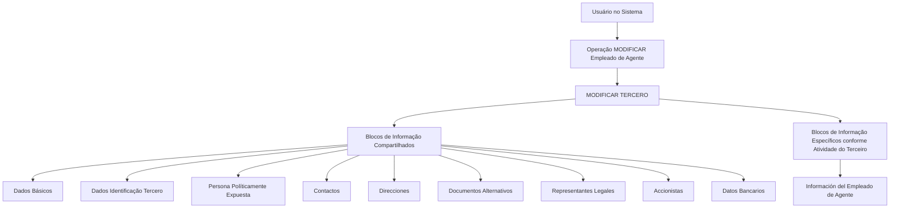

# Operação MODIFICAR Empregado de Agente — Documentação Reef

## 1. Metadados do Documento
- **Arquivo de Origem:** Não identificado no conteúdo fornecido
- **Tipo de Documento:** Procedimento
- **Domínio / Sistema:** Reef / MODIFICAR TERCERO / gestão de empregados de agências ou agentes
- **Público-Alvo:** Usuários do sistema, Operação, Analistas Funcionais
- **Data/Versão Identificada:** Não identificada

---

## 2. Resumo Executivo & Contexto de Negócio

O documento descreve a operação **“MODIFICAR Empleado de Agente”**, destinada ao complemento, à modificação e/ou à inabilitação das informações de empregados vinculados a Agências ou Agentes. A operação atua sobre blocos ou estruturas de dados que agrupam as informações conforme a sua natureza.

A obrigatoriedade e a habilitação dos campos não são estáticas. Elas podem variar conforme o código de atividade do terceiro e conforme o terceiro seja classificado como Pessoa Física ou Pessoa Jurídica. Portanto, o comportamento do registro de dados depende de atributos cadastrais do terceiro.

Modificações implementadas localmente também podem afetar o comportamento da aplicação quanto à obrigatoriedade de registro dos dados do terceiro. O documento não especifica quais modificações locais existem, nem como são configuradas ou aplicadas.

O fluxo de captura de dados pode variar segundo o critério adotado pelo usuário no sistema. Embora a operação faça referência a blocos compartilhados da função **MODIFICAR TERCERO** e a um bloco específico de empregado de agente, o conteúdo não informa métodos HTTP, contratos JSON, regras de persistência, perfis de acesso ou validações detalhadas por campo.

---

## 3. Arquitetura, Componentes & Tecnologias Envolvidas

Os componentes funcionais identificados são:

- Operação **MODIFICAR Empleado de Agente**.
- Função ou processo **MODIFICAR TERCERO**.
- Blocos de informação compartilhados utilizados em `MODIFICAR TERCERO`.
- Blocos específicos determinados pela atividade do terceiro.
- Bloco específico **Información del Empleado de Agente**.
- Referências ao portal de documentação **Documentation / DOCUMENTACIÓN Reef**, **Mapfredocument** e ao estado de ciclo de vida **Approved Source / VL**.

> **Nota de Análise:** O documento não apresenta arquitetura técnica de infraestrutura, banco de dados, APIs, microsserviços, protocolos, ambientes ou integrações externas. O diagrama abaixo representa somente o fluxo funcional explicitamente descrito.



---

## 4. Regras de Negócio, Especificações Funcionais & Processos

### 4.1 Finalidade da operação

A operação **MODIFICAR Empleado de Agente** consiste em:

1. Complementar informações de empregados de Agências ou de Agentes.
2. Modificar informações de empregados de Agências ou de Agentes.
3. Inabilitar informações de empregados de Agências ou de Agentes.
4. Atuar sobre qualquer bloco ou estrutura de dados que contenha e agrupe tais informações segundo a sua natureza.

### 4.2 Premissas de obrigatoriedade e habilitação

As regras de obrigatoriedade e habilitação dos campos são condicionais:

1. A obrigatoriedade e/ou habilitação dos campos em cada bloco ou estrutura de informação compartilhada pode variar conforme o **código de atividade do terceiro**.
2. A obrigatoriedade e/ou habilitação dos campos também pode variar conforme o tipo de terceiro seja **Pessoa Física** ou **Pessoa Jurídica**.
3. Modificações implementadas localmente podem afetar o comportamento da aplicação em relação à obrigatoriedade de registro dos dados do terceiro.
4. A ordem de captura de dados nos diferentes blocos de informação pode variar conforme o critério adotado pelo usuário no sistema.

### 4.3 Processo funcional identificado

1. O usuário inicia a operação de modificar terceiro.
2. O usuário acessa a funcionalidade de modificação de informação do empregado de agente.
3. O sistema disponibiliza blocos de informação compartilhados associados a `MODIFICAR TERCERO`.
4. O sistema disponibiliza blocos específicos de acordo com a atividade do terceiro.
5. O usuário registra, complementa, modifica ou inabilita dados no bloco **Información del Empleado de Agente**, conforme aplicável.

> **Nota de Análise:** O documento não detalha a sequência obrigatória entre blocos, critérios específicos de inabilitação, campos de cada bloco, mensagens de erro ou comportamento após gravação.

---

## 5. Tabelas de Parâmetros, Ambientes e Estruturas de Dados

| Item / Parâmetro | Descrição / Função | Tipo / Valores / Formato | Ambiente / Observações |
| :--- | :--- | :--- | :--- |
| Operação | Gerencia complemento, modificação e/ou inabilitação de dados de empregados de Agências ou Agentes. | `MODIFICAR Empleado de Agente` | Associada ao processo `MODIFICAR TERCERO`. |
| Código de atividade do terceiro | Pode determinar obrigatoriedade e habilitação dos campos nos blocos compartilhados. | Código de atividade; formato não informado. | Valores e regras não detalhados. |
| Tipo de terceiro | Pode determinar obrigatoriedade e habilitação dos campos. | Pessoa Física ou Pessoa Jurídica. | Critérios de variação não detalhados. |
| Modificações locais | Podem afetar a obrigatoriedade do registro dos dados do terceiro. | Não informado. | Implementações locais não especificadas. |
| Ordem de captura | Pode variar nos diferentes blocos de informação. | Critério do usuário no sistema. | Não há ordem fixa documentada. |
| Dados Básicos | Bloco de informação compartilhado. | Campos não informados. | Parte de `MODIFICAR TERCERO`. |
| Dados Identificación Tercero | Bloco de identificação do terceiro. | Campos não informados. | Parte de `MODIFICAR TERCERO`. |
| Persona Políticamente Expuesta | Bloco de informação compartilhado. | Campos não informados. | Parte de `MODIFICAR TERCERO`. |
| Contactos | Bloco de informação compartilhado. | Campos não informados. | Parte de `MODIFICAR TERCERO`. |
| Direcciones | Bloco de informação compartilhado. | Campos não informados. | Parte de `MODIFICAR TERCERO`. |
| Documentos Alternativos | Bloco de informação compartilhado. | Campos não informados. | Parte de `MODIFICAR TERCERO`. |
| Representantes Legales | Bloco de informação compartilhado. | Campos não informados. | Parte de `MODIFICAR TERCERO`. |
| Accionistas | Bloco de informação compartilhado. | Campos não informados. | Parte de `MODIFICAR TERCERO`. |
| Datos Bancarios | Bloco de informação compartilhado. | Campos não informados. | Parte de `MODIFICAR TERCERO`. |
| Información del Empleado de Agente | Bloco específico para informações do empregado de agente. | Campos não informados. | Aplicável conforme a atividade do terceiro. |
| Portal de documentação | Referência de navegação apresentada no conteúdo bruto. | `Documentation / DOCUMENTACIÓN Reef`; `Mapfredocument`. | Exibe `Owner user:agonzalez_mapfre.com` e `Lifecycle Approved Source / VL`. |

---

## 6. Bateria de Perguntas & Respostas para RAG (FAQ Sintético)

### P1: Em que consiste a operação MODIFICAR Empleado de Agente?
**R:** A operação consiste no complemento, na modificação e/ou na inabilitação das informações dos empregados de Agências ou de Agentes, em quaisquer blocos ou estruturas de dados que agrupem essas informações conforme a sua natureza.

### P2: Quais fatores podem alterar a obrigatoriedade dos campos na operação MODIFICAR Empleado de Agente?
**R:** A obrigatoriedade e/ou habilitação dos campos pode variar conforme o código de atividade do terceiro, o tipo de terceiro — Pessoa Física ou Pessoa Jurídica — e modificações implementadas localmente que afetem o comportamento da aplicação.

### P3: A classificação do terceiro como Pessoa Física ou Pessoa Jurídica influencia o cadastro?
**R:** Sim. O documento informa que a obrigatoriedade e/ou habilitação dos campos nos blocos ou estruturas de informação pode variar caso o terceiro seja Pessoa Física ou Pessoa Jurídica.

### P4: O código de atividade do terceiro interfere nos campos disponíveis?
**R:** Sim. A obrigatoriedade e/ou habilitação dos campos no registro dos dados de cada bloco ou estrutura de informação compartilhada pode variar de acordo com o código de atividade do terceiro.

### P5: A ordem de preenchimento dos blocos de informação é fixa?
**R:** Não. O documento informa que a ordem de captura dos dados nos distintos blocos de informação pode variar segundo o critério seguido pelo usuário no sistema.

### P6: Quais blocos compartilhados são mencionados em MODIFICAR TERCERO?
**R:** Os blocos mencionados são Dados Básicos, Dados Identificación Tercero, Persona Políticamente Expuesta, Contactos, Direcciones, Documentos Alternativos, Representantes Legales, Accionistas e Datos Bancarios.

### P7: Qual é o bloco específico relacionado ao empregado de agente?
**R:** O bloco específico indicado é **Información del Empleado de Agente**, classificado como um bloco de informação específico de acordo com a atividade do terceiro.

### P8: O documento informa os campos do bloco Información del Empleado de Agente?
**R:** Não. O documento apenas lista o bloco **Información del Empleado de Agente**; não detalha seus campos, formatos, obrigatoriedades individuais ou validações.

### P9: O documento especifica APIs, métodos HTTP ou contratos JSON para a operação?
**R:** Não. O conteúdo fornecido não descreve APIs, métodos HTTP, contratos JSON, endpoints, integrações técnicas ou mecanismos de persistência.

### P10: O que as modificações locais podem alterar na aplicação?
**R:** As modificações que tenham sido implementadas localmente podem afetar o comportamento da aplicação em relação à obrigatoriedade do registro dos dados do terceiro.

---

## 7. Glossário de Termos, Siglas & Conceitos-Chave

- **Agente:** Entidade mencionada como vinculada a empregados cujas informações podem ser complementadas, modificadas ou inabilitadas.
- **Agência:** Entidade mencionada como vinculada a empregados cujas informações podem ser complementadas, modificadas ou inabilitadas.
- **Bloques de Información Compartidos:** Blocos de informação reutilizados no processo `MODIFICAR TERCERO`.
- **Bloques de Información Específicos:** Blocos de informação aplicáveis de acordo com a atividade do terceiro.
- **MODIFICAR TERCERO:** Processo ou operação que reúne blocos compartilhados de informação do terceiro.
- **Pessoa Física:** Tipo de terceiro que pode influenciar obrigatoriedade e habilitação de campos.
- **Pessoa Jurídica:** Tipo de terceiro que pode influenciar obrigatoriedade e habilitação de campos.
- **Persona Políticamente Expuesta:** Bloco de informação compartilhado listado no processo `MODIFICAR TERCERO`.
- **Reef:** Nome presente na referência de documentação exibida no conteúdo.
- **Tercero:** Terceiro cadastrado, cujos atributos — como código de atividade e tipo — influenciam o comportamento dos campos.

---

## 8. Notas Críticas, Riscos & Limitações

- O arquivo de origem, a data, a versão e a autoria formal do documento não foram identificados no conteúdo fornecido.
- O documento não detalha campos, tipos de dados, formatos, regras de validação, mensagens de erro ou critérios de persistência.
- Não há definição dos códigos de atividade, nem matriz que relacione cada código aos campos obrigatórios ou habilitados.
- Não há detalhamento das modificações locais que podem alterar a obrigatoriedade dos dados.
- Não há descrição de permissões, perfis de usuário, auditoria, trilha de alterações ou regras específicas para inabilitação.
- O conteúdo não apresenta arquitetura técnica, integrações, APIs, ambientes, URLs, versões, portas, logs ou dependências de infraestrutura.
- A presença de caracteres corrompidos na extração, como `Modicación`, `Especícos` e `Identicación`, sugere falha de codificação na extração bruta; o sentido foi preservado sem inferir conteúdo adicional.

---

## 9. Conteúdo Bruto Estruturado (Referência Fiel)

```text
--- [PÁGINA 1 DE 2] ---

OPERACIÓN MODIFICAR Empleado de Agente
¿En que consiste?
Esta operación consiste en el Complemento, Modicación y/o Inhabilitación de la información de los Empleados de las Agencias o de los
Agentes, en cualquiera de los bloques o estructuras de datos que la contienen y agrupan de acuerdo con su naturaleza.
Premisas
La obligatoriedad y/o la habilitación de los campos en el registro de los datos de cada uno de los bloques o estructuras de información
compartidas puede variar de acuerdo con el código de actividad del Tercero:
La obligatoriedad y/o la habilitación de los campos en el registro de los datos de cada uno de los bloques o estructuras de información
pueden variar si el tipo de Tercero es una Persona Física o una Persona Jurídica:
Las modicaciones que se hubieran podido implementar localmente a su vez pueden afectar el comportamiento de la aplicación en
relación con la obligatoriedad en el registro de los Datos del Tercero.
Por último, el orden de captura de los datos en los distintos bloques de Información puede variar de acuerdo con el criterio seguido por el
Usuario en el Sistema.
Proceso
MODIFICAR
TERCERO
Modificar Información
del Empleado de Agente
Bloques de Información Compartidos (MODIFICAR TERCERO)
 Datos Básicos ( )
 Datos Identicación Tercero ( )
 Persona Políticamente Expuesta(   )
 Contactos (   )
 Direcciones (   )
 Documentos Alternativos (   )
Ejemplo:
Ejemplo:
Documentation / DOCUMENTACIÓN Reef
DOCUMENTACIÓN Reef
Mapfredocument
DOCUMENTACIÓN Reef
Owner
user:agonzalez_mapfre.com
Lifecycle
Approved Source
 / 
 VL
Buscar Inicio Soluciones Arquitecturas APIs Componentes Cloud Documentación Zeus Reef Ayuda
ES


--- [PÁGINA 2 DE 2] ---

Representantes Legales (   )
 Accionistas (   )
 Datos Bancarios (   )
Bloques de Información Especícos de acuerdo con la Actividad del Tercero.
 Información del Empleado de Agente (  )
```
