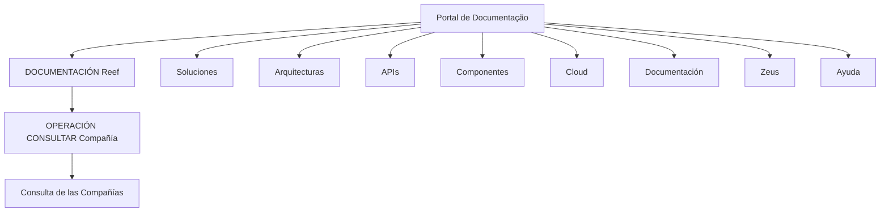

# Documentação Reef — Consulta de Compañía

## 1. Metadados do Documento
- **Arquivo de Origem:** Não identificado
- **Tipo de Documento:** Não identificado
- **Domínio / Sistema:** Reef; Mapfre
- **Público-Alvo:** Não identificado
- **Data/Versão Identificada:** Não identificada

---

## 2. Resumo Executivo & Contexto de Negócio

O conteúdo apresenta uma página ou registro de documentação denominado **“OPERACIÓN CONSULTAR Compañía”**, cujo objetivo declarado é a **consulta das Compañías**. O material está associado ao domínio **Reef** e contém referências a **Mapfre** e ao repositório ou artefato denominado `Mapfredocument`.

A tela exibida possui navegação para áreas como Soluções, Arquiteturas, APIs, Componentes, Cloud, Documentação, Zeus, Reef e Ajuda. Essas opções indicam que a documentação está inserida em um portal corporativo com categorização de conteúdos técnicos e funcionais.

O documento informa o ciclo de vida como **Approved Source** e associa a propriedade do conteúdo ao identificador literal `user:agonzalez_mapfre.com`. Não há detalhamento adicional sobre regras da operação de consulta, contratos de API, filtros, parâmetros de entrada, estruturas de resposta ou tecnologias implementadas.

> **Nota de Análise:** O conteúdo identifica a operação “CONSULTAR Compañía”, mas não descreve métodos HTTP, endpoints, autenticação, campos de requisição, campos de resposta ou regras de validação.

---

## 3. Arquitetura, Componentes & Tecnologias Envolvidas

Os elementos explicitamente citados são:

- **Reef:** domínio, sistema ou área de documentação.
- **Mapfre:** referência organizacional ou de domínio presente no conteúdo.
- **Mapfredocument:** identificador apresentado na tela.
- **Zeus:** área disponível na navegação do portal.
- **Cloud, APIs, Componentes, Arquiteturas e Soluções:** categorias navegáveis do portal.
- **OPERACIÓN CONSULTAR Compañía:** operação documentada para consulta de companhias.



> **Nota de Análise:** O diagrama representa exclusivamente a estrutura de navegação e o relacionamento textual entre Reef, a operação de consulta e a finalidade declarada. O documento não fornece arquitetura de software, comunicação entre componentes ou fluxo de dados técnico.

---

## 4. Regras de Negócio, Especificações Funcionais & Processos

### Operação identificada

A operação apresentada é:

- **Nome:** `OPERACIÓN CONSULTAR Compañía`
- **Finalidade declarada:** `Consulta de las Compañías.`

### Informações de governança do conteúdo

- O ciclo de vida informado é **Approved Source**.
- O proprietário informado é `user:agonzalez_mapfre.com`.
- O conteúdo possui referência a **Documentation / DOCUMENTACIÓN Reef**.
- O identificador `VL` é exibido, sem explicação funcional ou técnica adicional.

### Restrições de informação disponível

O conteúdo original não fornece:

- Processo passo a passo para consultar uma companhia.
- Critérios de pesquisa ou filtros.
- Regras de autorização.
- Regras de validação.
- Parâmetros obrigatórios ou opcionais.
- Contratos de integração ou APIs.
- Estruturas de dados de entrada ou saída.
- Tratamento de erros, exceções ou mensagens.
- Detalhamento de ambiente, URL, servidor ou rota de logs.

---

## 5. Tabelas de Parâmetros, Ambientes e Estruturas de Dados

| Item / Parâmetro | Descrição / Função | Tipo / Valores / Formato | Ambiente / Observações |
| :--- | :--- | :--- | :--- |
| Operação | Consulta de companhias | `OPERACIÓN CONSULTAR Compañía` | Não há fluxo operacional detalhado |
| Finalidade | Consultar companhias | `Consulta de las Compañías.` | Descrição literal do conteúdo |
| Domínio de documentação | Área associada ao conteúdo | `Reef` | Exibido como `Documentation / DOCUMENTACIÓN Reef` |
| Referência documental | Identificador textual apresentado | `Mapfredocument` | Sem detalhamento adicional |
| Proprietário | Responsável indicado no conteúdo | `user:agonzalez_mapfre.com` | Identificador preservado literalmente |
| Ciclo de vida | Estado de governança do conteúdo | `Approved Source` | Não há definição adicional |
| Identificador | Código ou rótulo exibido | `VL` | Significado não informado |
| Idioma | Idioma mostrado na navegação | `ES` | Interface contém termos em espanhol |

---

## 6. Bateria de Perguntas & Respostas para RAG (FAQ Sintético)

### P1: Qual é a finalidade da operação “OPERACIÓN CONSULTAR Compañía”?
**R:** A finalidade declarada no conteúdo é realizar a consulta das companhias, conforme a descrição literal: “Consulta de las Compañías.”

### P2: A qual domínio ou sistema a operação “CONSULTAR Compañía” está associada?
**R:** A operação está associada à documentação Reef, identificada no conteúdo como “Documentation / DOCUMENTACIÓN Reef”.

### P3: O documento informa uma API ou endpoint para consultar companhias?
**R:** Não. Embora a navegação do portal contenha uma seção denominada “APIs”, o conteúdo não apresenta endpoint, método HTTP, URL, contrato JSON ou mecanismo de autenticação para a operação de consulta.

### P4: Quem é o proprietário indicado para o conteúdo?
**R:** O proprietário informado literalmente no conteúdo é `user:agonzalez_mapfre.com`.

### P5: Qual é o ciclo de vida do documento?
**R:** O ciclo de vida exibido é `Approved Source`.

### P6: O que significa o identificador “VL” exibido no documento?
**R:** O conteúdo apresenta o identificador `VL`, mas não explica seu significado, escopo ou relação com a operação “CONSULTAR Compañía”.

### P7: Quais áreas técnicas podem ser acessadas pela navegação exibida?
**R:** A navegação apresenta as áreas Soluciones, Arquitecturas, APIs, Componentes, Cloud, Documentación, Zeus, Reef e Ayuda, além de opções como Buscar e Inicio.

### P8: O documento descreve quais campos devem ser utilizados na consulta de companhias?
**R:** Não. Não há campos, parâmetros, filtros de pesquisa, formatos de dados ou critérios de validação descritos no conteúdo fornecido.

### P9: Existe detalhamento de erros ou exceções para a operação de consulta?
**R:** Não. O conteúdo não apresenta códigos de erro, mensagens operacionais, políticas de retentativa ou tratamento de exceções.

### P10: O documento contém informações sobre ambientes, servidores ou URLs?
**R:** Não. Não foram identificados ambientes, servidores, portas, URLs, rotas de logs ou variáveis de configuração no conteúdo original.

---

## 7. Glossário de Termos, Siglas & Conceitos-Chave

- **Reef:** domínio, sistema ou área de documentação citada como `DOCUMENTACIÓN Reef`.
- **OPERACIÓN CONSULTAR Compañía:** nome da operação cujo propósito declarado é consultar companhias.
- **Compañía:** entidade consultada pela operação; o conteúdo não define sua estrutura ou atributos.
- **Mapfre:** termo presente na referência `Mapfredocument`; não há definição adicional.
- **Mapfredocument:** identificador textual exibido no conteúdo.
- **Approved Source:** estado de ciclo de vida exibido para o conteúdo.
- **VL:** identificador apresentado sem definição no material.
- **Zeus:** seção disponível na navegação do portal, sem detalhamento funcional.

---

## 8. Notas Críticas, Riscos & Limitações

- O conteúdo é extremamente resumido e não contém especificação técnica suficiente para implementar ou operar a consulta de companhias.
- Não há evidência de endpoint, método HTTP, contrato de integração, autenticação ou autorização.
- Não há definição de parâmetros de busca, campos de resposta, paginação, ordenação ou filtros.
- Não há descrição de exceções, tratamento de erros, auditoria ou observabilidade.
- O significado de `VL`, `Mapfredocument` e a relação operacional entre Reef e Mapfre não são detalhados.
- Não foram identificadas informações de versão, data, ambiente, servidor ou URL.
- A classificação do tipo de documento não pode ser determinada com segurança apenas pelo conteúdo fornecido.

---

## 9. Conteúdo Bruto Estruturado (Referência Fiel)

```text
--- [PÁGINA 1 DE 1] ---

OPERACIÓN CONSULTAR Compañía
Consulta de las Compañías.
Documentation / DOCUMENTACIÓN Reef
DOCUMENTACIÓN Reef
Mapfredocument
DOCUMENTACIÓN Reef
Owner
user:agonzalez_mapfre.com
Lifecycle
Approved Source
 / 
 VL
Buscar Inicio Soluciones Arquitecturas APIs Componentes Cloud Documentación Zeus Reef Ayuda
ES
```
