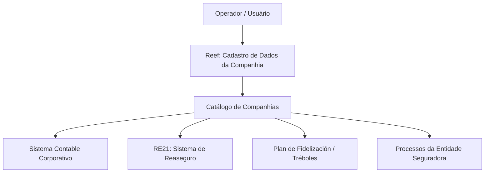

# Cadastro de Informações Específicas da Companhia — Reef / MAPFRE

## 1. Metadados do Documento
- **Arquivo de Origem:** Não identificado
- **Tipo de Documento:** Manual Operacional
- **Domínio / Sistema:** Reef / catálogo de companhias MAPFRE
- **Público-Alvo:** Operação, negócio e administradores funcionais
- **Data/Versão Identificada:** Não identificada

---

## 2. Resumo Executivo & Contexto de Negócio

O documento descreve a criação de informações específicas de uma companhia no catálogo de companhias do sistema Reef. O objetivo declarado é capturar, identificar, detalhar e classificar informações de âmbito operacional da companhia para que processos da entidade seguradora considerem, ou não, essas circunstâncias.

A funcionalidade apresentada disponibiliza a ação **CREAR** e orienta que os atributos do bloco “Datos Compañía” devem ser preenchidos em sequência visual, da esquerda para a direita e de cima para baixo. O conteúdo define dados cadastrais, monetários, contábeis, de resseguro, calendário operacional e programa de fidelização.

O cadastro contempla identificadores locais e corporativos, incluindo a identificação patronal conforme a legislação do país e a identificação societária contábil segundo diretrizes corporativas da MAPFRE. A identificação societária deve corresponder ao identificador da sociedade no Sistema Contable Corporativo.

Também são definidos parâmetros operacionais para a moeda de origem usada em mudanças cruzadas entre divisas, tratamento de sábados e domingos como dias festivos e regras de uso de Tréboles no Plano de Fidelización. O documento não detalha telas, permissões, validações técnicas, métodos de integração ou persistência dos dados.

---

## 3. Arquitetura, Componentes & Tecnologias Envolvidas

Os componentes e referências explicitamente citados são:

- **Reef:** sistema ou domínio documental no qual o catálogo de companhias é apresentado.
- **MAPFRE:** organização cujas diretrizes corporativas orientam a identificação societária.
- **Sistema Contable Corporativo:** sistema de referência para o identificador da sociedade.
- **RE21:** sistema de resseguro cujo código de entidade pode ser informado no catálogo.
- **Plan de Fidelización:** configuração operacional que define a moeda e limites de uso de Tréboles.
- **Tréboles:** unidade associada ao programa de fidelização, usada para obtenção e canje.
- **Mapfredocument:** referência documental exibida no conteúdo bruto.



> **Nota de Análise:** O documento cita Reef, Sistema Contable Corporativo, RE21 e Plan de Fidelización, mas não descreve interfaces, protocolos, métodos HTTP, contratos JSON, bases de dados ou mecanismos técnicos de integração.

---

## 4. Regras de Negócio, Especificações Funcionais & Processos

### Processo de criação de informações da companhia

1. Utilizar a ação habilitada **CREAR**.
2. Preencher os atributos do bloco **Datos Compañía**.
3. Seguir a sequência de captura definida visualmente: da esquerda para a direita e de cima para baixo.
4. Registrar dados de identificação, moeda, resseguro, calendário operacional e fidelização conforme a configuração local e as diretrizes corporativas aplicáveis.

### Regras e comportamentos identificados

- O **Código de la Compañía** identifica a chave da companhia.
- A **Abreviatura de la Compañía** permite identificar a companhia por uma abreviatura durante sua criação.
- A **Razón Social** corresponde ao nome sob o qual a entidade ou sociedade mercantil MAPFRE está registrada local e legalmente.
- A **Moneda** identifica no sistema o código ISO da moeda do país.
- A **Clave de Identificación Patronal** identifica, no catálogo de companhias, a chave de identificação patronal segundo a legislação do país da companhia.
- A **Clave de Identificación Societaria** identifica a chave de identificação contábil de acordo com as diretrizes corporativas da MAPFRE.
- O valor da **Clave de Identificación Societaria** deve ser o identificador da sociedade no **Sistema Contable Corporativo**.
- São apresentados como exemplos de identificador societário: `0002` para Mapfre España, `0233` para Mapfre Paraguay Seguros e `0378` para Mapfre Dominicana, S.A.
- A **Compañía Reaseguro Externa** identifica o código da entidade no sistema de resseguro **RE21**.
- Quando o check **Moneda Local Origen** é ativado, a moeda do país passa a ser a moeda de origem considerada internamente pela companhia para realizar mudanças cruzadas entre divisas.
- O campo **¿Sábados Laborables?** determina se os sábados serão considerados dias festivos ou não.
- O campo **¿Domingos Laborables?** determina se os domingos serão considerados dias festivos ou não.
- A **Moneda Programa de Fidelización (Tréboles)** identifica o código ISO da moeda usada para obter ou canjear Tréboles, conforme a configuração operacional local do Plano de Fidelização.
- O **Número Mínimo de Tréboles** define o número mínimo de Tréboles que um cliente deve possuir para realizar o canje.
- O **Número Máximo de Tréboles** define o número máximo de Tréboles que um cliente pode canjear no pagamento de recibos.
- O intervalo máximo de Tréboles pode permanecer aberto quando o dado não é informado.

---

## 5. Tabelas de Parâmetros, Ambientes e Estruturas de Dados

| Item / Parâmetro | Descrição / Função | Tipo / Valores / Formato | Ambiente / Observações |
| :--- | :--- | :--- | :--- |
| Ação habilitada | Permite criar informações específicas da companhia | `CREAR` | Única ação explicitamente apresentada |
| Código de la Compañía | Identifica a chave da companhia | Não especificado | Cadastro de companhia |
| Abreviatura de la Compañía | Identifica a companhia por abreviatura | Não especificado | Usada durante a criação da companhia |
| Razón Social | Informa o nome legal e localmente registrado da entidade ou sociedade mercantil MAPFRE | Não especificado | Cadastro de companhia |
| Moneda | Identifica o código ISO da moeda do país | Código ISO | Cadastro de companhia |
| Clave de Identificación Patronal | Identifica a chave patronal conforme legislação do país | Não especificado | Catálogo de companhias |
| Clave de Identificación Societaria | Identifica a chave contábil segundo diretrizes corporativas MAPFRE | Identificador da sociedade no Sistema Contable Corporativo | Exemplos: `0002`, `0233`, `0378` |
| `0002` | Identificador societário de exemplo | Código | Mapfre España |
| `0233` | Identificador societário de exemplo | Código | Mapfre Paraguay Seguros |
| `0378` | Identificador societário de exemplo | Código | Mapfre Dominicana, S.A. |
| Compañía Reaseguro Externa | Identifica o código da entidade no sistema de resseguro | Código da entidade | Sistema RE21 |
| Moneda Local Origen | Define a moeda do país como moeda de origem para mudanças cruzadas entre divisas | Check | Efeito condicionado à ativação do check |
| ¿Sábados Laborables? | Define se sábados são considerados dias festivos | Campo de decisão; valores não detalhados | Calendário operacional |
| ¿Domingos Laborables? | Define se domingos são considerados dias festivos | Campo de decisão; valores não detalhados | Calendário operacional |
| Moneda Programa de Fidelización (Tréboles) | Identifica a moeda usada para obter/canjear Tréboles | Código ISO | Conforme configuração local do Plan de Fidelización |
| Número Mínimo de Tréboles | Define o mínimo necessário para o cliente realizar canje | Número; formato não especificado | Programa de fidelização |
| Número Máximo de Tréboles | Define o máximo permitido para canje no pagamento de recibos | Número; pode não ser informado | Intervalo pode ficar aberto |

---

## 6. Bateria de Perguntas & Respostas para RAG (FAQ Sintético)

### P1: Qual é o objetivo do cadastro de informações específicas da companhia no Reef?
**R:** O cadastro existe para identificar, detalhar e classificar informações de âmbito operacional da companhia. Essas informações permitem que os processos da entidade seguradora considerem ou não circunstâncias específicas da companhia.

### P2: Qual ação está habilitada para cadastrar uma companhia?
**R:** A ação habilitada apresentada no documento é **CREAR**.

### P3: Em qual ordem os dados da companhia devem ser capturados?
**R:** Os atributos do bloco “Datos Compañía” devem seguir a sequência de captura da esquerda para a direita e de cima para baixo.

### P4: O que representa a Clave de Identificación Societaria?
**R:** A Clave de Identificación Societaria identifica a chave de identificação contábil conforme as diretrizes corporativas da MAPFRE. Seu valor deve ser o identificador da sociedade no Sistema Contable Corporativo.

### P5: Quais exemplos de identificadores societários são fornecidos?
**R:** O documento fornece `0002` para Mapfre España, `0233` para Mapfre Paraguay Seguros e `0378` para Mapfre Dominicana, S.A.

### P6: Para que serve o campo Compañía Reaseguro Externa?
**R:** O campo Compañía Reaseguro Externa identifica, no catálogo de definição das entidades, o código da entidade no sistema de resseguro RE21.

### P7: O que acontece ao ativar Moneda Local Origen?
**R:** Ao ativar o check Moneda Local Origen, a moeda do país passa a ser a moeda de origem que a companhia considera internamente para efetuar mudanças cruzadas entre divisas.

### P8: Como são tratados sábados e domingos no cadastro da companhia?
**R:** Os campos ¿Sábados Laborables? e ¿Domingos Laborables? identificam se sábados e domingos devem ou não ser considerados dias festivos. O documento não detalha os valores técnicos aceitos pelo campo.

### P9: Qual moeda deve ser informada no Programa de Fidelización (Tréboles)?
**R:** Deve ser informado o código ISO da moeda utilizada para obter ou canjear Tréboles, de acordo com a configuração operacional realizada localmente no Plan de Fidelización.

### P10: Qual é a regra para o Número Mínimo de Tréboles?
**R:** O Número Mínimo de Tréboles indica ao sistema a quantidade mínima de Tréboles estabelecida pela entidade para que um cliente possa realizar o canje.

### P11: O Número Máximo de Tréboles é obrigatório?
**R:** Não necessariamente. O documento informa que o intervalo pode permanecer aberto se o Número Máximo de Tréboles não for informado.

### P12: O documento define APIs ou contratos técnicos do cadastro de companhia?
**R:** Não. O conteúdo descreve campos e suas finalidades funcionais, mas não detalha APIs, métodos HTTP, contratos JSON, persistência de dados, autenticação ou permissões.

---

## 7. Glossário de Termos, Siglas & Conceitos-Chave

- **Reef:** Sistema ou domínio documental onde é apresentado o cadastro de informações específicas da companhia.
- **MAPFRE:** Organização referenciada nas regras de razão social e nas diretrizes corporativas de identificação societária.
- **Código ISO da Moeda:** Código ISO que identifica a moeda do país ou a moeda utilizada no programa de fidelização.
- **Clave de Identificación Patronal:** Chave de identificação patronal de acordo com a legislação do país da companhia.
- **Clave de Identificación Societaria:** Identificador contábil da sociedade conforme diretrizes corporativas MAPFRE.
- **Sistema Contable Corporativo:** Sistema de referência para o identificador da sociedade.
- **RE21:** Sistema de resseguro no qual é identificado o código da entidade.
- **Moneda Local Origen:** Opção que define a moeda do país como moeda de origem para mudanças cruzadas entre divisas.
- **Tréboles:** Unidade usada no programa de fidelização para obtenção e canje.
- **Plan de Fidelización:** Plano cuja configuração operacional local determina a moeda usada para Tréboles.
- **Canje:** Operação de troca ou resgate de Tréboles, inclusive no pagamento de recibos.
- **Recibos:** Itens de pagamento para os quais o canje de Tréboles pode ser utilizado.

---

## 8. Notas Críticas, Riscos & Limitações

- O arquivo de origem, a data, a versão e a identificação completa do documento não foram fornecidos.
- O conteúdo bruto termina após a palavra **“Ejemplo:”** e a abertura de um bloco de código, sem apresentar o exemplo mencionado.
- Os campos são descritos funcionalmente, mas não possuem tipos técnicos, tamanhos, obrigatoriedade, validações, mensagens de erro ou valores permitidos.
- Não há especificação de permissões para a ação **CREAR**.
- Não são descritas integrações técnicas, sincronização, frequência de atualização ou comportamento de falha envolvendo Sistema Contable Corporativo, RE21 ou Plan de Fidelización.
- Não há detalhamento adicional sobre a semântica de “dias festivos” nos campos de sábados e domingos.
- **Nota de Análise:** O documento lista sistemas de referência, mas não detalha métodos HTTP, contratos JSON, endpoints, rotas de log ou mecanismos de autenticação.

---

## 9. Conteúdo Bruto Estruturado (Referência Fiel)

```text
--- [PÁGINA 1 DE 2] ---

CREAR Información especíca de la Compañía
Objetivo
La captura de la información en esta Estructura obedece a la necesidad de identicar y detallar la información de ámbito operativo de la
Compañía además de clasicarla adecuadamente para poder contemplar o no esta circunstancia en los procesos de la entidad Aseguradora
que así lo demanden.
Acciones habilitadas
 CREAR ( )
Datos Compañía
De Izquierda a Derecha y de Arriba hacia Abajo, los siguientes atributos marcan la secuencia de captura en este Bloque de Información.
Código de la Compañía ( )
Este Campo identica la clave de la Compañía.
Abreviatura de la Compañía ( )
Este dato en la creación de la Compañía contiene la abreviatura por la que se puede identicar.
Razón Social ( )
Este dato en la creación de la compañía indicará el nombre con que la entidad o sociedad mercantil MAPFRE está registrada local y
legalmente.
Moneda (  )
Este dato identica en el sistema el código ISO de la Moneda del país.
Clave de Identicación Patronal ( )
Documentation / DOCUMENTACIÓN Reef
DOCUMENTACIÓN Reef
Mapfredocument
DOCUMENTACIÓN Reef
Owner
user:agonzalez_mapfre.com
Lifecycle
Approved Source
 / 
 VL
Buscar Inicio Soluciones Arquitecturas APIs Componentes Cloud Documentación Zeus Reef Ayuda
ES

--- [PÁGINA 2 DE 2] ---

Este atributo sirve para identicar en el catálogo de compañías la clave de identicación patronal de acuerdo con la legislación del país en el
que se ubica la compañía.
Clave de Identicación Societaria ( )
Este atributo sirve para identicar la clave de identicación contable de acuerdo con las directrices Corporativas de MAPFRE.
Su valor debe ser el identicador de la sociedad en el sistema Contable Corporativo como por ejemplo: 0002 (Mapfre España), 0233
(Mapfre Paraguay Seguros), 0378 (Mapfre Dominicana, S.A.), ...
Compañía Reaseguro Externa ( )
Este atributo del catálogo de denición de las entidades, identica en el sistema el código de la entidad en el sistema de Reaseguro RE21.*
Moneda Local Origen ( )
Si activamos el Check de este Campo, se determina que la Moneda del País va a ser la Moneda Origen que la Compañía va a considerar
internamente para efectuar cambios cruzados entre divisas.
¿Sábados Laborables? ( )
Este campo identica si los sábados van a considerarse o no días como días festivos.
¿Domingos Laborables? ( )
Este campo identica si los domingos van a considerarse o no días como días festivos.
Moneda Programa de Fidelización (Tréboles) (  )
Este campo identica en el sistema el código ISO de la moneda usada para obtener/canjear Tréboles de acuerdo con la conguración
operativa realizada localmente en el Plan de Fidelización
Número Mínimo de Tréboles ( )
Este dato en la denición de las compañías le indica al Sistema el número mínimo de tréboles que la entidad ha establecido para que un
Cliente pueda realizar el canje de los mismos.
Número Máximo de Tréboles ( )
Este atributo en el catálogo de denición de compañías le indica al Sistema el número máximo de tréboles que la entidad establece para que
un Cliente pueda canjearlos en el pago de sus recibos, pudiendo quedar abierto este rango si el dato no se informa.
Ejemplo:
```
