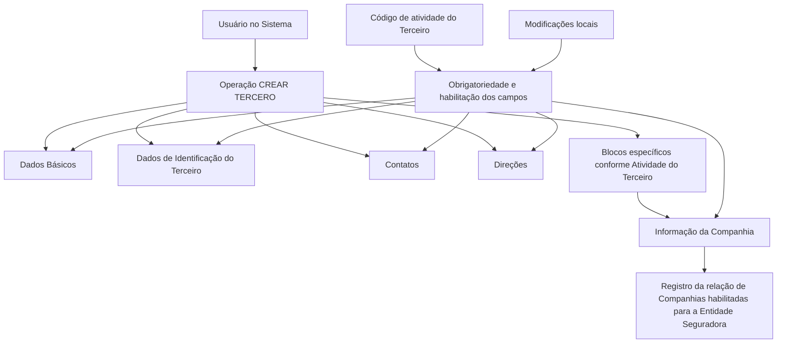

# Operação Criar Companhia — Registro de Companhias para Entidade Seguradora

## 1. Metadados do Documento
- **Arquivo de Origem:** Não identificado no conteúdo extraído.
- **Tipo de Documento:** Procedimento.
- **Domínio / Sistema:** Sistema de Terceiros / Companhias; documentação Reef; referência a Mapfre.
- **Público-Alvo:** Usuários do sistema, operação e analistas funcionais.
- **Data/Versão Identificada:** Não identificada.

---

## 2. Resumo Executivo & Contexto de Negócio

O documento descreve a operação **“Crear Compañía”**, destinada a registrar no Sistema a relação de Companhias habilitadas para uma Entidade Seguradora. A operação está inserida no processo de criação de um Terceiro, complementando blocos de informações compartilhados com informações específicas da Companhia.

A premissa principal determina que Companhias de uma Entidade Seguradora devem ser sempre criadas como **Pessoas Jurídicas**. O processo envolve o preenchimento de dados básicos, identificação, contatos, direções e informações específicas da Companhia.

A obrigatoriedade e a habilitação de campos podem variar conforme o código de atividade do Terceiro. O documento também informa que modificações implementadas localmente podem afetar o comportamento da aplicação, especialmente quanto à obrigatoriedade do registro de Dados do Terceiro.

A sequência de captura de dados nos blocos de informação não é fixa: ela pode variar segundo o critério do Usuário no Sistema. O conteúdo aponta para documentação Reef, identificada como aprovada e associada ao proprietário `user:agonzalez_mapfre.com`.

---

## 3. Arquitetura, Componentes & Tecnologias Envolvidas

Os elementos explicitamente citados no documento são:

- **Sistema:** ambiente onde a relação de Companhias habilitadas é registrada.
- **Operação CREAR TERCERO:** processo base para criação do Terceiro.
- **Operação CREAR COMPAÑÍA:** processo de criação de informações de uma Companhia.
- **Blocos de Informação Compartidos:** Dados Básicos, Dados de Identificação do Terceiro, Contatos e Direções.
- **Bloco de Informação Específico:** Informação da Companhia, aplicável conforme a atividade do Terceiro.
- **Reef:** repositório ou contexto de documentação citado no exemplo.
- **Mapfre:** referência presente na navegação e no identificador do proprietário da documentação.
- **Zeus, Cloud, APIs, Componentes e Arquiteturas:** itens citados na navegação da plataforma documental, sem detalhamento funcional no conteúdo extraído.



> **Nota de Análise:** O conteúdo não descreve tecnologias de implementação, interfaces, métodos HTTP, contratos JSON, banco de dados, URLs de ambiente ou integrações entre serviços.

---

## 4. Regras de Negócio, Especificações Funcionais & Processos

### Objetivo da operação

A operação **Crear Compañía** permite registrar no Sistema a relação de Companhias habilitadas para a Entidade Seguradora.

### Premissas e regras de criação

1. As Companhias de uma Entidade Seguradora devem ser criadas sempre como **Pessoas Jurídicas**.
2. A obrigatoriedade de preenchimento e/ou a habilitação de campos pode variar para cada bloco ou estrutura de informação compartilhada.
3. A variação de obrigatoriedade e habilitação está relacionada ao **código de atividade do Terceiro**.
4. Modificações implementadas localmente podem afetar o comportamento da aplicação em relação à obrigatoriedade do registro dos Dados do Terceiro.
5. A ordem de captura de dados nos diferentes blocos de informação pode variar conforme o critério do Usuário no Sistema.
6. A criação da Companhia é composta por blocos compartilhados do processo **CREAR TERCERO** e por um bloco específico denominado **Información de la Compañía**.
7. Os blocos específicos devem ser considerados de acordo com a atividade do Terceiro.

### Fluxo funcional identificado

1. O Usuário inicia o processo **CREAR TERCERO**.
2. O Usuário registra a informação necessária para criação da Companhia.
3. O Usuário preenche os blocos de informação compartilhados:
   - Dados Básicos;
   - Dados de Identificação do Terceiro;
   - Contatos;
   - Direções.
4. O Usuário preenche os blocos específicos aplicáveis conforme a atividade do Terceiro.
5. O Usuário registra a **Informação da Companhia**.
6. O Sistema mantém a relação de Companhias habilitadas para a Entidade Seguradora.

> **Nota de Análise:** O documento não apresenta campos concretos, validações por código de atividade, lista de atividades, regras de persistência, mensagens de erro ou critérios explícitos para considerar uma Companhia “habilitada”.

---

## 5. Tabelas de Parâmetros, Ambientes e Estruturas de Dados

| Item / Parâmetro | Descrição / Função | Tipo / Valores / Formato | Ambiente / Observações |
| :--- | :--- | :--- | :--- |
| Operação Crear Compañía | Registra no Sistema a relação de Companhias habilitadas para a Entidade Seguradora. | Operação funcional. | Detalhes de interface não informados. |
| Companhia | Entidade registrada pela operação Crear Compañía. | Deve ser Pessoa Jurídica. | Associada a uma Entidade Seguradora. |
| Entidade Seguradora | Entidade para a qual são registradas Companhias habilitadas. | Entidade de negócio. | Não há identificação nominal no conteúdo. |
| Tercero | Entidade criada no processo base CREAR TERCERO. | Entidade de cadastro. | O código de atividade do Terceiro influencia campos. |
| Código de atividade do Tercero | Critério que pode determinar obrigatoriedade ou habilitação de campos. | Código não detalhado. | Valores possíveis não informados. |
| Dados Básicos | Bloco compartilhado de informações no processo CREAR TERCERO. | Bloco de informação. | Campos não detalhados. |
| Dados de Identificação do Tercero | Bloco compartilhado para identificação do Terceiro. | Bloco de informação. | Campos não detalhados. |
| Contatos | Bloco compartilhado do processo CREAR TERCERO. | Bloco de informação. | Campos não detalhados. |
| Direções | Bloco compartilhado do processo CREAR TERCERO. | Bloco de informação. | Campos não detalhados. |
| Informação da Companhia | Bloco específico para registrar dados da Companhia. | Bloco de informação específico. | Aplicável conforme a atividade do Terceiro. |
| Modificações locais | Alterações locais que podem afetar o comportamento da aplicação. | Modificações não especificadas. | Podem influenciar obrigatoriedade dos Dados do Terceiro. |
| Ordem de captura | Sequência de preenchimento dos blocos de informação. | Variável. | Pode variar segundo o critério do Usuário. |
| Documentación Reef | Referência de documentação exibida no exemplo. | Recurso documental. | Apresenta status “Approved Source”. |
| Owner | Proprietário identificado na documentação Reef. | `user:agonzalez_mapfre.com` | Associado ao exemplo documental. |
| Lifecycle | Estado de ciclo de vida exibido. | `Approved Source` | Não há definição adicional no conteúdo. |
| Idioma | Idioma exibido na navegação documental. | `ES` | Sem informações adicionais. |

---

## 6. Bateria de Perguntas & Respostas para RAG (FAQ Sintético)

### P1: Qual é o objetivo da operação Crear Compañía?
**R:** A operação Crear Compañía permite registrar no Sistema a relação de Companhias habilitadas para uma Entidade Seguradora.

### P2: Como as Companhias de uma Entidade Seguradora devem ser criadas?
**R:** As Companhias de uma Entidade Seguradora devem ser sempre criadas como Pessoas Jurídicas.

### P3: Quais blocos de informação compartilhados fazem parte do processo CREAR TERCERO?
**R:** Os blocos de informação compartilhados identificados são Dados Básicos, Dados de Identificação do Terceiro, Contatos e Direções.

### P4: Qual bloco específico deve ser preenchido na criação de uma Companhia?
**R:** O bloco específico identificado é Informação da Companhia. O documento o apresenta como parte dos blocos específicos aplicáveis de acordo com a atividade do Terceiro.

### P5: O código de atividade do Terceiro influencia o cadastro?
**R:** Sim. A obrigatoriedade e/ou a habilitação dos campos no registro de dados dos blocos ou estruturas de informação compartilhadas pode variar de acordo com o código de atividade do Terceiro.

### P6: Modificações locais podem alterar o comportamento da aplicação?
**R:** Sim. O documento informa que modificações implementadas localmente podem afetar o comportamento da aplicação quanto à obrigatoriedade do registro dos Dados do Terceiro.

### P7: Existe uma sequência obrigatória para preencher os blocos de informação?
**R:** Não há uma sequência fixa descrita. A ordem de captura dos dados nos distintos blocos de informação pode variar conforme o critério seguido pelo Usuário no Sistema.

### P8: A operação Crear Compañía é independente da criação de Terceiro?
**R:** Não. O fluxo apresentado associa a criação da Companhia ao processo CREAR TERCERO, utilizando blocos compartilhados desse processo e adicionando o bloco específico Informação da Companhia.

### P9: O documento detalha quais campos devem ser preenchidos em Dados Básicos, Contatos ou Direções?
**R:** Não. O documento identifica os blocos de informação, mas não detalha os campos, seus formatos, valores permitidos ou validações específicas.

### P10: O documento informa como uma Companhia é considerada habilitada?
**R:** Não. O documento afirma que a operação registra a relação de Companhias habilitadas para a Entidade Seguradora, mas não fornece critérios, estados, regras de aprovação ou validações para habilitação.

### P11: Qual documentação é citada como exemplo no conteúdo extraído?
**R:** O exemplo referencia “Documentation / DOCUMENTACIÓN Reef”, com Owner `user:agonzalez_mapfre.com` e Lifecycle `Approved Source`.

### P12: O conteúdo informa APIs, URLs, microsserviços ou contratos de integração?
**R:** Não. Embora a navegação cite APIs, Componentes, Cloud, Arquiteturas e Zeus, o conteúdo não detalha endpoints, métodos, URLs, contratos, tecnologias ou integrações.

---

## 7. Glossário de Termos, Siglas & Conceitos-Chave

- **CREAR COMPAÑÍA:** Operação para registrar a relação de Companhias habilitadas para uma Entidade Seguradora.
- **CREAR TERCERO:** Processo base de criação do Terceiro, contendo blocos de informação compartilhados.
- **Compañía / Companhia:** Entidade cadastrada para uma Entidade Seguradora; deve ser criada como Pessoa Jurídica.
- **Entidad Aseguradora / Entidade Seguradora:** Entidade para a qual são mantidas Companhias habilitadas.
- **Tercero / Terceiro:** Entidade de cadastro cujo código de atividade pode influenciar a obrigatoriedade ou habilitação de campos.
- **Persona Jurídica / Pessoa Jurídica:** Natureza obrigatória para Companhias de uma Entidade Seguradora.
- **Bloques de Información Compartidos:** Conjunto de blocos reutilizados no processo CREAR TERCERO: Dados Básicos, Identificação, Contatos e Direções.
- **Información de la Compañía:** Bloco de informação específico da Companhia.
- **Reef:** Nome presente na referência de documentação; o significado da sigla ou produto não é definido no conteúdo.
- **Mapfre:** Termo presente na navegação e no identificador do Owner; a relação organizacional não é detalhada.
- **Lifecycle:** Rótulo exibido para o ciclo de vida da documentação, com valor `Approved Source`.
- **Zeus:** Item de navegação citado sem definição funcional.
- **ES:** Indicador de idioma exibido na navegação documental.

---

## 8. Notas Críticas, Riscos & Limitações

- O texto extraído apresenta caracteres corrompidos em termos como `modicaciones`, `especícos` e `Identicación`; o significado foi preservado conforme o contexto textual.
- Não foram identificados nome de arquivo, data, versão, autor formal ou histórico de alterações.
- Não há detalhamento de campos, formatos, tipos de dado, valores obrigatórios, listas de códigos de atividade ou regras de habilitação da Companhia.
- Não há descrição de telas, permissões, perfis de acesso, mensagens de erro, integrações, APIs, banco de dados, logs ou ambientes.
- Modificações locais podem alterar a obrigatoriedade do registro dos Dados do Terceiro, criando risco de comportamento diferente entre instalações ou contextos locais.
- A ordem de preenchimento pode variar conforme o Usuário, mas o documento não explicita dependências entre blocos nem validações condicionais.
- O documento cita Reef, Mapfre, Zeus, Cloud, APIs e Componentes apenas na navegação ou no exemplo documental, sem detalhamento adicional.

---

## 9. Conteúdo Bruto Estruturado (Referência Fiel)

```text
--- [PÁGINA 1 DE 1] ---

OPERACIÓN CREAR Compañía
¿En que consiste?
Esta operación permite registrar en el Sistema la relación de Compañías habilitadas para la Entidad Aseguradora.
Premisas
Las Compañías de la Entidad Aseguradora siempre se crearán como Personas Jurídicas.
La obligatoriedad y/o la habilitación de los campos en el registro de los datos de cada uno de los bloques o estructuras de información
compartidas puede variar de acuerdo con el código de actividad del Tercero:
Las modicaciones que se hubieran podido implementar localmente a su vez pueden afectar el comportamiento de la aplicación en
relación con la obligatoriedad en el registro de los Datos del Tercero.
Por último, el orden de captura de los datos en los distintos bloques de Información puede variar de acuerdo con el criterio seguido por el
Usuario en el Sistema.
Proceso
CREAR
TERCERO
Crear Información de
la Compañía
Bloques de Información Compartidos (CREAR TERCERO)
 Datos Básicos ( )
 Datos Identicación del Tercero ( )
 Contactos ( )
 Direcciones ( )
Bloques de Información Especícos de acuerdo con la Actividad del Tercero.
 Información de la Compañía ( )
Ejemplo:
Documentation / DOCUMENTACIÓN Reef
DOCUMENTACIÓN Reef
Mapfredocument
DOCUMENTACIÓN Reef
Owner
user:agonzalez_mapfre.com
Lifecycle
Approved Source
 / 
 VL
Buscar Inicio Soluciones Arquitecturas APIs Componentes Cloud Documentación Zeus Reef Ayuda
ES
```
