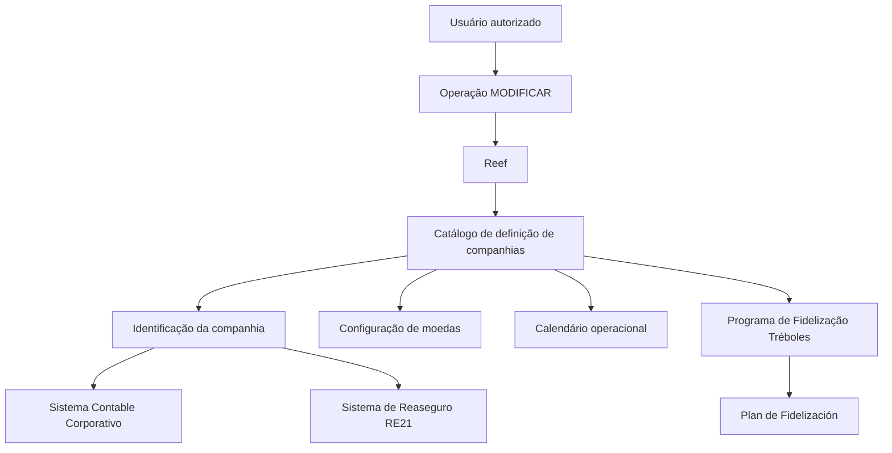

# Operação de Modificação de Informações Específicas da Companhia no Reef

## 1. Metadados do Documento
- **Arquivo de Origem:** Não identificado no conteúdo extraído
- **Tipo de Documento:** Manual Operacional
- **Domínio / Sistema:** Reef / catálogo de definição de companhias MAPFRE
- **Público-Alvo:** Operação, negócio, administradores funcionais e desenvolvedores
- **Data/Versão Identificada:** Não identificada

---

## 2. Resumo Executivo & Contexto de Negócio

O documento descreve a operação **MODIFICAR Información específica de la Compañía**, cuja finalidade é alterar informações cadastradas para uma companhia no sistema Reef. A operação está relacionada ao bloco funcional **Datos Compañía**, apresentado como uma sequência de captura de atributos.

A documentação caracteriza o **Código de la Compañía** como a chave identificadora da companhia e determina que esse valor não pode ser modificado. Os demais atributos apresentados abrangem identificação corporativa, identificação local e contábil, moedas, integração com resseguro e regras de calendário operacional.

O cadastro de companhia atende necessidades corporativas da MAPFRE, incluindo a identificação legal local da entidade, a identificação patronal conforme legislação do país e a identificação societária conforme diretrizes corporativas. A identificação societária deve corresponder ao identificador da sociedade no **Sistema Contable Corporativo**.

O documento também descreve parâmetros para operações envolvendo moedas e o programa de fidelização **Tréboles**. Esses parâmetros definem a moeda utilizada para obtenção e resgate de Tréboles, bem como limites mínimos e máximos para que clientes possam realizar resgates.

---

## 3. Arquitetura, Componentes & Tecnologias Envolvidas

O conteúdo extraído menciona os seguintes sistemas, domínios e componentes:

- **Reef:** sistema no qual a operação de modificação de informações da companhia é realizada.
- **Catálogo de definição de companhias:** catálogo que contém atributos de definição das entidades/companhias.
- **MAPFRE:** contexto corporativo das entidades e diretrizes de identificação societária.
- **Sistema Contable Corporativo:** sistema de referência para o identificador da sociedade.
- **RE21:** sistema de resseguro cuja entidade é identificada pelo atributo **Compañía Reaseguro Externa**.
- **Plan de Fidelización:** configuração operacional local que determina a moeda utilizada para obter ou resgatar Tréboles.
- **Mapfredocument / Documentación Reef:** referências de documentação e navegação exibidas no conteúdo bruto.



**Nota de Análise:** o documento não detalha métodos HTTP, APIs, contratos JSON, banco de dados, mecanismos de autenticação, permissões específicas, nem integrações técnicas entre Reef, RE21 e o Sistema Contable Corporativo.

---

## 4. Regras de Negócio, Especificações Funcionais & Processos

### Operação habilitada

A ação habilitada no documento é:

- **MODIFICAR:** permite modificar informações da companhia.

### Sequência de captura

O documento determina que os atributos do bloco **Datos Compañía** devem ser considerados na sequência visual de captura:

1. Da esquerda para a direita.
2. De cima para baixo.

### Regras por atributo

1. **Código de la Compañía**
   - Identifica a chave da companhia.
   - A chave da companhia não pode ser modificada.

2. **Abreviatura de la Compañía**
   - Na criação da companhia, armazena a abreviação pela qual a companhia pode ser identificada.

3. **Razón Social**
   - Na criação da companhia, informa o nome sob o qual a entidade ou sociedade mercantil MAPFRE está registrada local e legalmente.

4. **Moneda**
   - Identifica no sistema o código ISO da moeda do país.

5. **Clave de Identificación Patronal**
   - Identifica, no catálogo de companhias, a chave de identificação patronal.
   - A identificação patronal deve estar de acordo com a legislação do país em que a companhia está localizada.

6. **Clave de Identificación Societaria**
   - Identifica a chave de identificação contábil segundo as diretrizes corporativas da MAPFRE.
   - O valor deve ser o identificador da sociedade no Sistema Contable Corporativo.
   - O documento fornece os exemplos `0002` para Mapfre España, `0233` para Mapfre Paraguay Seguros e `0378` para Mapfre Dominicana, S.A.

7. **Compañía Reaseguro Externa**
   - Identifica no sistema o código da entidade no sistema de resseguro RE21.

8. **Moneda Local Origen**
   - Quando o check do campo é ativado, a moeda do país passa a ser a moeda de origem considerada internamente pela companhia para realizar mudanças cruzadas entre divisas.

9. **¿Sábados Laborables?**
   - Define se sábados serão considerados ou não como dias festivos.

10. **¿Domingos Laborables?**
    - Define se domingos serão considerados ou não como dias festivos.

11. **Moneda Programa de Fidelización (Tréboles)**
    - Identifica o código ISO da moeda usada para obter ou resgatar Tréboles.
    - A moeda deve estar de acordo com a configuração operacional local realizada no Plan de Fidelización.

12. **Número Mínimo de Tréboles**
    - Define a quantidade mínima de Tréboles que um cliente deve possuir para realizar o resgate.

13. **Número Máximo de Tréboles**
    - Define a quantidade máxima de Tréboles que um cliente pode resgatar no pagamento de recibos.
    - O intervalo máximo pode permanecer aberto quando o valor não for informado.

---

## 5. Tabelas de Parâmetros, Ambientes e Estruturas de Dados

| Item / Parâmetro | Descrição / Função | Tipo / Valores / Formato | Ambiente / Observações |
| :--- | :--- | :--- | :--- |
| Operação | Modificar informações específicas da companhia | `MODIFICAR` | Operação habilitada no Reef |
| Código de la Compañía | Identifica a chave da companhia | Não especificado | Não pode ser modificado |
| Abreviatura de la Compañía | Abreviação pela qual a companhia pode ser identificada | Não especificado | Associada à criação da companhia |
| Razón Social | Nome sob o qual a entidade ou sociedade mercantil MAPFRE está registrada local e legalmente | Não especificado | Associada à criação da companhia |
| Moneda | Código ISO da moeda do país | Código ISO de moeda | Identificado no sistema |
| Clave de Identificación Patronal | Chave de identificação patronal da companhia | Não especificado | Deve respeitar a legislação do país da companhia |
| Clave de Identificación Societaria | Chave de identificação contábil da sociedade | Identificador de sociedade | Deve corresponder ao Sistema Contable Corporativo |
| Identificador societário `0002` | Identificador de sociedade | `0002` | Mapfre España |
| Identificador societário `0233` | Identificador de sociedade | `0233` | Mapfre Paraguay Seguros |
| Identificador societário `0378` | Identificador de sociedade | `0378` | Mapfre Dominicana, S.A. |
| Compañía Reaseguro Externa | Código da entidade no sistema de resseguro | Não especificado | Sistema de Reaseguro RE21 |
| Moneda Local Origen | Determina a moeda de origem para mudanças cruzadas entre divisas | Check / indicador de ativação | Quando ativado, usa a moeda do país |
| ¿Sábados Laborables? | Define o tratamento de sábados como dias festivos | Não especificado | Calendário operacional |
| ¿Domingos Laborables? | Define o tratamento de domingos como dias festivos | Não especificado | Calendário operacional |
| Moneda Programa de Fidelización (Tréboles) | Código ISO da moeda utilizada para obter ou resgatar Tréboles | Código ISO de moeda | Conforme configuração local do Plan de Fidelización |
| Número Mínimo de Tréboles | Quantidade mínima para um cliente realizar resgate | Número | Regra de elegibilidade para resgate |
| Número Máximo de Tréboles | Quantidade máxima resgatável no pagamento de recibos | Número ou não informado | O intervalo pode permanecer aberto se não houver valor informado |

---

## 6. Bateria de Perguntas & Respostas para RAG (FAQ Sintético)

### P1: Qual é a finalidade da operação MODIFICAR no Reef?
**R:** A operação **MODIFICAR** permite modificar informações específicas de uma companhia no bloco funcional **Datos Compañía** do sistema Reef.

### P2: O Código de la Compañía pode ser alterado durante a modificação da companhia?
**R:** Não. O documento estabelece que o **Código de la Compañía** identifica a chave da companhia e que essa chave não pode ser modificada.

### P3: Como deve ser preenchida a Clave de Identificación Societaria?
**R:** A **Clave de Identificación Societaria** deve conter o identificador da sociedade no **Sistema Contable Corporativo**, conforme as diretrizes corporativas da MAPFRE. O documento exemplifica os valores `0002` para Mapfre España, `0233` para Mapfre Paraguay Seguros e `0378` para Mapfre Dominicana, S.A.

### P4: Para que serve a Clave de Identificación Patronal?
**R:** A **Clave de Identificación Patronal** identifica, no catálogo de companhias, a chave de identificação patronal conforme a legislação do país onde a companhia está localizada.

### P5: Qual sistema é referenciado pelo campo Compañía Reaseguro Externa?
**R:** O campo **Compañía Reaseguro Externa** identifica no sistema o código da entidade no sistema de resseguro **RE21**.

### P6: O que acontece quando Moneda Local Origen é ativada?
**R:** Quando o check de **Moneda Local Origen** é ativado, a moeda do país passa a ser a moeda de origem considerada internamente pela companhia para efetuar mudanças cruzadas entre divisas.

### P7: Como são definidos sábados e domingos laboráveis?
**R:** Os campos **¿Sábados Laborables?** e **¿Domingos Laborables?** definem se sábados e domingos serão considerados ou não como dias festivos.

### P8: Qual moeda deve ser usada no Programa de Fidelización (Tréboles)?
**R:** O campo **Moneda Programa de Fidelización (Tréboles)** deve identificar o código ISO da moeda usada para obter ou resgatar Tréboles, segundo a configuração operacional local do **Plan de Fidelización**.

### P9: Qual é a regra para o Número Mínimo de Tréboles?
**R:** O **Número Mínimo de Tréboles** define a quantidade mínima de Tréboles que um cliente deve possuir para poder realizar o resgate.

### P10: Como funciona o Número Máximo de Tréboles?
**R:** O **Número Máximo de Tréboles** define o limite máximo de Tréboles que um cliente pode resgatar no pagamento de seus recibos. Esse intervalo pode permanecer aberto quando o valor não for informado.

### P11: Em que ordem os atributos do bloco Datos Compañía devem ser capturados?
**R:** Os atributos devem seguir a sequência visual indicada no documento: da esquerda para a direita e de cima para baixo.

### P12: O documento especifica APIs ou contratos JSON para a operação de modificação da companhia?
**R:** Não. O documento descreve atributos funcionais e regras de cadastro, mas não apresenta métodos HTTP, APIs, contratos JSON, endpoints ou estruturas de persistência.

---

## 7. Glossário de Termos, Siglas & Conceitos-Chave

- **Reef:** sistema mencionado como contexto da documentação e da operação de modificação de companhia.
- **MAPFRE:** organização corporativa referenciada nas regras de registro legal e nas diretrizes corporativas de identificação societária.
- **RE21:** sistema de resseguro referenciado pelo campo **Compañía Reaseguro Externa**.
- **Sistema Contable Corporativo:** sistema corporativo de referência para o identificador da sociedade.
- **Plan de Fidelización:** plano cuja configuração operacional local define a moeda usada para obtenção e resgate de Tréboles.
- **Tréboles:** unidade associada ao programa de fidelização, passível de obtenção e resgate.
- **Razón Social:** nome legal e localmente registrado da entidade ou sociedade mercantil MAPFRE.
- **Moneda Local Origen:** indicador que faz a moeda do país ser considerada a moeda de origem para mudanças cruzadas entre divisas.
- **Código ISO de moneda:** código ISO usado para identificar moedas no sistema.
- **Recibos:** pagamentos nos quais Tréboles podem ser utilizados conforme o limite máximo definido.

---

## 8. Notas Críticas, Riscos & Limitações

- O texto extraído não identifica o nome do arquivo de origem, data, versão, autor técnico ou responsáveis pela manutenção da operação.
- O documento não especifica perfis de acesso, permissões, mecanismos de aprovação ou auditoria para a ação **MODIFICAR**.
- Não há detalhamento de validações de formato, obrigatoriedade, tamanho de campo, tipos de dados ou mensagens de erro para os atributos.
- Não são documentados os fluxos técnicos de sincronização entre Reef, RE21, Sistema Contable Corporativo e Plan de Fidelización.
- O documento menciona um exemplo após **Número Máximo de Tréboles**, mas o conteúdo do exemplo não está presente na extração fornecida.
- Não há detalhamento adicional sobre como os campos de sábados e domingos são aplicados a calendários, vencimentos, cálculos ou processos operacionais.

---

## 9. Conteúdo Bruto Estruturado (Referência Fiel)

```text
--- [PÁGINA 1 DE 2] ---

MODIFICAR Información especíca de la Compañía
Objetivo
Esta Operación permite Modicar la información de la Compañía.
Acciones habilitadas
 MODIFICAR ( )
Datos Compañía
De Izquierda a Derecha y de Arriba hacia Abajo, los siguientes atributos marcan la secuencia de captura en este Bloque de Información.
Código de la Compañía
Este Campo identica la clave de la Compañía, clave que no podrá modicarse.
Abreviatura de la Compañía ( )
Este dato en la creación de la Compañía contiene la abreviatura por la que se puede identicar.
Razón Social ( )
Este dato en la creación de la compañía indicará el nombre con que la entidad o sociedad mercantil MAPFRE está registrada local y
legalmente.
Moneda (  )
Este dato identica en el sistema el código ISO de la Moneda del país.
Clave de Identicación Patronal ( )
Este atributo sirve para identicar en el catálogo de compañías la clave de identicación patronal de acuerdo con la legislación del país en el
que se ubica la compañía.
Documentation / DOCUMENTACIÓN Reef
DOCUMENTACIÓN Reef
Mapfredocument
DOCUMENTACIÓN Reef
Owner
user:agonzalez_mapfre.com
Lifecycle
Approved Source
 / 
 VL
Buscar Inicio Soluciones Arquitecturas APIs Componentes Cloud Documentación Zeus Reef Ayuda
ES


--- [PÁGINA 2 DE 2] ---

Clave de Identicación Societaria ( )
Este atributo sirve para identicar la clave de identicación contable de acuerdo con las directrices Corporativas de MAPFRE.
Su valor debe ser el identicador de la sociedad en el sistema Contable Corporativo: 0002 (Mapfre España), 0233 (Mapfre Paraguay
Seguros), 0378 (Mapfre Dominicana, S.A.), ...
Compañía Reaseguro Externa ( )
Este atributo del catálogo de denición de las entidades, identica en el sistema el código de la entidad en el sistema de Reaseguro RE21.
Moneda Local Origen ( )
Si activamos el Check de este Campo, se determina que la Moneda del País va a ser la Moneda Origen que la Compañía va a considerar
internamente para efectuar cambios cruzados entre divisas.
¿Sábados Laborables? ( )
Este campo identica si los sábados van a considerarse o no días como días festivos.
¿Domingos Laborables? ( )
Este campo identica si los domingos van a considerarse o no días como días festivos.
Moneda Programa de Fidelización (Tréboles) (  )
Este campo identica en el sistema el código ISO de moneda usada para obtener/canjear Tréboles de acuerdo con la conguración operativa
realizada localmente en el Plan de Fidelización
Número Mínimo de Tréboles ( )
Este dato en la denición de las compañías le indica al Sistema el número mínimo de tréboles que la entidad establece ha de tener un Cliente
para que éste pueda realizar el canje de los mismos.
Número Máximo de Tréboles ( )
Este atributo en el catálogo de denición de compañías le indica al Sistema el número máximo de tréboles que la entidad establece para que
un Cliente pueda canjearlos en el pago de sus recibos, pudiendo quedar abierto este rango si el dato no se informa.
Ejemplo:
```
