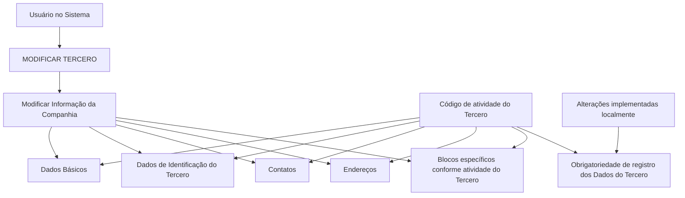

# Operación Modificar Compañía — Gestión de Información de Terceros

## 1. Metadados do Documento
- **Arquivo de Origem:** Não identificado no conteúdo fornecido
- **Tipo de Documento:** Procedimento
- **Domínio / Sistema:** Reef / Mapfre — operação “MODIFICAR TERCERO”
- **Público-Alvo:** Usuários do sistema, Operação, Negócio
- **Data/Versão Identificada:** Não identificada

---

## 2. Resumo Executivo & Contexto de Negócio

O documento descreve a operação **MODIFICAR Compañía**, destinada a complementar, modificar e/ou inabilitar informações de uma Companhia presente em estruturas de dados que armazenam e agrupam esses dados. A operação está inserida no contexto de gestão de informações de um **Tercero** no sistema.

A obrigatoriedade de preenchimento e a habilitação dos campos não são estáticas. Esses comportamentos podem variar conforme o **código de atividade do Tercero**, o que exige que o usuário considere a classificação de atividade ao modificar informações cadastrais.

O conteúdo também informa que alterações implementadas localmente podem impactar o comportamento da aplicação, particularmente quanto à obrigatoriedade de registro dos dados do Tercero. O documento não detalha quais alterações locais existem, como são implantadas ou quais campos específicos são afetados.

O processo prevê a modificação de informações por blocos compartilhados — Dados Básicos, Identificação do Tercero, Contatos e Endereços — além de blocos específicos definidos conforme a atividade do Tercero. A ordem de captura dos dados pode variar segundo o critério adotado pelo usuário no sistema.

---

## 3. Arquitetura, Componentes & Tecnologias Envolvidas

Os elementos identificados no conteúdo são:

| Componente / Elemento | Papel identificado |
| :--- | :--- |
| Operação **MODIFICAR Compañía** | Complementa, modifica e/ou inabilita informações da Companhia. |
| Operação **MODIFICAR TERCERO** | Contexto operacional que agrupa blocos de informação compartilhados. |
| Tercero | Entidade cujos dados e código de atividade influenciam os campos aplicáveis. |
| Companhia | Entidade cuja informação pode ser modificada dentro do processo. |
| Blocos de Informação Compartilhados | Agrupamentos de Dados Básicos, Identificação do Tercero, Contatos e Endereços. |
| Blocos de Informação Específicos | Agrupamentos aplicáveis de acordo com a atividade do Tercero. |
| Reef / DOCUMENTACIÓN Reef | Repositório ou área de documentação mencionada no exemplo. |
| Mapfredocument | Nome exibido na navegação do ambiente documental. |
| Zeus | Item exibido na navegação do ambiente documental. |



> **Nota de Análise:** O conteúdo não especifica interfaces, URLs, métodos HTTP, contratos de dados, bancos de dados, tecnologias de implementação ou integrações entre sistemas.

---

## 4. Regras de Negócio, Especificações Funcionais & Processos

1. A operação **MODIFICAR Compañía** permite:
   - Complementar informações da Companhia.
   - Modificar informações da Companhia.
   - Inabilitar informações da Companhia.

2. A alteração pode ocorrer em qualquer estrutura de dados que contenha e agrupe informações da Companhia.

3. A obrigatoriedade de campos no registro de dados de cada bloco ou estrutura de informação compartilhada pode variar conforme o **código de atividade do Tercero**.

4. A habilitação de campos no registro de dados de cada bloco ou estrutura de informação compartilhada pode variar conforme o **código de atividade do Tercero**.

5. Alterações implementadas localmente podem afetar o comportamento da aplicação quanto à obrigatoriedade de registro dos Dados do Tercero.

6. A ordem de captura dos dados nos diferentes blocos de informação pode variar conforme o critério do Usuário no Sistema.

7. O processo de modificação abrange os seguintes blocos compartilhados:
   - Dados Básicos.
   - Dados de Identificação do Tercero.
   - Contatos.
   - Endereços.

8. O processo também abrange blocos de informação específicos de acordo com a atividade do Tercero.

> **Nota de Análise:** O documento não define quais códigos de atividade existem, quais campos são obrigatórios ou habilitados para cada código, nem as regras que determinam a inabilitação de informações.

---

## 5. Tabelas de Parâmetros, Ambientes e Estruturas de Dados

| Item / Parâmetro | Descrição / Função | Tipo / Valores / Formato | Ambiente / Observações |
| :--- | :--- | :--- | :--- |
| Operação MODIFICAR Compañía | Complementar, modificar e/ou inabilitar informações da Companhia. | Operação funcional. | Executada no contexto de MODIFICAR TERCERO. |
| Código de atividade do Tercero | Influencia a obrigatoriedade e/ou habilitação de campos. | Código não detalhado. | Regras específicas não foram fornecidas. |
| Dados Básicos | Bloco compartilhado de informação. | Estrutura de dados. | Campos não detalhados. |
| Dados de Identificação do Tercero | Bloco compartilhado de informação. | Estrutura de dados. | Campos não detalhados. |
| Contatos | Bloco compartilhado de informação. | Estrutura de dados. | Campos não detalhados. |
| Endereços | Bloco compartilhado de informação. | Estrutura de dados. | Campos não detalhados. |
| Blocos específicos por atividade | Estruturas aplicáveis conforme a atividade do Tercero. | Estruturas de dados. | Não há relação de blocos ou atividades. |
| Alterações locais | Podem alterar o comportamento da aplicação sobre obrigatoriedade de dados. | Configuração ou implementação local não detalhada. | Impacto específico não informado. |
| Ordem de captura | Pode variar nos blocos de informação. | Sequência definida pelo critério do usuário. | Não há fluxo obrigatório prescrito. |
| DOCUMENTACIÓN Reef | Área de documentação exibida no exemplo. | Navegação documental. | Owner exibido: `user:agonzalez_mapfre.com`. |
| Lifecycle | Estado apresentado no exemplo. | `Approved Source`. | Significado operacional não detalhado. |
| Idioma | Idioma exibido na navegação. | `ES`. | Interface documental apresentada em espanhol. |

---

## 6. Bateria de Perguntas & Respostas para RAG (FAQ Sintético)

### P1: Em que consiste a operação MODIFICAR Compañía?
**R:** A operação MODIFICAR Compañía consiste em complementar, modificar e/ou inabilitar a informação da Companhia em qualquer estrutura de dados que a contenha e agrupe.

### P2: Quais blocos compartilhados podem participar da modificação de um Tercero?
**R:** O processo MODIFICAR TERCERO lista os blocos compartilhados Dados Básicos, Dados de Identificação do Tercero, Contatos e Endereços.

### P3: O código de atividade do Tercero influencia o preenchimento dos dados?
**R:** Sim. A obrigatoriedade e/ou a habilitação dos campos no registro de dados dos blocos ou estruturas de informação compartilhada pode variar de acordo com o código de atividade do Tercero.

### P4: As alterações locais podem modificar as regras de obrigatoriedade de dados?
**R:** Sim. O documento informa que modificações implementadas localmente podem afetar o comportamento da aplicação relacionado à obrigatoriedade de registrar os Dados do Tercero.

### P5: Existe uma ordem obrigatória para capturar os dados nos blocos de informação?
**R:** Não há uma ordem fixa definida no conteúdo. A ordem de captura dos dados nos diferentes blocos de informação pode variar conforme o critério seguido pelo Usuário no Sistema.

### P6: Quais ações são permitidas sobre a informação da Companhia?
**R:** A operação permite complementar, modificar e/ou inabilitar a informação da Companhia.

### P7: Há blocos de informação além dos blocos compartilhados?
**R:** Sim. O documento menciona blocos de informação específicos, aplicáveis de acordo com a atividade do Tercero. Contudo, não identifica esses blocos nem descreve os critérios de associação.

### P8: O documento informa quais campos são obrigatórios para cada código de atividade?
**R:** Não. O documento apenas estabelece que a obrigatoriedade e a habilitação podem variar pelo código de atividade do Tercero; não apresenta a matriz de campos, códigos ou validações.

### P9: O que deve ser considerado antes de modificar os dados de uma Companhia?
**R:** Deve-se considerar o código de atividade do Tercero, pois esse código pode alterar a obrigatoriedade e a habilitação dos campos, além de eventuais modificações implementadas localmente que afetem o comportamento da aplicação.

### P10: O documento descreve APIs, contratos JSON ou métodos HTTP para MODIFICAR Compañía?
**R:** Não. O conteúdo apresenta a operação em nível funcional e não detalha APIs, métodos HTTP, contratos JSON, endpoints, integrações ou tecnologias de implementação.

---

## 7. Glossário de Termos, Siglas & Conceitos-Chave

- **Compañía:** Entidade cuja informação pode ser complementada, modificada e/ou inabilitada pela operação descrita.
- **Tercero:** Entidade referenciada pela operação MODIFICAR TERCERO; seu código de atividade influencia a obrigatoriedade e a habilitação de campos.
- **MODIFICAR Compañía:** Operação funcional para alterar informações da Companhia.
- **MODIFICAR TERCERO:** Contexto de processo que inclui blocos compartilhados para modificação de informações do Tercero.
- **Blocos de Informação Compartilhados:** Estruturas que incluem Dados Básicos, Dados de Identificação do Tercero, Contatos e Endereços.
- **Blocos de Informação Específicos:** Estruturas de informação aplicáveis de acordo com a atividade do Tercero.
- **Reef:** Termo exibido como “DOCUMENTACIÓN Reef”; o conteúdo não fornece expansão ou descrição funcional adicional.
- **Mapfredocument:** Nome exibido na navegação do exemplo; sem definição adicional no conteúdo.
- **Zeus:** Item exibido na navegação do exemplo; sem definição adicional no conteúdo.
- **Lifecycle:** Campo exibido no exemplo com o valor `Approved Source`; seu significado operacional não é detalhado.
- **ES:** Indicador de idioma exibido na navegação do ambiente documental.

---

## 8. Notas Críticas, Riscos & Limitações

- A matriz entre códigos de atividade do Tercero e campos obrigatórios/habilitados não foi fornecida.
- O documento menciona modificações locais, mas não identifica responsáveis, escopo, configuração, versão ou efeitos concretos dessas modificações.
- Não há definição dos campos presentes em Dados Básicos, Identificação do Tercero, Contatos, Endereços ou blocos específicos.
- Não há critérios explícitos para complementar, modificar ou inabilitar uma informação da Companhia.
- Não há detalhe de permissões, perfis de usuário, trilha de auditoria, validações, mensagens de erro ou procedimentos de reversão.
- Não foram identificados ambientes técnicos, URLs operacionais, servidores, endpoints, credenciais, versões ou dependências externas.
- O conteúdo bruto aparenta conter caracteres de extração corrompidos, como `Modicar`, `Identicación` e `Especícos`; a estrutura semântica foi preservada sem inferir conteúdo ausente.

---

## 9. Conteúdo Bruto Estruturado (Referência Fiel)

```text
--- [PÁGINA 1 DE 1] ---

OPERACIÓN MODIFICAR Compañía
¿En que consiste?
Esta operación consiste en Complementar, Modicar y/o Inhabilitar la información de la Compañía en cualquiera de las estructuras de datos
que la contienen y agrupan.
Premisas
La obligatoriedad y/o la habilitación de los campos en el registro de los datos de cada uno de los bloques o estructuras de información
compartidas puede variar de acuerdo con el código de actividad del Tercero:
Las modicaciones que se hubieran podido implementar localmente a su vez pueden afectar el comportamiento de la aplicación en
relación con la obligatoriedad en el registro de los Datos del Tercero.
Por último, el orden de captura de los datos en los distintos bloques de Información puede variar de acuerdo con el criterio seguido por el
Usuario en el Sistema.
Proceso
MODIFICAR
TERCERO
Modificar Información
de la Compañía
Bloques de Información Compartidos (MODIFICAR TERCERO)
 Datos Básicos ( )
 Datos Identicación Tercero ( )
 Contactos (   )
 Direcciones (   )
Bloques de Información Especícos de acuerdo con la Actividad del Tercero.
 Modicar Información de la Compañía ( )
Ejemplo:
Documentation / DOCUMENTACIÓN Reef
DOCUMENTACIÓN Reef
Mapfredocument
DOCUMENTACIÓN Reef
Owner
user:agonzalez_mapfre.com
Lifecycle
Approved Source
 / 
 VL
Buscar Inicio Soluciones Arquitecturas APIs Componentes Cloud Documentación Zeus Reef Ayuda
ES
```
