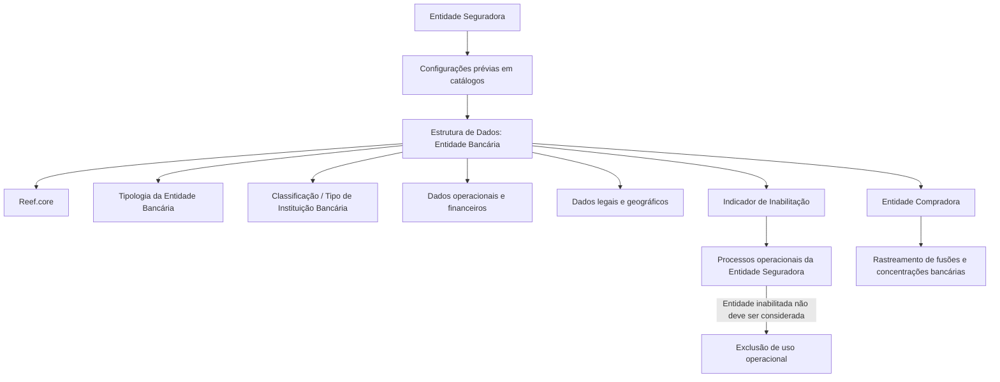
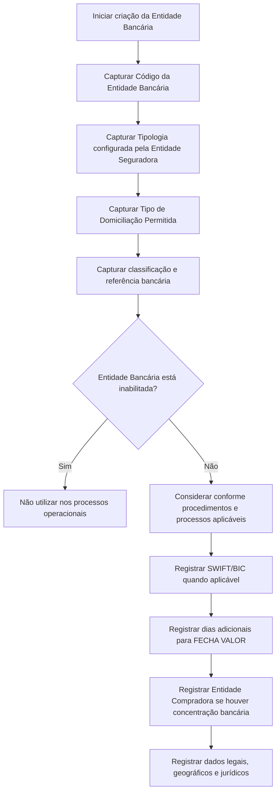

# Cadastro de Informações da Entidade Bancária no Reef.core

## 1. Metadados do Documento
- **Arquivo de Origem:** Não identificado no conteúdo fornecido
- **Tipo de Documento:** Especificação Funcional
- **Domínio / Sistema:** Reef.core / Entidades Bancárias
- **Público-Alvo:** Negócio, Operação, Desenvolvedores e Arquitetos
- **Data/Versão Identificada:** Não identificada

---

## 2. Resumo Executivo & Contexto de Negócio

O documento descreve a criação e o cadastro de informações de Entidades Bancárias em uma estrutura de dados do sistema Reef.core. O objetivo declarado é identificar, detalhar, tipificar e classificar informações operacionais de instituições bancárias utilizadas pela entidade seguradora.

Os atributos cadastrados permitem que procedimentos e processos da entidade seguradora considerem, ou não, os valores associados a uma Entidade Bancária. A utilização operacional da entidade depende, entre outros fatores, do indicador de inabilitação, que sinaliza que a instituição não deve ser empregada, contemplada ou considerada nos processos operacionais.

A especificação também contempla informações relacionadas a acordos comerciais de domiciliação bancária, classificação institucional, referência bancária, código SWIFT/BIC, prazo adicional para formação de data valor e dados legais/geográficos da instituição.

O Reef.core permite rastrear códigos de Entidades Bancárias em cenários de concentração bancária, fusão ou absorção de instituições. Esse rastreamento é realizado por meio do campo de Entidade Compradora, que associa a entidade absorvida ao código da instituição compradora.

> **Nota de Análise:** O documento descreve os campos funcionais do cadastro, mas não detalha telas, contratos de API, persistência de dados, regras de obrigatoriedade, valores permitidos, permissões de acesso ou mensagens de validação.

---

## 3. Arquitetura, Componentes & Tecnologias Envolvidas

### Componentes e conceitos identificados

- **Reef.core:** Sistema mencionado como responsável por permitir o rastreamento de códigos de Entidades Bancárias ao longo de fusões e concentrações bancárias.
- **Estrutura de Dados de Entidade Bancária:** Estrutura utilizada para registrar dados operacionais, classificatórios, legais e financeiros de instituições bancárias.
- **Entidade Seguradora:** Organização que realiza previamente configurações de tipologias, classificações e tipos de empresa jurídica em catálogos correspondentes.
- **Entidade Bancária:** Instituição cadastrada e utilizada, ou excluída por inabilitação, em processos operacionais da entidade seguradora.
- **Código SWIFT / BIC:** Identificador internacional do banco receptor em transferências internacionais.
- **Zona SEPA:** Zona Única de Pagamentos em Europa, citada como critério para aplicação do código SWIFT/BIC.



> **Nota de Análise:** O documento não apresenta arquitetura técnica de infraestrutura, integrações, microsserviços, bancos de dados, APIs, protocolos ou ambientes de implantação.

---

## 4. Regras de Negócio, Especificações Funcionais & Processos

### Ação habilitada

- A ação explicitamente indicada no documento é **CRIAR**.
- A criação ocorre no bloco de informação denominado **Dados Entidad Bancaria**.
- A sequência de captura dos atributos deve seguir a orientação apresentada: **da esquerda para a direita e de cima para baixo**.

### Regras funcionais dos atributos

1. **Código da Entidade Bancária**
   - Identifica a chave que a Entidade Bancária terá no sistema.

2. **Tipologia da Entidade Bancária**
   - Contém a tipologia da Entidade Bancária.
   - A tipologia deve estar de acordo com configuração prévia realizada pela entidade seguradora.
   - A informação será utilizada posteriormente para exploração operacional.

3. **Tipo de Domiciliação Permitida**
   - Determina o tipo de processo de domiciliação bancária que a entidade MAPFRE local prevê realizar com a Entidade Bancária.
   - O tipo de domiciliação é definido conforme acordo comercial pactuado entre a entidade MAPFRE local e a Entidade Bancária.

4. **Tipo de Instituição Bancária**
   - Identifica a classificação bancária atribuída à Entidade Bancária.
   - A classificação depende de configuração prévia realizada pela entidade seguradora.

5. **Referência Bancária**
   - Contém a chave de referência da Entidade Bancária.

6. **Inabilitação**
   - Indica ao sistema que a Entidade Bancária está inabilitada.
   - Uma Entidade Bancária inabilitada não deve ser utilizada, contemplada ou considerada nos processos operacionais da entidade seguradora.

7. **Código SWIFT / BIC**
   - Contém o código SWIFT, também denominado código BIC.
   - SWIFT significa **Society for Worldwide Interbank Financial Telecommunication**.
   - BIC significa **Bank Identifier Code**.
   - O código é uma série alfanumérica de 8 ou 11 dígitos.
   - O código é utilizado para identificar o banco receptor de uma transferência internacional.
   - O código SWIFT/BIC aplica-se somente a países que não pertencem à Zona SEPA.

8. **Aplicação do código SWIFT/BIC e Zona SEPA**
   - A Zona SEPA é descrita como Zona Única de Pagamentos em Europa.
   - Segundo o documento, a Zona SEPA compreende os 28 países da União Europeia, além de Liechtenstein, Islândia, Noruega, Andorra, Mônaco, San Marino, Suíça, Reino Unido e Cidade do Vaticano.

9. **Número de Dias Adicionais**
   - Contém a quantidade de dias que a Entidade Bancária considera para compor a **FECHA VALOR** em operações financeiras.

10. **Entidade Compradora**
    - Contém o código da Entidade Bancária compradora.
    - O campo é aplicável quando ocorre um processo de concentração bancária em que uma entidade absorve uma ou mais Entidades Bancárias.
    - O campo permite que o Reef.core rastreie códigos das entidades conforme fusões e concentrações ocorridas ao longo de sua existência.

11. **Data de Constituição**
    - Contém a data em que a Entidade Bancária foi legalmente constituída no país em que opera.

12. **Nacionalidade**
    - Contém a chave do primeiro nível da estrutura geográfica.
    - Essa chave corresponde ao país de procedência da Entidade Bancária.

13. **Tipo de Empresa Jurídica**
    - Estabelece a tipologia da empresa.
    - A tipologia depende de configuração expressa e prévia da entidade seguradora no catálogo correspondente.



---

## 5. Tabelas de Parâmetros, Ambientes e Estruturas de Dados

| Item / Parâmetro | Descrição / Função | Tipo / Valores / Formato | Ambiente / Observações |
| :--- | :--- | :--- | :--- |
| Ação habilitada | Permite criar informações da Entidade Bancária. | `CRIAR` | Outras ações não são detalhadas. |
| Código da Entidade Bancária | Identifica a chave da Entidade Bancária no sistema. | Não especificado | Campo associado ao cadastro no sistema. |
| Tipologia da Entidade Bancária | Define a tipologia da instituição para exploração posterior. | Conforme configuração prévia da entidade seguradora | Valores permitidos não detalhados. |
| Tipo de Domiciliação Permitida | Determina o processo de domiciliação bancária permitido entre a entidade MAPFRE local e a Entidade Bancária. | Conforme acordo comercial entre as partes | Tipos de domiciliação não detalhados. |
| Tipo de Instituição Bancária | Identifica a classificação bancária atribuída à Entidade Bancária. | Conforme configuração prévia da entidade seguradora | Categorias de classificação não detalhadas. |
| Referência Bancária | Armazena a chave de referência da Entidade Bancária. | Não especificado | Formato não detalhado. |
| Inabilitação | Indica que a Entidade Bancária não deve ser empregada em processos operacionais. | Não especificado | O documento não define representação do indicador. |
| Código SWIFT | Identifica o banco receptor de transferência internacional. | Série alfanumérica de 8 ou 11 dígitos | Também denominado código BIC; aplicável somente fora da Zona SEPA. |
| Código BIC | Nome alternativo do código SWIFT. | Série alfanumérica de 8 ou 11 dígitos | BIC significa Bank Identifier Code. |
| Número de Dias Adicionais | Define dias considerados para compor a FECHA VALOR de operações financeiras. | Número de dias | Faixa, mínimo e máximo não detalhados. |
| Entidade Compradora | Informa o código da instituição compradora em concentrações bancárias. | Código da Entidade Bancária | Aplicável quando uma entidade absorve uma ou mais instituições. |
| Data de Constituição | Registra a data de constituição legal da Entidade Bancária. | Data | Refere-se ao país onde a entidade opera. |
| Nacionalidade | Registra a chave do primeiro nível da estrutura geográfica referente ao país de procedência. | Chave geográfica | Catálogo ou formato não detalhado. |
| Tipo de Empresa Jurídica | Define a tipologia jurídica da empresa. | Conforme catálogo previamente configurado | Valores permitidos não detalhados. |
| Zona SEPA | Critério territorial para aplicação do código SWIFT/BIC. | União Europeia e países adicionais listados no documento | SWIFT/BIC é indicado somente para países fora da Zona SEPA. |

---

## 6. Bateria de Perguntas & Respostas para RAG (FAQ Sintético)

### P1: Qual é o objetivo do cadastro de Entidades Bancárias no Reef.core?
**R:** O cadastro tem como objetivo identificar, detalhar, tipificar e classificar as informações operacionais das Entidades Bancárias. Essas informações permitem que procedimentos e processos da entidade seguradora considerem ou deixem de considerar valores relacionados às instituições cadastradas.

### P2: Qual ação está habilitada no documento para a estrutura de Dados da Entidade Bancária?
**R:** A ação habilitada explicitamente no documento é **CRIAR**. O documento não descreve ações de consulta, alteração, exclusão ou aprovação.

### P3: Para que serve o Código da Entidade Bancária?
**R:** O Código da Entidade Bancária identifica a chave que a instituição bancária terá no sistema.

### P4: Como é definida a Tipologia da Entidade Bancária?
**R:** A Tipologia da Entidade Bancária é definida de acordo com configuração prévia realizada pela entidade seguradora. O documento informa que essa informação será utilizada para exploração posterior, mas não detalha os valores possíveis.

### P5: O que determina o Tipo de Domiciliação Permitida?
**R:** O Tipo de Domiciliação Permitida determina o tipo de processo de domiciliação bancária que a entidade MAPFRE local considera realizar com a Entidade Bancária, conforme o acordo comercial pactuado entre ambas as partes.

### P6: O que acontece quando uma Entidade Bancária está inabilitada?
**R:** Quando uma Entidade Bancária está inabilitada, ela não deve ser empregada, contemplada ou considerada nos processos operacionais da entidade seguradora.

### P7: Qual é o formato do código SWIFT/BIC descrito no documento?
**R:** O código SWIFT, também chamado de código BIC, é descrito como uma série alfanumérica de 8 ou 11 dígitos utilizada para identificar o banco receptor de uma transferência internacional.

### P8: Quando o código SWIFT/BIC deve ser aplicado?
**R:** Segundo o documento, o código SWIFT/BIC deve ser aplicado unicamente nos países que não pertencem à Zona SEPA.

### P9: Qual é a função do Número de Dias Adicionais?
**R:** O Número de Dias Adicionais contém a quantidade de dias que a Entidade Bancária considera para compor a FECHA VALOR em suas operações financeiras.

### P10: Como o Reef.core trata fusões e concentrações bancárias?
**R:** O Reef.core permite rastrear códigos das Entidades Bancárias ao longo de fusões e concentrações por meio do campo Entidade Compradora. Esse campo contém o código da instituição compradora quando uma entidade absorve uma ou mais Entidades Bancárias.

### P11: O que representa o campo Nacionalidade?
**R:** O campo Nacionalidade contém a chave do primeiro nível da estrutura geográfica correspondente ao país de procedência da Entidade Bancária.

### P12: Como é definido o Tipo de Empresa Jurídica?
**R:** O Tipo de Empresa Jurídica estabelece a tipologia da empresa de acordo com uma configuração expressa e realizada previamente pela entidade seguradora no catálogo correspondente.

---

## 7. Glossário de Termos, Siglas & Conceitos-Chave

- **BIC:** *Bank Identifier Code*. Denominação alternativa do código SWIFT utilizada para identificar o banco receptor de uma transferência internacional.
- **Código SWIFT:** Código alfanumérico de 8 ou 11 dígitos utilizado para identificar o banco receptor de uma transferência internacional.
- **Entidade Bancária:** Instituição bancária cadastrada na estrutura de dados para uso em processos e procedimentos da entidade seguradora.
- **Entidade Compradora:** Instituição bancária que absorveu uma ou mais entidades em um processo de concentração bancária.
- **Entidade Seguradora:** Organização que configura previamente tipologias, classificações e catálogos utilizados no cadastro de Entidades Bancárias.
- **FECHA VALOR:** Data valor de operações financeiras, cuja composição pode considerar o Número de Dias Adicionais da Entidade Bancária.
- **MAPFRE local:** Entidade MAPFRE mencionada como parte do acordo comercial para processos de domiciliação bancária.
- **Reef.core:** Sistema citado como capaz de rastrear códigos de Entidades Bancárias durante fusões e concentrações bancárias.
- **SEPA:** Zona Única de Pagamentos em Europa. O documento a utiliza como critério para determinar a aplicação do código SWIFT/BIC.
- **Society for Worldwide Interbank Financial Telecommunication:** Expansão da sigla SWIFT indicada no documento.

---

## 8. Notas Críticas, Riscos & Limitações

- O documento não identifica o arquivo de origem, data, versão, autoria técnica ou ciclo de aprovação do conteúdo funcional.
- O documento não especifica quais campos são obrigatórios, opcionais, editáveis ou imutáveis.
- Não foram informados tipos técnicos de dados, tamanhos máximos, formatos de datas, regras de unicidade ou validações de integridade.
- Não há detalhamento dos catálogos prévios utilizados para Tipologia da Entidade Bancária, Tipo de Instituição Bancária ou Tipo de Empresa Jurídica.
- Não são apresentados valores possíveis para o indicador de Inabilitação, para o Tipo de Domiciliação Permitida ou para o Número de Dias Adicionais.
- O documento não define integrações, APIs, contratos JSON, métodos HTTP, eventos, bancos de dados, logs, URLs, ambientes ou mecanismos de autenticação.
- A lista de países abrangidos pela Zona SEPA é apresentada conforme o conteúdo original e não deve ser expandida ou atualizada sem uma fonte documental adicional.
- Não é detalhado como o sistema valida a condição de aplicação do código SWIFT/BIC, nem como identifica automaticamente se um país pertence à Zona SEPA.

---

## 9. Conteúdo Bruto Estruturado (Referência Fiel)

```text
--- [PÁGINA 1 DE 2] ---

CREAR Información especíca de la Entidad Bancaria
Objetivo
El registro de la información en esta Estructura de Datos obedece a la necesidad de identicar y detallar la información de ámbito operativo
de las Entidades Bancarias además de tipicar y clasicarlas adecuadamente para poder contemplar o no sus valores en los Procedimientos
y/o Procesos de la entidad Aseguradora que lo requieran.
Acciones habilitadas
 CREAR ( )
Datos Entidad Bancaria
De Izquierda a Derecha y de Arriba hacia Abajo, los siguientes atributos marcan la secuencia de captura en este Bloque de Información.
Código de la Entidad Bancaria ( )
Este campo identica la clave que va a tener la entidad Bancaria en el Sistema.
Tipología de la Entidad Bancaria (  )
Este dato contiene la tipología de la entidad bancaria, de acuerdo con la conguración previa que haya realizado la entidad aseguradora, para
su posterior explotación.
Tipo de Domiciliación Permitida (  )
Este dato determina el tipo de proceso de domiciliación bancaria que la entidad MAPFRE local contempla realizar con la entidad bancaria de
acuerdo con el acuerdo comercial pactado entre ambas partes.
Ejemplo:
Ejemplo:
Documentation / DOCUMENTACIÓN Reef
DOCUMENTACIÓN Reef
Mapfredocument
DOCUMENTACIÓN Reef
Owner
user:agonzalez_mapfre.com
Lifecycle
Approved Source
 / 
 VL
Buscar Inicio Soluciones Arquitecturas APIs Componentes Cloud Documentación Zeus Reef Ayuda
ES


--- [PÁGINA 2 DE 2] ---

Tipo de Institución Bancaria (  )
Este campo identica la clasicación bancaria que se otorga a la entidad bancaria de acuerdo con la conguración previa que haya realizado
la Entidad Aseguradora:
Referencia Bancaria ( )
Este campo contiene la clave de referencia de la entidad bancaria.
Inhabilitación ( )
Este campo le indica al sistema que la Entidad Bancaria está inhabilitada por lo que de encontrarse en esta situación, no debería ser
empleada, contemplada o considerada en los procesos operativos de la entidad.
Código SWIFT ( )
Este campo contiene el código SWIFT (acrónimo de Society for Worldwide Interbank Financial Telecommunication), también denominado
código BIC (Bank Identier Code), que no es sino una serie alfanumérica de 8 u 11 dígitos que se utiliza para identicar al banco receptor de
una transferencia internacional.
¿Cuándo se aplica el código SWIFT / BIC?
El código SWIFT / BIC se aplica únicamente en aquellos países que no pertenecen a la Zona SEPA (o Zona única de Pagos en Europa)
comprendida por los 28 países de la Unión Europea, además de Liechtenstein, Islandia, Noruega, Andorra, Mónaco, San Marino, Suiza, Reino
Unido y Ciudad del Vaticano Estado.
Número de Días Adicionales ( )
Este campo contiene el número de días que la entidad bancaria contempla para conformar la 'FECHA VALOR' en sus operaciones nancieras.
Entidad Compradora ( )
Este campo contiene el código de la entidad bancaria compradora (en el supuesto que haya existido un proceso de concentración bancario y
una entidad haya absorbido una u otras entidades bancarias).
De esta manera Reef.core permite trazar los códigos de las Entidades de acuerdo a las fusiones y concentraciones por las que pasen a lo
largo de su existencia.
Fecha de Constitución ( )
Este dato contiene la fecha en la que se constituyó legalmente la entidad bancaria en el país en el que está operando.
Nacionalidad ( )
Este campo contiene la clave del primer nivel de la estructura geográca que corresponde al país de procedencia de la entidad bancaria.
Tipo de Empresa Jurídica ( )
Este dato establece la tipología de la Empresa de acuerdo con la conguración expresa que la Entidad Aseguradora haya realizado
previamente en el catálogo correspondiente.
Ejemplo:
```
