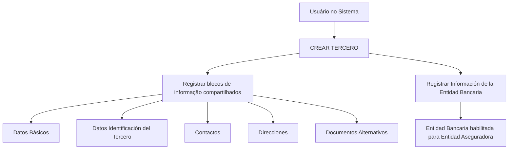

# Operação Criar Entidade Bancária — Documentação Reef

## 1. Metadados do Documento
- **Arquivo de Origem:** Não identificado no conteúdo fornecido
- **Tipo de Documento:** Procedimento
- **Domínio / Sistema:** Reef / Mapfre
- **Público-Alvo:** Operação, Negócio, Desenvolvedores
- **Data/Versão Identificada:** Não identificada

---

## 2. Resumo Executivo & Contexto de Negócio

O documento descreve a operação **CREAR Entidad Bancaria**, destinada a registrar no Sistema a relação de Entidades Bancárias habilitadas para uma Entidade Aseguradora. O procedimento pertence ao contexto documental Reef, com referências a Mapfre e Mapfredocument.

A criação de uma Entidade Bancária é tratada como criação de um **Tercero** no Sistema. A Entidade Bancária deve obrigatoriamente ser criada como **Persona Jurídica**. Após a criação do Tercero, devem ser registrados os dados específicos da Entidade Bancária.

O processo utiliza blocos de informação compartilhados e blocos específicos conforme a atividade do Tercero. A obrigatoriedade e a habilitação dos campos podem variar segundo o código de atividade do Tercero, além de poderem ser afetadas por modificações implementadas localmente.

O documento também estabelece que a ordem de captura dos dados nos blocos de informação pode variar conforme o critério seguido pelo usuário no Sistema. Não há detalhamento de telas, campos individuais, validações de formato, métodos de integração ou contratos técnicos.

---

## 3. Arquitetura, Componentes & Tecnologias Envolvidas

### Componentes e conceitos identificados

| Componente / Conceito | Descrição baseada no documento |
| :--- | :--- |
| Sistema | Sistema não nomeado no trecho; utilizado para registrar a relação de Entidades Bancárias habilitadas. |
| Entidad Aseguradora | Entidade para a qual as Entidades Bancárias habilitadas são registradas. |
| Entidad Bancaria | Entidade registrada no Sistema; deve sempre ser criada como Persona Jurídica. |
| Tercero | Registro-base criado antes do preenchimento das informações da Entidade Bancária. |
| Bloques de Información Compartidos | Conjunto de blocos compartilhados no processo CREAR TERCERO. |
| Información de la Entidad Bancaria | Bloco específico utilizado para registrar dados da Entidade Bancária. |
| Reef | Contexto de documentação citado como “DOCUMENTACIÓN Reef”. |
| Mapfre / Mapfredocument | Referências presentes no conteúdo de origem. |



**Nota de Análise:** O documento não identifica o nome técnico do Sistema, tecnologias, banco de dados, serviços, APIs, URLs de ambiente, protocolos de integração ou contratos de dados.

---

## 4. Regras de Negócio, Especificações Funcionais & Processos

### Objetivo da operação
A operação **CREAR Entidad Bancaria** permite registrar no Sistema a relação de Entidades Bancárias habilitadas para a Entidade Aseguradora.

### Regras de negócio identificadas

1. As Entidades Bancárias da Entidade Aseguradora devem sempre ser criadas como **Personas Jurídicas**.
2. A criação da Entidade Bancária começa pela operação **CREAR TERCERO**.
3. Depois da criação do Tercero, deve ser criada a informação específica da Entidade Bancária.
4. A obrigatoriedade dos campos dos blocos ou estruturas de informação compartilhadas pode variar de acordo com o código de atividade do Tercero.
5. A habilitação dos campos dos blocos ou estruturas de informação compartilhadas pode variar de acordo com o código de atividade do Tercero.
6. Modificações implementadas localmente podem afetar a obrigatoriedade do registro dos Dados do Tercero.
7. A ordem de captura dos dados nos diferentes blocos de informação pode variar segundo o critério seguido pelo usuário no Sistema.

### Processo operacional extraído

1. Executar a operação **CREAR TERCERO**.
2. Criar ou registrar a informação da Entidade Bancária.
3. Preencher os blocos de informação compartilhados aplicáveis:
   - Datos Básicos.
   - Datos Identificación del Tercero.
   - Contactos.
   - Direcciones.
   - Documentos Alternativos.
4. Preencher o bloco específico conforme a atividade do Tercero:
   - Información de la Entidad Bancaria.
5. Considerar que campos obrigatórios ou habilitados podem variar conforme o código de atividade do Tercero e modificações locais.

**Nota de Análise:** O documento não informa quais campos compõem cada bloco, quais códigos de atividade existem, quais regras locais podem ser aplicadas, nem critérios de validação ou aprovação do cadastro.

---

## 5. Tabelas de Parâmetros, Ambientes e Estruturas de Dados

| Item / Parâmetro | Descrição / Função | Tipo / Valores / Formato | Ambiente / Observações |
| :--- | :--- | :--- | :--- |
| Operação | CREAR Entidad Bancaria | Operação de cadastro | Registra Entidades Bancárias habilitadas para a Entidade Aseguradora. |
| Registro-base | CREAR TERCERO | Processo de criação | Deve ser executado para criar a Entidade Bancária. |
| Tipo de pessoa | Persona Jurídica | Regra obrigatória | Todas as Entidades Bancárias devem ser criadas dessa forma. |
| Código de atividade do Tercero | Determina variações de comportamento dos campos compartilhados | Código não detalhado | Pode afetar obrigatoriedade e habilitação dos campos. |
| Datos Básicos | Bloco de informação compartilhado | Estrutura não detalhada | Associado ao processo CREAR TERCERO. |
| Datos Identificación del Tercero | Bloco de informação compartilhado | Estrutura não detalhada | Associado ao processo CREAR TERCERO. |
| Contactos | Bloco de informação compartilhado | Estrutura não detalhada | Associado ao processo CREAR TERCERO. |
| Direcciones | Bloco de informação compartilhado | Estrutura não detalhada | Associado ao processo CREAR TERCERO. |
| Documentos Alternativos | Bloco de informação compartilhado | Estrutura não detalhada | Associado ao processo CREAR TERCERO. |
| Información de la Entidad Bancaria | Bloco específico da atividade do Tercero | Estrutura não detalhada | Necessário para registrar dados da Entidade Bancária. |
| Modificações locais | Alterações implementadas localmente | Não detalhado | Podem afetar a obrigatoriedade dos Dados do Tercero. |
| Ordem de captura | Sequência de preenchimento dos blocos | Variável | Pode variar conforme o critério do usuário no Sistema. |

---

## 6. Bateria de Perguntas & Respostas para RAG (FAQ Sintético)

### P1: Qual é o objetivo da operação CREAR Entidad Bancaria?
**R:** A operação CREAR Entidad Bancaria permite registrar no Sistema a relação de Entidades Bancárias habilitadas para uma Entidade Aseguradora.

### P2: Como uma Entidade Bancária deve ser cadastrada no Sistema?
**R:** Uma Entidade Bancária deve sempre ser criada como Persona Jurídica. O fluxo parte da criação de um Tercero e inclui o registro da Informação da Entidade Bancária.

### P3: Qual operação deve ser realizada antes de registrar os dados específicos da Entidade Bancária?
**R:** Deve ser executada a operação CREAR TERCERO. Após a criação do Tercero, o processo inclui o registro da informação específica da Entidade Bancária.

### P4: Quais blocos de informação compartilhados são citados no processo CREAR TERCERO?
**R:** O documento cita os blocos Datos Básicos, Datos Identificación del Tercero, Contactos, Direcciones e Documentos Alternativos.

### P5: Qual bloco específico deve ser usado para uma Entidade Bancária?
**R:** O bloco específico citado é Información de la Entidad Bancaria, pertencente aos blocos de informação específicos de acordo com a atividade do Tercero.

### P6: A obrigatoriedade dos campos é fixa para todas as Entidades Bancárias?
**R:** Não. A obrigatoriedade dos campos dos blocos ou estruturas de informação compartilhadas pode variar de acordo com o código de atividade do Tercero. Modificações locais também podem afetar a obrigatoriedade de registro dos Dados do Tercero.

### P7: O código de atividade do Tercero influencia o cadastro?
**R:** Sim. O código de atividade do Tercero pode influenciar tanto a obrigatoriedade quanto a habilitação dos campos nos blocos ou estruturas de informação compartilhadas.

### P8: A ordem de preenchimento dos blocos de informação é obrigatoriamente fixa?
**R:** Não. O documento informa que a ordem de captura dos dados nos diferentes blocos de informação pode variar conforme o critério seguido pelo usuário no Sistema.

### P9: O documento especifica quais campos existem em Datos Básicos ou Contactos?
**R:** Não. O documento apenas lista os blocos de informação compartilhados, sem detalhar seus campos, formatos, obrigatoriedades individuais ou regras de validação.

### P10: O documento informa APIs, métodos HTTP ou contratos JSON para a criação de Entidade Bancária?
**R:** Não. O conteúdo fornecido não descreve APIs, métodos HTTP, contratos JSON, URLs, serviços técnicos ou integrações para a operação CREAR Entidad Bancaria.

---

## 7. Glossário de Termos, Siglas & Conceitos-Chave

- **CREAR Entidad Bancaria:** Operação para registrar no Sistema a relação de Entidades Bancárias habilitadas para uma Entidade Aseguradora.
- **CREAR TERCERO:** Operação de criação do Tercero, utilizada como etapa do processo de criação da Entidade Bancária.
- **Entidad Aseguradora:** Entidade para a qual são registradas Entidades Bancárias habilitadas.
- **Entidad Bancaria:** Entidade bancária cadastrada no Sistema e associada ao contexto da Entidade Aseguradora.
- **Persona Jurídica:** Tipo obrigatório de criação aplicável às Entidades Bancárias.
- **Tercero:** Registro ou entidade cuja criação antecede o registro específico da Entidade Bancária.
- **Bloques de Información Compartidos:** Blocos de dados compartilhados associados ao processo CREAR TERCERO.
- **Información de la Entidad Bancaria:** Bloco de informação específico relacionado à atividade de Entidade Bancária.
- **Reef:** Nome presente na referência “DOCUMENTACIÓN Reef”.
- **Mapfredocument:** Termo presente no conteúdo de referência documental.
- **VL:** Sigla exibida na área de documentação, sem expansão ou definição no trecho fornecido.

---

## 8. Notas Críticas, Riscos & Limitações

- O conteúdo não informa o nome do arquivo de origem, data, versão ou autoria formal do procedimento.
- O documento não detalha os campos de cada bloco de informação, seus tipos, formatos, valores permitidos ou mensagens de validação.
- O documento afirma que modificações locais podem alterar a obrigatoriedade dos Dados do Tercero, mas não identifica quais modificações locais existem ou como consultá-las.
- Não há definição dos códigos de atividade do Tercero nem de sua relação com regras de obrigatoriedade ou habilitação.
- Não são descritos perfis de acesso, aprovações, auditoria, persistência, tratamento de erros ou critérios de sucesso do cadastro.
- Não há informações sobre APIs, integrações, tecnologias, URLs, ambientes, logs, métodos HTTP ou contratos JSON.
- A ordem de captura dos blocos pode variar conforme o critério do usuário, o que pode exigir validação operacional adicional para padronização de processos.

---

## 9. Conteúdo Bruto Estruturado (Referência Fiel)

```text
--- [PÁGINA 1 DE 1] ---

OPERACIÓN CREAR Entidad Bancaria
¿En que consiste?
Esta operación permite registrar en el Sistema la relación de Entidades Bancarias habilitadas para la Entidad Aseguradora.
Premisas
Las Entidades Bancarias de la Entidad Aseguradora siempre se crearán como Personas Jurídicas.
La obligatoriedad y/o la habilitación de los campos en el registro de los datos de cada uno de los bloques o estructuras de información
compartidas puede variar de acuerdo con el código de actividad del Tercero:
Las modicaciones que se hubieran podido implementar localmente a su vez pueden afectar el comportamiento de la aplicación en
relación con la obligatoriedad en el registro de los Datos del Tercero.
Por último, el orden de captura de los datos en los distintos bloques de Información puede variar de acuerdo con el criterio seguido por el
Usuario en el Sistema.
Proceso
CREAR
TERCERO
Crear Información de
la Entidad Bancaria
Bloques de Información Compartidos (CREAR TERCERO)
 Datos Básicos ( )
 Datos Identicación del Tercero ( )
 Contactos ( )
 Direcciones ( )
 Documentos Alternativos ( )
Bloques de Información Especícos de acuerdo con la Actividad del Tercero.
 Información de la Entidad Bancaria ( )
Ejemplo:
Documentation / DOCUMENTACIÓN Reef
DOCUMENTACIÓN Reef
Mapfredocument
DOCUMENTACIÓN Reef
Owner
user:agonzalez_mapfre.com
Lifecycle
Approved Source
 / 
 VL
Buscar Inicio Soluciones Arquitecturas APIs Componentes Cloud Documentación Zeus Reef Ayuda
ES
```
