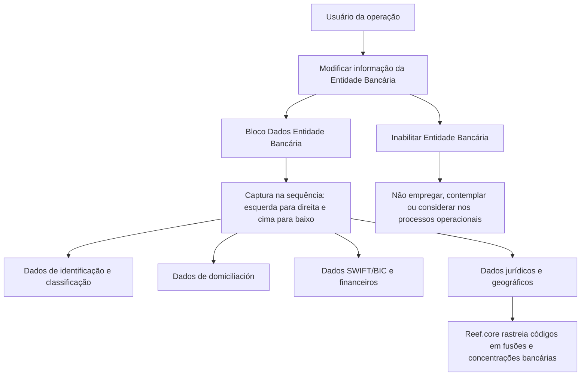

# Operação de Modificação e Inabilitação de Entidades Bancárias no Reef.core

## 1. Metadados do Documento
- **Arquivo de Origem:** Não identificado no conteúdo extraído
- **Tipo de Documento:** Manual Operacional
- **Domínio / Sistema:** Reef / Reef.core / MAPFRE
- **Público-Alvo:** Não identificado
- **Data/Versão Identificada:** Não identificada

---

## 2. Resumo Executivo & Contexto de Negócio

O documento descreve a operação destinada a modificar informações cadastrais de uma Entidade Bancária no sistema Reef.core. A operação também permite inabilitar uma entidade bancária, evitando que ela seja empregada, contemplada ou considerada nos processos operacionais da entidade.

A captura de dados da Entidade Bancária possui uma sequência definida: os atributos devem ser preenchidos da esquerda para a direita e de cima para baixo dentro do bloco de informação. Os atributos abrangem identificação bancária, tipologia, classificação institucional, dados de domiciliación, identificação internacional, situação de inabilitação, relação com processos de concentração bancária e dados jurídicos/geográficos.

O documento atribui à Entidade Aseguradora a configuração prévia de determinados catálogos, incluindo tipologia da entidade bancária, classificação bancária e tipo de empresa jurídica. Portanto, a operação de manutenção da Entidade Bancária depende das configurações previamente estabelecidas pela entidade seguradora.

O código SWIFT/BIC recebe detalhamento específico como identificador do banco receptor de transferências internacionais. O documento restringe sua aplicação aos países que não pertencem à Zona SEPA, listando a composição territorial da zona conforme o conteúdo extraído.

---

## 3. Arquitetura, Componentes & Tecnologias Envolvidas

| Componente / Termo | Papel identificado no documento |
| :--- | :--- |
| Reef | Repositório ou domínio de documentação citado no conteúdo extraído. |
| Reef.core | Sistema que permite rastrear códigos de Entidades Bancárias ao longo de fusões e concentrações bancárias. |
| Entidade Bancária | Objeto cadastral administrado pela operação de modificação e inabilitação. |
| Entidade Aseguradora | Responsável por configurações prévias de tipologias, classificações e catálogos utilizados no cadastro. |
| MAPFRE local | Entidade que pode realizar processos de domiciliación bancária conforme acordo comercial com a entidade bancária. |
| Broker | Termo usado na descrição do campo de inabilitação; quando inabilitado, não deve ser empregado nos processos operacionais. |
| SWIFT / BIC | Código de identificação do banco receptor em transferências internacionais. |
| Zona SEPA | Zona única de pagamentos na Europa, usada como critério para a aplicação do código SWIFT/BIC. |



> **Nota de Análise:** O documento não detalha interface, métodos HTTP, contratos JSON, banco de dados, autenticação, integrações técnicas ou ambientes de execução da operação.

---

## 4. Regras de Negócio, Especificações Funcionais & Processos

1. A operação permite modificar a informação da Entidade Bancária.
2. A operação disponibiliza as ações **MODIFICAR** e **INHABILITAR**.
3. Os atributos do bloco “Datos Entidad Bancaria” devem seguir a sequência de captura da esquerda para a direita e de cima para baixo.
4. O Código da Entidade Bancária identifica a chave da entidade bancária no sistema.
5. A Tipologia da Entidade Bancária depende de configuração prévia realizada pela Entidade Aseguradora e é destinada à exploração posterior.
6. O Tipo de Domiciliación Permitida determina o tipo de processo de domiciliación bancária que a entidade MAPFRE local prevê realizar com a entidade bancária, conforme acordo comercial entre as partes.
7. O Tipo de Instituição Bancária identifica a classificação bancária atribuída à entidade conforme configuração prévia da Entidade Aseguradora.
8. A Referência Bancária contém a chave de referência da entidade bancária.
9. A inabilitação indica ao sistema que o Broker está inabilitado. Quando inabilitado, o Broker não deve ser empregado, contemplado ou considerado nos processos operacionais da entidade.
10. O Código SWIFT, também denominado BIC, é uma série alfanumérica de 8 ou 11 dígitos para identificar o banco receptor de uma transferência internacional.
11. O código SWIFT/BIC aplica-se exclusivamente aos países que não pertencem à Zona SEPA.
12. A Zona SEPA é descrita como abrangendo os 28 países da União Europeia, além de Liechtenstein, Islandia, Noruega, Andorra, Mónaco, San Marino, Suiza, Reino Unido e Ciudad del Vaticano Estado.
13. O Número de Días Adicionales contém a quantidade de dias considerada pela entidade bancária para conformar a “FECHA VALOR” em operações financeiras.
14. A Entidad Compradora armazena o código da entidade bancária compradora quando houve concentração bancária e uma entidade absorveu uma ou mais entidades bancárias.
15. Reef.core permite rastrear os códigos das Entidades Bancárias de acordo com fusões e concentrações ocorridas durante sua existência.
16. A Fecha de Constitución representa a data de constituição legal da entidade bancária no país em que opera.
17. A Nacionalidad contém a chave do primeiro nível da estrutura geográfica correspondente ao país de procedência da entidade bancária.
18. O Tipo de Empresa Jurídica define a tipologia da empresa conforme configuração prévia da Entidade Aseguradora no catálogo correspondente.

---

## 5. Tabelas de Parâmetros, Ambientes e Estruturas de Dados

| Item / Parâmetro | Descrição / Função | Tipo / Valores / Formato | Ambiente / Observações |
| :--- | :--- | :--- | :--- |
| Ação MODIFICAR | Permite modificar a informação da Entidade Bancária. | Ação operacional. | Disponível na operação. |
| Ação INHABILITAR | Permite inabilitar a Entidade Bancária. | Ação operacional. | A entidade inabilitada não deve ser considerada nos processos operacionais. |
| Código de la Entidad Bancaria | Identifica a chave da entidade bancária no sistema. | Não especificado. | Campo de identificação no sistema. |
| Tipología de la Entidad Bancaria | Contém a tipologia da entidade bancária. | Configuração prévia da Entidade Aseguradora. | Destinada à exploração posterior. |
| Tipo de Domiciliación Permitida | Determina o tipo de processo de domiciliación bancária realizado pela MAPFRE local com a entidade bancária. | Não especificado. | Condicionado ao acordo comercial entre as partes. |
| Tipo de Institución Bancaria | Identifica a classificação bancária concedida à entidade. | Configuração prévia da Entidade Aseguradora. | Classificação depende de configuração anterior. |
| Referencia Bancaria | Contém a chave de referência da entidade bancária. | Não especificado. | — |
| Inhabilitación | Indica que o Broker está inabilitado no sistema. | Não especificado. | O Broker inabilitado não deve ser usado, contemplado ou considerado operacionalmente. |
| Código SWIFT / BIC | Identifica o banco receptor de uma transferência internacional. | Série alfanumérica de 8 ou 11 dígitos. | Aplicável apenas a países fora da Zona SEPA. |
| Número de Días Adicionales | Armazena o número de dias para conformar a “FECHA VALOR” em operações financeiras. | Número de dias. | Considerado pela entidade bancária. |
| Entidad Compradora | Contém o código da entidade bancária compradora após processo de concentração bancária. | Código de entidade bancária. | Suporta rastreabilidade de fusões e concentrações no Reef.core. |
| Fecha de Constitución | Registra a data de constituição legal da entidade bancária. | Data. | Referente ao país no qual a entidade opera. |
| Nacionalidad | Contém a chave do primeiro nível da estrutura geográfica do país de procedência. | Chave geográfica. | Associada à origem da entidade bancária. |
| Tipo de Empresa Jurídica | Estabelece a tipologia da empresa. | Configuração prévia da Entidade Aseguradora no catálogo correspondente. | — |
| Zona SEPA | Zona usada como critério de aplicação do código SWIFT/BIC. | 28 países da União Europeia, Liechtenstein, Islandia, Noruega, Andorra, Mónaco, San Marino, Suiza, Reino Unido e Ciudad del Vaticano Estado. | SWIFT/BIC aplica-se somente fora dessa zona. |

---

## 6. Bateria de Perguntas & Respostas para RAG (FAQ Sintético)

### P1: Qual é o objetivo da operação de Entidade Bancária no Reef?
**R:** A operação permite modificar a informação da Entidade Bancária e também inabilitá-la no sistema.

### P2: Qual é a sequência de captura dos atributos da Entidade Bancária?
**R:** Os atributos do bloco “Datos Entidad Bancaria” devem ser capturados da esquerda para a direita e de cima para baixo.

### P3: O que identifica o Código da Entidade Bancária?
**R:** O Código da Entidade Bancária identifica a chave da entidade bancária no sistema.

### P4: Quem configura a Tipologia da Entidade Bancária?
**R:** A Tipologia da Entidade Bancária é definida de acordo com configuração prévia realizada pela Entidade Aseguradora, para posterior exploração.

### P5: O que determina o Tipo de Domiciliación Permitida?
**R:** O Tipo de Domiciliación Permitida determina o processo de domiciliación bancária que a entidade MAPFRE local contempla realizar com a entidade bancária, conforme o acordo comercial firmado entre ambas as partes.

### P6: Qual é o efeito da inabilitação no sistema?
**R:** A inabilitação indica que o Broker está inabilitado. Quando isso ocorre, o Broker não deve ser empregado, contemplado ou considerado nos processos operacionais da entidade.

### P7: O que é o código SWIFT/BIC e qual é o formato informado?
**R:** O código SWIFT/BIC identifica o banco receptor de uma transferência internacional. O documento informa que é uma série alfanumérica de 8 ou 11 dígitos; SWIFT significa Society for Worldwide Interbank Financial Telecommunication e BIC significa Bank Identifier Code.

### P8: Quando o código SWIFT/BIC deve ser aplicado?
**R:** O código SWIFT/BIC aplica-se unicamente aos países que não pertencem à Zona SEPA.

### P9: Para que serve o Número de Días Adicionales?
**R:** O Número de Días Adicionales contém a quantidade de dias que a entidade bancária contempla para conformar a “FECHA VALOR” em suas operações financeiras.

### P10: Como o Reef.core trata fusões e concentrações bancárias?
**R:** Quando há uma concentração bancária e uma entidade absorve uma ou mais entidades, o campo Entidad Compradora guarda o código da entidade compradora. Dessa forma, o Reef.core pode rastrear os códigos das Entidades Bancárias ao longo de fusões e concentrações.

### P11: O que representa o campo Nacionalidad?
**R:** Nacionalidad contém a chave do primeiro nível da estrutura geográfica correspondente ao país de procedência da Entidade Bancária.

### P12: Como é definido o Tipo de Empresa Jurídica?
**R:** O Tipo de Empresa Jurídica estabelece a tipologia da empresa de acordo com configuração expressa previamente realizada pela Entidade Aseguradora no catálogo correspondente.

---

## 7. Glossário de Termos, Siglas & Conceitos-Chave

- **BIC:** *Bank Identifier Code*; denominação alternativa do código SWIFT.
- **Broker:** Termo utilizado na descrição do campo de inabilitação; quando inabilitado, não deve ser usado nos processos operacionais da entidade.
- **Domiciliación:** Processo de domiciliación bancária mencionado no cadastro da Entidade Bancária.
- **Entidad Compradora:** Entidade bancária que absorveu uma ou outras entidades em um processo de concentração bancária.
- **Entidad Aseguradora:** Entidade responsável por configurações prévias de tipologias, classificações e catálogos.
- **Entidad Bancaria:** Entidade cadastral administrada pela operação de modificação e inabilitação.
- **FECHA VALOR:** Data cujo cálculo considera o Número de Días Adicionales em operações financeiras.
- **MAPFRE local:** Entidade MAPFRE que pode realizar processos de domiciliación bancária conforme acordo comercial.
- **Reef.core:** Sistema citado como capaz de rastrear códigos de Entidades Bancárias em fusões e concentrações.
- **SEPA:** Zona única de Pagos en Europa; utilizada como critério para aplicação do código SWIFT/BIC.
- **SWIFT:** *Society for Worldwide Interbank Financial Telecommunication*; código usado para identificar o banco receptor de uma transferência internacional.

---

## 8. Notas Críticas, Riscos & Limitações

- O documento não especifica quais valores são permitidos para Tipología de la Entidad Bancaria, Tipo de Institución Bancaria ou Tipo de Empresa Jurídica; apenas indica que dependem de configuração prévia da Entidade Aseguradora.
- O documento não detalha os critérios técnicos, operacionais ou de autorização para executar as ações MODIFICAR e INHABILITAR.
- A descrição do campo Inhabilitación menciona “Broker”, embora a operação seja descrita como manutenção de Entidade Bancária. O conteúdo não esclarece se Broker e Entidade Bancária são o mesmo objeto de negócio nesse contexto.
- Não há detalhamento de obrigatoriedade, validação, formato ou tamanho para a maioria dos campos, exceto para o código SWIFT/BIC.
- Não são apresentados contratos de integração, serviços, APIs, persistência, logs, permissões ou procedimentos de auditoria.
- A lista de territórios da Zona SEPA é reproduzida conforme o texto extraído e não deve ser interpretada como uma validação externa atualizada da composição da zona.

---

## 9. Conteúdo Bruto Estruturado (Referência Fiel)

```text
--- [PÁGINA 1 DE 2] ---

MODIFICAR Información especíca de la Entidad Bancaria
Objetivo
Esta Operación permite Modicar la información de la Entidad Bancaria además de poder Inhabilitarla.
Acciones habilitadas
 MODIFICAR ( )
 INHABILITAR ( )
Datos Entidad Bancaria
De Izquierda a Derecha y de Arriba hacia Abajo, los siguientes atributos marcan la secuencia de captura en este Bloque de Información.
Código de la Entidad Bancaria
Este Campo identica la clave de la entidad Bancaria en el Sistema.
Tipología de la Entidad Bancaria (  )
Este dato contiene la tipología de la entidad bancaria, de acuerdo con la conguración previa que haya realizado la entidad aseguradora, para
su posterior explotación.
Tipo de Domiciliación Permitida (  )
Este dato determina el tipo de proceso de domiciliación bancaria que la entidad MAPFRE local contempla realizar con la entidad bancaria de
acuerdo con el acuerdo comercial pactado entre ambas partes.
Ejemplo:
Ejemplo:
Documentation / DOCUMENTACIÓN Reef
DOCUMENTACIÓN Reef
Mapfredocument
DOCUMENTACIÓN Reef
Owner
user:agonzalez_mapfre.com
Lifecycle
Approved Source
 / 
 VL
Buscar Inicio Soluciones Arquitecturas APIs Componentes Cloud Documentación Zeus Reef Ayuda
ES


--- [PÁGINA 2 DE 2] ---

Tipo de Institución Bancaria (  )
Este campo identica la clasicación bancaria que se otorga a la entidad bancaria de acuerdo con la conguración previa que haya realizado
la Entidad Aseguradora:
Referencia Bancaria ( )
Este campo contiene la clave de referencia de la entidad bancaria.
Inhabilitación ( )
Este campo le indica al Sistema que el Broker está inhabilitado en el Sistema por lo cual, de estarlo, no debería ser empleado, contemplado o
considerado en los procesos operativos de la entidad.
Código SWIFT ( )
Este atributo contiene el código SWIFT (acrónimo de Society for Worldwide Interbank Financial Telecommunication), también denominado
código BIC (Bank Identier Code), que no es sino una serie alfanumérica de 8 u 11 dígitos que se utiliza para identicar al banco receptor de
una transferencia internacional.
¿Cuándo se aplica el código SWIFT / BIC?
El código SWIFT / BIC se aplica únicamente en aquellos países que no pertenecen a la Zona SEPA (o Zona única de Pagos en Europa)
comprendida por los 28 países de la Unión Europea, además de Liechtenstein, Islandia, Noruega, Andorra, Mónaco, San Marino, Suiza, Reino
Unido y Ciudad del Vaticano Estado.
Número de Días Adicionales ( )
Este Campo contiene el número de días que la entidad bancaria contempla para conformar la 'FECHA VALOR' en sus operaciones nancieras.
Entidad Compradora ( )
Este campo contiene el código de la entidad bancaria compradora en el supuesto que haya existido un proceso de concentración bancario y
una entidad haya absorbido una u otras entidades bancarias. De esta manera Reef.core permite trazar los códigos de las Entidades de
acuerdo a las fusiones y concentraciones por las que pasen a lo largo de su existencia.
Fecha de Constitución ( )
Este atributo contiene la fecha en la que se constituyó legalmente la entidad bancaria en el país en el que está operando.
Nacionalidad ( )
Este atributo contiene la clave del primer nivel de la estructura geográca que corresponde al país de procedencia de la entidad bancaria.
Tipo de Empresa Jurídica ( )
Este Dato establece la tipología de la Empresa de acuerdo con la conguración expresa que la Entidad Aseguradora haya realizado
previamente en el catálogo correspondiente.
Ejemplo:
```
