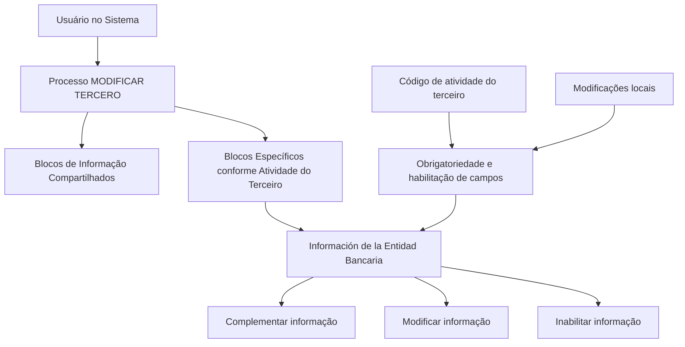

# Operação MODIFICAR Entidade Bancária — Documentação Reef

## 1. Metadados do Documento
- **Arquivo de Origem:** Não identificado no conteúdo fornecido
- **Tipo de Documento:** Procedimento
- **Domínio / Sistema:** Reef / Mapfre — operação **MODIFICAR Entidad Bancaria**
- **Público-Alvo:** Usuários do sistema, operação e equipes funcionais
- **Data/Versão Identificada:** Não identificada

---

## 2. Resumo Executivo & Contexto de Negócio

O documento descreve a operação **MODIFICAR Entidad Bancaria**, destinada a complementar, modificar e/ou inabilitar informações de uma entidade bancária em estruturas de dados que armazenam e agrupam esses dados.

A operação está inserida no processo mais amplo **MODIFICAR TERCERO**, que possui blocos de informação compartilhados e blocos específicos conforme a atividade do terceiro. A **Información de la Entidad Bancaria** é identificada como um bloco específico dependente da atividade do terceiro.

A obrigatoriedade e a habilitação dos campos podem variar conforme o código de atividade do terceiro. Além disso, alterações implementadas localmente podem afetar o comportamento da aplicação em relação à obrigatoriedade do preenchimento dos dados do terceiro.

O documento também estabelece que a sequência de captura de dados nos blocos de informação pode variar conforme o critério adotado pelo usuário no sistema. Não são detalhadas telas, campos, contratos técnicos, regras de validação individuais ou mecanismos de inabilitação.

---

## 3. Arquitetura, Componentes & Tecnologias Envolvidas

### Componentes e conceitos identificados

| Componente / Conceito | Papel descrito |
| :--- | :--- |
| Operação MODIFICAR Entidad Bancaria | Complementa, modifica e/ou inabilita dados da entidade bancária. |
| Processo MODIFICAR TERCERO | Processo que reúne os blocos de informação compartilhados e específicos do terceiro. |
| Información de la Entidad Bancaria | Bloco específico associado à atividade do terceiro. |
| Código de atividade do terceiro | Critério que pode alterar obrigatoriedade e habilitação de campos. |
| Alterações locais | Implementações locais que podem afetar a obrigatoriedade de registro dos dados do terceiro. |
| Documentación Reef | Localização documental exibida no exemplo. |
| Mapfredocument | Elemento identificado na navegação documental exibida. |
| Zeus | Item disponível na navegação exibida, sem detalhamento funcional. |



**Nota de Análise:** O conteúdo não descreve arquitetura de software, serviços, APIs, banco de dados, protocolos, métodos HTTP, contratos JSON, URLs de ambiente ou tecnologias de implementação.

---

## 4. Regras de Negócio, Especificações Funcionais & Processos

### Objetivo funcional da operação

A operação **MODIFICAR Entidad Bancaria** permite atuar sobre informações de uma entidade bancária nas estruturas de dados que as contêm e agrupam. As ações explicitamente previstas são:

1. Complementar informações da entidade bancária.
2. Modificar informações da entidade bancária.
3. Inabilitar informações da entidade bancária.

### Premissas funcionais

1. A obrigatoriedade dos campos registrados em cada bloco ou estrutura de informação compartilhada pode variar conforme o código de atividade do terceiro.
2. A habilitação dos campos registrados em cada bloco ou estrutura de informação compartilhada também pode variar conforme o código de atividade do terceiro.
3. Modificações implementadas localmente podem afetar o comportamento da aplicação quanto à obrigatoriedade do registro dos dados do terceiro.
4. A ordem de captura dos dados nos diferentes blocos de informação pode variar conforme o critério adotado pelo usuário no sistema.

### Fluxo identificado

1. O usuário acessa o processo **MODIFICAR TERCERO**.
2. O usuário modifica as informações da entidade bancária.
3. O sistema organiza os dados em blocos de informação compartilhados e blocos específicos conforme a atividade do terceiro.
4. A **Información de la Entidad Bancaria** é tratada como bloco específico conforme a atividade do terceiro.
5. A obrigatoriedade e habilitação de campos podem ser influenciadas pelo código de atividade do terceiro e por modificações locais.

**Nota de Análise:** O documento não define critérios para autorização da modificação, campos obrigatórios concretos, regras de auditoria, mensagens de erro, estados de aprovação ou condições técnicas para inabilitação.

---

## 5. Tabelas de Parâmetros, Ambientes e Estruturas de Dados

| Item / Parâmetro | Descrição / Função | Tipo / Valores / Formato | Ambiente / Observações |
| :--- | :--- | :--- | :--- |
| Operação | Atua sobre a informação da entidade bancária. | Complementar, Modificar, Inabilitar | Operação MODIFICAR Entidad Bancaria |
| Código de atividade do terceiro | Pode determinar a obrigatoriedade e a habilitação dos campos. | Código não especificado | Aplicável aos blocos ou estruturas de informação compartilhada |
| Modificações locais | Podem alterar o comportamento da aplicação sobre a obrigatoriedade de dados do terceiro. | Não especificado | Dependência de implementações locais |
| Ordem de captura | Pode variar durante o preenchimento dos blocos de informação. | Critério do usuário | Não há ordem fixa definida no documento |
| Dados Básicos | Bloco de informação compartilhada listado no processo MODIFICAR TERCERO. | Não especificado | Sem detalhamento adicional |
| Datos Identificación Tercero | Bloco de informação compartilhada listado no processo MODIFICAR TERCERO. | Não especificado | Sem detalhamento adicional |
| Contactos | Bloco de informação compartilhada listado no processo MODIFICAR TERCERO. | Não especificado | Sem detalhamento adicional |
| Direcciones | Bloco de informação compartilhada listado no processo MODIFICAR TERCERO. | Não especificado | Sem detalhamento adicional |
| Documentos Alternativos | Bloco de informação compartilhada listado no processo MODIFICAR TERCERO. | Não especificado | Sem detalhamento adicional |
| Información de la Entidad Bancaria | Bloco de informação específico conforme a atividade do terceiro. | Não especificado | Objeto principal da operação |

---

## 6. Bateria de Perguntas & Respostas para RAG (FAQ Sintético)

### P1: Em que consiste a operação MODIFICAR Entidad Bancaria?
**R:** A operação MODIFICAR Entidad Bancaria consiste em complementar, modificar e/ou inabilitar informações da entidade bancária nas estruturas de dados que contêm e agrupam essas informações.

### P2: Quais ações podem ser realizadas sobre a informação da entidade bancária?
**R:** O documento prevê três ações: complementar a informação, modificar a informação e inabilitar a informação da entidade bancária.

### P3: Em qual processo a modificação da entidade bancária está inserida?
**R:** A modificação da informação da entidade bancária está inserida no processo **MODIFICAR TERCERO**.

### P4: A informação da entidade bancária é um bloco compartilhado ou específico?
**R:** A **Información de la Entidad Bancaria** é listada como um bloco de informação específico de acordo com a atividade do terceiro.

### P5: Quais blocos de informação compartilhada são citados no processo MODIFICAR TERCERO?
**R:** O documento lista os blocos Dados Básicos, Dados de Identificação do Terceiro, Contatos, Endereços e Documentos Alternativos como blocos de informação compartilhada.

### P6: O código de atividade do terceiro influencia o preenchimento de campos?
**R:** Sim. A obrigatoriedade e/ou a habilitação dos campos no registro de dados de cada bloco ou estrutura de informação compartilhada podem variar de acordo com o código de atividade do terceiro.

### P7: Alterações locais podem afetar o comportamento da aplicação?
**R:** Sim. Modificações implementadas localmente podem afetar o comportamento da aplicação em relação à obrigatoriedade de registrar os dados do terceiro.

### P8: Existe uma ordem obrigatória para capturar dados nos blocos de informação?
**R:** Não há uma ordem fixa indicada. A ordem de captura de dados nos diferentes blocos de informação pode variar conforme o critério adotado pelo usuário no sistema.

### P9: O documento informa quais campos compõem a informação da entidade bancária?
**R:** Não. O documento identifica a Informação da Entidade Bancária como um bloco específico, mas não detalha os campos, tipos, formatos ou validações desse bloco.

### P10: O documento define APIs, métodos HTTP ou contratos JSON para a operação?
**R:** Não. O conteúdo fornecido não descreve APIs, métodos HTTP, contratos JSON, tecnologias de integração, URLs de serviço ou mecanismos técnicos de persistência.

---

## 7. Glossário de Termos, Siglas & Conceitos-Chave

- **MODIFICAR Entidad Bancaria:** Operação para complementar, modificar e/ou inabilitar informações de entidade bancária.
- **MODIFICAR TERCERO:** Processo que reúne blocos de informação compartilhados e blocos específicos relacionados a um terceiro.
- **Tercero:** Entidade à qual os blocos de informação se relacionam; o documento não fornece uma definição adicional.
- **Información de la Entidad Bancaria:** Bloco específico, de acordo com a atividade do terceiro, que concentra informações da entidade bancária.
- **Bloques de Información Compartidos:** Conjunto de blocos listados como Dados Básicos, Dados de Identificação do Terceiro, Contatos, Endereços e Documentos Alternativos.
- **Código de actividad:** Código de atividade do terceiro que pode influenciar obrigatoriedade e habilitação dos campos.
- **Reef:** Nome presente na navegação documental exibida como “DOCUMENTACIÓN Reef”.
- **Mapfredocument:** Termo exibido na navegação documental; sem definição adicional no conteúdo.
- **Zeus:** Termo exibido na navegação documental; sem definição adicional no conteúdo.

---

## 8. Notas Críticas, Riscos & Limitações

- O documento não identifica o arquivo de origem, data, versão, autor técnico ou responsável pelo procedimento.
- A operação não detalha campos da entidade bancária, regras de validação, formatos, valores permitidos ou requisitos de preenchimento.
- A obrigatoriedade dos dados pode variar conforme o código de atividade do terceiro, mas os códigos e respectivos efeitos não são apresentados.
- Alterações locais podem modificar o comportamento da aplicação, o que introduz dependência de configurações ou implementações não documentadas no conteúdo fornecido.
- A ordem de captura dos dados depende do critério do usuário, sem um fluxo rígido de preenchimento.
- Não há detalhamento de permissões, trilha de auditoria, tratamento de erro, integrações, serviços, persistência, URLs ou ambientes.
- **Nota de Análise:** O documento lista a operação e os blocos de informação relacionados, porém não detalha métodos de acesso, contratos técnicos ou condições específicas para complementar, modificar ou inabilitar a informação bancária.

---

## 9. Conteúdo Bruto Estruturado (Referência Fiel)

```text
--- [PÁGINA 1 DE 1] ---

OPERACIÓN MODIFICAR Entidad Bancaria
¿En que consiste?
Esta operación consiste en Complementar, Modicar y/o Inhabilitar la información de la Entidad Bancaria en cualquiera de las estructuras de
datos que la contienen y agrupan.
Premisas
La obligatoriedad y/o la habilitación de los campos en el registro de los datos de cada uno de los bloques o estructuras de información
compartidas puede variar de acuerdo con el código de actividad del Tercero:
Las modicaciones que se hubieran podido implementar localmente a su vez pueden afectar el comportamiento de la aplicación en
relación con la obligatoriedad en el registro de los Datos del Tercero.
Por último, el orden de captura de los datos en los distintos bloques de Información puede variar de acuerdo con el criterio seguido por el
Usuario en el Sistema.
Proceso
MODIFICAR
TERCERO
Modificar Información
de la Entidad Bancaria
Bloques de Información Compartidos (MODIFICAR TERCERO)
 Datos Básicos ( )
 Datos Identicación Tercero ( )
 Contactos (   )
 Direcciones (   )
 Documentos Alternativos (   )
Bloques de Información Especícos de acuerdo con la Actividad del Tercero.
 Información de la Entidad Bancaria (  )
Ejemplo:
Documentation / DOCUMENTACIÓN Reef
DOCUMENTACIÓN Reef
Mapfredocument
DOCUMENTACIÓN Reef
Owner
user:agonzalez_mapfre.com
Lifecycle
Approved Source
 / 
 VL
Buscar Inicio Soluciones Arquitecturas APIs Componentes Cloud Documentación Zeus Reef Ayuda
ES
```
