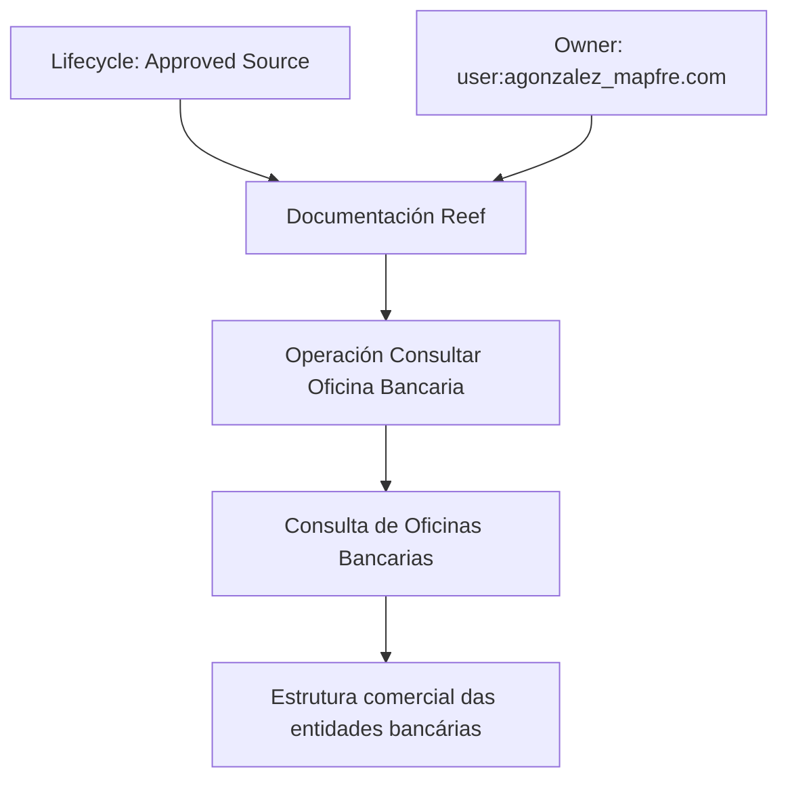

# Operação Consultar Oficina Bancaria — Documentação Reef

## 1. Metadados do Documento
- **Arquivo de Origem:** Não identificado no conteúdo fornecido
- **Tipo de Documento:** Documentação / Manual funcional resumido
- **Domínio / Sistema:** Reef; Mapfre
- **Público-Alvo:** Usuários de documentação Reef, analistas funcionais e equipes envolvidas com estruturas comerciais bancárias
- **Data/Versão Identificada:** Não identificada
- **Owner identificado:** `user:agonzalez_mapfre.com`
- **Lifecycle identificado:** `Approved Source`
- **Identificador adicional:** `VL`

---

## 2. Resumo Executivo & Contexto de Negócio

O conteúdo descreve a operação **“Consultar Oficina Bancaria”**, associada à consulta de oficinas bancárias conforme a estrutura comercial das entidades bancárias. A documentação está apresentada no contexto do portal **Reef**, com referências a **Mapfre** e à área de documentação denominada “DOCUMENTACIÓN Reef”.

O objetivo funcional explicitamente identificado é permitir a consulta de oficinas bancárias de acordo com a estrutura comercial de cada entidade bancária. O trecho não fornece detalhes sobre critérios de busca, campos retornados, regras de filtragem, métodos de integração, contratos de API ou comportamento de erro.

O portal de origem aparenta organizar conteúdos por áreas como Soluções, Arquiteturas, APIs, Componentes, Cloud, Documentação, Zeus, Reef e Ajuda. Essa estrutura de navegação indica que “Operación Consultar Oficina Bancaria” é um conteúdo documentado dentro desse ecossistema, mas não comprova relações técnicas entre as áreas listadas.

O ciclo de vida exibido como **Approved Source** sugere que o conteúdo possui uma classificação de aprovação na fonte documental. O significado operacional, o processo de aprovação e os responsáveis por essa classificação não são detalhados no material fornecido.

---

## 3. Arquitetura, Componentes & Tecnologias Envolvidas

Os únicos elementos identificáveis no conteúdo são:

- **Operación Consultar Oficina Bancaria:** operação de consulta de oficinas bancárias.
- **Reef:** contexto ou plataforma de documentação mencionada no cabeçalho e na navegação.
- **Mapfre:** organização, domínio ou marca referenciada pelo texto “Mapfredocument”.
- **Entidades bancárias:** organizações cuja estrutura comercial é usada como referência para a consulta.
- **Owner:** `user:agonzalez_mapfre.com`.
- **Lifecycle:** `Approved Source`.
- **VL:** identificador ou valor associado ao conteúdo, sem definição adicional.

O conteúdo não descreve arquitetura de software, camadas, microsserviços, bancos de dados, protocolos, APIs, endpoints, tecnologias, ambientes ou integrações. Portanto, não é possível reconstruir uma arquitetura técnica sem extrapolar os fatos disponíveis.



---

## 4. Regras de Negócio, Especificações Funcionais & Processos

### Regra funcional identificada

1. A operação denominada **“Consultar Oficina Bancaria”** realiza a consulta de oficinas bancárias.
2. A consulta deve considerar a **estrutura comercial das entidades bancárias**.
3. O conteúdo não especifica:
   - quais entidades bancárias são suportadas;
   - quais atributos formam a estrutura comercial;
   - quais campos identificam uma oficina bancária;
   - critérios de entrada, filtros ou ordenação;
   - regras de autorização;
   - formatos de resposta;
   - métodos HTTP, endpoints ou contratos JSON;
   - regras de tratamento de erro;
   - frequência de atualização dos dados.

> **Nota de Análise:** O documento apresenta a finalidade da operação “Consultar Oficina Bancaria”, mas não detalha a implementação técnica, os métodos de consulta nem os dados retornados.

---

## 5. Tabelas de Parâmetros, Ambientes e Estruturas de Dados

| Item / Parâmetro | Descrição / Função | Tipo / Valores / Formato | Ambiente / Observações |
| :--- | :--- | :--- | :--- |
| Operación Consultar Oficina Bancaria | Operação destinada à consulta de oficinas bancárias. | Nome de operação | Não há ambiente identificado. |
| Oficinas Bancarias | Objeto de consulta mencionado pelo documento. | Entidade de negócio; estrutura não detalhada | Não há campos ou atributos informados. |
| Estrutura comercial | Referência usada para consultar oficinas bancárias das entidades bancárias. | Regra funcional; estrutura não detalhada | Aplicável às entidades bancárias. |
| Entidades bancárias | Organizações cuja estrutura comercial é considerada na consulta. | Domínio de negócio | Nenhuma entidade bancária é nomeada. |
| Reef | Contexto ou portal de documentação mencionado no conteúdo. | Plataforma / área documental | Referenciado como “Documentation / DOCUMENTACIÓN Reef”. |
| Mapfre | Referência textual presente como “Mapfredocument”. | Organização, domínio ou marca; não detalhado | Relação técnica não especificada. |
| Owner | Responsável identificado no conteúdo. | `user:agonzalez_mapfre.com` | O papel e as responsabilidades não são detalhados. |
| Lifecycle | Estado ou classificação do documento. | `Approved Source` | Processo e significado da classificação não detalhados. |
| Identificador adicional | Valor apresentado após o Lifecycle. | `VL` | Sem descrição adicional. |
| Idioma da interface | Idioma exibido na navegação. | `ES` | O conteúdo principal está em espanhol. |

### Áreas de navegação listadas

| Área | Evidência no conteúdo | Observação |
| :--- | :--- | :--- |
| Buscar | Item de navegação | Sem detalhamento funcional. |
| Inicio | Item de navegação | Sem detalhamento funcional. |
| Soluciones | Item de navegação | Sem relação técnica comprovada com a operação. |
| Arquitecturas | Item de navegação | Sem arquitetura descrita no trecho. |
| APIs | Item de navegação | Nenhuma API específica é apresentada. |
| Componentes | Item de navegação | Nenhum componente específico é apresentado. |
| Cloud | Item de navegação | Nenhum serviço de nuvem é identificado. |
| Documentación | Item de navegação | Contexto documental geral. |
| Zeus | Item de navegação | Não há definição ou relação descrita. |
| Reef | Item de navegação e contexto documental | Relacionado diretamente ao cabeçalho “DOCUMENTACIÓN Reef”. |
| Ayuda | Item de navegação | Sem detalhamento funcional. |

---

## 6. Bateria de Perguntas & Respostas para RAG (FAQ Sintético)

### P1: Qual é o objetivo da operação “Consultar Oficina Bancaria”?
**R:** A operação “Consultar Oficina Bancaria” tem como objetivo consultar oficinas bancárias de acordo com a estrutura comercial das entidades bancárias.

### P2: A operação “Consultar Oficina Bancaria” informa quais dados são retornados para cada oficina bancária?
**R:** Não. O conteúdo apenas informa que a operação consulta oficinas bancárias conforme a estrutura comercial das entidades bancárias. Campos retornados, formatos e atributos das oficinas não são detalhados.

### P3: Quais entidades bancárias são suportadas pela consulta de oficinas?
**R:** O conteúdo menciona entidades bancárias de forma genérica, mas não identifica nomes de bancos ou outras entidades específicas suportadas pela operação.

### P4: Existe endpoint, método HTTP ou contrato JSON documentado para “Consultar Oficina Bancaria”?
**R:** Não. O material fornecido não apresenta endpoint, método HTTP, parâmetros de requisição, exemplo de resposta, contrato JSON ou códigos de erro.

### P5: Qual é o sistema ou contexto documental associado à operação?
**R:** A operação é apresentada no contexto de “Documentation / DOCUMENTACIÓN Reef” e do item de navegação “Reef”.

### P6: Quem está identificado como owner do conteúdo?
**R:** O conteúdo identifica o owner como `user:agonzalez_mapfre.com`. Não há descrição adicional sobre atribuições ou responsabilidades desse owner.

### P7: Qual lifecycle é exibido para o documento?
**R:** O lifecycle exibido é `Approved Source`. O documento não explica o significado operacional dessa classificação nem o fluxo de aprovação correspondente.

### P8: O conteúdo apresenta arquitetura de microsserviços ou integrações técnicas?
**R:** Não. Não são citados microsserviços, bancos de dados, filas, protocolos, tecnologias, URLs, ambientes ou integrações técnicas.

### P9: Qual regra de negócio está explicitamente descrita?
**R:** A regra explicitamente descrita é que a consulta de oficinas bancárias deve ocorrer de acordo com a estrutura comercial das entidades bancárias.

### P10: O que significa o identificador “VL” mostrado no conteúdo?
**R:** O conteúdo exibe o valor `VL`, mas não fornece definição, contexto, finalidade ou relacionamento desse identificador com a operação ou com o lifecycle.

---

## 7. Glossário de Termos, Siglas & Conceitos-Chave

- **Oficina Bancaria:** oficina bancária consultada pela operação descrita. O documento não define atributos, identificadores ou estrutura de dados dessa entidade.
- **Estrutura comercial:** referência organizacional ou comercial das entidades bancárias usada para realizar a consulta de oficinas bancárias. A composição da estrutura não é detalhada.
- **Entidades bancárias:** organizações bancárias cuja estrutura comercial é considerada pela operação.
- **Reef:** nome presente no contexto de documentação e navegação. O documento não define tecnicamente o que é Reef.
- **Mapfre:** termo presente em “Mapfredocument”. O conteúdo não descreve sua função, relacionamento técnico ou escopo.
- **Owner:** campo que identifica `user:agonzalez_mapfre.com` como responsável pelo conteúdo.
- **Lifecycle:** campo de estado do conteúdo, apresentado como `Approved Source`.
- **Approved Source:** classificação de lifecycle exibida no documento; significado não detalhado.
- **VL:** identificador exibido sem explicação.
- **ES:** indicador de idioma exibido na interface, associado ao espanhol.
- **Zeus:** item de navegação citado sem definição adicional.

---

## 8. Notas Críticas, Riscos & Limitações

- O material fornecido possui conteúdo extremamente resumido e não permite derivar especificações de implementação.
- Não há descrição de API, endpoint, protocolo, autenticação, autorização, contratos de dados, validações, tratamento de falhas ou observabilidade.
- Não há informações sobre ambientes, URLs, servidores, portas, variáveis de configuração ou caminhos de logs.
- Não há definição dos campos que compõem uma oficina bancária nem da estrutura comercial das entidades bancárias.
- Não há informação sobre atualização, sincronização, origem, qualidade ou governança dos dados consultados.
- O texto extraído apresenta caracteres corrompidos em “Ocina”, interpretado contextualmente como “Oficina”, pois o próprio título e a descrição mencionam “Oficinas Bancarias”.
- O item `VL` é exibido sem contexto suficiente para classificá-lo como versão, ambiente, domínio ou outro tipo de identificador.
- As áreas “Soluciones”, “Arquitecturas”, “APIs”, “Componentes”, “Cloud”, “Zeus” e “Ayuda” aparecem como navegação; não devem ser interpretadas como dependências técnicas da operação.

---

## 9. Conteúdo Bruto Estruturado (Referência Fiel)

```text
--- [PÁGINA 1 DE 1] ---

OPERACIÓN CONSULTAR Ocina Bancaria
Consulta de las Ocinas Bancarias de acuerdo con la estructura comercial de las entidades bancarias.
Documentation / DOCUMENTACIÓN Reef
DOCUMENTACIÓN Reef
Mapfredocument
DOCUMENTACIÓN Reef
Owner
user:agonzalez_mapfre.com
Lifecycle
Approved Source
 / 
 VL
Buscar Inicio Soluciones Arquitecturas APIs Componentes Cloud Documentación Zeus Reef Ayuda
ES
```
