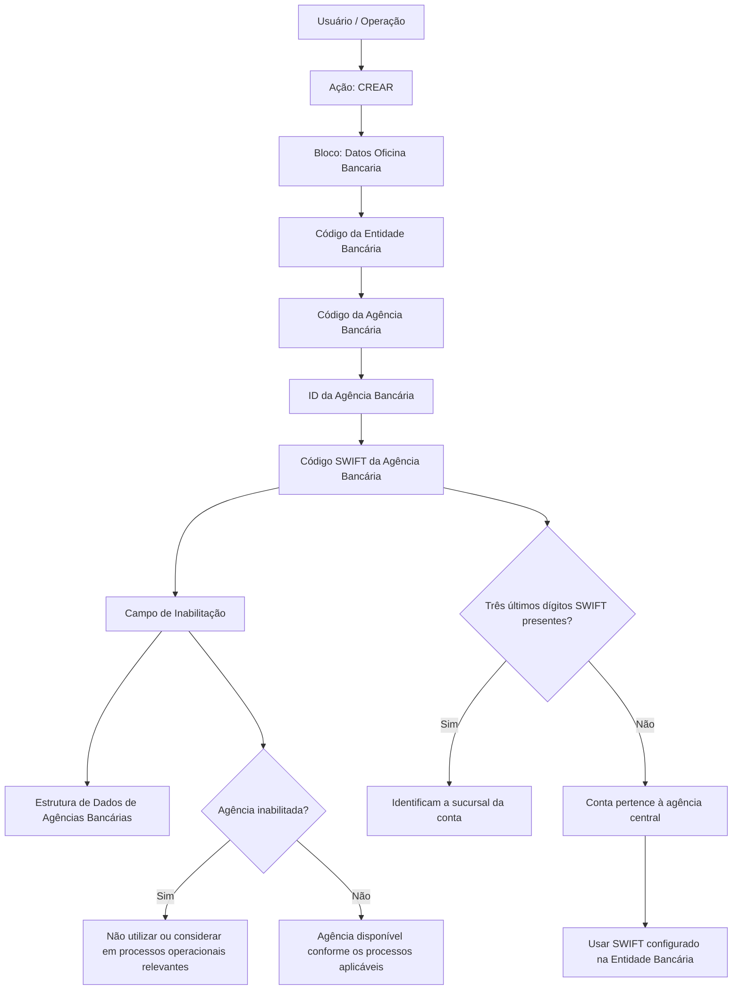

# Cadastro de Informações da Agência Bancária — Estrutura de Dados Operacional

## 1. Metadados do Documento
- **Arquivo de Origem:** Não identificado no conteúdo fornecido
- **Tipo de Documento:** Especificação Técnica / Procedimento de Cadastro
- **Domínio / Sistema:** DOCUMENTACIÓN Reef / Mapfre
- **Público-Alvo:** Operação, Negócio, Analistas Funcionais e Desenvolvedores
- **Data/Versão Identificada:** Não identificada

---

## 2. Resumo Executivo & Contexto de Negócio

O documento descreve o cadastro de informações de uma **Agência Bancária** em uma estrutura de dados corporativa. O objetivo declarado é identificar, detalhar, classificar e disponibilizar para consulta e exploração posterior informações de âmbito operacional relacionadas às agências bancárias.

A funcionalidade explicitamente habilitada é a ação **CREAR**. O processo de captura dos dados segue uma ordem definida: da esquerda para a direita e de cima para baixo no bloco de informações denominado **Datos Oficina Bancaria**.

A estrutura registra a associação entre uma agência e sua entidade bancária, utilizando códigos para identificar a entidade, a agência e o código interno territorial da agência. Também contempla o código SWIFT, empregado para identificar o banco e a agência destinatária em transferências internacionais.

O documento estabelece uma regra relevante para códigos SWIFT: os três últimos dígitos são opcionais. Quando presentes, identificam a sucursal na qual a conta está localizada; quando ausentes, entende-se que a conta pertence à agência central do banco e deve ser utilizado o código SWIFT configurado no nível da entidade bancária.

Por fim, o cadastro contém um campo de inabilitação. Uma Agência Bancária inabilitada não deve ser utilizada, considerada ou contemplada em processos operacionais da entidade quando o estado da agência for relevante.

---

## 3. Arquitetura, Componentes & Tecnologias Envolvidas

Os componentes e conceitos explicitamente citados são:

- **Sistema:** Sistema não nomeado no conteúdo extraído.
- **Estrutura de Dados:** Estrutura utilizada para registrar informações operacionais de Agências Bancárias.
- **Bloco de Informação:** `Datos Oficina Bancaria`.
- **Entidade Bancária:** Banco ao qual uma agência bancária é associada.
- **Agência Bancária / Oficina Bancaria:** Sucursal bancária cadastrada na estrutura de dados.
- **Estrutura Territorial:** Configuração territorial própria da Entidade Bancária, utilizada para o código interno da agência.
- **Código SWIFT:** Código usado para identificar banco e agência receptora em transferências internacionais.
- **DOCUMENTACIÓN Reef / Mapfre:** Referências de documentação exibidas no conteúdo extraído.



> **Nota de Análise:** O conteúdo não informa tecnologia de implementação, banco de dados, interface, endpoints HTTP, contratos JSON, autenticação, integrações sistêmicas ou ambientes técnicos.

---

## 4. Regras de Negócio, Especificações Funcionais & Processos

### 4.1 Objetivo do Cadastro

O registro das informações na estrutura de dados é necessário para:

1. Identificar informações de âmbito operacional das Agências Bancárias.
2. Detalhar informações de âmbito operacional das Agências Bancárias.
3. Classificar adequadamente as Agências Bancárias.
4. Permitir consulta posterior das informações cadastradas.
5. Permitir exploração posterior das informações cadastradas.

### 4.2 Ação Habilitada

A única ação explicitamente apresentada no conteúdo é:

- **CREAR:** criação de um registro de informações de Agência Bancária.

### 4.3 Sequência de Captura

O bloco `Datos Oficina Bancaria` define que os atributos devem seguir a sequência de captura:

1. Da esquerda para a direita.
2. De cima para baixo.

A sequência de campos apresentada é:

1. Código da Entidade Bancária.
2. Código da Agência Bancária.
3. ID da Agência Bancária.
4. Código SWIFT da Agência Bancária.
5. Inabilitação.

### 4.4 Associação entre Entidade Bancária e Agência Bancária

- O **Código da Entidade Bancária** contém a chave do banco à qual a agência bancária em definição será associada.
- O **Código da Agência Bancária** é a chave utilizada para identificar a sucursal bancária associada ao Código da Entidade Bancária previamente capturado.
- Portanto, a identificação da Agência Bancária depende da associação prévia com uma Entidade Bancária.

### 4.5 Identificador Interno Territorial

O **ID da Agência Bancária** contém o código interno da Agência Bancária de acordo com a configuração da estrutura territorial própria da Entidade Bancária.

O documento não detalha:

- O formato do ID da Agência Bancária.
- A tabela de domínios da estrutura territorial.
- A origem ou mecanismo de validação do código interno.
- A obrigatoriedade do campo.

### 4.6 Regra do Código SWIFT

O **Código SWIFT da Agência Bancária** é utilizado para registrar o código SWIFT que identifica:

- O banco.
- A agência receptora de uma transferência internacional.

Regras adicionais:

1. Os três últimos dígitos do código SWIFT são opcionais.
2. Quando os três últimos dígitos estão presentes, os dígitos fazem referência à sucursal na qual a conta específica se encontra.
3. Quando os três últimos dígitos não estão presentes, entende-se que a conta pertence à agência central do banco.
4. Quando os três últimos dígitos não estão presentes, o código SWIFT utilizado é aquele configurado no nível da Entidade Bancária.

### 4.7 Regra de Inabilitação

O campo **Inhabilitación** informa ao Sistema que a Agência Bancária está inabilitada.

Quando uma Agência Bancária está inabilitada:

- Não deve ser empregada.
- Não deve ser contemplada.
- Não deve ser considerada.
- A restrição se aplica aos processos operacionais da entidade nos quais o estado da Agência Bancária seja relevante.

> **Nota de Análise:** O documento não define os valores possíveis, o formato ou o comportamento de validação do campo `Inhabilitación`. Também não especifica se a inabilitação é reversível nem quais processos operacionais verificam esse estado.

---

## 5. Tabelas de Parâmetros, Ambientes e Estruturas de Dados

| Item / Parâmetro | Descrição / Função | Tipo / Valores / Formato | Ambiente / Observações |
| :--- | :--- | :--- | :--- |
| Ação habilitada | Permite criar informações na estrutura de dados de Agências Bancárias. | `CREAR` | O conteúdo não apresenta outras ações habilitadas. |
| Bloco de informação | Agrupa os atributos do cadastro da agência bancária. | `Datos Oficina Bancaria` | Os atributos seguem a ordem da esquerda para a direita e de cima para baixo. |
| Código da Entidade Bancária | Contém a chave do banco ao qual a agência bancária será associada. | Não especificado | Deve ser capturado antes do Código da Agência Bancária. |
| Código da Agência Bancária | Identifica a sucursal bancária associada ao Código da Entidade Bancária capturado anteriormente. | Não especificado | A identificação é associada à entidade bancária previamente informada. |
| ID da Agência Bancária | Contém o código interno da Agência Bancária conforme a configuração territorial própria da Entidade Bancária. | Não especificado | O documento não detalha a estrutura territorial nem o formato do identificador. |
| Código SWIFT da Agência Bancária | Registra o código SWIFT usado para identificar banco e agência receptora de transferência internacional. | Três últimos dígitos opcionais | Se os três dígitos finais estiverem ausentes, aplica-se o SWIFT configurado no nível da Entidade Bancária. |
| Três últimos dígitos do SWIFT | Referenciam a sucursal em que determinada conta está localizada. | Opcionais | Quando não presentes, a conta é entendida como pertencente à agência central do banco. |
| Inabilitação | Indica que a Agência Bancária está inabilitada no Sistema. | Não especificado | Agências inabilitadas não devem ser usadas, consideradas ou contempladas nos processos relevantes. |
| DOCUMENTACIÓN Reef | Referência de documentação exibida no conteúdo bruto. | Texto de navegação/documentação | O documento não explica a função técnica da plataforma. |
| Owner | Proprietário exibido na documentação. | `user:agonzalez_mapfre.com` | Informação presente no conteúdo bruto extraído. |
| Lifecycle | Estado de ciclo de vida exibido na documentação. | `Approved Source` | Não há detalhamento adicional sobre o significado operacional desse estado. |
| Referência adicional | Texto exibido após `Approved Source`. | `VL` | O significado não é explicado no conteúdo fornecido. |

---

## 6. Bateria de Perguntas & Respostas para RAG (FAQ Sintético)

### P1: Qual é o objetivo do cadastro de informações da Agência Bancária?
**R:** O cadastro existe para identificar, detalhar e classificar informações de âmbito operacional das Agências Bancárias, permitindo sua consulta e exploração posterior na estrutura de dados corporativa.

### P2: Qual ação está habilitada para o registro de uma Agência Bancária?
**R:** A ação explicitamente habilitada no documento é `CREAR`, destinada à criação de informações de Agência Bancária na estrutura de dados.

### P3: Qual é a ordem de preenchimento dos atributos no bloco Datos Oficina Bancaria?
**R:** Os atributos devem ser capturados da esquerda para a direita e de cima para baixo. A sequência apresentada é: Código da Entidade Bancária, Código da Agência Bancária, ID da Agência Bancária, Código SWIFT da Agência Bancária e Inabilitação.

### P4: Para que serve o Código da Entidade Bancária?
**R:** O Código da Entidade Bancária contém a chave do banco ao qual a agência bancária que está sendo definida será associada.

### P5: Como uma Agência Bancária é identificada no cadastro?
**R:** A Agência Bancária é identificada pelo Código da Agência Bancária, que corresponde à chave da sucursal bancária associada ao Código da Entidade Bancária capturado previamente.

### P6: O que representa o ID da Agência Bancária?
**R:** O ID da Agência Bancária contém o código interno da agência, definido de acordo com a configuração da estrutura territorial própria da Entidade Bancária. O documento não detalha o formato nem a composição desse código.

### P7: Qual é a finalidade do Código SWIFT da Agência Bancária?
**R:** O Código SWIFT é registrado para identificar o banco e a agência receptora em uma transferência internacional.

### P8: Os três últimos dígitos do código SWIFT são obrigatórios?
**R:** Não. Os três últimos dígitos do código SWIFT são opcionais. Quando informados, identificam a sucursal na qual uma conta específica está localizada.

### P9: O que ocorre quando os três últimos dígitos do código SWIFT não são informados?
**R:** Quando os três últimos dígitos não estão presentes, entende-se que a conta pertence à agência central do banco. Nessa situação, o código SWIFT aplicável é o configurado no nível da Entidade Bancária.

### P10: O que significa uma Agência Bancária estar inabilitada?
**R:** Uma Agência Bancária inabilitada é uma agência que não deve ser empregada, contemplada ou considerada nos processos operacionais da entidade em que o estado da agência seja relevante.

### P11: O documento informa os valores permitidos para o campo Inabilitação?
**R:** Não. O conteúdo informa apenas a finalidade do campo Inabilitação, mas não apresenta valores permitidos, formato, regra de preenchimento ou critérios para reversão da inabilitação.

### P12: O documento define APIs, métodos HTTP ou contratos de integração para o cadastro de Agências Bancárias?
**R:** Não. O conteúdo extraído descreve campos e regras funcionais do cadastro, mas não detalha APIs, métodos HTTP, contratos JSON, bancos de dados, integrações ou tecnologias de implementação.

---

## 7. Glossário de Termos, Siglas & Conceitos-Chave

- **Agência Bancária / Oficina Bancaria:** Sucursal bancária cujas informações operacionais são registradas na estrutura de dados.
- **Código da Agência Bancária / Código de la Oficina Bancaria:** Chave que identifica a sucursal bancária associada a uma Entidade Bancária.
- **Código da Entidade Bancária / Código de la Entidad Bancaria:** Chave do banco ao qual uma Agência Bancária é associada.
- **CREAR:** Ação habilitada para criar o registro de informações de Agência Bancária.
- **Dados Oficina Bancaria / Datos Oficina Bancaria:** Bloco de informações que reúne os atributos da Agência Bancária.
- **Entidade Bancária / Entidad Bancaria:** Banco ao qual a Agência Bancária está associada.
- **ID da Agência Bancária / ID de la Oficina Bancaria:** Código interno da agência conforme a estrutura territorial da Entidade Bancária.
- **Inhabilitación:** Campo que informa que a Agência Bancária está inabilitada no Sistema.
- **Sucursal:** Agência ou filial bancária.
- **SWIFT:** Sigla de *Society for Worldwide Interbank Financial Telecommunication*; código utilizado para identificar o banco e a agência receptora de uma transferência internacional.
- **DOCUMENTACIÓN Reef:** Referência de documentação exibida no material extraído.
- **Lifecycle:** Campo de ciclo de vida exibido com o valor `Approved Source`.

---

## 8. Notas Críticas, Riscos & Limitações

- O arquivo de origem, a data e a versão do documento não foram identificados no conteúdo fornecido.
- O documento não apresenta o nome do Sistema que consome ou armazena a estrutura de dados.
- O conteúdo não especifica obrigatoriedade, tamanho, máscara, formato ou validações dos campos de cadastro.
- O documento não informa valores permitidos para o campo `Inhabilitación`.
- O documento não detalha os mecanismos de validação do Código da Entidade Bancária, Código da Agência Bancária, ID da Agência Bancária ou Código SWIFT.
- Não há descrição de APIs, métodos HTTP, contratos JSON, persistência, eventos, integrações, autenticação, autorização, logs ou monitoramento.
- Não são fornecidos exemplos completos de código SWIFT.
- O texto extraído contém caracteres corrompidos ou substituídos em palavras como `Ocina`, `deniendo` e `conguración`; a interpretação adotada preserva o significado contextual aparente, sem acrescentar dados não fornecidos.
- **Nota de Análise:** O documento lista o bloco `Datos Oficina Bancaria`, mas não detalha a interface, as regras de erro, o comportamento de atualização ou o processo de consulta das informações cadastradas.

---

## 9. Conteúdo Bruto Estruturado (Referência Fiel)

```text
--- [PÁGINA 1 DE 2] ---

CREAR Información especíca de la Ocina Bancaria
Objetivo
El registro de la información en esta Estructura de Datos obedece a la necesidad de identicar y detallar la información de ámbito operativo
de las Ocinas Bancarias además de clasicarlas adecuadamente para su posterior consulta y explotación.
Acciones habilitadas
 CREAR ( )
Datos Ocina Bancaria
De Izquierda a Derecha y de Arriba hacia Abajo, los siguientes atributos marcan la secuencia de captura en este Bloque de Información.
Código de la Entidad Bancaria (  )
Este campo contiene la clave del banco a la que estará asociada la sucursal bancaria que se esté deniendo.
Código de la Ocina Bancaria ( )
Este dato será la clave por la que se va a identicar la sucursal bancaria que estará asociada al código de Entidad Bancaria previamente
capturado.
ID de la Ocina Bancaria ( )
Este campo contiene el código interno de la Ocina Bancaria de acuerdo con la conguración de la estructura Territorial propia que tenga la
entidad Bancaria.
Código SWIFT de la Ocina Bancaria ( )
Este campo sirve para registrar el código SWIFT (acrónimo de Society for Worldwide Interbank Financial Telecommunication) que se utiliza
para identicar al banco y la ocina receptora de una transferencia internacional.
Ejemplo:
Documentation / DOCUMENTACIÓN Reef
DOCUMENTACIÓN Reef
Mapfredocument
DOCUMENTACIÓN Reef
Owner
user:agonzalez_mapfre.com
Lifecycle
Approved Source
 /
 VL
Buscar Inicio Soluciones Arquitecturas APIs Componentes Cloud Documentación Zeus Reef Ayuda
ES


--- [PÁGINA 2 DE 2] ---

Los tres últimos dígitos son opcionales y en caso de aparecer hacen referencia a la sucursal en la que se encuentra la cuenta en concreto.
Si no estuvieran presentes se entiende que pertenece a la ocina central del banco y por tanto el código SWIFT sería el congurado a nivel
de la Entidad Bancaria.
Inhabilitación ( )
Este campo le indica al Sistema que la Ocina Bancaria está inhabilitada en el Sistema por lo cual, de estarlo, no debería ser empleada,
contemplada o considerada en los procesos operativos de la entidad en los que el estado de la Ocina sea relevante..
```
