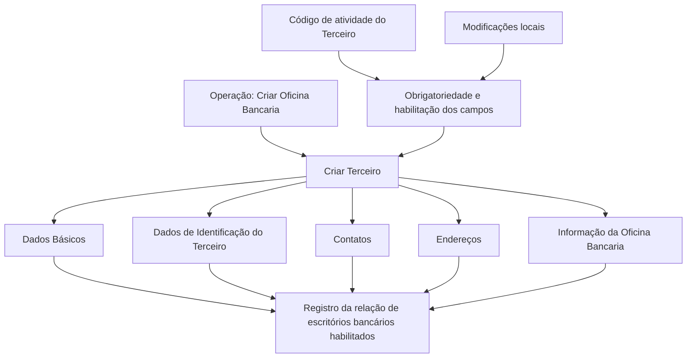

# Operação “Criar Oficina Bancaria” — Registro de Escritórios Bancários por Entidade Bancária

## 1. Metadados do Documento
- **Arquivo de Origem:** Não informado; conteúdo bruto fornecido pelo usuário
- **Tipo de Documento:** Procedimento
- **Domínio / Sistema:** Operação de cadastro de terceiros e escritórios bancários; documentação Reef / Mapfre
- **Público-Alvo:** Operação, negócio e usuários do sistema
- **Data/Versão Identificada:** Não identificada

---

## 2. Resumo Executivo & Contexto de Negócio

O documento descreve a operação **“Crear Oficina Bancaria”**, destinada a registrar no sistema a relação de escritórios bancários habilitados por uma entidade bancária em uma entidade seguradora.

O registro de um escritório bancário deve ser realizado no contexto de criação de um terceiro. A premissa explícita é que os escritórios bancários da entidade seguradora são sempre criados como **pessoas jurídicas**.

O processo combina blocos de informação compartilhados pelo cadastro de terceiros — dados básicos, identificação, contatos e endereços — com um bloco específico de informação do escritório bancário. A obrigatoriedade e a habilitação dos campos podem variar conforme o código de atividade do terceiro.

O documento também alerta que modificações implementadas localmente podem alterar o comportamento da aplicação quanto à obrigatoriedade do preenchimento dos dados do terceiro. Além disso, a ordem de captura dos blocos de informação pode variar conforme o critério adotado pelo usuário no sistema.

---

## 3. Arquitetura, Componentes & Tecnologias Envolvidas

O conteúdo não apresenta tecnologias, protocolos, microsserviços, bancos de dados, URLs operacionais, APIs, contratos HTTP ou ambientes técnicos. Os elementos funcionais identificados são:

- **Sistema:** aplicação não nomeada que mantém o cadastro.
- **Operação “Crear Oficina Bancaria”:** processo de registro de escritórios bancários.
- **Criar Terceiro:** fluxo-base para criação do registro associado ao escritório bancário.
- **Blocos de Informação Compartilhados:** dados básicos, identificação do terceiro, contatos e endereços.
- **Bloco de Informação Específico:** informação do escritório bancário.
- **Entidade Bancária:** entidade que habilita escritórios bancários.
- **Entidade Seguradora:** entidade em que a relação dos escritórios bancários é registrada.



> **Nota de Análise:** o documento não detalha telas, campos individuais, regras de validação por código de atividade, métodos de integração ou contratos de dados.

---

## 4. Regras de Negócio, Especificações Funcionais & Processos

### Objetivo da operação

A operação “Crear Oficina Bancaria” permite registrar no sistema a relação de escritórios bancários que foram habilitados por uma entidade bancária na entidade seguradora.

### Premissas obrigatórias

1. Os escritórios bancários da entidade seguradora devem ser criados sempre como **pessoas jurídicas**.
2. O registro do escritório bancário é realizado por meio do fluxo de **Criar Terceiro**.
3. O processo contém blocos de informação compartilhados e blocos específicos conforme a atividade do terceiro.
4. A obrigatoriedade e/ou a habilitação dos campos pode variar conforme o **código de atividade do terceiro**.
5. Modificações implementadas localmente podem afetar o comportamento da aplicação quanto à obrigatoriedade de registro dos dados do terceiro.
6. A sequência de captura dos dados nos blocos de informação pode variar conforme o critério utilizado pelo usuário no sistema.

### Processo funcional identificado

1. Iniciar a operação **Criar Oficina Bancaria**.
2. Executar o fluxo **Criar Terceiro**.
3. Preencher os blocos de informação compartilhados:
   - Dados Básicos;
   - Dados de Identificação do Terceiro;
   - Contatos;
   - Endereços.
4. Preencher o bloco específico **Informação da Oficina Bancaria**.
5. Considerar o código de atividade do terceiro para determinar a obrigatoriedade e a disponibilidade dos campos.
6. Considerar eventuais modificações locais que possam alterar a obrigatoriedade dos dados.
7. Registrar a relação do escritório bancário habilitado pela entidade bancária na entidade seguradora.

> **Nota de Análise:** o documento não especifica critérios de sucesso, mensagens de erro, aprovação, persistência, exclusão, alteração ou consulta de escritórios bancários.

---

## 5. Tabelas de Parâmetros, Ambientes e Estruturas de Dados

| Item / Parâmetro | Descrição / Função | Tipo / Valores / Formato | Ambiente / Observações |
| :--- | :--- | :--- | :--- |
| Operação “Crear Oficina Bancaria” | Registra a relação de escritórios bancários habilitados por entidade bancária em entidade seguradora. | Operação funcional | Sistema não identificado no conteúdo. |
| Oficina Bancaria | Escritório bancário a ser registrado. | Cadastro de terceiro | Deve ser criado como pessoa jurídica. |
| Entidade Bancária | Entidade que habilita os escritórios bancários. | Entidade de negócio | Não há atributos ou identificadores detalhados. |
| Entidade Seguradora | Entidade na qual a relação de escritórios bancários é registrada. | Entidade de negócio | Não há atributos ou identificadores detalhados. |
| Criar Terceiro | Fluxo utilizado para criar o registro associado ao escritório bancário. | Processo de cadastro | Inclui blocos compartilhados e bloco específico. |
| Dados Básicos | Bloco compartilhado de informação do terceiro. | Bloco de informação | Campos não detalhados. |
| Dados de Identificação do Terceiro | Bloco compartilhado de identificação do terceiro. | Bloco de informação | Campos não detalhados. |
| Contatos | Bloco compartilhado de contatos do terceiro. | Bloco de informação | Campos não detalhados. |
| Endereços | Bloco compartilhado de endereços do terceiro. | Bloco de informação | Campos não detalhados. |
| Informação da Oficina Bancaria | Bloco específico para a atividade de escritório bancário. | Bloco de informação específico | Campos não detalhados. |
| Código de atividade do Terceiro | Critério que pode determinar obrigatoriedade e habilitação dos campos. | Código de classificação | Valores não informados. |
| Modificações locais | Alterações implementadas localmente que podem afetar a obrigatoriedade dos dados. | Configuração ou customização local | Detalhes não informados. |
| Ordem de captura | Sequência de preenchimento dos blocos de informação. | Fluxo de operação | Pode variar conforme o critério do usuário. |

---

## 6. Bateria de Perguntas & Respostas para RAG (FAQ Sintético)

### P1: Qual é o objetivo da operação “Crear Oficina Bancaria”?
**R:** A operação “Crear Oficina Bancaria” permite registrar no sistema a relação de escritórios bancários habilitados por uma entidade bancária em uma entidade seguradora.

### P2: Como um escritório bancário deve ser criado no cadastro?
**R:** O documento estabelece que os escritórios bancários da entidade seguradora devem ser sempre criados como pessoas jurídicas.

### P3: Qual processo deve ser utilizado para registrar uma oficina bancária?
**R:** O registro utiliza o processo de **Criar Terceiro**, que contém blocos de informação compartilhados e um bloco específico para a informação da oficina bancária.

### P4: Quais blocos compartilhados fazem parte do processo Criar Terceiro?
**R:** Os blocos compartilhados identificados são: Dados Básicos, Dados de Identificação do Terceiro, Contatos e Endereços.

### P5: Qual bloco contém os dados específicos de um escritório bancário?
**R:** O bloco específico identificado no documento é **Informação da Oficina Bancaria**, aplicável conforme a atividade do terceiro.

### P6: A obrigatoriedade dos campos é fixa para todos os terceiros?
**R:** Não. A obrigatoriedade e/ou a habilitação dos campos nos blocos ou estruturas de informação compartilhadas pode variar de acordo com o código de atividade do terceiro.

### P7: Modificações locais podem alterar o comportamento do cadastro?
**R:** Sim. O documento informa que modificações implementadas localmente podem afetar o comportamento da aplicação em relação à obrigatoriedade do registro dos dados do terceiro.

### P8: A sequência de preenchimento dos blocos de informação é obrigatória?
**R:** Não necessariamente. O documento informa que a ordem de captura dos dados nos diferentes blocos de informação pode variar de acordo com o critério seguido pelo usuário no sistema.

### P9: O documento informa quais campos devem ser preenchidos em Dados Básicos, Contatos ou Endereços?
**R:** Não. O documento apenas lista os blocos de informação; ele não detalha os campos, formatos, regras de validação ou valores permitidos para esses blocos.

### P10: O documento define APIs, métodos HTTP ou contratos JSON para o cadastro de escritórios bancários?
**R:** Não. O conteúdo fornecido descreve um processo funcional de cadastro e não apresenta APIs, métodos HTTP, contratos JSON, tecnologias ou integrações técnicas.

---

## 7. Glossário de Termos, Siglas & Conceitos-Chave

- **Oficina Bancaria:** escritório bancário habilitado por uma entidade bancária e registrado na entidade seguradora.
- **Criar Terceiro:** processo utilizado para criar o registro de terceiro associado ao escritório bancário.
- **Pessoa Jurídica:** classificação obrigatória indicada pelo documento para escritórios bancários da entidade seguradora.
- **Entidade Bancária:** entidade que habilita escritórios bancários.
- **Entidade Seguradora:** entidade na qual é registrada a relação de escritórios bancários habilitados.
- **Código de atividade do Terceiro:** critério que pode influenciar a obrigatoriedade e/ou a habilitação dos campos do cadastro.
- **Blocos de Informação Compartilhados:** estruturas de dados comuns no processo Criar Terceiro: dados básicos, identificação, contatos e endereços.
- **Informação da Oficina Bancaria:** bloco específico de informação aplicável ao escritório bancário.
- **Reef:** termo presente no rodapé de documentação; o conteúdo não define seu significado funcional ou técnico.
- **Mapfre:** termo presente em identificação de documentação e conta de usuário; o conteúdo não detalha seu papel no processo.

---

## 8. Notas Críticas, Riscos & Limitações

- O documento não identifica o nome do sistema no qual a operação é executada.
- O documento não detalha os campos dos blocos de Dados Básicos, Identificação do Terceiro, Contatos, Endereços ou Informação da Oficina Bancaria.
- Não há lista de códigos de atividade do terceiro nem regras específicas de obrigatoriedade para cada código.
- Modificações locais podem alterar a obrigatoriedade dos dados, criando risco de comportamento diferente entre instalações ou configurações locais.
- A ordem de preenchimento pode variar conforme o usuário, sem que o documento apresente um fluxo obrigatório ou critérios de dependência entre blocos.
- Não há informações sobre validações, mensagens de erro, permissões, auditoria, integrações, APIs, ambientes, URLs, versões ou responsáveis técnicos.
- **Nota de Análise:** o documento lista a operação “Crear Oficina Bancaria”, porém não detalha os métodos técnicos, contratos de dados ou campos expostos pelo sistema.

---

## 9. Conteúdo Bruto Estruturado (Referência Fiel)

```text
--- [PÁGINA 1 DE 1] ---

OPERACIÓN CREAR Ocina Bancaria
¿En que consiste?
Esta operación permite registrar en el Sistema la relación de Ocinas Bancarias habilitadas por Entidad Bancaria en la Entidad Aseguradora.
Premisas
Las Ocinas Bancarias de la Entidad Aseguradora siempre se crearán como Personas Jurídicas.
La obligatoriedad y/o la habilitación de los campos en el registro de los datos de cada uno de los bloques o estructuras de información
compartidas puede variar de acuerdo con el código de actividad del Tercero:
Las modicaciones que se hubieran podido implementar localmente a su vez pueden afectar el comportamiento de la aplicación en
relación con la obligatoriedad en el registro de los Datos del Tercero.
Por último, el orden de captura de los datos en los distintos bloques de Información puede variar de acuerdo con el criterio seguido por el
Usuario en el Sistema.
Proceso
CREAR
TERCERO
Crear Información de
la Oficina Bancaria
Bloques de Información Compartidos (CREAR TERCERO)
 Datos Básicos ( )
 Datos Identicación del Tercero ( )
 Contactos ( )
 Direcciones ( )
Bloques de Información Especícos de acuerdo con la Actividad del Tercero.
 Información de la Ocina Bancaria ( )
Ejemplo:
Documentation / DOCUMENTACIÓN Reef
DOCUMENTACIÓN Reef
Mapfredocument
DOCUMENTACIÓN Reef
Owner
user:agonzalez_mapfre.com
Lifecycle
Approved Source
 / 
 VL
Buscar Inicio Soluciones Arquitecturas APIs Componentes Cloud Documentación Zeus Reef Ayuda
ES
```
