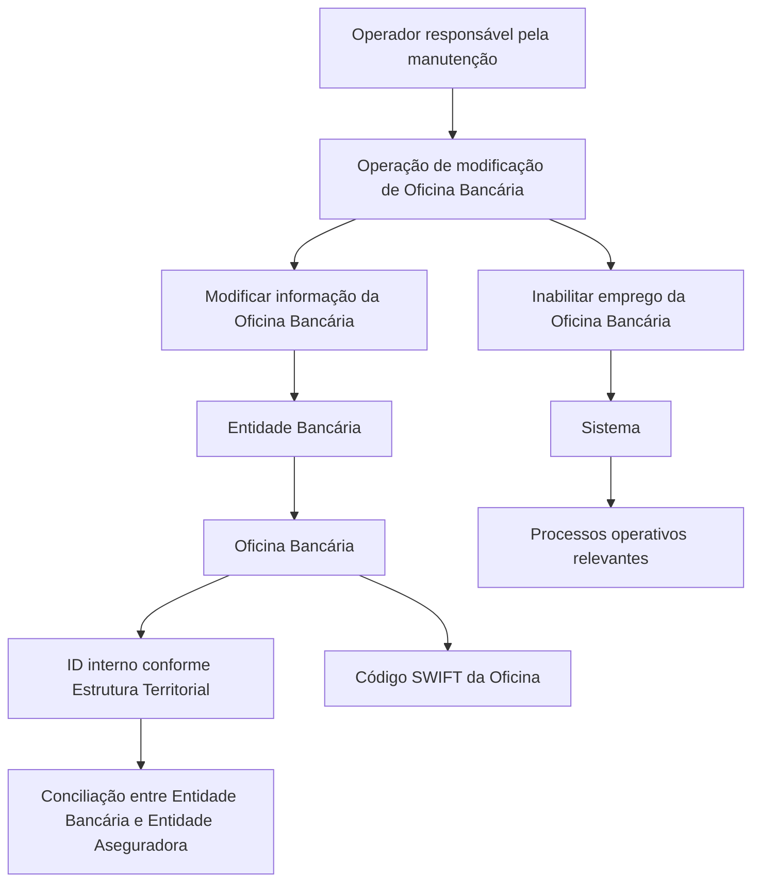

# Operação de Modificação e Inabilitação de Oficinas Bancárias

## 1. Metadados do Documento
- **Arquivo de Origem:** Não identificado
- **Tipo de Documento:** Manual Operacional
- **Domínio / Sistema:** Reef / Mapfre — gestão de Entidades e Oficinas Bancárias
- **Público-Alvo:** Operação, Negócio e equipes responsáveis pela manutenção cadastral bancária
- **Data/Versão Identificada:** Não identificada

---

## 2. Resumo Executivo & Contexto de Negócio

O documento descreve uma operação destinada à manutenção das informações de Oficinas Bancárias associadas a uma Entidade Bancária. A operação permite modificar dados da oficina bancária ou inabilitar o uso da oficina nos processos operativos da entidade.

A sequência de captura dos atributos no bloco “Dados Entidad Bancaria” é definida da esquerda para a direita e de cima para baixo. Os campos abrangem o código da entidade bancária, o código da oficina bancária, o identificador interno da oficina e o código SWIFT da oficina.

O correto preenchimento e manutenção do identificador interno da Oficina Bancária facilita a conciliação de operações entre a Entidade Bancária e a Entidade Aseguradora. O código SWIFT permite identificar o banco e a oficina receptora em transferências internacionais.

A inabilitação de uma Oficina Bancária indica ao sistema que a oficina não deve ser empregada, contemplada ou considerada nos processos operativos da entidade quando o estado da oficina for relevante. O documento não detalha a interface, os critérios de autorização, os métodos técnicos, os contratos de integração ou os efeitos de persistência da operação.

---

## 3. Arquitetura, Componentes & Tecnologias Envolvidas

Os elementos identificados no documento são:

| Componente / Termo | Papel descrito |
| :--- | :--- |
| Reef | Repositório ou contexto documental citado na interface de documentação. |
| Mapfre | Contexto corporativo identificado pela referência `Mapfredocument` e pelo proprietário `agonzalez_mapfre.com`. |
| Entidade Bancária | Banco ao qual uma Oficina Bancária está associada. |
| Oficina Bancária | Sucursal bancária cuja informação pode ser modificada ou inabilitada. |
| Entidade Aseguradora | Entidade participante da conciliação de operações com a Entidade Bancária. |
| Sistema | Sistema que recebe o estado de inabilitação da Oficina Bancária. |
| Código SWIFT | Código utilizado para identificar banco e oficina receptora de transferência internacional. |
| Estrutura Territorial | Configuração da Entidade Bancária usada como referência para o código interno da Oficina Bancária. |



> **Nota de Análise:** O documento não detalha tecnologias de implementação, integrações, APIs, bancos de dados, ambientes, URLs, métodos HTTP ou contratos JSON.

---

## 4. Regras de Negócio, Especificações Funcionais & Processos

### 4.1 Objetivo da operação
A operação permite:

1. **Modificar** a informação das Oficinas Bancárias.
2. **Inabilitar** o emprego de uma Oficina Bancária nos processos operativos da entidade.

### 4.2 Ações habilitadas
As ações habilitadas explicitamente no documento são:

- `MODIFICAR`
- `INHABILITAR`

### 4.3 Sequência de captura
No bloco de informação “Datos Entidad Bancaria”, a captura dos atributos segue esta sequência:

1. Da esquerda para a direita.
2. De cima para baixo.

### 4.4 Código da Entidade Bancária
O campo “Código de la Entidad Bancaria” apresenta a chave do banco ao qual a sucursal bancária está associada.

### 4.5 Código da Oficina Bancária
O campo “Código de la Oficina Bancaria” apresenta a chave que identifica a sucursal bancária.

### 4.6 ID da Oficina Bancária
O campo “ID de la Oficina Bancaria” contém o código interno da Oficina Bancária conforme a configuração da Estrutura Territorial fornecida pela Entidade Bancária.

A manutenção correta desse dado facilita a conciliação das operações entre a Entidade Bancária e a Entidade Aseguradora.

### 4.7 Código SWIFT da Oficina Bancária
O campo “Código SWIFT de la Oficina Bancaria” registra o código SWIFT, sigla de *Society for Worldwide Interbank Financial Telecommunication*. O código é utilizado para identificar:

- O banco.
- A oficina receptora de uma transferência internacional.

Os três últimos dígitos do código SWIFT são opcionais. Quando presentes, esses três dígitos fazem referência à sucursal em que a conta está localizada.

Quando os três últimos dígitos não estiverem presentes, entende-se que a conta pertence à oficina central do banco. Nesse cenário, deve ser usado o código SWIFT configurado no nível da Entidade Bancária.

### 4.8 Inabilitação da Oficina Bancária
O campo “Inhabilitación” informa ao Sistema que a Oficina Bancária está inabilitada.

Quando uma Oficina Bancária estiver inabilitada, ela não deve ser:

- Empregada.
- Contemplada.
- Considerada.

Essa restrição se aplica aos processos operativos da entidade nos quais o estado da Oficina Bancária seja relevante.

---

## 5. Tabelas de Parâmetros, Ambientes e Estruturas de Dados

| Item / Parâmetro | Descrição / Função | Tipo / Valores / Formato | Ambiente / Observações |
| :--- | :--- | :--- | :--- |
| Ação habilitada | Define a operação aplicada à Oficina Bancária. | `MODIFICAR` ou `INHABILITAR` | O documento não especifica permissões, validações ou fluxo de confirmação. |
| Código da Entidade Bancária | Exibe a chave do banco associado à sucursal bancária. | Chave bancária; formato não informado | Associado à Entidade Bancária. |
| Código da Oficina Bancária | Exibe a chave identificadora da sucursal bancária. | Chave da sucursal; formato não informado | Associado à Oficina Bancária. |
| ID da Oficina Bancária | Contém o código interno da Oficina Bancária conforme a Estrutura Territorial. | Código interno; formato não informado | A manutenção correta facilita a conciliação entre Entidade Bancária e Entidade Aseguradora. |
| Código SWIFT da Oficina Bancária | Registra o código que identifica banco e oficina receptora de transferências internacionais. | Código SWIFT; três últimos dígitos opcionais | Sem os três últimos dígitos, aplica-se o SWIFT configurado na Entidade Bancária. |
| Três últimos dígitos do SWIFT | Identificam a sucursal na qual a conta está localizada. | Opcional | A ausência indica pertencimento à oficina central do banco. |
| Inabilitação | Indica que a Oficina Bancária está inabilitada no Sistema. | Estado; valores técnicos não informados | A oficina não deve ser usada em processos operativos quando seu estado for relevante. |
| Sequência de captura | Determina a ordem de preenchimento dos atributos do bloco de dados. | Esquerda para direita; cima para baixo | Aplicável ao bloco “Datos Entidad Bancaria”. |
| Proprietário documental | Identificação exibida na fonte documental. | `user:agonzalez_mapfre.com` | Referência de interface documental. |
| Lifecycle documental | Estado exibido na fonte documental. | `Approved Source` | Referência de interface documental. |

---

## 6. Bateria de Perguntas & Respostas para RAG (FAQ Sintético)

### P1: Qual é o objetivo da operação de Oficina Bancária?
**R:** A operação permite modificar as informações das Oficinas Bancárias ou inabilitar o emprego dessas oficinas nos processos operativos da entidade.

### P2: Quais ações estão habilitadas para a Oficina Bancária?
**R:** O documento habilita duas ações: `MODIFICAR`, para alterar a informação da Oficina Bancária, e `INHABILITAR`, para impedir seu uso nos processos operativos relevantes.

### P3: O que representa o Código da Entidade Bancária?
**R:** O Código da Entidade Bancária mostra a chave do banco ao qual a sucursal bancária está associada.

### P4: Qual é a finalidade do Código da Oficina Bancária?
**R:** O Código da Oficina Bancária mostra a chave que identifica a sucursal bancária.

### P5: Como deve ser interpretado o ID da Oficina Bancária?
**R:** O ID da Oficina Bancária contém o código interno da oficina, definido de acordo com a configuração da Estrutura Territorial fornecida pela Entidade Bancária.

### P6: Por que a manutenção do ID da Oficina Bancária é importante?
**R:** O documento informa que o correto mantenimento do ID da Oficina Bancária facilita a conciliação das operações entre a Entidade Bancária e a Entidade Aseguradora.

### P7: Para que serve o Código SWIFT da Oficina Bancária?
**R:** O Código SWIFT da Oficina Bancária serve para registrar o código SWIFT usado na identificação do banco e da oficina receptora de uma transferência internacional.

### P8: Os três últimos dígitos do código SWIFT são obrigatórios?
**R:** Não. Os três últimos dígitos são opcionais. Quando informados, fazem referência à sucursal onde a conta está localizada.

### P9: O que ocorre quando os três últimos dígitos do SWIFT não são informados?
**R:** A ausência dos três últimos dígitos indica que a conta pertence à oficina central do banco. Nesse caso, o código SWIFT aplicável é o configurado no nível da Entidade Bancária.

### P10: O que significa inabilitar uma Oficina Bancária?
**R:** Inabilitar uma Oficina Bancária informa ao Sistema que ela está inabilitada e não deve ser empregada, contemplada ou considerada nos processos operativos da entidade nos quais o estado da oficina seja relevante.

### P11: Qual é a ordem de captura dos atributos no bloco Dados Entidad Bancaria?
**R:** A sequência de captura ocorre da esquerda para a direita e de cima para baixo.

### P12: O documento define APIs ou métodos técnicos para modificar ou inabilitar uma Oficina Bancária?
**R:** Não. O documento descreve a finalidade funcional da operação e os campos associados, mas não detalha APIs, métodos HTTP, contratos JSON, regras de autorização, persistência ou integrações técnicas.

---

## 7. Glossário de Termos, Siglas & Conceitos-Chave

- **Código SWIFT:** Código utilizado para identificar o banco e a oficina receptora de uma transferência internacional.
- **SWIFT:** *Society for Worldwide Interbank Financial Telecommunication*.
- **Entidade Bancária:** Banco ao qual uma sucursal ou Oficina Bancária está associada.
- **Entidade Aseguradora:** Entidade mencionada como participante na conciliação de operações com a Entidade Bancária.
- **Oficina Bancária:** Sucursal bancária cujos dados podem ser modificados ou cujo uso pode ser inabilitado.
- **Estrutura Territorial:** Configuração da Entidade Bancária utilizada como referência para o código interno da Oficina Bancária.
- **Conciliação:** Processo cuja realização é facilitada pela manutenção correta do ID da Oficina Bancária.
- **Inabilitação:** Estado que impede que uma Oficina Bancária seja empregada, contemplada ou considerada nos processos operativos relevantes.

---

## 8. Notas Críticas, Riscos & Limitações

- O documento não informa o nome do arquivo de origem, data, versão ou autoria formal, além da referência visual ao proprietário `user:agonzalez_mapfre.com`.
- O documento não especifica formatos, tamanhos, obrigatoriedade ou regras de validação para Código da Entidade Bancária, Código da Oficina Bancária e ID da Oficina Bancária.
- O documento informa que os três últimos dígitos do código SWIFT são opcionais, mas não fornece exemplos completos de códigos SWIFT.
- Não há detalhamento sobre como a inabilitação é persistida, revertida, auditada ou propagada aos processos operativos.
- Não há informações sobre permissões de usuário, controles de acesso, aprovação, trilha de auditoria ou segregação de funções.
- Não são descritos endpoints, APIs, tecnologias, ambientes, servidores, URLs, bancos de dados ou contratos de integração.
- **Nota de Análise:** O conteúdo extraído apresenta caracteres corrompidos em ocorrências de “Oficina”, “información” e “configuración”. A interpretação foi limitada ao sentido textual explícito e recorrente do documento.

---

## 9. Conteúdo Bruto Estruturado (Referência Fiel)

```text
--- [PÁGINA 1 DE 2] ---

MODIFICAR Información especíca de la Ocina Bancaria
Objetivo
Esta Operación permite Modicar la información de las Ocinas Bancarias o Inhabilitar su empleo en los procesos operativos de la entidad.
Acciones habilitadas
 MODIFICAR ( )
 INHABILITAR ( )
Datos Entidad Bancaria
De Izquierda a Derecha y de Arriba hacia Abajo, los siguientes atributos marcan la secuencia de captura en este Bloque de Información.
Código de la Entidad Bancaria
Este campo muestra la clave del banco a la que está asociada la sucursal bancaria.
Código de la Ocina Bancaria
Este dato mostrará la clave que identica a la sucursal bancaria.
ID de la Ocina Bancaria ( )
Este campo contiene el código interno de la Ocina Bancaria de acuerdo con la conguración de la estructura Territorial provista por la
entidad Bancaria.
El correcto mantenimiento de este dato facilitará la conciliación de las operaciones entre la Entidad Bancaria y la Entidad Aseguradora.
Código SWIFT de la Ocina Bancaria ( )
Este campo sirve para registrar el código SWIFT (acrónimo de Society for Worldwide Interbank Financial Telecommunication) que se utiliza
para identicar al banco y la ocina receptora de una transferencia internacional.
Consejo:
Documentation / DOCUMENTACIÓN Reef
DOCUMENTACIÓN Reef
Mapfredocument
DOCUMENTACIÓN Reef
Owner
user:agonzalez_mapfre.com
Lifecycle
Approved Source
 / 
 VL
Buscar Inicio Soluciones Arquitecturas APIs Componentes Cloud Documentación Zeus Reef Ayuda
ES


--- [PÁGINA 2 DE 2] ---

Los tres últimos dígitos son opcionales y en caso de aparecer hacen referencia a la sucursal en la que se encuentra la cuenta en concreto.
Si no estuvieran presentes se entiende que pertenece a la ocina central del banco y por tanto el código SWIFT sería el congurado a nivel
de la Entidad Bancaria.
Inhabilitación ( )
Este campo le indica al Sistema que la Ocina Bancaria está inhabilitada en el Sistema por lo cual, de estarlo, no debería ser empleada,
contemplada o considerada en los procesos operativos de la entidad en los que el estado de la Ocina sea relevante..
```
