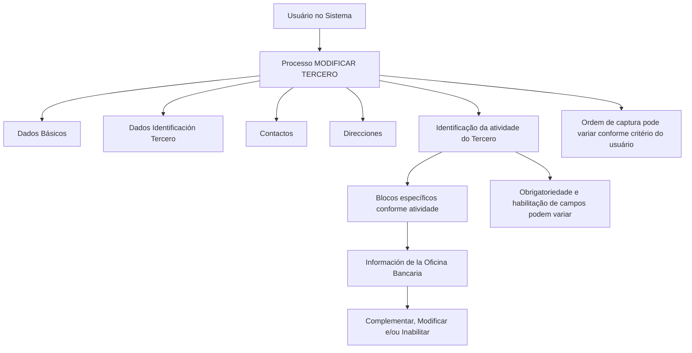

# Operação MODIFICAR Oficina Bancaria — Documentação REEF

## 1. Metadados do Documento
- **Arquivo de Origem:** Não identificado no conteúdo extraído
- **Tipo de Documento:** Procedimento
- **Domínio / Sistema:** REEF / Mapfre — operação de manutenção de informações de Oficina Bancaria
- **Público-Alvo:** Usuários do sistema, analistas funcionais e equipes de operação
- **Data/Versão Identificada:** Não identificada

---

## 2. Resumo Executivo & Contexto de Negócio

O documento descreve a operação **MODIFICAR Oficina Bancaria**, utilizada para complementar, modificar e/ou inabilitar informações de uma Oficina Bancaria nas estruturas de dados que armazenam e agrupam esses dados.

A operação está inserida no processo **MODIFICAR TERCERO**. A alteração da informação de Oficina Bancaria deve considerar os blocos de informação compartilhados e os blocos específicos aplicáveis de acordo com a atividade do Tercero.

A obrigatoriedade e a habilitação dos campos podem variar segundo o código de atividade do Tercero. Portanto, o preenchimento e a manutenção da informação de Oficina Bancaria não possuem, no conteúdo apresentado, um comportamento único e invariável para todos os registros.

O documento também informa que modificações implementadas localmente podem afetar o comportamento da aplicação, especialmente quanto à obrigatoriedade do registro dos dados do Tercero. A sequência de captura de dados entre os blocos de informação pode variar conforme o critério adotado pelo usuário no sistema.

---

## 3. Arquitetura, Componentes & Tecnologias Envolvidas

Os componentes e conceitos explicitamente citados são:

- **REEF:** contexto documental e sistema associado ao procedimento.
- **MODIFICAR TERCERO:** operação ou processo que agrupa blocos de informação compartilhados e específicos.
- **Oficina Bancaria:** informação específica que pode ser complementada, modificada ou inabilitada.
- **Tercero:** entidade cujos dados e atividade influenciam a obrigatoriedade e a habilitação de campos.
- **Dados Básicos:** bloco de informação compartilhado.
- **Dados Identificación Tercero:** bloco de informação compartilhado.
- **Contactos:** bloco de informação compartilhado.
- **Direcciones:** bloco de informação compartilhado.
- **Información de la Oficina Bancaria:** bloco de informação específico conforme a atividade do Tercero.
- **Mapfredocument:** termo exibido no rodapé/navegação do conteúdo.
- **Zeus, Cloud, APIs, Componentes, Soluciones, Arquitecturas:** termos presentes na navegação documental; o texto não especifica a participação desses elementos no processo de Oficina Bancaria.



> **Nota de Análise:** O documento não apresenta métodos HTTP, contratos JSON, banco de dados, interfaces técnicas, URLs de ambientes, servidores, tecnologias de implementação ou integrações externas para a operação MODIFICAR Oficina Bancaria.

---

## 4. Regras de Negócio, Especificações Funcionais & Processos

### 4.1 Objetivo da operação

A operação **MODIFICAR Oficina Bancaria** consiste em executar uma ou mais das seguintes ações sobre a informação de Oficina Bancaria:

1. **Complementar** a informação existente.
2. **Modificar** a informação existente.
3. **Inabilitar** a informação existente.

As ações podem ocorrer em qualquer estrutura de dados que contenha e agrupe a informação de Oficina Bancaria.

### 4.2 Premissas de obrigatoriedade e habilitação

1. A obrigatoriedade dos campos dos registros de dados pode variar.
2. A habilitação dos campos dos registros de dados pode variar.
3. A variação de obrigatoriedade e habilitação ocorre de acordo com o **código de atividade do Tercero**.
4. As modificações implementadas localmente podem afetar o comportamento da aplicação.
5. O impacto de modificações locais é relacionado, especificamente, à obrigatoriedade do registro dos Dados do Tercero.
6. A ordem de captura dos dados nos diferentes blocos de informação pode variar.
7. A variação na ordem de captura depende do critério seguido pelo usuário no sistema.

### 4.3 Fluxo funcional identificado

1. O usuário acessa o processo **MODIFICAR TERCERO**.
2. O usuário trabalha com os blocos de informação compartilhados disponíveis no processo.
3. O sistema considera a atividade do Tercero para determinar os blocos específicos aplicáveis.
4. O usuário acessa a **Información de la Oficina Bancaria** quando esse bloco for aplicável à atividade do Tercero.
5. O usuário complementa, modifica e/ou inabilita a informação de Oficina Bancaria.
6. A obrigatoriedade e a habilitação dos campos podem variar conforme o código de atividade do Tercero.
7. A sequência de captura pode variar conforme o critério do usuário.

> **Nota de Análise:** O conteúdo não detalha os campos da Oficina Bancaria, critérios de validação por código de atividade, regras de inabilitação, mensagens de erro, permissões de usuário, persistência dos dados ou condições de aprovação.

---

## 5. Tabelas de Parâmetros, Ambientes e Estruturas de Dados

| Item / Parâmetro | Descrição / Função | Tipo / Valores / Formato | Ambiente / Observações |
| :--- | :--- | :--- | :--- |
| Operação MODIFICAR Oficina Bancaria | Permite complementar, modificar e/ou inabilitar a informação de Oficina Bancaria. | Ações funcionais: complementar, modificar, inabilitar. | Executada em estruturas de dados que contêm e agrupam a informação. |
| Tercero | Entidade cujos dados são alterados no processo MODIFICAR TERCERO. | Entidade de negócio. | O código de atividade do Tercero influencia campos e blocos aplicáveis. |
| Código de atividade do Tercero | Critério que pode alterar a obrigatoriedade e/ou habilitação dos campos. | Código; formato não informado. | Não há relação de códigos ou regras por código no conteúdo. |
| Dados Básicos | Bloco de informação compartilhado no processo MODIFICAR TERCERO. | Bloco de informação. | Campos não detalhados. |
| Dados Identificación Tercero | Bloco de informação compartilhado no processo MODIFICAR TERCERO. | Bloco de informação. | Campos não detalhados. |
| Contactos | Bloco de informação compartilhado no processo MODIFICAR TERCERO. | Bloco de informação. | Campos não detalhados. |
| Direcciones | Bloco de informação compartilhado no processo MODIFICAR TERCERO. | Bloco de informação. | Campos não detalhados. |
| Información de la Oficina Bancaria | Bloco de informação específico de acordo com a atividade do Tercero. | Bloco de informação específico. | O documento não lista campos, formatos ou validações. |
| Modificações locais | Alterações implementadas localmente que podem influenciar o comportamento da aplicação. | Não especificado. | Podem afetar a obrigatoriedade no registro dos Dados do Tercero. |
| Ordem de captura | Sequência de preenchimento nos blocos de informação. | Não especificado. | Pode variar conforme o critério do usuário no sistema. |
| Lifecycle | Metadado documental exibido como “Approved Source”. | Estado documental. | Associado à navegação da DOCUMENTACIÓN Reef. |
| Owner | Responsável exibido no conteúdo documental. | `user:agonzalez_mapfre.com` | Exibido na DOCUMENTACIÓN Reef. |
| VL | Termo exibido junto ao conteúdo documental. | Não especificado. | O documento não define o significado de VL. |

---

## 6. Bateria de Perguntas & Respostas para RAG (FAQ Sintético)

### P1: Em que consiste a operação MODIFICAR Oficina Bancaria?
**R:** A operação MODIFICAR Oficina Bancaria consiste em complementar, modificar e/ou inabilitar a informação da Oficina Bancaria em qualquer estrutura de dados que contenha e agrupe essa informação.

### P2: Quais ações podem ser realizadas sobre a informação de Oficina Bancaria?
**R:** O documento informa três ações possíveis: complementar a informação, modificar a informação e/ou inabilitar a informação da Oficina Bancaria.

### P3: Em qual processo está inserida a alteração de Oficina Bancaria?
**R:** A alteração é apresentada dentro do processo **MODIFICAR TERCERO**, que reúne blocos de informação compartilhados e blocos específicos conforme a atividade do Tercero.

### P4: O código de atividade do Tercero influencia a manutenção da Oficina Bancaria?
**R:** Sim. A obrigatoriedade e/ou a habilitação dos campos no registro dos dados dos blocos ou estruturas de informação compartilhadas podem variar de acordo com o código de atividade do Tercero.

### P5: Quais blocos de informação compartilhados são citados no processo MODIFICAR TERCERO?
**R:** O documento cita os blocos Dados Básicos, Dados Identificación Tercero, Contactos e Direcciones como blocos de informação compartilhados do processo MODIFICAR TERCERO.

### P6: A Información de la Oficina Bancaria é um bloco compartilhado ou específico?
**R:** A Información de la Oficina Bancaria é apresentada como um bloco de informação específico, aplicável de acordo com a atividade do Tercero.

### P7: Modificações locais podem alterar o comportamento da aplicação?
**R:** Sim. O documento informa que modificações implementadas localmente podem afetar o comportamento da aplicação em relação à obrigatoriedade do registro dos Dados do Tercero.

### P8: A ordem de preenchimento dos blocos de informação é fixa?
**R:** Não. A ordem de captura dos dados nos distintos blocos de informação pode variar de acordo com o critério seguido pelo usuário no sistema.

### P9: O documento detalha os campos que compõem a Oficina Bancaria?
**R:** Não. O documento identifica a Información de la Oficina Bancaria como um bloco específico, mas não apresenta a relação de campos, tipos, formatos, valores permitidos ou validações desse bloco.

### P10: O documento informa APIs, métodos HTTP ou contratos de integração para Oficina Bancaria?
**R:** Não. O conteúdo não descreve APIs, métodos HTTP, contratos JSON, serviços de integração, URLs, portas ou tecnologias de implementação relacionadas à operação MODIFICAR Oficina Bancaria.

### P11: Quem é o proprietário exibido na DOCUMENTACIÓN Reef?
**R:** O conteúdo apresenta `user:agonzalez_mapfre.com` no campo Owner da DOCUMENTACIÓN Reef.

### P12: Qual é o estado de ciclo de vida exibido para a documentação?
**R:** O conteúdo apresenta o Lifecycle como **Approved Source**.

---

## 7. Glossário de Termos, Siglas & Conceitos-Chave

- **REEF:** Nome exibido no contexto da documentação, em “Documentation / DOCUMENTACIÓN Reef”. O documento não expande a sigla.
- **MODIFICAR TERCERO:** Processo no qual são apresentados blocos de informação compartilhados e blocos específicos segundo a atividade do Tercero.
- **Tercero:** Entidade de negócio mencionada no processo MODIFICAR TERCERO; o respectivo código de atividade pode influenciar a obrigatoriedade e a habilitação de campos.
- **Oficina Bancaria:** Informação que pode ser complementada, modificada e/ou inabilitada.
- **Datos Básicos:** Bloco de informação compartilhado no processo MODIFICAR TERCERO.
- **Datos Identificación Tercero:** Bloco de informação compartilhado relacionado à identificação do Tercero.
- **Contactos:** Bloco de informação compartilhado no processo MODIFICAR TERCERO.
- **Direcciones:** Bloco de informação compartilhado no processo MODIFICAR TERCERO.
- **Información de la Oficina Bancaria:** Bloco de informação específico conforme a atividade do Tercero.
- **Lifecycle:** Metadado documental exibido com o valor “Approved Source”.
- **Owner:** Metadado de responsável exibido com o valor `user:agonzalez_mapfre.com`.
- **VL:** Termo exibido no conteúdo documental sem definição adicional.

---

## 8. Notas Críticas, Riscos & Limitações

- O documento possui apenas uma página de conteúdo extraído e não detalha a implementação técnica da operação.
- Não foram identificados campos, tipos de dados, máscaras, valores permitidos ou critérios de validação para a Información de la Oficina Bancaria.
- Não existe matriz explícita que relacione códigos de atividade do Tercero às regras de obrigatoriedade ou habilitação dos campos.
- O documento informa que modificações locais podem afetar a obrigatoriedade dos Dados do Tercero, mas não especifica quais modificações, quais instalações locais ou quais efeitos concretos são aplicáveis.
- A ordem de captura dos dados pode variar segundo o critério do usuário; o conteúdo não define um fluxo obrigatório único.
- Não há informação sobre perfis de acesso, autorização, auditoria, tratamento de erros, aprovação, reversão ou rastreabilidade de alterações.
- Não foram identificados ambientes, URLs, servidores, banco de dados, APIs, contratos, integrações ou mecanismos de persistência.
- Alguns caracteres do texto extraído apresentam corrupção de codificação, como `Ocina`, `Modicar` e `Especícos`. A estrutura analítica interpreta esses termos somente quando o contexto permite associá-los claramente a “Oficina”, “Modificar” e “Específicos”; a transcrição bruta abaixo preserva a extração recebida.

---

## 9. Conteúdo Bruto Estruturado (Referência Fiel)

```text
--- [PÁGINA 1 DE 1] ---

OPERACIÓN MODIFICAR Ocina Bancaria
¿En que consiste?
Esta operación consiste en Complementar, Modicar y/o Inhabilitar la información de la Ocina Bancaria en cualquiera de las estructuras de
datos que la contienen y agrupan.
Premisas
La obligatoriedad y/o la habilitación de los campos en el registro de los datos de cada uno de los bloques o estructuras de información
compartidas puede variar de acuerdo con el código de actividad del Tercero:
Las modicaciones que se hubieran podido implementar localmente a su vez pueden afectar el comportamiento de la aplicación en
relación con la obligatoriedad en el registro de los Datos del Tercero.
Por último, el orden de captura de los datos en los distintos bloques de Información puede variar de acuerdo con el criterio seguido por el
Usuario en el Sistema.
Proceso
MODIFICAR
TERCERO
Modificar Información
de la Oficina Bancaria
Bloques de Información Compartidos (MODIFICAR TERCERO)
 Datos Básicos ( )
 Datos Identicación Tercero ( )
 Contactos (   )
 Direcciones (   )
Bloques de Información Especícos de acuerdo con la Actividad del Tercero.
 Información de la Ocina Bancaria(  )
Ejemplo:
Documentation / DOCUMENTACIÓN Reef
DOCUMENTACIÓN Reef
Mapfredocument
DOCUMENTACIÓN Reef
Owner
user:agonzalez_mapfre.com
Lifecycle
Approved Source
 / 
 VL
Buscar Inicio Soluciones Arquitecturas APIs Componentes Cloud Documentación Zeus Reef Ayuda
ES
```
