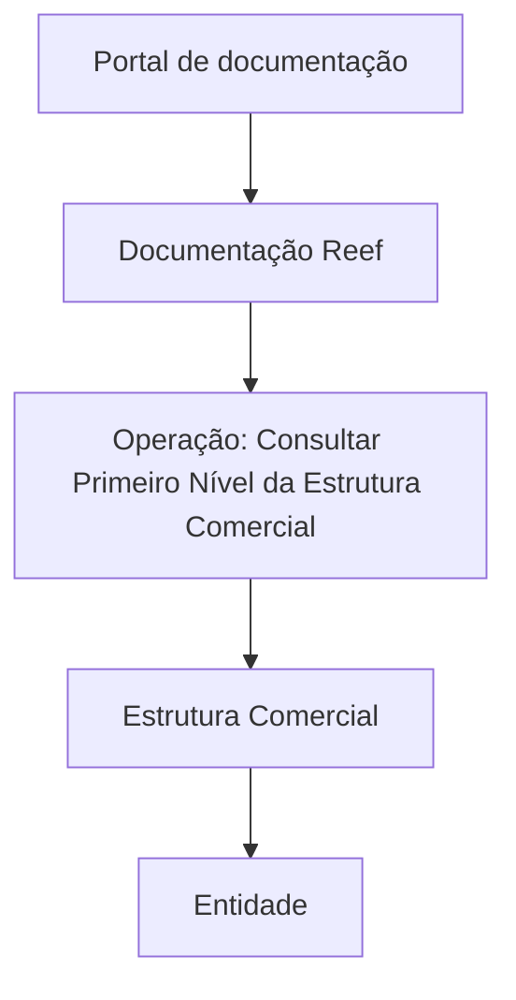

# Operação Consultar Primeiro Nível da Estrutura Comercial — Documentação Reef

## 1. Metadados do Documento
- **Arquivo de Origem:** Não identificado no conteúdo extraído
- **Tipo de Documento:** Procedimento
- **Domínio / Sistema:** Reef / Estrutura Comercial / Mapfre
- **Público-Alvo:** Operação, Arquitetos, Desenvolvedores e Negócio
- **Data/Versão Identificada:** Não identificada

---

## 2. Resumo Executivo & Contexto de Negócio

O documento descreve a operação **“Consultar Primeiro Nível da Estrutura Comercial”** no contexto da documentação Reef. O objetivo explicitamente apresentado é consultar os primeiros níveis da Estrutura Comercial com os quais a Entidade opera.

O conteúdo extraído contém principalmente o título da operação, uma descrição funcional curta e elementos de navegação do portal de documentação. O portal apresenta categorias como Soluções, Arquiteturas, APIs, Componentes, Cloud, Documentação, Zeus, Reef e Ajuda.

A documentação está identificada como **“DOCUMENTACIÓN Reef”** e possui ciclo de vida **Approved Source**. A propriedade do conteúdo é atribuída ao usuário `agonzalez_mapfre.com`.

Não há detalhamento sobre telas, critérios de pesquisa, contratos de API, métodos HTTP, regras de autorização, fontes de dados ou resultados retornados pela operação de consulta.

---

## 3. Arquitetura, Componentes & Tecnologias Envolvidas

Os elementos identificados no conteúdo são:

| Componente / Elemento | Papel identificado |
| :--- | :--- |
| Reef | Domínio ou área de documentação associada à operação. |
| Estrutura Comercial | Estrutura de negócio cujos primeiros níveis são consultados. |
| Entidade | Organização que opera com a Estrutura Comercial. |
| Mapfre | Referência corporativa exibida no documento. |
| Zeus | Categoria ou área disponível na navegação do portal. |
| Portal de documentação | Interface que disponibiliza conteúdos de Soluções, Arquiteturas, APIs, Componentes, Cloud, Documentação, Zeus, Reef e Ajuda. |



**Nota de Análise:** o diagrama representa somente as relações semânticas explicitamente identificáveis no texto. O documento não detalha arquitetura técnica, integrações, microsserviços, APIs, banco de dados ou fluxo de dados.

---

## 4. Regras de Negócio, Especificações Funcionais & Processos

1. A operação documentada é denominada **“Consultar Primeiro Nível da Estrutura Comercial”**.
2. A finalidade declarada é a **consulta dos primeiros níveis da Estrutura Comercial**.
3. A consulta considera os primeiros níveis da Estrutura Comercial **com os quais a Entidade opera**.
4. O conteúdo está inserido na documentação Reef.
5. O ciclo de vida informado para a documentação é **Approved Source**.

**Nota de Análise:** o documento não descreve critérios para determinar quais níveis compõem o “primeiro nível”, campos de entrada, filtros, regras de retorno, comportamento em caso de ausência de dados ou responsabilidades de autorização.

---

## 5. Tabelas de Parâmetros, Ambientes e Estruturas de Dados

| Item / Parâmetro | Descrição / Função | Tipo / Valores / Formato | Ambiente / Observações |
| :--- | :--- | :--- | :--- |
| Operação | Consulta do primeiro nível da Estrutura Comercial. | `Consultar Primer Nivel de la Estructura Comercial` | Documentação Reef |
| Objetivo da consulta | Consultar os primeiros níveis da Estrutura Comercial com os quais a Entidade opera. | Descrição funcional | Não há critérios adicionais descritos |
| Domínio documental | Área de documentação associada à operação. | Reef | Exibido como “DOCUMENTACIÓN Reef” |
| Proprietário | Responsável identificado no documento. | `user:agonzalez_mapfre.com` | Campo Owner |
| Ciclo de vida | Estado documental identificado. | `Approved Source` | Campo Lifecycle |
| Idioma de navegação | Idioma apresentado na interface. | `ES` | Exibido no portal |
| Seções de navegação | Áreas disponíveis no portal. | Buscar, Inicio, Soluciones, Arquitecturas, APIs, Componentes, Cloud, Documentación, Zeus, Reef, Ayuda | Elementos de navegação |
| Identificador adicional | Texto adicional apresentado no conteúdo. | `VL` | Significado não detalhado |

---

## 6. Bateria de Perguntas & Respostas para RAG (FAQ Sintético)

### P1: Qual é o objetivo da operação “Consultar Primeiro Nível da Estrutura Comercial”?
**R:** O objetivo é consultar os primeiros níveis da Estrutura Comercial com os quais a Entidade opera.

### P2: Em qual domínio documental está registrada a operação de consulta da Estrutura Comercial?
**R:** A operação está registrada na documentação Reef, identificada no conteúdo como “DOCUMENTACIÓN Reef”.

### P3: O documento informa quais dados devem ser enviados para consultar o primeiro nível da Estrutura Comercial?
**R:** Não. O conteúdo extraído não descreve parâmetros de entrada, filtros, campos obrigatórios ou formato de requisição.

### P4: O documento especifica uma API ou método HTTP para a consulta da Estrutura Comercial?
**R:** Não. Embora a navegação do portal contenha uma seção denominada APIs, o documento não informa endpoint, método HTTP, contrato JSON ou serviço técnico associado à operação.

### P5: Qual é o ciclo de vida da documentação Reef apresentada?
**R:** O ciclo de vida indicado no documento é `Approved Source`.

### P6: Quem está identificado como proprietário da documentação?
**R:** O campo Owner identifica `user:agonzalez_mapfre.com` como proprietário da documentação apresentada.

### P7: O que significa “VL” no documento?
**R:** O texto `VL` aparece no conteúdo extraído, mas o documento não fornece definição, contexto funcional ou significado para esse identificador.

### P8: Quais áreas estão disponíveis na navegação do portal de documentação?
**R:** A navegação apresenta Buscar, Inicio, Soluciones, Arquitecturas, APIs, Componentes, Cloud, Documentación, Zeus, Reef e Ayuda.

### P9: A consulta retorna todos os níveis da Estrutura Comercial?
**R:** O documento menciona somente a consulta dos primeiros níveis da Estrutura Comercial. Não há informação sobre retorno de níveis adicionais.

### P10: O documento detalha as regras para definir com quais estruturas a Entidade opera?
**R:** Não. O texto afirma que a consulta envolve os primeiros níveis da Estrutura Comercial com os quais a Entidade opera, porém não define regras, fontes de dados ou critérios para estabelecer essa relação.

---

## 7. Glossário de Termos, Siglas & Conceitos-Chave

- **Reef:** Domínio ou área de documentação associada à operação de consulta.
- **Estrutura Comercial:** Estrutura de negócio cujos primeiros níveis são objeto da operação documentada.
- **Entidade:** Organização que opera com a Estrutura Comercial; o documento não identifica qual Entidade.
- **Owner:** Campo que identifica o proprietário da documentação.
- **Lifecycle:** Campo que identifica o ciclo de vida documental.
- **Approved Source:** Valor apresentado para o ciclo de vida da documentação.
- **Mapfre:** Referência corporativa exibida no conteúdo.
- **Zeus:** Área ou categoria disponível na navegação do portal; sem detalhamento adicional.
- **VL:** Identificador exibido no conteúdo, sem definição fornecida.

---

## 8. Notas Críticas, Riscos & Limitações

- O conteúdo é resumido e não descreve implementação técnica da operação.
- Não há URL, endpoint, método HTTP, contrato de integração, tecnologia, ambiente ou credencial identificados.
- Não há definição formal de “primeiros níveis” da Estrutura Comercial.
- Não há critérios de autorização, regras de acesso ou matriz de permissões.
- Não há descrição de tratamento de erros, mensagens operacionais ou comportamento para resultados vazios.
- O significado de `VL` não é detalhado.
- **Nota de Análise:** o documento lista a operação de consulta, mas não detalha métodos HTTP, contratos JSON, fontes de dados ou sistemas responsáveis pela execução.

---

## 9. Conteúdo Bruto Estruturado (Referência Fiel)

```text
--- [PÁGINA 1 DE 1] ---

OPERACIÓN CONSULTAR Primer Nivel de la Estructura Comercial
Consulta de los Primeros Niveles de la Estructura Comercial con las que opera la Entidad.
Documentation / DOCUMENTACIÓN Reef
DOCUMENTACIÓN Reef
Mapfredocument
DOCUMENTACIÓN Reef
Owner
user:agonzalez_mapfre.com
Lifecycle
Approved Source
 / 
 VL
Buscar Inicio Soluciones Arquitecturas APIs Componentes Cloud Documentación Zeus Reef Ayuda
ES
```
