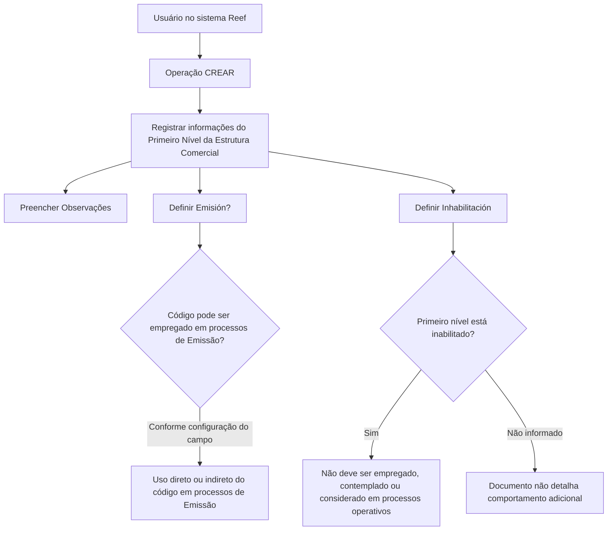

# Cadastro de Informações do Primeiro Nível da Estrutura Comercial

## 1. Metadados do Documento
- **Arquivo de Origem:** `Não identificado`
- **Tipo de Documento:** Procedimento
- **Domínio / Sistema:** Reef / Estrutura Comercial
- **Público-Alvo:** Operação, Negócio e usuários do sistema Reef
- **Data/Versão Identificada:** Não identificada
- **Owner identificado:** `user:agonzalez_mapfre.com`
- **Lifecycle identificado:** `Approved`

---

## 2. Resumo Executivo & Contexto de Negócio

O documento descreve a operação **CREAR**, destinada ao registro, no sistema, de informações relacionadas aos **Primeiros Níveis da Estrutura Comercial** configurados na companhia. O material cita **Pessoas Jurídicas** como exemplo de entidade que pode compor esse primeiro nível.

O objetivo funcional é permitir que a organização registre informações necessárias para caracterizar um nível inicial da Estrutura Comercial. O processo apresenta uma sequência de captura de campos, orientada pela leitura “da esquerda para a direita e de cima para baixo”.

A operação inclui campos para registrar observações, determinar se o código do primeiro nível poderá ser usado em processos de emissão e controlar a inabilitação do nível no sistema. A inabilitação possui impacto operacional explícito: um primeiro nível inabilitado não deve ser empregado, contemplado ou considerado nos processos operativos da entidade.

O conteúdo disponibilizado não informa métodos HTTP, contratos de integração, banco de dados, perfis de acesso, mensagens de erro, validações obrigatórias ou detalhes técnicos de implementação da operação **CREAR**.

---

## 3. Arquitetura, Componentes & Tecnologias Envolvidas

### Componentes e sistemas identificados

| Componente / Termo | Papel identificado no documento |
| :--- | :--- |
| Reef | Sistema/documentação no qual a operação é apresentada. |
| Estrutura Comercial | Estrutura organizacional cujos primeiros níveis podem ser cadastrados. |
| Primeiro Nível da Estrutura Comercial | Entidade ou nível configurado na companhia, passível de criação e manutenção de informações. |
| Pessoas Jurídicas | Exemplo citado de informação ou entidade associada aos primeiros níveis da Estrutura Comercial. |
| Processos de Emissão | Processos que podem utilizar, direta ou indiretamente, o código do primeiro nível da Estrutura Comercial. |
| Processos operativos da entidade | Processos nos quais um primeiro nível inabilitado não deve ser usado, contemplado ou considerado. |
| Mapfredocument | Termo exibido na navegação/documentação. O documento não detalha seu papel técnico ou funcional. |
| Zeus | Termo exibido na navegação. O documento não detalha sua relação com a operação. |

### Fluxo funcional identificado



> **Nota de Análise:** O documento não apresenta uma arquitetura técnica de software, interfaces, integrações, servidores, URLs, bancos de dados, tecnologias de implementação ou contratos de API. O diagrama representa exclusivamente o fluxo funcional explicitamente descrito.

---

## 4. Regras de Negócio, Especificações Funcionais & Processos

### 4.1 Objetivo da operação

A operação **CREAR** permite registrar no sistema determinadas informações dos **Primeiros Níveis da Estrutura Comercial** configurados na companhia. O texto menciona “Pessoas Jurídicas” como exemplo relacionado a esses primeiros níveis.

### 4.2 Ação habilitada

A ação explicitamente indicada pelo documento é:

- **CREAR**

O material não detalha ações de alteração, exclusão, consulta, aprovação ou cancelamento.

### 4.3 Sequência de captura

Os campos do bloco **Datos Primer Nivel Estructura Comercial** devem ser interpretados na seguinte sequência de captura:

1. Da esquerda para a direita.
2. De cima para baixo.

O documento não informa quais campos são obrigatórios, tipos de dados, tamanhos máximos, máscaras, valores padrão ou regras de validação.

### 4.4 Campo “Observaciones”

O campo **Observaciones** permite inserir um texto esclarecedor ou observações relacionadas ao fato de criar o nível da Estrutura Comercial.

Não são detalhados:
- formato do texto;
- limite de caracteres;
- obrigatoriedade;
- regras de auditoria;
- regras de visibilidade;
- impacto do conteúdo registrado em processos posteriores.

### 4.5 Campo “Emisión?”

O campo **Emisión?** determina o comportamento do sistema quanto ao uso do código do primeiro nível da Estrutura Comercial nos processos de emissão.

A regra declarada é:

- O código do primeiro nível da Estrutura Comercial pode ser empregado, direta ou indiretamente, em processos de **Emisión**, conforme o comportamento determinado pelo campo **Emisión?**.

O documento não especifica valores possíveis para o campo, como “Sim/Não”, nem detalha quais processos de emissão são afetados.

### 4.6 Campo “Inhabilitación”

O campo **Inhabilitación** indica ao sistema que o primeiro nível da Estrutura Comercial está inabilitado.

A regra operacional declarada é:

- Quando o primeiro nível estiver inabilitado, ele **não deveria ser empregado, contemplado ou considerado** nos processos operativos da entidade.

O documento não informa:
- se a inabilitação bloqueia operações já existentes;
- se há data de início ou fim de vigência;
- se é possível reabilitar o primeiro nível;
- quais telas, serviços ou processos operativos devem aplicar essa restrição;
- se há mensagem de bloqueio ao usuário.

---

## 5. Tabelas de Parâmetros, Ambientes e Estruturas de Dados

| Item / Parâmetro | Descrição / Função | Tipo / Valores / Formato | Ambiente / Observações |
| :--- | :--- | :--- | :--- |
| Operação `CREAR` | Permite registrar informações de Primeiros Níveis da Estrutura Comercial configurados na companhia. | Ação habilitada. | O documento não detalha permissões, endpoint ou fluxo de confirmação. |
| Dados do Primeiro Nível da Estrutura Comercial | Bloco de informações para captura dos dados do primeiro nível da Estrutura Comercial. | Conjunto de campos. | A sequência de captura é da esquerda para a direita e de cima para baixo. |
| `Observaciones` | Permite inserir texto esclarecedor ou observações sobre a criação do nível. | Texto; formato não detalhado. | Obrigatoriedade, tamanho e validações não informados. |
| `Emisión?` | Determina o comportamento relativo ao emprego do código do primeiro nível em processos de emissão. | Valores não informados. | O código pode ser utilizado direta ou indiretamente em processos de Emisión. |
| `Inhabilitación` | Indica que o primeiro nível está inabilitado no sistema. | Valores não informados. | Um nível inabilitado não deveria ser empregado, contemplado ou considerado nos processos operativos da entidade. |
| Primeiro Nível da Estrutura Comercial | Nível configurado na companhia cujas informações podem ser registradas. | Entidade de negócio. | Pessoas Jurídicas são citadas como exemplo. |
| Owner | Proprietário identificado na documentação. | `user:agonzalez_mapfre.com` | Informação exibida no conteúdo de origem. |
| Lifecycle | Estado de ciclo de vida da documentação. | `Approved` | Informação exibida no conteúdo de origem. |
| Ambiente / URL | Não identificado. | Não aplicável. | O texto não fornece URLs, hosts, portas ou nomes de ambiente. |
| Logs | Não identificados. | Não aplicável. | O texto não fornece caminhos, níveis ou variáveis de log. |

---

## 6. Bateria de Perguntas & Respostas para RAG (FAQ Sintético)

### P1: Qual é o objetivo da operação CREAR na Estrutura Comercial?
**R:** A operação **CREAR** permite registrar no sistema determinadas informações dos Primeiros Níveis da Estrutura Comercial configurados na companhia. O documento cita Pessoas Jurídicas como exemplo relacionado a esses primeiros níveis.

### P2: Qual ação está habilitada no procedimento documentado?
**R:** A única ação explicitamente habilitada no documento é **CREAR**. O conteúdo não descreve ações de alteração, exclusão, consulta ou cancelamento.

### P3: Qual é a sequência de preenchimento dos campos do bloco Dados do Primeiro Nível da Estrutura Comercial?
**R:** Os campos devem seguir a sequência de captura indicada no documento: da esquerda para a direita e de cima para baixo.

### P4: Para que serve o campo Observaciones?
**R:** O campo **Observaciones** permite que o usuário registre um texto esclarecedor ou observações relacionadas ao ato de criar o nível da Estrutura Comercial.

### P5: O documento informa o tamanho máximo ou a obrigatoriedade do campo Observaciones?
**R:** Não. O documento somente informa que o campo permite inserir texto esclarecedor ou observações. Não há definição de obrigatoriedade, tamanho máximo, máscara ou validação.

### P6: Qual é a finalidade do campo Emisión??
**R:** O campo **Emisión?** determina o comportamento do sistema para permitir que o código do primeiro nível da Estrutura Comercial seja empregado, direta ou indiretamente, nos processos de Emisión.

### P7: Quais valores podem ser selecionados no campo Emisión??
**R:** O documento não especifica os valores permitidos para o campo **Emisión?**. Ele apenas informa que o campo determina se o código do primeiro nível pode ser utilizado, direta ou indiretamente, em processos de Emisión.

### P8: O que ocorre quando o campo Inhabilitación indica que um primeiro nível está inabilitado?
**R:** Quando o primeiro nível da Estrutura Comercial está inabilitado, ele não deveria ser empregado, contemplado ou considerado nos processos operativos da entidade.

### P9: A inabilitação impede o uso do primeiro nível em quais processos?
**R:** O documento estabelece que um primeiro nível inabilitado não deve ser empregado, contemplado ou considerado nos processos operativos da entidade. O conteúdo não enumera processos operativos específicos.

### P10: Pessoas Jurídicas são obrigatoriamente os Primeiros Níveis da Estrutura Comercial?
**R:** O documento cita Pessoas Jurídicas como exemplo de informação relacionada aos Primeiros Níveis da Estrutura Comercial. O texto não afirma que todas as configurações do primeiro nível sejam necessariamente Pessoas Jurídicas.

### P11: O documento descreve APIs, métodos HTTP ou contratos JSON da operação CREAR?
**R:** Não. O documento não detalha métodos HTTP, endpoints, contratos JSON, autenticação, bancos de dados ou integrações técnicas da operação **CREAR**.

### P12: Existe informação sobre ambientes, URLs, servidores ou caminhos de log?
**R:** Não. O conteúdo extraído não apresenta URLs de ambiente, servidores, portas, variáveis de configuração, caminhos de logs ou procedimentos de monitoramento.

---

## 7. Glossário de Termos, Siglas & Conceitos-Chave

- **CREAR:** Ação habilitada para registrar informações de Primeiros Níveis da Estrutura Comercial.
- **Emisión:** Processos de emissão nos quais o código do primeiro nível da Estrutura Comercial pode ser empregado direta ou indiretamente.
- **Estrutura Comercial:** Estrutura configurada na companhia, organizada em níveis, incluindo os Primeiros Níveis tratados pelo procedimento.
- **Inhabilitación:** Campo que indica que o primeiro nível da Estrutura Comercial está inabilitado no sistema.
- **Observaciones:** Campo destinado ao registro de texto esclarecedor ou observações sobre a criação do nível.
- **Pessoas Jurídicas:** Exemplo citado pelo documento como informação associada a Primeiros Níveis da Estrutura Comercial.
- **Primeiro Nível da Estrutura Comercial:** Nível inicial da Estrutura Comercial configurada na companhia e sujeito ao registro de informações pela operação CREAR.
- **Reef:** Sistema ou contexto documental identificado no material de origem.
- **Mapfredocument:** Termo exibido na navegação da documentação; significado funcional ou técnico não detalhado.
- **Zeus:** Termo exibido na navegação da documentação; significado funcional ou técnico não detalhado.

---

## 8. Notas Críticas, Riscos & Limitações

- O documento não identifica o nome do arquivo de origem, data, versão, autor funcional ou histórico de revisões.
- O conteúdo não define os valores, tipo de dado, obrigatoriedade, domínio ou validações dos campos **Observaciones**, **Emisión?** e **Inhabilitación**.
- Não há detalhamento de perfis de acesso, matriz de permissões, aprovação, auditoria ou segregação de funções para a operação **CREAR**.
- Não foram informados APIs, métodos HTTP, contratos de dados, banco de dados, integrações, filas, serviços ou arquitetura técnica.
- Não foram identificados ambientes, URLs, hosts, portas, credenciais, arquivos de configuração ou procedimentos de log.
- A regra de inabilitação usa a expressão “não deveria”, sem detalhar o mecanismo técnico de bloqueio, prevenção ou tratamento de exceções.
- O documento lista termos de navegação como **Mapfredocument** e **Zeus**, mas não explica seu vínculo com a operação de criação.
- **Nota de Análise:** O material apresenta uma descrição funcional resumida. Não há detalhamento adicional para determinar o comportamento completo do sistema em cenários de erro, alteração, reabilitação ou duplicidade de registros.

---

## 9. Conteúdo Bruto Estruturado (Referência Fiel)

```text
--- [PÁGINA 1 DE 1] ---

CREAR Información especíca del Primer Nivel de la Estructura
Comercial
Objetivo
Esta operación permite registrar en el sistema cierta información de los Primeros Niveles de la Estructura Comercial (como Personas
Jurídicas) congurados en la Compañía.
Acciones habilitadas
 CREAR ( )
Datos Primer Nivel Estructura Comercial
De Izquierda a Derecha y de Arriba hacia Abajo, los siguientes campos marcan la secuencia de captura en este Bloque de Información.
Observaciones ( )
Este campo permite ingresar un texto aclaratorio u observaciones al hecho de crear el nivel de la estructura.
Emisión? ( )
Este campo determina el comportamiento del sistema permitiendo que el código del primer nivel de la estructura comercial se pueda
emplear, directa o indirectamente, en los procesos de Emisión.
Inhabilitación ( )
Este campo le indica al sistema que el primer nivel de la estructura comercial está inhabilitado en el Sistema por lo cual, de estarlo, no
debería ser empleado, contemplado o considerado en los procesos operativos de la entidad.
Documentation / DOCUMENTACIÓN Reef
DOCUMENTACIÓN Reef
Mapfredocument
DOCUMENTACIÓN Reef
Owner
user:agonzalez_mapfre.com
Lifecycle
Approved Source
 / 
 VL
Buscar Inicio Soluciones Arquitecturas APIs Componentes Cloud Documentación Zeus Reef Ayuda
ES
```
