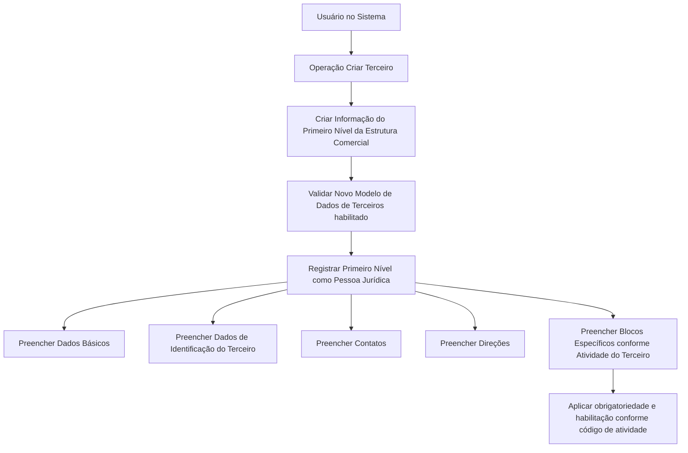

# Operação Criar Primeiro Nível da Estrutura Comercial — Documentação Reef

## 1. Metadados do Documento
- **Arquivo de Origem:** Não identificado no conteúdo extraído
- **Tipo de Documento:** Procedimento
- **Domínio / Sistema:** Reef / Modelo de Dados de Terceiros / Estrutura Comercial
- **Público-Alvo:** Usuários de negócio e operação do Sistema
- **Data/Versão Identificada:** Não identificada

---

## 2. Resumo Executivo & Contexto de Negócio

O documento descreve a operação **Criar Primeiro Nível da Estrutura Comercial**. A operação permite registrar no Sistema as informações referentes aos primeiros níveis da estrutura comercial configurada na companhia, incluindo entidades como pessoas jurídicas.

A criação dos primeiros níveis da estrutura comercial está condicionada à habilitação do **Novo Modelo de Dados de Terceiros** para uso pela companhia. O documento estabelece como premissa que os primeiros níveis da estrutura comercial da entidade seguradora devem ser criados sempre como pessoas jurídicas.

O processo de registro utiliza blocos de informações compartilhados pela operação **Criar Terceiro**, incluindo Dados Básicos, Dados de Identificação do Terceiro, Contatos e Direções. Também existem blocos de informação específicos definidos conforme a atividade do terceiro.

A obrigatoriedade, habilitação e ordem de captura de campos podem variar conforme o código de atividade do terceiro, critérios do usuário no Sistema e possíveis modificações implementadas localmente. O documento não detalha os campos, códigos de atividade, validações específicas, telas, APIs ou contratos de integração envolvidos.

---

## 3. Arquitetura, Componentes & Tecnologias Envolvidas

Os elementos explicitamente citados são:

- **Sistema:** Sistema não nomeado no trecho operacional; o contexto documental menciona Reef.
- **Operação funcional:** Criar Terceiro.
- **Operação especializada:** Criar Informação do Primeiro Nível da Estrutura Comercial.
- **Modelo de dados:** Novo Modelo de Dados de Terceiros.
- **Entidade de negócio:** Terceiro.
- **Tipo de terceiro obrigatório para o primeiro nível:** Pessoa Jurídica.
- **Blocos compartilhados:** Dados Básicos, Dados de Identificação do Terceiro, Contatos e Direções.
- **Blocos específicos:** Informações variáveis de acordo com a atividade do terceiro.
- **Portal/documentação citada:** DOCUMENTACIÓN Reef / Mapfredocument.



**Nota de Análise:** O conteúdo não apresenta arquitetura técnica de servidores, bancos de dados, APIs, microsserviços, protocolos, tecnologias de implementação ou ambientes.

---

## 4. Regras de Negócio, Especificações Funcionais & Processos

### 4.1 Finalidade da operação

A operação permite registrar no Sistema as informações dos primeiros níveis da estrutura comercial configurada na companhia. O documento usa pessoas jurídicas como exemplo de entidades pertencentes a esses níveis.

### 4.2 Premissas

1. O **Novo Modelo de Dados de Terceiros** deve estar habilitado para utilização pela companhia.
2. Os primeiros níveis da estrutura comercial da entidade seguradora devem ser criados sempre como **Pessoas Jurídicas**.
3. A obrigatoriedade e a habilitação de campos podem variar conforme o código de atividade do terceiro.
4. Modificações locais implementadas podem afetar o comportamento da aplicação, incluindo a obrigatoriedade de registro dos dados do terceiro.
5. A ordem de preenchimento dos blocos de informação pode variar conforme o critério seguido pelo usuário no Sistema.

### 4.3 Processo funcional extraído

1. O usuário inicia a operação **Criar Terceiro**.
2. O usuário cria a informação referente ao primeiro nível da estrutura comercial.
3. O usuário registra os blocos de informação compartilhados:
   - Dados Básicos.
   - Dados de Identificação do Terceiro.
   - Contatos.
   - Direções.
4. O usuário registra os blocos específicos aplicáveis à atividade do terceiro.
5. O Sistema pode variar a obrigatoriedade ou habilitação dos campos em função do código de atividade do terceiro.
6. Alterações locais podem modificar o comportamento esperado de obrigatoriedade dos dados.
7. O usuário pode adotar ordem distinta de captura entre os blocos de informação.

### 4.4 Restrições identificadas

| Regra / Restrição | Descrição |
| :--- | :--- |
| Tipo de entidade | Os primeiros níveis da estrutura comercial devem ser criados como Pessoas Jurídicas. |
| Dependência do modelo de dados | O Novo Modelo de Dados de Terceiros deve estar habilitado pela companhia. |
| Campos condicionais | A obrigatoriedade e habilitação dos campos podem depender do código de atividade do terceiro. |
| Personalizações locais | Modificações locais podem alterar a obrigatoriedade do registro dos dados do terceiro. |
| Ordem de preenchimento | A sequência de captura dos blocos pode variar conforme o critério do usuário. |

---

## 5. Tabelas de Parâmetros, Ambientes e Estruturas de Dados

### 5.1 Blocos de informação

| Item / Parâmetro | Descrição / Função | Tipo / Valores / Formato | Ambiente / Observações |
| :--- | :--- | :--- | :--- |
| Operação principal | Cria um terceiro no Sistema. | Criar Terceiro | Utilizada para registrar a informação do primeiro nível da estrutura comercial. |
| Primeiro nível da estrutura comercial | Informação comercial a ser criada. | Pessoa Jurídica | Deve ser criado sempre como Pessoa Jurídica. |
| Dados Básicos | Bloco compartilhado de informações do terceiro. | Não detalhado | O documento não informa campos internos. |
| Dados de Identificação do Terceiro | Bloco compartilhado de identificação. | Não detalhado | O documento não informa campos internos. |
| Contatos | Bloco compartilhado de contatos do terceiro. | Não detalhado | O documento não informa campos internos. |
| Direções | Bloco compartilhado de endereços/direções do terceiro. | Não detalhado | O documento não informa campos internos. |
| Blocos específicos | Informações aplicáveis conforme a atividade do terceiro. | Variável conforme atividade | Campos e estruturas não detalhados. |
| Código de atividade do terceiro | Critério que pode influenciar campos. | Não detalhado | Pode determinar obrigatoriedade e habilitação. |
| Novo Modelo de Dados de Terceiros | Premissa para utilização da operação. | Habilitado para a companhia | Não são informados versão, configuração ou procedimento de habilitação. |

### 5.2 Referências documentais e navegação

| Item / Parâmetro | Descrição / Função | Tipo / Valores / Formato | Ambiente / Observações |
| :--- | :--- | :--- | :--- |
| DOCUMENTACIÓN Reef | Área documental mencionada no conteúdo extraído. | Documentação | Contexto associado a Reef. |
| Mapfredocument | Nome exibido no trecho de navegação. | Portal ou repositório documental | Não há URL no conteúdo. |
| Owner | Proprietário exibido no conteúdo. | `user:agonzalez_mapfre.com` | Valor reproduzido conforme extração. |
| Lifecycle | Estado de ciclo de vida exibido. | `Approved` | O documento não explica critérios ou processo de aprovação. |
| Idioma | Idioma exibido no portal. | `ES` | Conteúdo operacional está em espanhol. |

---

## 6. Bateria de Perguntas & Respostas para RAG (FAQ Sintético)

### P1: Qual é a finalidade da operação Criar Primeiro Nível da Estrutura Comercial?
**R:** A operação permite registrar no Sistema a informação dos primeiros níveis da estrutura comercial configurada na companhia. O documento cita pessoas jurídicas como exemplo desses primeiros níveis.

### P2: Qual tipo de terceiro deve ser utilizado para criar os primeiros níveis da estrutura comercial?
**R:** Os primeiros níveis da estrutura comercial da entidade seguradora devem ser criados sempre como Pessoas Jurídicas.

### P3: Qual premissa de sistema deve ser atendida antes de utilizar a operação?
**R:** O Novo Modelo de Dados de Terceiros deve estar habilitado para utilização pela companhia.

### P4: Qual operação do Sistema é usada para registrar a informação do primeiro nível da estrutura comercial?
**R:** O processo é realizado por meio da operação **Criar Terceiro**, na qual é criada a informação do primeiro nível da estrutura comercial.

### P5: Quais blocos de informação compartilhados são mencionados no processo Criar Terceiro?
**R:** Os blocos compartilhados citados são Dados Básicos, Dados de Identificação do Terceiro, Contatos e Direções.

### P6: Existem informações adicionais além dos blocos compartilhados?
**R:** Sim. O documento menciona blocos de informação específicos que devem ser considerados de acordo com a atividade do terceiro. O conteúdo não detalha os campos desses blocos específicos.

### P7: O código de atividade do terceiro influencia o preenchimento de dados?
**R:** Sim. A obrigatoriedade e/ou habilitação dos campos de cada bloco ou estrutura de informação compartilhada pode variar conforme o código de atividade do terceiro.

### P8: Modificações locais podem alterar o comportamento da aplicação?
**R:** Sim. O documento informa que modificações implementadas localmente podem afetar o comportamento da aplicação em relação à obrigatoriedade do registro dos dados do terceiro.

### P9: Existe uma ordem obrigatória para preencher Dados Básicos, Identificação, Contatos e Direções?
**R:** Não. O documento estabelece que a ordem de captura dos dados nos diferentes blocos de informação pode variar conforme o critério seguido pelo usuário no Sistema.

### P10: O documento especifica os campos obrigatórios dos blocos de Dados Básicos e Contatos?
**R:** Não. O documento apenas lista os blocos de informação e informa que obrigatoriedade e habilitação podem variar conforme o código de atividade do terceiro e modificações locais.

### P11: O documento descreve APIs, métodos HTTP ou contratos JSON da operação?
**R:** Não. O conteúdo extraído não apresenta APIs, métodos HTTP, contratos JSON, endpoints, integrações técnicas ou especificações de serviço.

### P12: Onde a documentação parece estar catalogada?
**R:** O trecho de navegação menciona DOCUMENTACIÓN Reef e Mapfredocument. Porém, o conteúdo não fornece URL, caminho de acesso ou procedimento de consulta ao repositório documental.

---

## 7. Glossário de Termos, Siglas & Conceitos-Chave

- **Criar Terceiro:** Operação do Sistema usada para criar o registro de um terceiro e suas informações associadas.
- **Estrutura Comercial:** Estrutura organizacional/comercial cujos primeiros níveis podem ser registrados no Sistema.
- **Primeiro Nível da Estrutura Comercial:** Informação ou entidade pertencente ao primeiro nível da estrutura comercial configurada na companhia.
- **Novo Modelo de Dados de Terceiros:** Modelo de dados que deve estar habilitado para a companhia utilizar a operação descrita.
- **Pessoa Jurídica:** Tipo de terceiro obrigatório para a criação dos primeiros níveis da estrutura comercial.
- **Código de Atividade do Terceiro:** Critério que pode determinar habilitação e obrigatoriedade dos campos de informação.
- **Blocos de Informação Compartilhados:** Estruturas reutilizadas no processo Criar Terceiro: Dados Básicos, Dados de Identificação do Terceiro, Contatos e Direções.
- **Blocos de Informação Específicos:** Estruturas adicionais aplicáveis de acordo com a atividade do terceiro.
- **Reef:** Nome citado no contexto de documentação.
- **Mapfredocument:** Nome exibido no trecho de navegação/documentação.
- **Lifecycle:** Campo apresentado como estado de ciclo de vida, com valor `Approved`.

---

## 8. Notas Críticas, Riscos & Limitações

- O conteúdo extraído não identifica o nome do arquivo de origem, versão documental, data de publicação ou autoria formal.
- O documento não detalha telas, campos, formatos, valores permitidos, mensagens de erro, validações sistêmicas ou critérios de persistência.
- A obrigatoriedade de campos não é fixa no material: ela pode variar conforme código de atividade do terceiro e modificações locais.
- As modificações locais representam risco de comportamento divergente entre companhias, implantações ou configurações.
- O conteúdo não define quais códigos de atividade existem, nem como cada código altera a habilitação ou obrigatoriedade dos blocos.
- O documento não fornece detalhes técnicos sobre banco de dados, APIs, integrações, autenticação, logs, ambientes, URLs ou procedimentos de suporte.
- **Nota de Análise:** O documento lista os blocos Dados Básicos, Dados de Identificação do Terceiro, Contatos e Direções, mas não detalha os campos ou regras internas de cada bloco.
- **Nota de Análise:** O documento cita Reef e Mapfredocument, mas não fornece relação técnica entre esses elementos e a operação Criar Terceiro.

---

## 9. Conteúdo Bruto Estruturado (Referência Fiel)

```text
--- [PÁGINA 1 DE 2] ---

OPERACIÓN CREAR Primer Nivel de la Estructura Comercial
¿En que consiste?
Esta operación permite registrar en el Sistema la Información de los Primeros Niveles de la Estructura Comercial (como Personas Jurídicas)
congurados en la Compañía.
Premisas
El Nuevo Modelo de Datos de Terceros está habilitado para ser utilizado por la Compañía
Los Primeros Niveles de la Estructura Comercial de la Entidad Aseguradora siempre se crearán como Personas Jurídicas.
La obligatoriedad y/o la habilitación de los campos en el registro de los datos de cada uno de los bloques o estructuras de información
compartidas puede variar de acuerdo con el código de actividad del Tercero:
Las modicaciones que se hubieran podido implementar localmente a su vez pueden afectar el comportamiento de la aplicación en
relación con la obligatoriedad en el registro de los Datos del Tercero.
Por último, el orden de captura de los datos en los distintos bloques de Información puede variar de acuerdo con el criterio seguido por el
Usuario en el Sistema.
Proceso
CREAR
TERCERO
Crear Información
del Primer Nivel de la Estructura Comercial
Bloques de Información Compartidos (CREAR TERCERO)
 Datos Básicos ( )
 Datos Identicación del Tercero ( )
 Contactos ( )
 Direcciones ( )
Bloques de Información Especícos de acuerdo con la Actividad del Tercero.
Ejemplo:
Documentation / DOCUMENTACIÓN Reef
DOCUMENTACIÓN Reef
Mapfredocument
DOCUMENTACIÓN Reef
Owner
user:agonzalez_mapfre.com
Lifecycle
Approved Source
 / 
 VL
Buscar Inicio Soluciones Arquitecturas APIs Componentes Cloud Documentación Zeus Reef Ayuda
ES


--- [PÁGINA 2 DE 2] ---

Información del Primer Nivel la Estructura Comercial ( )
```
