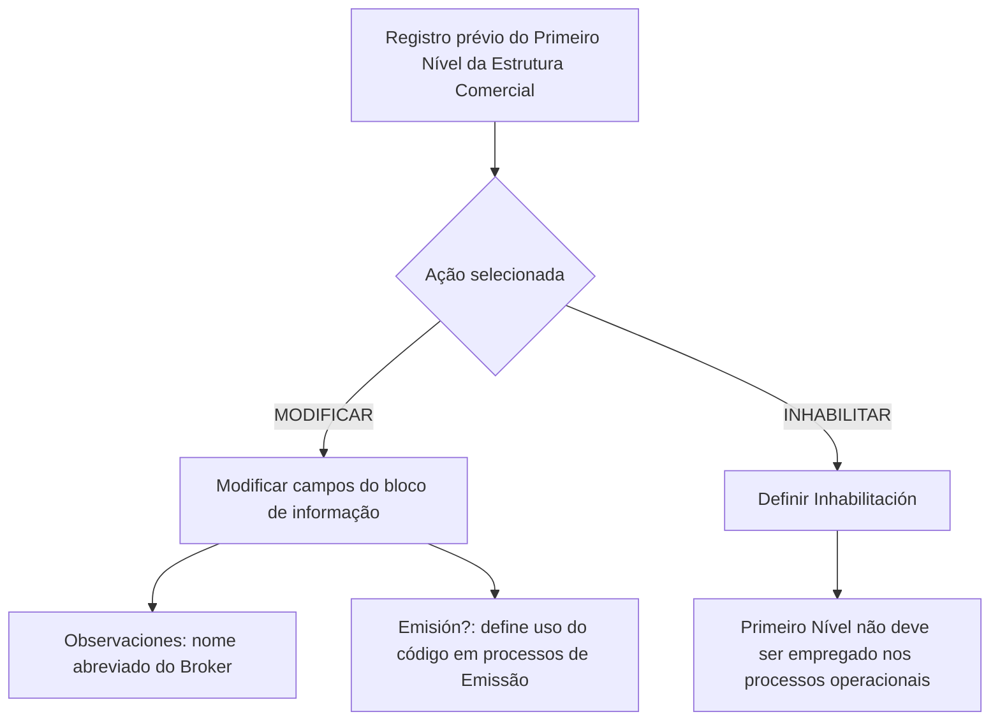

# Modificação e Inabilitação do Primeiro Nível da Estrutura Comercial

## 1. Metadados do Documento
- **Arquivo de Origem:** Não identificado no conteúdo fornecido
- **Tipo de Documento:** Procedimento
- **Domínio / Sistema:** Reef / Mapfre — Estrutura Comercial
- **Público-Alvo:** Operação, Negócio e usuários do sistema Reef
- **Data/Versão Identificada:** Não identificada

---

## 2. Resumo Executivo & Contexto de Negócio

O documento descreve uma operação destinada a modificar informações previamente registradas para o Primeiro Nível da Estrutura Comercial de uma companhia. A operação também permite inabilitar esse nível da estrutura comercial no sistema.

As ações explicitamente disponíveis são **MODIFICAR** e **INHABILITAR**. A modificação segue uma sequência de campos apresentada da esquerda para a direita e de cima para baixo no bloco de informações do Primeiro Nível da Estrutura Comercial.

O campo **Observaciones** contém o nome abreviado do Broker, previamente capturado no Bloco de Informação. O campo **Emisión?** controla se o código do primeiro nível pode ser utilizado, direta ou indiretamente, nos processos de emissão.

O campo **Inhabilitación** informa ao sistema se o Primeiro Nível da Estrutura Comercial está inabilitado. Quando inabilitado, esse nível não deve ser empregado, contemplado ou considerado nos processos operacionais da entidade.

---

## 3. Arquitetura, Componentes & Tecnologias Envolvidas

O conteúdo cita o sistema **Reef**, a documentação **Mapfredocument** e a estrutura funcional denominada **Primer Nivel de la Estructura Comercial**. Não há detalhes sobre arquitetura de software, APIs, bancos de dados, tecnologias de implementação, métodos HTTP, contratos JSON, ambientes técnicos ou integrações entre sistemas.

O fluxo funcional identificado consiste na seleção de uma ação sobre um registro previamente cadastrado, seguida da atualização dos campos do bloco de informação ou da inabilitação do nível comercial.



> **Nota de Análise:** O documento menciona o sistema Reef e a documentação Mapfredocument, mas não detalha componentes técnicos, mecanismos de persistência, permissões, validações de interface ou integrações.

---

## 4. Regras de Negócio, Especificações Funcionais & Processos

1. A operação permite modificar informações previamente registradas para o Primeiro Nível da Estrutura Comercial de uma companhia.
2. A operação permite inabilitar o Primeiro Nível da Estrutura Comercial.
3. As ações disponíveis são:
   - **MODIFICAR**
   - **INHABILITAR**
4. Os campos do bloco de informação seguem uma sequência de modificação da esquerda para a direita e de cima para baixo.
5. O campo **Observaciones** contém o nome abreviado do Broker que foi capturado no Bloco de Informação.
6. O campo **Emisión?** determina o comportamento do sistema quanto ao emprego do código do primeiro nível da estrutura comercial nos processos de Emissão.
7. O código do primeiro nível pode ser empregado direta ou indiretamente nos processos de Emissão, conforme a definição do campo **Emisión?**.
8. O campo **Inhabilitación** indica se o Primeiro Nível da Estrutura Comercial está inabilitado no sistema.
9. Quando o Primeiro Nível da Estrutura Comercial estiver inabilitado, ele não deve ser empregado, contemplado ou considerado nos processos operacionais da entidade.

---

## 5. Tabelas de Parâmetros, Ambientes e Estruturas de Dados

| Item / Parâmetro | Descrição / Função | Tipo / Valores / Formato | Ambiente / Observações |
| :--- | :--- | :--- | :--- |
| Operação | Permite modificar informações do Primeiro Nível da Estrutura Comercial previamente registrada e permite inabilitá-lo. | Ação operacional | Sistema Reef |
| MODIFICAR | Ação disponível para modificar a informação do Primeiro Nível da Estrutura Comercial. | Ação | Não há detalhamento de campos obrigatórios ou validações. |
| INHABILITAR | Ação disponível para inabilitar o Primeiro Nível da Estrutura Comercial. | Ação | O nível inabilitado não deve ser usado em processos operacionais. |
| Observaciones | Contém o nome abreviado do Broker previamente capturado no Bloco de Informação. | Campo textual | A documentação não especifica tamanho, formato ou obrigatoriedade. |
| Emisión? | Determina se o código do primeiro nível pode ser utilizado direta ou indiretamente nos processos de Emissão. | Campo de comportamento do sistema | Valores possíveis não informados. |
| Inhabilitación | Informa ao sistema que o Primeiro Nível da Estrutura Comercial está inabilitado. | Campo de status | Um nível inabilitado não deve ser empregado, contemplado ou considerado operacionalmente. |
| Primeiro Nível da Estrutura Comercial | Nível da estrutura comercial sujeito a modificação ou inabilitação. | Entidade funcional | Associado a uma companhia registrada previamente. |
| Reef | Sistema citado na documentação. | Sistema | Sem detalhamento técnico adicional. |
| Mapfredocument | Nome citado no rodapé ou cabeçalho documental. | Repositório ou identificação documental não confirmada | O papel técnico não é detalhado. |
| Owner | Proprietário indicado na documentação. | Identificador de usuário | `user:agonzalez_mapfre.com` |
| Lifecycle | Estado de ciclo de vida apresentado. | Status documental | `Approved Source` |
| Idioma | Idioma indicado na navegação documental. | Código de idioma | `ES` |

---

## 6. Bateria de Perguntas & Respostas para RAG (FAQ Sintético)

### P1: Qual é o objetivo da operação de modificação do Primeiro Nível da Estrutura Comercial?
**R:** A operação permite modificar as informações previamente registradas para o Primeiro Nível da Estrutura Comercial de uma companhia. A mesma operação também permite inabilitar esse nível no sistema.

### P2: Quais ações estão disponíveis para o Primeiro Nível da Estrutura Comercial?
**R:** O documento apresenta duas ações possíveis: **MODIFICAR** e **INHABILITAR**.

### P3: O que representa o campo Observaciones no Primeiro Nível da Estrutura Comercial?
**R:** O campo **Observaciones** contém o nome abreviado do Broker que foi capturado anteriormente no Bloco de Informação.

### P4: Qual é a função do campo Emisión??
**R:** O campo **Emisión?** determina o comportamento do sistema, permitindo que o código do primeiro nível da estrutura comercial seja empregado direta ou indiretamente nos processos de Emissão.

### P5: O que acontece quando o Primeiro Nível da Estrutura Comercial é inabilitado?
**R:** Quando o campo **Inhabilitación** indica que o Primeiro Nível da Estrutura Comercial está inabilitado, esse nível não deve ser empregado, contemplado ou considerado nos processos operacionais da entidade.

### P6: Em que ordem os campos do bloco de informação devem ser modificados?
**R:** A documentação estabelece que os campos devem seguir a sequência apresentada da esquerda para a direita e de cima para baixo.

### P7: O código do Primeiro Nível da Estrutura Comercial pode ser usado nos processos de Emissão?
**R:** Sim, o código pode ser empregado direta ou indiretamente nos processos de Emissão quando o comportamento definido pelo campo **Emisión?** permitir esse uso. O documento não informa os valores específicos desse campo.

### P8: O documento define quais validações são aplicadas antes da inabilitação?
**R:** Não. O documento informa a finalidade do campo **Inhabilitación**, mas não descreve validações, permissões, confirmações ou regras adicionais necessárias para executar a inabilitação.

### P9: O documento especifica APIs ou contratos técnicos para a operação?
**R:** Não. O conteúdo não apresenta métodos HTTP, endpoints, payloads, contratos JSON, tecnologias de implementação ou integrações técnicas.

### P10: Qual sistema é citado como contexto da documentação?
**R:** O sistema citado é o **Reef**, identificado também em referências como “DOCUMENTACIÓN Reef”.

---

## 7. Glossário de Termos, Siglas & Conceitos-Chave

- **Broker:** Entidade cujo nome abreviado é armazenado no campo **Observaciones**.
- **Emisión:** Processo no qual o código do Primeiro Nível da Estrutura Comercial pode ser empregado direta ou indiretamente.
- **Emisión?:** Campo que determina o comportamento do sistema relativo ao uso do código do primeiro nível nos processos de Emissão.
- **Estructura Comercial:** Estrutura comercial da companhia, da qual o documento trata especificamente o primeiro nível.
- **Inhabilitación:** Campo que sinaliza que o Primeiro Nível da Estrutura Comercial está inabilitado no sistema.
- **Mapfredocument:** Identificação documental citada no conteúdo, sem definição funcional adicional.
- **Primer Nivel de la Estructura Comercial:** Primeiro nível da estrutura comercial de uma companhia, sujeito às ações de modificação e inabilitação.
- **Reef:** Sistema ou contexto documental citado no material.
- **VL:** Sigla apresentada no rodapé documental sem definição no conteúdo fornecido.

---

## 8. Notas Críticas, Riscos & Limitações

- O documento não identifica o arquivo de origem, data, versão ou autor técnico.
- Não há detalhamento de campos obrigatórios, formatos, limites de tamanho ou valores válidos.
- O documento não define perfis de acesso, matriz de permissões ou processo de aprovação para modificar ou inabilitar registros.
- Não são descritos mecanismos de auditoria, histórico de alterações, reversão da inabilitação ou tratamento de erros.
- Não há informação sobre APIs, integrações, banco de dados, URLs, ambientes, logs, tecnologias ou contratos de dados.
- **Risco operacional:** Um Primeiro Nível da Estrutura Comercial marcado como inabilitado não deve ser utilizado nos processos operacionais; o documento não descreve como o sistema bloqueia ou sinaliza tentativas de uso.
- **Nota de Análise:** O documento lista os campos **Observaciones**, **Emisión?** e **Inhabilitación**, porém não detalha a interface, os valores permitidos nem as validações associadas.

---

## 9. Conteúdo Bruto Estruturado (Referência Fiel)

```text
--- [PÁGINA 1 DE 1] ---

MODIFICAR Información especíca del Primer Nivel de la Estructura
Comercial
Objetivo
Esta Operación permite Modicar la información que tuviera el Primer Nivel de la Estructura Comercial de la compañía registrada
previamente además de poder Inhabilitarlo.
Posibles Acciones
 MODIFICAR ( )
 INHABILITAR ( )
Datos Primer Nivel Estructura Comercial
De Izquierda a Derecha y de Arriba hacia Abajo, los siguientes campos marcan la secuencia de Modicación en este Bloque de Información.
Observaciones ( )
Este campo contiene el nombre abreviado del Broker, que se habrá capturado en el Bloque de Información
Emisión? ( )
Este campo determina el comportamiento del Sistema permitiendo que el código del primer nivel de la estructura comercial se pueda
emplear, directa o indirectamente, en los procesos de Emisión.
Inhabilitación ( )
Este campo le indica al Sistema que el Primer Nivel de la Estructura Comercial está inhabilitado en el Sistema por lo cual, de estarlo, no
debería ser empleado, contemplado o considerado en los procesos operativos de la entidad.
Documentation / DOCUMENTACIÓN Reef
DOCUMENTACIÓN Reef
Mapfredocument
DOCUMENTACIÓN Reef
Owner
user:agonzalez_mapfre.com
Lifecycle
Approved Source
 / 
 VL
Buscar Inicio Soluciones Arquitecturas APIs Componentes Cloud Documentación Zeus Reef Ayuda
ES
```
