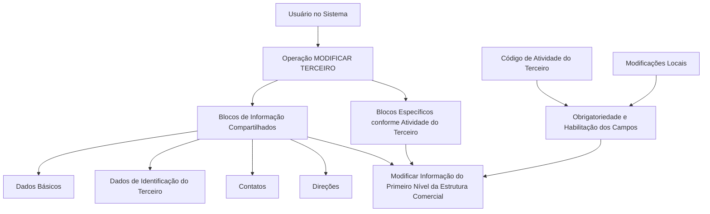

# Operação MODIFICAR — Primeiro Nível da Estrutura Comercial

## 1. Metadados do Documento
- **Arquivo de Origem:** `Não identificado — conteúdo bruto fornecido na solicitação`
- **Tipo de Documento:** `Procedimento`
- **Domínio / Sistema:** `Operação MODIFICAR TERCEIRO / Estrutura Comercial; documentação Reef / Mapfre`
- **Público-Alvo:** `Usuários do sistema, Analistas Funcionais, Operação`
- **Data/Versão Identificada:** `Não identificada`

---

## 2. Resumo Executivo & Contexto de Negócio

O documento descreve a operação **MODIFICAR**, destinada a complementar, modificar e/ou inabilitar informações do **Primeiro Nível da Estrutura Comercial**. A alteração pode ocorrer em qualquer estrutura de dados que contenha e agrupe essas informações.

A obrigatoriedade e a habilitação dos campos não são fixas para todos os registros. Esses comportamentos podem variar conforme o **código de atividade do Terceiro**, indicando que o cadastro e a manutenção da Estrutura Comercial dependem da classificação de atividade associada ao Terceiro.

O documento também alerta que modificações implementadas localmente podem alterar o comportamento da aplicação, especialmente em relação à obrigatoriedade do registro dos Dados do Terceiro. Portanto, a operação deve considerar possíveis particularidades locais do sistema.

O processo menciona blocos de informação compartilhados da operação **MODIFICAR TERCEIRO** — Dados Básicos, Dados de Identificação do Terceiro, Contatos e Direções — além de blocos específicos conforme a atividade do Terceiro. A ordem de captura dos dados pode variar segundo o critério adotado pelo usuário no sistema.

---

## 3. Arquitetura, Componentes & Tecnologias Envolvidas

Os componentes funcionais explicitamente citados são:

| Componente / Elemento | Papel descrito |
| :--- | :--- |
| Operação MODIFICAR | Operação para complementar, modificar e/ou inabilitar dados. |
| MODIFICAR TERCEIRO | Contexto operacional que reúne blocos de informações compartilhados. |
| Primeiro Nível da Estrutura Comercial | Informação-alvo da operação descrita. |
| Terceiro | Entidade cujo código de atividade influencia obrigatoriedade e habilitação de campos. |
| Dados Básicos | Bloco de informação compartilhado. |
| Dados de Identificação do Terceiro | Bloco de informação compartilhado. |
| Contatos | Bloco de informação compartilhado. |
| Direções | Bloco de informação compartilhado. |
| Blocos específicos por atividade | Estruturas de informação condicionadas à atividade do Terceiro. |
| DOCUMENTACIÓN Reef / Mapfredocument | Referências presentes no trecho de navegação e documentação. |



> **Nota de Análise:** O conteúdo não detalha tecnologias de implementação, interfaces, métodos HTTP, contratos de integração, banco de dados, URLs de ambiente, versões ou mecanismos de autenticação.

---

## 4. Regras de Negócio, Especificações Funcionais & Processos

### Escopo da operação

A operação permite as seguintes ações sobre a informação do Primeiro Nível da Estrutura Comercial:

1. **Complementar** informações.
2. **Modificar** informações.
3. **Inabilitar** informações.

As ações podem ser realizadas em qualquer estrutura de dados que contenha e agrupe a informação do Primeiro Nível da Estrutura Comercial.

### Regras de obrigatoriedade e habilitação

1. A obrigatoriedade dos campos no registro de dados dos blocos ou estruturas de informação compartilhadas pode variar de acordo com o **código de atividade do Terceiro**.
2. A habilitação dos campos no registro de dados dos blocos ou estruturas de informação compartilhadas também pode variar conforme o **código de atividade do Terceiro**.
3. Modificações implementadas localmente podem afetar o comportamento da aplicação quanto à obrigatoriedade de registro dos Dados do Terceiro.
4. O documento não fornece os códigos de atividade existentes, nem especifica quais campos são obrigatórios, opcionais ou inabilitados para cada código.

### Ordem de captura de informações

A ordem de captura dos dados nos diferentes blocos de informação pode variar conforme o critério seguido pelo usuário no sistema. O documento não impõe uma sequência operacional obrigatória entre Dados Básicos, Identificação do Terceiro, Contatos, Direções e blocos específicos por atividade.

### Fluxo funcional descrito

1. O usuário acessa a operação **MODIFICAR TERCEIRO**.
2. O usuário trabalha com os blocos de informação compartilhados:
   - Dados Básicos;
   - Dados de Identificação do Terceiro;
   - Contatos;
   - Direções.
3. O usuário pode acessar blocos de informação específicos conforme a atividade do Terceiro.
4. O usuário modifica a informação do **Primeiro Nível da Estrutura Comercial**.
5. Durante o registro, o comportamento de obrigatoriedade e habilitação dos campos pode ser condicionado pelo código de atividade do Terceiro e por modificações locais implementadas.

---

## 5. Tabelas de Parâmetros, Ambientes e Estruturas de Dados

| Item / Parâmetro | Descrição / Função | Tipo / Valores / Formato | Ambiente / Observações |
| :--- | :--- | :--- | :--- |
| Operação | Operação funcional para manutenção da informação comercial. | `MODIFICAR` | Aplicável ao contexto de MODIFICAR TERCEIRO. |
| Entidade principal | Registro cujos dados e estrutura comercial são tratados. | `Terceiro` | O código de atividade do Terceiro influencia regras de campos. |
| Primeiro Nível da Estrutura Comercial | Informação comercial a complementar, modificar ou inabilitar. | Não detalhado | Pode estar presente em estruturas de dados que a contenham e agrupem. |
| Código de atividade do Terceiro | Critério que pode modificar o comportamento dos campos. | Código não especificado | Afeta obrigatoriedade e/ou habilitação. |
| Dados Básicos | Bloco de informação compartilhado. | Não detalhado | Parte da operação MODIFICAR TERCEIRO. |
| Dados de Identificação do Terceiro | Bloco de informação compartilhado. | Não detalhado | Parte da operação MODIFICAR TERCEIRO. |
| Contatos | Bloco de informação compartilhado. | Não detalhado | Parte da operação MODIFICAR TERCEIRO. |
| Direções | Bloco de informação compartilhado. | Não detalhado | Parte da operação MODIFICAR TERCEIRO. |
| Blocos específicos por atividade | Informações específicas condicionadas à atividade do Terceiro. | Não detalhado | O documento não relaciona os blocos ou atividades existentes. |
| Modificações locais | Alterações previamente implementadas localmente. | Não detalhado | Podem afetar a obrigatoriedade dos Dados do Terceiro. |
| Ordem de captura | Sequência em que o usuário registra informações nos blocos. | Variável | Pode variar conforme o critério do usuário. |
| DOCUMENTACIÓN Reef | Referência de documentação exibida no conteúdo bruto. | Navegação documental | Sem detalhamento funcional adicional. |
| Owner | Identificação de proprietário mostrada no trecho documental. | `user:agonzalez_mapfre.com` | Valor transcrito literalmente do conteúdo. |
| Lifecycle | Campo de ciclo de vida exibido na documentação. | `Approved Source / VL` | Relação exata entre os valores não é detalhada. |

---

## 6. Bateria de Perguntas & Respostas para RAG (FAQ Sintético)

### P1: Em que consiste a operação MODIFICAR do Primeiro Nível da Estrutura Comercial?
**R:** A operação MODIFICAR consiste em complementar, modificar e/ou inabilitar as informações do Primeiro Nível da Estrutura Comercial em qualquer estrutura de dados que contenha e agrupe essas informações.

### P2: Quais ações podem ser realizadas sobre a informação do Primeiro Nível da Estrutura Comercial?
**R:** O documento prevê três ações: complementar informações, modificar informações e inabilitar informações relacionadas ao Primeiro Nível da Estrutura Comercial.

### P3: O código de atividade do Terceiro interfere no preenchimento dos campos?
**R:** Sim. A obrigatoriedade e/ou a habilitação dos campos no registro de dados dos blocos ou estruturas de informação compartilhadas pode variar de acordo com o código de atividade do Terceiro.

### P4: Quais blocos de informação compartilhados são citados na operação MODIFICAR TERCEIRO?
**R:** Os blocos compartilhados citados são Dados Básicos, Dados de Identificação do Terceiro, Contatos e Direções.

### P5: Existem blocos de informação específicos para cada Terceiro?
**R:** O documento informa que existem blocos de informação específicos de acordo com a atividade do Terceiro. Entretanto, o conteúdo não identifica quais são esses blocos nem quais atividades os determinam.

### P6: Modificações locais podem afetar o comportamento da operação?
**R:** Sim. Modificações implementadas localmente podem afetar o comportamento da aplicação em relação à obrigatoriedade no registro dos Dados do Terceiro.

### P7: Existe uma ordem obrigatória para capturar Dados Básicos, Contatos e Direções?
**R:** Não. O documento estabelece que a ordem de captura dos dados nos diferentes blocos de informação pode variar de acordo com o critério seguido pelo usuário no sistema.

### P8: O documento informa quais campos são obrigatórios para cada código de atividade?
**R:** Não. O documento informa apenas que a obrigatoriedade e a habilitação podem variar conforme o código de atividade do Terceiro, sem listar os códigos, campos ou regras específicas.

### P9: A operação MODIFICAR está limitada a uma única estrutura de dados?
**R:** Não. A operação pode atuar em qualquer estrutura de dados que contenha e agrupe a informação do Primeiro Nível da Estrutura Comercial.

### P10: O documento especifica APIs, métodos HTTP ou contratos de integração para MODIFICAR TERCEIRO?
**R:** Não. O conteúdo fornecido descreve o processo funcional e os blocos de informação, mas não detalha APIs, métodos HTTP, contratos JSON, tecnologias de integração ou persistência de dados.

---

## 7. Glossário de Termos, Siglas & Conceitos-Chave

- **MODIFICAR:** Operação que permite complementar, modificar e/ou inabilitar informações.
- **MODIFICAR TERCEIRO:** Contexto operacional que reúne blocos compartilhados e blocos específicos para manutenção de dados do Terceiro.
- **Terceiro:** Entidade cujos dados são registrados e cuja atividade pode influenciar a obrigatoriedade e habilitação dos campos.
- **Primeiro Nível da Estrutura Comercial:** Informação comercial que é objeto da operação descrita.
- **Estruturas de dados:** Estruturas que contêm e agrupam a informação do Primeiro Nível da Estrutura Comercial.
- **Blocos de Informação Compartilhados:** Conjunto de blocos citados como Dados Básicos, Dados de Identificação do Terceiro, Contatos e Direções.
- **Código de atividade:** Código associado ao Terceiro que pode determinar regras de obrigatoriedade e habilitação de campos.
- **DOCUMENTACIÓN Reef:** Referência de documentação presente no conteúdo bruto.
- **VL:** Sigla exibida no campo Lifecycle; o documento não fornece sua expansão ou significado.

---

## 8. Notas Críticas, Riscos & Limitações

- O documento não especifica os campos que compõem o Primeiro Nível da Estrutura Comercial.
- Não há relação entre códigos de atividade do Terceiro e respectivas regras de obrigatoriedade ou habilitação.
- Modificações locais podem alterar o comportamento esperado da aplicação, criando risco de divergência entre implementações locais e regras documentadas de forma geral.
- A ordem de captura dos dados é variável segundo o critério do usuário, sem um fluxo sequencial obrigatório documentado.
- Não foram fornecidos detalhes de APIs, contratos, tecnologias, ambientes, logs, URLs, permissões ou mecanismos de validação técnica.
- **Nota de Análise:** O conteúdo lista a operação MODIFICAR TERCEIRO e blocos de informação, porém não detalha telas, campos, regras por atividade, métodos de persistência ou integrações expostas.

---

## 9. Conteúdo Bruto Estruturado (Referência Fiel)

```text
--- [PÁGINA 1 DE 1] ---

OPERACIÓN MODIFICAR Primer Nivel de la Estructura Comercial
¿En que consiste?
Esta operación consiste en Complementar, Modicar y/o Inhabilitar la información del Primer Nivel de la Estructura Comercial en cualquiera
de las estructuras de datos que la contienen y agrupan.
Premisas
La obligatoriedad y/o la habilitación de los campos en el registro de los datos de cada uno de los bloques o estructuras de información
compartidas puede variar de acuerdo con el código de actividad del Tercero:
Las modicaciones que se hubieran podido implementar localmente a su vez pueden afectar el comportamiento de la aplicación en
relación con la obligatoriedad en el registro de los Datos del Tercero.
Por último, el orden de captura de los datos en los distintos bloques de Información puede variar de acuerdo con el criterio seguido por el
Usuario en el Sistema.
Proceso
MODIFICAR
TERCERO
Modificar Información
del Primer Nivel Estructura Comercial
Bloques de Información Compartidos (MODIFICAR TERCERO)
 Datos Básicos ( )
 Datos Identicación Tercero ( )
 Contactos (   )
 Direcciones (   )
Bloques de Información Especícos de acuerdo con la Actividad del Tercero.
 Modicar Información del Primer Nivel de la Estructura Comercial(  )
Ejemplo:
Documentation / DOCUMENTACIÓN Reef
DOCUMENTACIÓN Reef
Mapfredocument
DOCUMENTACIÓN Reef
Owner
user:agonzalez_mapfre.com
Lifecycle
Approved Source
 / 
 VL
Buscar Inicio Soluciones Arquitecturas APIs Componentes Cloud Documentación Zeus Reef Ayuda
ES
```
