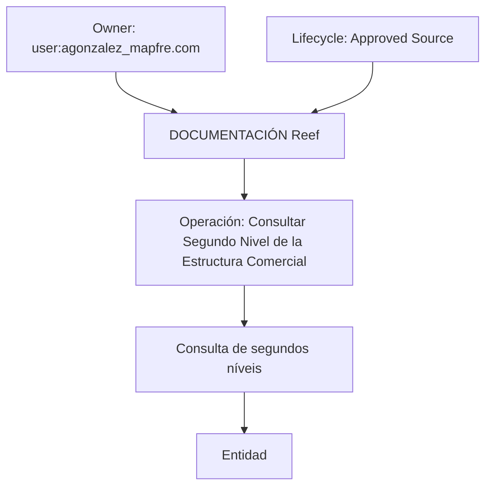

# Documentação REEF — Operación Consultar Segundo Nivel de la Estructura Comercial

## 1. Metadados do Documento
- **Arquivo de Origem:** Não identificado
- **Tipo de Documento:** Procedimento
- **Domínio / Sistema:** REEF / Estructura Comercial
- **Público-Alvo:** Operação, Negócio e usuários de documentação REEF
- **Data/Versão Identificada:** Não identificada

---

## 2. Resumo Executivo & Contexto de Negócio

O documento apresenta a operação **“Consultar Segundo Nivel de la Estructura Comercial”** no contexto da documentação REEF. O objetivo declarado é consultar os segundos níveis da estrutura comercial com os quais uma entidade opera.

A página está inserida no ambiente de documentação identificado como **DOCUMENTACIÓN Reef**, com referência a **Mapfredocument**. O conteúdo também indica que o artefato possui ciclo de vida aprovado.

O texto extraído não descreve os critérios de consulta, campos retornados, métodos técnicos, APIs, autenticação, regras de autorização ou fluxos de tratamento de erro. Portanto, a finalidade operacional está identificada, mas os detalhes funcionais e técnicos da consulta não estão disponíveis no conteúdo fornecido.

---

## 3. Arquitetura, Componentes & Tecnologias Envolvidas

Os elementos explicitamente citados são:

- **REEF:** domínio ou sistema ao qual a documentação pertence.
- **Operación Consultar Segundo Nivel de la Estructura Comercial:** operação documentada.
- **Entidad:** entidade que opera com os segundos níveis da estrutura comercial.
- **Mapfredocument:** identificação textual presente na página.
- **DOCUMENTACIÓN Reef:** ambiente ou área de documentação.
- **VL:** referência exibida junto ao status de aprovação.
- **Owner:** `user:agonzalez_mapfre.com`.
- **Lifecycle:** `Approved Source`.

O conteúdo não apresenta uma arquitetura de software, microsserviços, APIs, bases de dados, protocolos, URLs, ambientes técnicos ou tecnologias de implementação.



> **Nota de Análise:** O diagrama representa apenas as relações conceituais explicitamente disponíveis no texto extraído. O documento não detalha integrações técnicas, fluxo de dados ou componentes de implementação.

---

## 4. Regras de Negócio, Especificações Funcionais & Processos

A especificação funcional explicitamente disponível é:

1. A operação é denominada **“Consultar Segundo Nivel de la Estructura Comercial”**.
2. A operação permite a **consulta dos segundos níveis da estrutura comercial**.
3. A consulta está relacionada aos segundos níveis da estrutura comercial **com os quais a entidade opera**.

Não foram identificados no conteúdo fornecido:

- Critérios de seleção da entidade.
- Definição formal do que constitui o “segundo nível” da estrutura comercial.
- Parâmetros de entrada.
- Campos de resposta.
- Ordenação, filtros, paginação ou limites de resultado.
- Regras de validação.
- Regras de autorização ou perfis de acesso.
- Métodos HTTP, contratos JSON, serviços ou endpoints.
- Fluxo de exceções, mensagens de erro ou tratamento operacional.

> **Nota de Análise:** O documento lista a operação de consulta, porém não detalha a implementação funcional ou técnica necessária para executar a consulta.

---

## 5. Tabelas de Parâmetros, Ambientes e Estruturas de Dados

| Item / Parâmetro | Descrição / Função | Tipo / Valores / Formato | Ambiente / Observações |
| :--- | :--- | :--- | :--- |
| Operação | Consultar Segundo Nivel de la Estructura Comercial | Nome de operação | Relacionada à documentação REEF |
| Objeto da consulta | Segundos níveis da estrutura comercial | Informação de estrutura comercial | Associados à entidade que opera com esses níveis |
| Sistema / domínio | REEF | Nome de domínio ou sistema | Referenciado como DOCUMENTACIÓN Reef |
| Documentação | DOCUMENTACIÓN Reef | Área de documentação | A página possui navegação para Documentación |
| Owner | `user:agonzalez_mapfre.com` | Identificador de proprietário | Exibido no conteúdo da página |
| Lifecycle | Approved Source | Status de ciclo de vida | Exibido no conteúdo da página |
| Referência adicional | VL | Sigla ou identificador não detalhado | Exibido ao lado do status aprovado |
| Referência documental | Mapfredocument | Texto identificador | Não detalhado no conteúdo extraído |
| Idioma de interface | ES | Código de idioma | Exibido na navegação da página |

---

## 6. Bateria de Perguntas & Respostas para RAG (FAQ Sintético)

### P1: Qual é o objetivo da operação “Consultar Segundo Nivel de la Estructura Comercial”?
**R:** A operação tem como objetivo consultar os segundos níveis da estrutura comercial com os quais uma entidade opera.

### P2: Qual sistema ou domínio está associado à operação de consulta de segundo nível comercial?
**R:** A operação está associada ao domínio ou sistema REEF, identificado no conteúdo como DOCUMENTACIÓN Reef.

### P3: O documento informa quais dados são retornados pela consulta de segundo nível da estrutura comercial?
**R:** Não. O conteúdo somente informa que a operação consulta os segundos níveis da estrutura comercial com os quais a entidade opera; campos de retorno não foram detalhados.

### P4: O documento define parâmetros de entrada para a consulta?
**R:** Não. O texto fornecido não especifica parâmetros, filtros, identificadores de entidade ou formatos de entrada para a operação.

### P5: Existe um endpoint, método HTTP ou contrato de API documentado para essa operação?
**R:** Não. O conteúdo extraído não apresenta endpoint, URL, método HTTP, contrato JSON, protocolo ou tecnologia de integração.

### P6: Quem é o proprietário identificado na página de documentação REEF?
**R:** O proprietário exibido na página é `user:agonzalez_mapfre.com`.

### P7: Qual é o status de ciclo de vida registrado para o conteúdo?
**R:** O ciclo de vida registrado no conteúdo é `Approved Source`.

### P8: O que significa a referência “VL” exibida no documento?
**R:** O conteúdo apresenta a referência `VL`, mas não fornece sua definição, expansão ou finalidade no contexto da documentação REEF.

### P9: O documento explica o que é um segundo nível da estrutura comercial?
**R:** Não. O termo “Segundo Nivel de la Estructura Comercial” é utilizado como objeto da consulta, mas não recebe definição adicional.

### P10: Quais áreas de navegação são apresentadas na página?
**R:** A página apresenta as áreas de navegação: Buscar, Inicio, Soluciones, Arquitecturas, APIs, Componentes, Cloud, Documentación, Zeus, Reef e Ayuda.

---

## 7. Glossário de Termos, Siglas & Conceitos-Chave

- **REEF:** Nome do domínio, sistema ou área de documentação mencionada como DOCUMENTACIÓN Reef. O significado expandido não é informado.
- **Estructura Comercial:** Estrutura comercial cujos segundos níveis são objeto da operação de consulta.
- **Segundo Nivel:** Segundo nível da estrutura comercial. O documento não detalha sua definição funcional.
- **Entidad:** Entidade que opera com os segundos níveis consultados. O tipo de entidade não é especificado.
- **Owner:** Campo que identifica o proprietário do conteúdo; o valor apresentado é `user:agonzalez_mapfre.com`.
- **Lifecycle:** Campo de ciclo de vida documental; o valor apresentado é `Approved Source`.
- **VL:** Referência exibida no conteúdo sem definição adicional.
- **Mapfredocument:** Identificador textual presente na página sem descrição adicional.
- **ES:** Código de idioma exibido na interface de navegação.

---

## 8. Notas Críticas, Riscos & Limitações

- O conteúdo extraído é extremamente resumido e não contém detalhamento técnico ou funcional suficiente para implementar ou operar a consulta de forma autônoma.
- Não há definição dos parâmetros de entrada, estrutura de saída, filtros, regras de negócio detalhadas, mensagens de erro ou critérios de autorização.
- Não foram identificados métodos HTTP, endpoints, URLs, contratos de API, logs, ambientes, servidores ou dependências técnicas.
- A sigla ou referência `VL` não é definida.
- O termo `Mapfredocument` é apresentado sem explicação de função, integração ou relação com a operação.
- O status `Approved Source` indica aprovação documental, mas não fornece evidência sobre versão de API, vigência operacional ou disponibilidade técnica.

---

## 9. Conteúdo Bruto Estruturado (Referência Fiel)

```text
--- [PÁGINA 1 DE 1] ---

OPERACIÓN CONSULTAR Segundo Nivel de la Estructura Comercial
Consulta de los Segundos Niveles de la Estructura Comercial con las que opera la Entidad.
Documentation / DOCUMENTACIÓN Reef
DOCUMENTACIÓN Reef
Mapfredocument
DOCUMENTACIÓN Reef
Owner
user:agonzalez_mapfre.com
Lifecycle
Approved Source
 / 
 VL
Buscar Inicio Soluciones Arquitecturas APIs Componentes Cloud Documentación Zeus Reef Ayuda
ES
```
