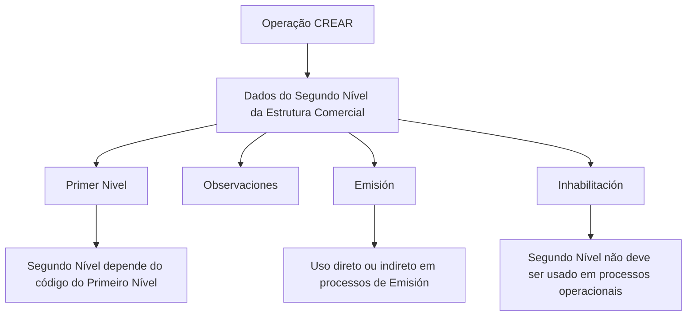

# Criação de Informação Específica do Segundo Nível da Estrutura Comercial

## 1. Metadados do Documento
- **Arquivo de Origem:** Não identificado no conteúdo fornecido
- **Tipo de Documento:** Procedimento
- **Domínio / Sistema:** Reef / Estrutura Comercial
- **Público-Alvo:** Operação, Negócio e usuários do sistema
- **Data/Versão Identificada:** Não identificada

---

## 2. Resumo Executivo & Contexto de Negócio

O documento descreve a operação **CREAR**, destinada ao registro de informações dos **Segundos Níveis da Estrutura Comercial** configurados na companhia. Como exemplo de entidade associada a esse nível, o documento cita **Personas Jurídicas**.

O procedimento organiza a captura de dados no bloco **Datos Segundo Nivel Estructura Comercial**. A sequência de preenchimento deve ser seguida da esquerda para a direita e de cima para baixo, conforme indicado pelo documento.

A criação de um Segundo Nível depende do código do **Primeiro Nível** da estrutura comercial. Também são registrados dados de observação, habilitação para utilização em processos de emissão e condição de inabilitação operacional.

O conteúdo evidencia que a estrutura comercial influencia processos operacionais da entidade, especialmente os processos de **Emisión**. Um Segundo Nível inabilitado não deve ser empregado, contemplado ou considerado nesses processos.

---

## 3. Arquitetura, Componentes & Tecnologias Envolvidas

O conteúdo fornecido não apresenta arquitetura técnica, integrações, tecnologias, APIs, bancos de dados, microsserviços, URLs de ambiente ou contratos de interface.

Os elementos funcionais identificados são:

- Sistema Reef.
- Operação **CREAR**.
- Bloco **Datos Segundo Nivel Estructura Comercial**.
- Primeiro Nível da Estrutura Comercial.
- Segundo Nível da Estrutura Comercial.
- Processos de **Emisión**.
- Estado de **Inhabilitación**.



> **Nota de Análise:** O documento não detalha a arquitetura de software, os componentes técnicos internos, os métodos HTTP, os contratos JSON ou os mecanismos de persistência da operação **CREAR**.

---

## 4. Regras de Negócio, Especificações Funcionais & Processos

### Objetivo funcional

A operação **CREAR** permite registrar no sistema as informações dos Segundos Níveis da Estrutura Comercial configurados na companhia. O documento cita as **Personas Jurídicas** como exemplo de Segundo Nível.

### Ação habilitada

A ação explicitamente habilitada é:

- **CREAR**

### Sequência de captura

Os campos do bloco **Datos Segundo Nivel Estructura Comercial** devem ser capturados na ordem apresentada, da esquerda para a direita e de cima para baixo.

### Regras dos campos

1. **Primer Nivel**
   - Deve conter o código do Primeiro Nível da Estrutura Comercial.
   - O Segundo Nível criado depende desse Primeiro Nível.

2. **Observaciones**
   - Permite informar texto explicativo ou observações relacionadas ao fato de criar o nível da estrutura comercial.

3. **Emisión**
   - Modula o comportamento do sistema.
   - Determina se o código do Segundo Nível da Estrutura Comercial pode ser empregado, direta ou indiretamente, nos processos de Emisión.

4. **Inhabilitación**
   - Indica ao sistema que o Segundo Nível da Estrutura Comercial está inabilitado.
   - Quando inabilitado, o Segundo Nível não deve ser empregado, contemplado ou considerado nos processos operacionais da entidade.

---

## 5. Tabelas de Parâmetros, Ambientes e Estruturas de Dados

| Item / Parâmetro | Descrição / Função | Tipo / Valores / Formato | Ambiente / Observações |
| :--- | :--- | :--- | :--- |
| Operação | Registra informações de Segundos Níveis da Estrutura Comercial. | `CREAR` | Ação habilitada no documento. |
| Segundo Nível da Estrutura Comercial | Nível comercial a ser registrado no sistema. | Não especificado | O documento cita Personas Jurídicas como exemplo. |
| Primer Nivel | Contém o código do Primeiro Nível do qual depende a chave do Segundo Nível. | Código; formato não especificado | Campo de dependência hierárquica. |
| Observaciones | Registra texto aclaratório ou observações sobre a criação do nível comercial. | Texto; tamanho e formato não especificados | Campo informativo. |
| Emisión | Modula o comportamento do sistema sobre o uso do código do Segundo Nível em processos de emissão. | Não especificado | Pode permitir uso direto ou indireto nos processos de Emisión. |
| Inhabilitación | Informa que o Segundo Nível está inabilitado no sistema. | Não especificado | Um nível inabilitado não deve ser usado, contemplado ou considerado nos processos operacionais. |
| Sistema | Contexto documental e sistema referenciado. | Reef | O conteúdo apresenta “DOCUMENTACIÓN Reef”. |
| Lifecycle | Estado documental informado na interface de documentação. | Approved | Aparece como “Lifecycle Approved”. |
| Owner | Identificação do proprietário exibida no conteúdo. | `user:agonzalez_mapfre.com` | Valor transcrito conforme o texto fornecido. |

---

## 6. Bateria de Perguntas & Respostas para RAG (FAQ Sintético)

### P1: Qual é o objetivo da operação CREAR no sistema Reef?
**R:** A operação **CREAR** permite registrar no sistema as informações dos Segundos Níveis da Estrutura Comercial configurados na companhia. O documento cita Personas Jurídicas como exemplo de Segundo Nível.

### P2: Qual ação está habilitada no procedimento de Segundo Nível da Estrutura Comercial?
**R:** A única ação explicitamente indicada como habilitada é **CREAR**.

### P3: Qual é a ordem de captura dos campos do bloco Datos Segundo Nivel Estructura Comercial?
**R:** Os campos devem ser capturados da esquerda para a direita e de cima para baixo, conforme a sequência indicada no bloco **Datos Segundo Nivel Estructura Comercial**.

### P4: O que deve ser informado no campo Primer Nivel?
**R:** O campo **Primer Nivel** deve conter o código do Primeiro Nível da Estrutura Comercial do qual depende a chave do Segundo Nível.

### P5: Para que serve o campo Observaciones?
**R:** O campo **Observaciones** permite inserir texto aclaratório ou observações relacionadas ao ato de criar o nível da Estrutura Comercial.

### P6: Qual é a finalidade do campo Emisión?
**R:** O campo **Emisión** modula o comportamento do sistema, permitindo que o código do Segundo Nível da Estrutura Comercial possa ser utilizado direta ou indiretamente nos processos de Emisión.

### P7: O que acontece quando um Segundo Nível está marcado como inabilitado?
**R:** Quando o campo **Inhabilitación** indica que o Segundo Nível está inabilitado, esse nível não deve ser empregado, contemplado ou considerado nos processos operacionais da entidade.

### P8: O documento define métodos HTTP ou contratos JSON para a operação CREAR?
**R:** Não. O conteúdo fornecido descreve a finalidade funcional da operação e os campos de captura, mas não apresenta métodos HTTP, endpoints, contratos JSON, APIs ou especificações técnicas de integração.

### P9: O documento identifica quais tipos de entidades podem representar um Segundo Nível?
**R:** O documento apresenta **Personas Jurídicas** como exemplo de Segundo Nível da Estrutura Comercial, sem listar outros tipos de entidades.

### P10: Qual sistema é mencionado como repositório da documentação?
**R:** O conteúdo menciona **DOCUMENTACIÓN Reef** e apresenta a operação no contexto do sistema Reef.

---

## 7. Glossário de Termos, Siglas & Conceitos-Chave

- **CREAR:** Ação habilitada para registrar informações de Segundos Níveis da Estrutura Comercial.
- **Emisión:** Processos de emissão nos quais o código do Segundo Nível pode ser empregado direta ou indiretamente, conforme o campo Emisión.
- **Estructura Comercial:** Estrutura hierárquica comercial composta, no conteúdo apresentado, por Primeiro Nível e Segundo Nível.
- **Inhabilitación:** Condição que informa ao sistema que um Segundo Nível está inabilitado e não deve ser considerado nos processos operacionais.
- **Personas Jurídicas:** Exemplo fornecido pelo documento para os Segundos Níveis da Estrutura Comercial.
- **Primer Nivel:** Primeiro Nível da Estrutura Comercial; seu código é informado como dependência do Segundo Nível.
- **Segundo Nivel:** Segundo Nível da Estrutura Comercial registrado pela operação CREAR.
- **Reef:** Sistema ou contexto de documentação mencionado no conteúdo.

---

## 8. Notas Críticas, Riscos & Limitações

- O conteúdo não informa obrigatoriedade, formato, domínio de valores ou validações técnicas dos campos **Primer Nivel**, **Observaciones**, **Emisión** e **Inhabilitación**.
- O conteúdo não detalha como a inabilitação é aplicada tecnicamente nos processos operacionais.
- O documento não apresenta fluxos de aprovação, perfis de acesso, matriz de permissões, mensagens de erro ou critérios de auditoria.
- Não foram identificados ambientes, servidores, URLs, APIs, métodos HTTP, contratos JSON, bases de dados ou tecnologias de implementação.
- A interface de documentação contém caracteres de codificação corrompidos em alguns trechos, como `especíca` e `congurados`; a transcrição bruta abaixo preserva esses caracteres.
- **Nota de Análise:** O documento lista a operação **CREAR** e seus campos funcionais, porém não detalha comportamentos de interface, persistência de dados ou integrações com outros sistemas.

---

## 9. Conteúdo Bruto Estruturado (Referência Fiel)

```text
--- [PÁGINA 1 DE 1] ---

CREAR Información especíca del Segundo Nivel de la Estructura
Comercial
Objetivo
Esta operación permite registrar en el sistema la información de los Segundos Niveles de la Estructura Comercial (como Personas Jurídicas)
congurados en la Compañía.
Acciones habilitadas
 CREAR ( )
Datos Segundo Nivel Estructura Comercial
De Izquierda a Derecha y de Arriba hacia Abajo, los siguientes campos marcan la secuencia de captura en este Bloque de Información.
Primer Nivel (  )
Este dato va a contener el código del primer nivel de la estructura comercial del que depende la clave del segundo nivel.
Observaciones ( )
Este campo permite ingresar un texto aclaratorio u observaciones al hecho de crear el nivel de la estructura comercial.
Emisión? ( )
Este campo modula el comportamiento del sistema permitiendo que el código del segundo nivel de la estructura comercial se pueda emplear,
directa o indirectamente, en los procesos de Emisión.
Inhabilitación ( )
Este campo le indica al sistema que el segundo nivel de la estructura comercial está inhabilitado en el sistema por lo cual, de estarlo, no
debería ser empleado, contemplado o considerado en los procesos operativos de la entidad.
Documentation / DOCUMENTACIÓN Reef
DOCUMENTACIÓN Reef
Mapfredocument
DOCUMENTACIÓN Reef
Owner
user:agonzalez_mapfre.com
Lifecycle
Approved Source
 / 
 VL
Buscar Inicio Soluciones Arquitecturas APIs Componentes Cloud Documentación Zeus Reef Ayuda
ES
```
