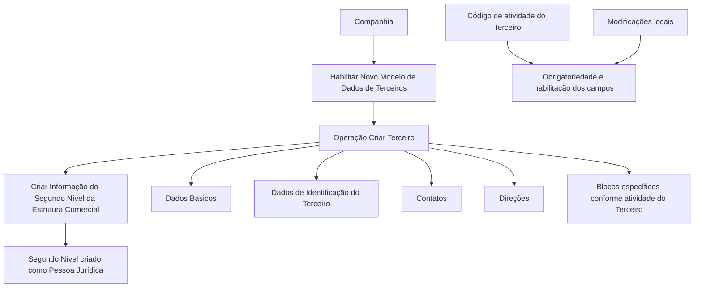
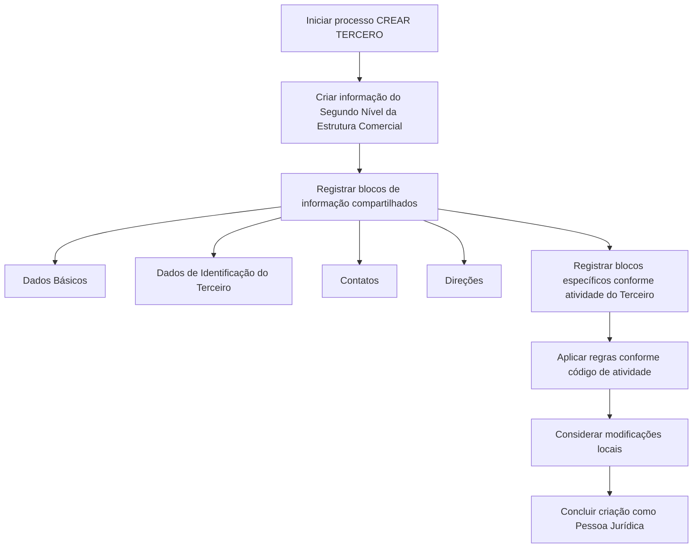

# Operação Criar Segundo Nível da Estrutura Comercial

## 1. Metadados do Documento
- **Arquivo de Origem:** Não identificado
- **Tipo de Documento:** Procedimento
- **Domínio / Sistema:** Estrutura Comercial / Novo Modelo de Dados de Terceiros / Reef
- **Público-Alvo:** Usuários do Sistema, Operação e Negócio
- **Data/Versão Identificada:** Não identificada

---

## 2. Resumo Executivo & Contexto de Negócio

O documento descreve a operação **“Criar Segundo Nível da Estrutura Comercial”**, destinada a registrar no Sistema as informações dos segundos níveis configurados na Companhia. O exemplo apresentado associa esses segundos níveis a **Pessoas Jurídicas**.

A operação depende de uma premissa estrutural: o **Novo Modelo de Dados de Terceiros** deve estar habilitado para uso pela Companhia. O documento determina que os segundos níveis da Estrutura Comercial da Entidade Asseguradora são sempre criados como Pessoas Jurídicas.

O processo de criação utiliza blocos de informação compartilhados pela operação **Criar Terceiro**, incluindo Dados Básicos, Dados de Identificação do Terceiro, Contatos e Direções. Também há blocos específicos definidos conforme a atividade do Terceiro.

A obrigatoriedade e a habilitação de campos podem variar conforme o código de atividade do Terceiro. Alterações implementadas localmente também podem modificar o comportamento da aplicação quanto à obrigatoriedade de preenchimento dos Dados do Terceiro. A ordem de captura nos blocos de informação pode variar de acordo com o critério adotado pelo usuário no Sistema.

---

## 3. Arquitetura, Componentes & Tecnologias Envolvidas

Os componentes e conceitos explicitamente mencionados são:

- **Sistema:** ambiente no qual o Segundo Nível da Estrutura Comercial é registrado.
- **Novo Modelo de Dados de Terceiros:** modelo que deve estar habilitado para a Companhia.
- **Operação Criar Terceiro:** operação que disponibiliza os blocos de informação compartilhados.
- **Segundo Nível da Estrutura Comercial:** entidade registrada pela operação.
- **Entidade Asseguradora:** contexto no qual o Segundo Nível é criado como Pessoa Jurídica.
- **Código de atividade do Terceiro:** critério que influencia habilitação e obrigatoriedade dos campos.
- **Reef / DOCUMENTACIÓN Reef:** portal ou área documental exibida no conteúdo extraído.
- **Mapfredocument:** termo exibido na navegação da documentação.



**Nota de Análise:** o conteúdo não detalha métodos HTTP, contratos JSON, banco de dados, interfaces técnicas, URLs de ambiente, mecanismos de autenticação ou integrações entre sistemas.

---

## 4. Regras de Negócio, Especificações Funcionais & Processos

1. A operação permite registrar no Sistema as informações dos **Segundos Níveis da Estrutura Comercial** configurados na Companhia.
2. Os Segundos Níveis da Estrutura Comercial podem ser exemplificados como **Pessoas Jurídicas**.
3. O **Novo Modelo de Dados de Terceiros** deve estar habilitado para utilização pela Companhia.
4. Os Segundos Níveis da Estrutura Comercial da Entidade Asseguradora devem ser criados sempre como **Pessoas Jurídicas**.
5. O processo utiliza a operação **Criar Terceiro** para registrar informações compartilhadas.
6. Os blocos de informação compartilhados citados são:
   - Dados Básicos;
   - Dados de Identificação do Terceiro;
   - Contatos;
   - Direções.
7. Devem existir blocos de informação específicos de acordo com a atividade do Terceiro.
8. A obrigatoriedade e/ou habilitação dos campos dos blocos ou estruturas de informação compartilhadas pode variar conforme o código de atividade do Terceiro.
9. Modificações locais implementadas podem afetar o comportamento da aplicação em relação à obrigatoriedade do registro dos Dados do Terceiro.
10. A ordem de captura dos dados nos blocos de informação pode variar conforme o critério seguido pelo usuário no Sistema.

### Fluxo operacional identificado



---

## 5. Tabelas de Parâmetros, Ambientes e Estruturas de Dados

| Item / Parâmetro | Descrição / Função | Tipo / Valores / Formato | Ambiente / Observações |
| :--- | :--- | :--- | :--- |
| Operação | Registra informações dos Segundos Níveis da Estrutura Comercial. | Criar Segundo Nível da Estrutura Comercial | Executada no Sistema. |
| Modelo de Dados | Premissa para utilização da operação. | Novo Modelo de Dados de Terceiros | Deve estar habilitado para a Companhia. |
| Segundo Nível | Entidade da Estrutura Comercial criada pela operação. | Pessoa Jurídica | Sempre criado como Pessoa Jurídica para a Entidade Asseguradora. |
| Dados Básicos | Bloco compartilhado de informação. | Não detalhado | Associado à operação Criar Terceiro. |
| Dados de Identificação do Terceiro | Bloco compartilhado de informação. | Não detalhado | Associado à operação Criar Terceiro. |
| Contatos | Bloco compartilhado de informação. | Não detalhado | Associado à operação Criar Terceiro. |
| Direções | Bloco compartilhado de informação. | Não detalhado | Associado à operação Criar Terceiro. |
| Blocos específicos | Informações adicionais dependentes da atividade do Terceiro. | Variável conforme atividade | O documento não especifica os blocos ou campos. |
| Código de atividade do Terceiro | Critério para determinar regras de campos. | Não detalhado | Pode alterar obrigatoriedade e habilitação dos campos. |
| Modificações locais | Customizações locais que influenciam o comportamento da aplicação. | Não detalhado | Podem afetar a obrigatoriedade dos Dados do Terceiro. |
| Ordem de captura | Sequência de registro dos dados nos blocos. | Variável | Pode variar conforme o critério do usuário. |
| Owner | Proprietário exibido na documentação Reef. | `user:agonzalez_mapfre.com` | Valor literal apresentado no conteúdo. |
| Lifecycle | Estado de ciclo de vida exibido na documentação. | `Approved` | Valor literal apresentado no conteúdo. |
| Source | Origem exibida na documentação. | `VL` | O contexto do valor não é detalhado. |

---

## 6. Bateria de Perguntas & Respostas para RAG (FAQ Sintético)

### P1: Qual é a finalidade da operação Criar Segundo Nível da Estrutura Comercial?
**R:** A operação permite registrar no Sistema as informações dos Segundos Níveis da Estrutura Comercial configurados na Companhia.

### P2: Qual pré-requisito deve ser atendido antes de utilizar a operação?
**R:** O Novo Modelo de Dados de Terceiros deve estar habilitado para utilização pela Companhia.

### P3: Como os Segundos Níveis da Estrutura Comercial devem ser criados na Entidade Asseguradora?
**R:** Os Segundos Níveis da Estrutura Comercial da Entidade Asseguradora devem ser sempre criados como Pessoas Jurídicas.

### P4: Quais blocos de informação compartilhados são usados no processo de Criar Terceiro?
**R:** O documento cita os blocos Dados Básicos, Dados de Identificação do Terceiro, Contatos e Direções.

### P5: Existem informações específicas além dos blocos compartilhados?
**R:** Sim. O processo inclui blocos de informação específicos de acordo com a atividade do Terceiro, mas o documento não especifica quais são esses blocos ou quais campos eles contêm.

### P6: O código de atividade do Terceiro influencia o preenchimento das informações?
**R:** Sim. A obrigatoriedade e/ou a habilitação dos campos de cada bloco ou estrutura de informação compartilhada pode variar conforme o código de atividade do Terceiro.

### P7: Modificações locais podem alterar as regras de preenchimento?
**R:** Sim. As modificações implementadas localmente podem afetar o comportamento da aplicação em relação à obrigatoriedade de registrar os Dados do Terceiro.

### P8: A sequência de preenchimento dos blocos de informação é fixa?
**R:** Não. A ordem de captura dos dados nos diferentes blocos de informação pode variar conforme o critério seguido pelo usuário no Sistema.

### P9: O documento define os métodos técnicos ou contratos de integração da operação?
**R:** Não. O conteúdo não fornece métodos HTTP, endpoints, contratos JSON, tecnologias de persistência, interfaces ou integrações técnicas.

### P10: Quem é identificado como owner na documentação Reef exibida?
**R:** O valor exibido para o campo Owner é `user:agonzalez_mapfre.com`.

---

## 7. Glossário de Termos, Siglas & Conceitos-Chave

- **Companhia:** organização para a qual o Novo Modelo de Dados de Terceiros deve estar habilitado.
- **Criar Terceiro / CREAR TERCERO:** operação associada aos blocos de informação compartilhados usados no processo.
- **Dados do Terceiro:** dados cujo preenchimento obrigatório pode ser afetado pelo código de atividade e por modificações locais.
- **Entidade Asseguradora:** entidade cujo Segundo Nível da Estrutura Comercial é criado como Pessoa Jurídica.
- **Estrutura Comercial:** estrutura organizacional que contém os Segundos Níveis registrados pela operação.
- **Novo Modelo de Dados de Terceiros:** modelo de dados cuja habilitação é uma premissa do processo.
- **Pessoa Jurídica:** tipo obrigatório de criação para os Segundos Níveis da Estrutura Comercial da Entidade Asseguradora.
- **Reef:** nome presente na área de documentação exibida no conteúdo.
- **Segundo Nível:** nível da Estrutura Comercial cuja informação é criada e registrada no Sistema.
- **VL:** valor exibido como Source na documentação Reef; o significado não é detalhado.

---

## 8. Notas Críticas, Riscos & Limitações

- O documento não identifica o arquivo de origem, data, versão, autor formal, sistema específico ou ambiente de execução.
- O conteúdo não detalha os campos existentes em Dados Básicos, Dados de Identificação do Terceiro, Contatos ou Direções.
- Os blocos específicos por atividade do Terceiro são citados, mas não são enumerados ou definidos.
- O documento informa que modificações locais podem afetar a obrigatoriedade dos Dados do Terceiro, mas não descreve quais modificações existem nem seus efeitos concretos.
- A variação da ordem de captura depende do critério do usuário, sem indicar uma sequência obrigatória.
- Não há especificações técnicas de APIs, endpoints, contratos de dados, logs, controles de acesso, validações de erro ou procedimentos de auditoria.
- **Nota de Análise:** o portal Reef é citado no conteúdo bruto, porém a relação técnica ou operacional entre Reef e a operação de criação não é detalhada.

---

## 9. Conteúdo Bruto Estruturado (Referência Fiel)

```text
--- [PÁGINA 1 DE 2] ---

OPERACIÓN CREAR Segundo Nivel de la Estructura Comercial
¿En que consiste?
Esta operación permite registrar en el Sistema la Información de los Segundos Niveles de la Estructura Comercial (como Personas Jurídicas)
congurados en la Compañía.
Premisas
El Nuevo Modelo de Datos de Terceros está habilitado para ser utilizado por la Compañía
Los Segundos Niveles de la Estructura Comercial de la Entidad Aseguradora siempre se crearán como Personas Jurídicas.
La obligatoriedad y/o la habilitación de los campos en el registro de los datos de cada uno de los bloques o estructuras de información
compartidas puede variar de acuerdo con el código de actividad del Tercero:
Las modicaciones que se hubieran podido implementar localmente a su vez pueden afectar el comportamiento de la aplicación en
relación con la obligatoriedad en el registro de los Datos del Tercero.
Por último, el orden de captura de los datos en los distintos bloques de Información puede variar de acuerdo con el criterio seguido por el
Usuario en el Sistema.
Proceso
CREAR
TERCERO
Crear Información
del Segundo Nivel de la Estructura Comercial
Bloques de Información Compartidos (CREAR TERCERO)
 Datos Básicos ( )
 Datos Identicación del Tercero ( )
 Contactos ( )
 Direcciones ( )
Bloques de Información Especícos de acuerdo con la Actividad del Tercero.
Ejemplo:
Documentation / DOCUMENTACIÓN Reef
DOCUMENTACIÓN Reef
Mapfredocument
DOCUMENTACIÓN Reef
Owner
user:agonzalez_mapfre.com
Lifecycle
Approved Source
 / 
 VL
Buscar Inicio Soluciones Arquitecturas APIs Componentes Cloud Documentación Zeus Reef Ayuda
ES


--- [PÁGINA 2 DE 2] ---

Información del Segundo Nivel la Estructura Comercial ( )
```
