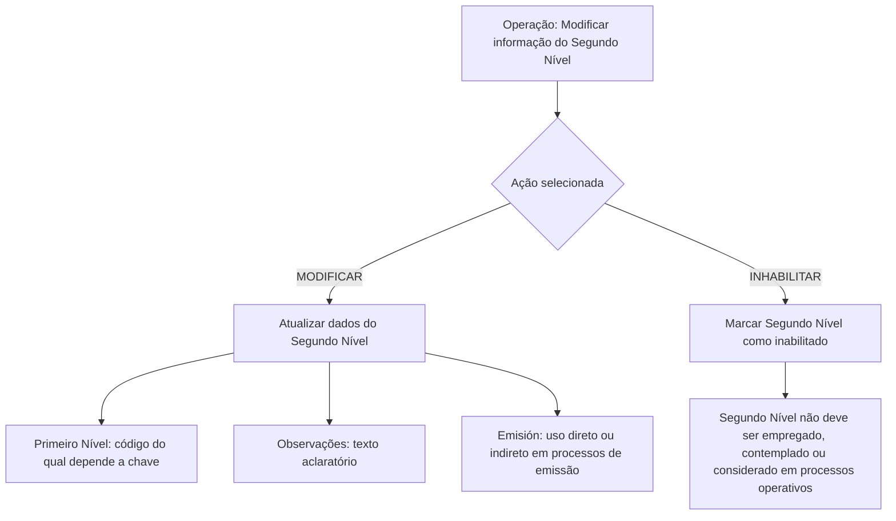

# Modificação e Inabilitação do Segundo Nível da Estrutura Comercial

## 1. Metadados do Documento
- **Arquivo de Origem:** Não identificado
- **Tipo de Documento:** Procedimento
- **Domínio / Sistema:** Reef / Mapfre
- **Público-Alvo:** Não identificado
- **Data/Versão Identificada:** Não identificada

---

## 2. Resumo Executivo & Contexto de Negócio

O documento descreve uma operação destinada a modificar informações previamente registradas para o segundo nível da estrutura comercial da companhia. A mesma operação também permite inabilitar esse segundo nível no sistema.

A estrutura comercial apresentada possui uma relação de dependência entre o primeiro nível e a chave do segundo nível. O campo **Primer Nivel** armazena o código do primeiro nível do qual dependerá a chave do segundo nível da estrutura comercial.

A operação disponibiliza duas ações possíveis: **MODIFICAR** e **INHABILITAR**. A ação de modificação altera os dados do segundo nível; a ação de inabilitação informa ao sistema que o segundo nível não deve ser empregado, contemplado ou considerado nos processos operacionais da entidade.

O documento também apresenta campos para registrar observações e controlar a utilização do código do segundo nível em processos de emissão. Não há detalhamento adicional sobre telas, contratos de integração, persistência de dados, perfis de acesso, métodos HTTP ou regras de validação técnica.

---

## 3. Arquitetura, Componentes & Tecnologias Envolvidas

Os elementos explicitamente citados são:

| Componente / Elemento | Papel identificado no documento |
| :--- | :--- |
| Reef | Contexto de documentação citado no rodapé. |
| Mapfre | Referência presente em `Mapfredocument` e no identificador do proprietário. |
| Estrutura Comercial | Estrutura organizacional que contém o primeiro e o segundo nível comercial. |
| Primeiro Nível | Nível cujo código determina a dependência da chave do segundo nível. |
| Segundo Nível | Nível comercial cujas informações podem ser modificadas ou inabilitadas. |
| Processos de Emissão | Processos nos quais o código do segundo nível pode ser empregado direta ou indiretamente, conforme o campo **Emisión**. |
| Processos Operativos da Entidade | Processos que não devem empregar, contemplar ou considerar um segundo nível inabilitado. |



> **Nota de Análise:** O documento não detalha componentes de software, microsserviços, banco de dados, APIs, URLs, tecnologias de implementação, ambientes ou mecanismos de integração.

---

## 4. Regras de Negócio, Especificações Funcionais & Processos

### Operação disponível

A operação permite modificar a informação existente para o segundo nível da estrutura comercial da companhia, desde que o segundo nível tenha sido registrado previamente. A operação também permite inabilitar o segundo nível.

### Ações possíveis

1. **MODIFICAR**
   - Permite alterar as informações do segundo nível da estrutura comercial.
   - A sequência de modificação dos campos é indicada como realizada da esquerda para a direita e de cima para baixo no bloco de informação.

2. **INHABILITAR**
   - Indica ao sistema que o segundo nível da estrutura comercial está inabilitado.
   - Um segundo nível inabilitado não deve ser empregado, contemplado ou considerado nos processos operativos da entidade.

### Regras associadas aos campos

1. **Primer Nivel**
   - Deve conter o código do primeiro nível da estrutura comercial.
   - O segundo nível depende desse primeiro nível.
   - A chave do segundo nível depende do código informado no campo **Primer Nivel**.

2. **Observaciones**
   - Permite registrar um texto aclaratório.
   - Permite registrar observações relacionadas ao fato de criar o nível da estrutura comercial.

3. **Emisión**
   - Modula o comportamento do sistema.
   - Permite determinar que o código do segundo nível da estrutura comercial possa ser utilizado direta ou indiretamente em processos de emissão.

4. **Inhabilitación**
   - Comunica ao sistema a condição de inabilitação do segundo nível da estrutura comercial.
   - Quando inabilitado, o segundo nível não deve participar dos processos operativos da entidade.

> **Nota de Análise:** O documento não informa valores permitidos, obrigatoriedade, formato, tamanho, regras de unicidade, mensagens de erro ou condições de reabilitação para os campos apresentados.

---

## 5. Tabelas de Parâmetros, Ambientes e Estruturas de Dados

| Item / Parâmetro | Descrição / Função | Tipo / Valores / Formato | Ambiente / Observações |
| :--- | :--- | :--- | :--- |
| Ação | Determina a operação executada sobre o segundo nível da estrutura comercial. | `MODIFICAR` ou `INHABILITAR` | O documento apresenta as duas ações como opções possíveis. |
| Primer Nivel | Contém o código do primeiro nível da estrutura comercial do qual dependerá a chave do segundo nível. | Código; formato não informado | Campo relacionado à dependência hierárquica entre primeiro e segundo nível. |
| Observaciones | Permite inserir texto aclaratório ou observações relacionadas à criação do nível da estrutura comercial. | Texto; formato e limite não informados | Não são definidos obrigatoriedade ou critérios de preenchimento. |
| Emisión | Modula o comportamento do sistema quanto ao uso do código do segundo nível em processos de emissão. | Valor não informado | O uso pode ser direto ou indireto nos processos de emissão. |
| Inhabilitación | Indica que o segundo nível está inabilitado no sistema. | Valor não informado | Um nível inabilitado não deve ser empregado, contemplado ou considerado nos processos operativos. |
| Segundo Nivel Estructura Comercial | Entidade funcional cujas informações podem ser modificadas ou inabilitadas. | Não informado | Deve estar previamente registrado para que suas informações sejam modificadas. |
| Owner | Proprietário exibido na documentação. | `user:agonzalez_mapfre.com` | Informação exibida no conteúdo extraído. |
| Lifecycle | Estado de ciclo de vida exibido na documentação. | `Approved Source` | O texto não explica o significado operacional desse estado. |
| Identificador adicional | Texto apresentado após o ciclo de vida. | `/ VL` | Sem detalhamento no conteúdo disponível. |

> **Nota de Análise:** O documento não apresenta servidores, URLs de ambiente, rotas de log, portas, variáveis de configuração, estruturas JSON, layouts de banco de dados ou contratos de API.

---

## 6. Bateria de Perguntas & Respostas para RAG (FAQ Sintético)

### P1: Qual é o objetivo da operação de modificação do segundo nível da estrutura comercial?
**R:** A operação permite modificar as informações que já estavam registradas para o segundo nível da estrutura comercial da companhia. A operação também permite inabilitar esse segundo nível.

### P2: Quais ações estão disponíveis para o segundo nível da estrutura comercial?
**R:** O documento apresenta duas ações possíveis: **MODIFICAR** e **INHABILITAR**. MODIFICAR altera as informações do segundo nível; INHABILITAR informa ao sistema que esse nível está inabilitado.

### P3: O que representa o campo Primer Nivel?
**R:** O campo **Primer Nivel** contém o código do primeiro nível da estrutura comercial. A chave do segundo nível depende do código informado nesse primeiro nível.

### P4: Qual é a relação entre o primeiro nível e o segundo nível da estrutura comercial?
**R:** O segundo nível possui uma dependência em relação ao primeiro nível. O documento estabelece que o campo **Primer Nivel** contém o código do primeiro nível do qual dependerá a chave do segundo nível.

### P5: Para que serve o campo Observaciones?
**R:** O campo **Observaciones** permite inserir um texto aclaratório ou observações relacionadas ao fato de criar o nível da estrutura comercial.

### P6: Como o campo Emisión afeta o segundo nível da estrutura comercial?
**R:** O campo **Emisión** modula o comportamento do sistema, permitindo que o código do segundo nível da estrutura comercial possa ser empregado direta ou indiretamente nos processos de emissão.

### P7: O que acontece quando um segundo nível da estrutura comercial é inabilitado?
**R:** A inabilitação informa ao sistema que o segundo nível está inabilitado. Nessa condição, o segundo nível não deve ser empregado, contemplado ou considerado nos processos operativos da entidade.

### P8: O documento define quais valores podem ser utilizados no campo Inhabilitación?
**R:** Não. O documento explica a finalidade funcional do campo **Inhabilitación**, mas não informa os valores permitidos, formato, obrigatoriedade ou mecanismo técnico para registrar a condição.

### P9: O documento informa APIs ou métodos HTTP para modificar o segundo nível?
**R:** Não. O conteúdo disponível não detalha métodos HTTP, endpoints, contratos JSON, APIs, microsserviços ou mecanismos de integração para executar a operação.

### P10: Em que sequência os campos devem ser modificados?
**R:** O documento informa que, no bloco de informações, os campos marcam a sequência de modificação da esquerda para a direita e de cima para baixo.

### P11: A operação pode ser usada para criar um segundo nível da estrutura comercial?
**R:** O objetivo declarado é modificar informações de um segundo nível previamente registrado e permitir sua inabilitação. Embora o campo **Observaciones** mencione observações relacionadas ao fato de criar o nível, o documento não descreve uma operação de criação.

### P12: O documento identifica ambientes, servidores ou URLs do sistema Reef?
**R:** Não. O conteúdo cita Reef e documentação relacionada a Mapfre, mas não informa URLs, ambientes, servidores, portas ou rotas operacionais.

---

## 7. Glossário de Termos, Siglas & Conceitos-Chave

- **Reef:** Nome citado no contexto da documentação, em expressões como `Documentation / DOCUMENTACIÓN Reef`.
- **Mapfre:** Referência presente em `Mapfredocument` e no identificador `agonzalez_mapfre.com`.
- **Estrutura Comercial:** Estrutura que contém os níveis comerciais mencionados no documento.
- **Primer Nivel:** Primeiro nível da estrutura comercial; seu código determina a dependência da chave do segundo nível.
- **Segundo Nivel:** Segundo nível da estrutura comercial que pode ter suas informações modificadas ou pode ser inabilitado.
- **Emisión:** Campo que modula o uso direto ou indireto do código do segundo nível em processos de emissão.
- **Inhabilitación:** Condição que informa ao sistema que o segundo nível não deve ser empregado, contemplado ou considerado em processos operativos.
- **MODIFICAR:** Ação disponível para alterar as informações do segundo nível.
- **INHABILITAR:** Ação disponível para declarar o segundo nível como inabilitado.
- **VL:** Texto exibido junto ao ciclo de vida como `/ VL`; o significado não é detalhado.

---

## 8. Notas Críticas, Riscos & Limitações

- O documento não identifica o nome do arquivo de origem, data, versão, autor funcional ou público-alvo.
- O conteúdo não detalha os valores, tipos, formatos ou obrigatoriedade dos campos **Primer Nivel**, **Observaciones**, **Emisión** e **Inhabilitación**.
- Não há especificação de critérios de validação, mensagens de erro, auditoria, autorização, trilha de aprovação ou reversão de inabilitação.
- Não são informados APIs, contratos de integração, métodos HTTP, banco de dados, componentes técnicos, URLs, servidores, ambientes, portas ou rotas de log.
- A ação de inabilitação possui impacto operacional explícito: um segundo nível inabilitado não deve ser empregado, contemplado ou considerado nos processos operativos da entidade.
- O texto extraído apresenta caracteres possivelmente corrompidos, como `Modicar`, `especíca` e `modicación`; a interpretação foi limitada ao contexto textual disponível.

---

## 9. Conteúdo Bruto Estruturado (Referência Fiel)

```text
--- [PÁGINA 1 DE 1] ---

MODIFICAR Información especíca del Segundo Nivel de la Estructura
Comercial
Objetivo
Esta Operación permite Modicar la información que tuviera el segundo nivel de la estructura comercial de la compañía registrada
previamente además de poder Inhabilitarlo.
Posibles Acciones
 MODIFICAR ( )
 INHABILITAR ( )
Datos Segundo Nivel Estructura Comercial
De Izquierda a Derecha y de Arriba hacia Abajo, los siguientes campos marcan la secuencia de modicación en este Bloque de Información.
Primer Nivel (  )
Este dato va a contener el código del primer nivel de la estructura comercial del que dependerá la clave del segundo nivel.
Observaciones ( )
Este campo permite ingresar un texto aclaratorio u observaciones al hecho de crear el nivel de la estructura comercial.
Emisión? ( )
Este campo modula el comportamiento del sistema permitiendo que el código del segundo nivel de la estructura comercial se pueda emplear,
directa o indirectamente, en los procesos de Emisión.
Inhabilitación ( )
Este campo le indica al sistema que el segundo nivel de la estructura comercial está inhabilitado en el sistema por lo cual, de estarlo, no
debería ser empleado, contemplado o considerado en los procesos operativos de la entidad.
Documentation / DOCUMENTACIÓN Reef
DOCUMENTACIÓN Reef
Mapfredocument
DOCUMENTACIÓN Reef
Owner
user:agonzalez_mapfre.com
Lifecycle
Approved Source
 / 
 VL
Buscar Inicio Soluciones Arquitecturas APIs Componentes Cloud Documentación Zeus Reef Ayuda
ES
```
