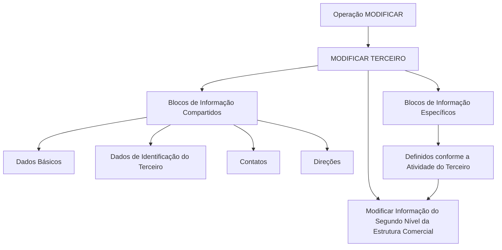

# Operação MODIFICAR — Segundo Nível da Estrutura Comercial

## 1. Metadados do Documento
- **Arquivo de Origem:** `Não identificado no conteúdo fornecido`
- **Tipo de Documento:** `Procedimento`
- **Domínio / Sistema:** `Estrutura Comercial / MODIFICAR TERCEIRO / Documentación Reef`
- **Público-Alvo:** `Usuários do sistema, operação e analistas funcionais`
- **Data/Versão Identificada:** `Não identificada`

---

## 2. Resumo Executivo & Contexto de Negócio

O documento descreve a operação **MODIFICAR**, destinada a complementar, modificar e/ou inabilitar informações do **Segundo Nível da Estrutura Comercial**. A alteração pode ocorrer em qualquer estrutura de dados que contenha ou agrupe essas informações.

A obrigatoriedade e a habilitação dos campos podem variar conforme o **código de atividade do Terceiro**. Portanto, a captura e a manutenção dos dados não seguem necessariamente um comportamento uniforme para todos os registros.

Modificações implementadas localmente podem afetar o comportamento da aplicação, especialmente quanto à obrigatoriedade de registro dos Dados do Terceiro. O documento também informa que a ordem de captura dos dados nos blocos de informação pode variar de acordo com o critério adotado pelo usuário no sistema.

O processo operacional é apresentado no contexto de **MODIFICAR TERCEIRO**, combinando blocos de informação compartilhados — Dados Básicos, Dados de Identificação do Terceiro, Contatos e Direções — com blocos específicos definidos segundo a atividade do Terceiro.

---

## 3. Arquitetura, Componentes & Tecnologias Envolvidas

Os componentes funcionais explicitamente citados são:

- Operação **MODIFICAR**.
- Entidade ou processo **TERCERO**.
- Informação do **Segundo Nível da Estrutura Comercial**.
- Blocos de Informação Compartidos.
- Blocos de Informação Específicos segundo a atividade do Terceiro.
- Documentación Reef.
- Mapfredocument.
- Zeus Reef.

> **Nota de Análise:** O conteúdo não descreve arquitetura de software, tecnologias de implementação, integrações, APIs, métodos HTTP, contratos JSON, ambientes ou servidores. Os itens são apresentados como elementos de navegação, documentação ou processo funcional.



---

## 4. Regras de Negócio, Especificações Funcionais & Processos

### Finalidade da operação

A operação MODIFICAR permite executar uma ou mais das seguintes ações sobre as informações do Segundo Nível da Estrutura Comercial:

1. Complementar informações.
2. Modificar informações.
3. Inabilitar informações.

As ações podem ser realizadas em qualquer estrutura de dados que contenha e agrupe informações do Segundo Nível da Estrutura Comercial.

### Premissas de preenchimento

1. A obrigatoriedade dos campos pode variar conforme o código de atividade do Terceiro.
2. A habilitação dos campos pode variar conforme o código de atividade do Terceiro.
3. Alterações implementadas localmente podem afetar o comportamento da aplicação quanto à obrigatoriedade de registro dos Dados do Terceiro.
4. A ordem de captura dos dados em diferentes blocos de informação pode variar conforme o critério adotado pelo usuário no sistema.

### Fluxo funcional identificado

1. Acessar o processo **MODIFICAR TERCEIRO**.
2. Consultar ou preencher os blocos de informação compartilhados aplicáveis:
   - Dados Básicos.
   - Dados de Identificação do Terceiro.
   - Contatos.
   - Direções.
3. Consultar ou preencher os blocos de informação específicos, conforme a atividade do Terceiro.
4. Executar a ação de modificar informações do Segundo Nível da Estrutura Comercial.
5. Considerar, durante o registro, as regras de obrigatoriedade e habilitação condicionadas pelo código de atividade do Terceiro e por possíveis modificações locais.

> **Nota de Análise:** O documento não detalha campos específicos, códigos de atividade existentes, critérios de validação, mensagens de erro, permissões, persistência de dados ou confirmação da operação.

---

## 5. Tabelas de Parâmetros, Ambientes e Estruturas de Dados

| Item / Parâmetro | Descrição / Função | Tipo / Valores / Formato | Ambiente / Observações |
| :--- | :--- | :--- | :--- |
| Operação MODIFICAR | Permite complementar, modificar e/ou inabilitar informações. | Ação funcional. | Aplicada ao Segundo Nível da Estrutura Comercial. |
| Segundo Nível da Estrutura Comercial | Informação comercial alvo da operação. | Estrutura de informação. | Pode estar presente em estruturas de dados que a contenham e agrupem. |
| Terceiro | Entidade cujo código de atividade influencia o comportamento de campos. | Entidade funcional. | Utilizada no processo MODIFICAR TERCEIRO. |
| Código de atividade do Terceiro | Critério que pode alterar obrigatoriedade e habilitação dos campos. | Código não detalhado. | Valores não informados. |
| Dados Básicos | Bloco de informação compartilhado. | Bloco funcional. | Associado a MODIFICAR TERCEIRO. |
| Dados de Identificação do Terceiro | Bloco de informação compartilhado. | Bloco funcional. | Associado a MODIFICAR TERCEIRO. |
| Contatos | Bloco de informação compartilhado. | Bloco funcional. | Associado a MODIFICAR TERCEIRO. |
| Direções | Bloco de informação compartilhado. | Bloco funcional. | Associado a MODIFICAR TERCEIRO. |
| Blocos de Informação Específicos | Blocos aplicáveis conforme a atividade do Terceiro. | Bloco funcional variável. | Conteúdo específico não detalhado. |
| Modificações locais | Alterações implementadas localmente que podem afetar o comportamento da aplicação. | Configuração ou alteração local não detalhada. | Podem afetar a obrigatoriedade dos Dados do Terceiro. |
| Documentation / DOCUMENTACIÓN Reef | Referência de documentação exibida no conteúdo. | Repositório ou área documental. | Sem URL identificada. |
| Mapfredocument | Termo exibido no conteúdo bruto. | Sistema, área ou identificador não detalhado. | Não há detalhamento adicional. |
| Zeus Reef | Item de navegação exibido no conteúdo bruto. | Sistema, área ou identificador não detalhado. | Não há detalhamento adicional. |

---

## 6. Bateria de Perguntas & Respostas para RAG (FAQ Sintético)

### P1: Em que consiste a operação MODIFICAR do Segundo Nível da Estrutura Comercial?
**R:** A operação MODIFICAR consiste em complementar, modificar e/ou inabilitar as informações do Segundo Nível da Estrutura Comercial em qualquer estrutura de dados que contenha e agrupe essas informações.

### P2: Quais ações podem ser realizadas sobre as informações do Segundo Nível da Estrutura Comercial?
**R:** O documento informa que as informações podem ser complementadas, modificadas e/ou inabilitadas por meio da operação MODIFICAR.

### P3: O código de atividade do Terceiro afeta o preenchimento dos campos?
**R:** Sim. A obrigatoriedade e/ou a habilitação dos campos no registro de dados dos blocos ou estruturas de informação compartilhadas pode variar de acordo com o código de atividade do Terceiro.

### P4: Modificações locais podem alterar o comportamento da aplicação?
**R:** Sim. Modificações implementadas localmente podem afetar o comportamento da aplicação em relação à obrigatoriedade do registro dos Dados do Terceiro.

### P5: A ordem de preenchimento dos blocos de informação é fixa?
**R:** Não. O documento estabelece que a ordem de captura dos dados nos diferentes blocos de informação pode variar segundo o critério seguido pelo usuário no sistema.

### P6: Quais blocos de informação compartilhados são citados no processo MODIFICAR TERCEIRO?
**R:** Os blocos de informação compartilhados citados são Dados Básicos, Dados de Identificação do Terceiro, Contatos e Direções.

### P7: Existem blocos de informação específicos para a atividade do Terceiro?
**R:** Sim. O processo menciona blocos de informação específicos de acordo com a atividade do Terceiro, mas não detalha seus nomes, campos ou regras de preenchimento.

### P8: Qual processo concentra a modificação das informações do Segundo Nível da Estrutura Comercial?
**R:** A modificação é apresentada no processo MODIFICAR TERCEIRO, no qual existe a ação “Modificar Información del Segundo Nivel Estructura Comercial”.

### P9: O documento informa quais campos são obrigatórios para cada código de atividade?
**R:** Não. O documento apenas informa que a obrigatoriedade e a habilitação podem variar conforme o código de atividade do Terceiro; os campos e códigos específicos não são apresentados.

### P10: O documento especifica APIs, métodos HTTP ou contratos de integração para a operação MODIFICAR?
**R:** Não. O conteúdo não apresenta APIs, métodos HTTP, contratos JSON, tecnologias de integração ou detalhes de implementação técnica.

---

## 7. Glossário de Termos, Siglas & Conceitos-Chave

- **MODIFICAR:** Operação destinada a complementar, modificar e/ou inabilitar informações.
- **MODIFICAR TERCEIRO:** Processo no qual são tratados blocos de informações compartilhados e específicos relacionados ao Terceiro.
- **Terceiro:** Entidade cujo código de atividade pode influenciar a obrigatoriedade e a habilitação dos campos.
- **Segundo Nível da Estrutura Comercial:** Estrutura de informação comercial que é alvo da operação MODIFICAR.
- **Blocos de Informação Compartidos:** Conjunto de blocos compartilhados no processo, incluindo Dados Básicos, Dados de Identificação do Terceiro, Contatos e Direções.
- **Blocos de Informação Específicos:** Blocos cuja aplicação depende da atividade do Terceiro.
- **Documentación Reef:** Referência documental apresentada no conteúdo.
- **Mapfredocument:** Termo exibido no conteúdo sem definição funcional adicional.
- **Zeus Reef:** Termo exibido na navegação documental sem definição funcional adicional.

---

## 8. Notas Críticas, Riscos & Limitações

- O documento não identifica o arquivo de origem, data, versão, autor técnico ou versão do sistema.
- Não há detalhamento dos campos que compõem o Segundo Nível da Estrutura Comercial.
- Não são listados códigos de atividade do Terceiro, seus valores possíveis ou regras específicas para cada código.
- Não são descritos controles de acesso, perfis de permissão, auditoria, validações, mensagens de erro ou tratamento de falhas.
- Modificações locais podem alterar a obrigatoriedade de dados, gerando risco de comportamento diferente entre instalações ou configurações locais.
- A flexibilidade na ordem de captura de dados pode exigir atenção operacional para garantir que informações dependentes sejam preenchidas corretamente.
- O documento não detalha Mapfredocument, Zeus Reef, URLs, ambientes, integrações ou tecnologias subjacentes.

---

## 9. Conteúdo Bruto Estruturado (Referência Fiel)

```text
--- [PÁGINA 1 DE 1] ---

OPERACIÓN MODIFICAR Segundo Nivel de la Estructura Comercial
¿En que consiste?
Esta operación consiste en Complementar, Modicar y/o Inhabilitar la información del Segundo Nivel de la Estructura Comercial en
cualquiera de las estructuras de datos que la contienen y agrupan.
Premisas
La obligatoriedad y/o la habilitación de los campos en el registro de los datos de cada uno de los bloques o estructuras de información
compartidas puede variar de acuerdo con el código de actividad del Tercero:
Las modicaciones que se hubieran podido implementar localmente a su vez pueden afectar el comportamiento de la aplicación en
relación con la obligatoriedad en el registro de los Datos del Tercero.
Por último, el orden de captura de los datos en los distintos bloques de Información puede variar de acuerdo con el criterio seguido por el
Usuario en el Sistema.
Proceso
MODIFICAR
TERCERO
Modificar Información
del Segundo Nivel Estructura Comercial
Bloques de Información Compartidos (MODIFICAR TERCERO)
 Datos Básicos ( )
 Datos Identicación Tercero ( )
 Contactos (   )
 Direcciones (   )
Bloques de Información Especícos de acuerdo con la Actividad del Tercero.
 Modicar Información del Segundo Nivel de la Estructura Comercial (  )
Ejemplo:
Documentation / DOCUMENTACIÓN Reef
DOCUMENTACIÓN Reef
Mapfredocument
DOCUMENTACIÓN Reef
Owner
user:agonzalez_mapfre.com
Lifecycle
Approved Source
 / 
 VL
Buscar Inicio Soluciones Arquitecturas APIs Componentes Cloud Documentación Zeus Reef Ayuda
ES
```
