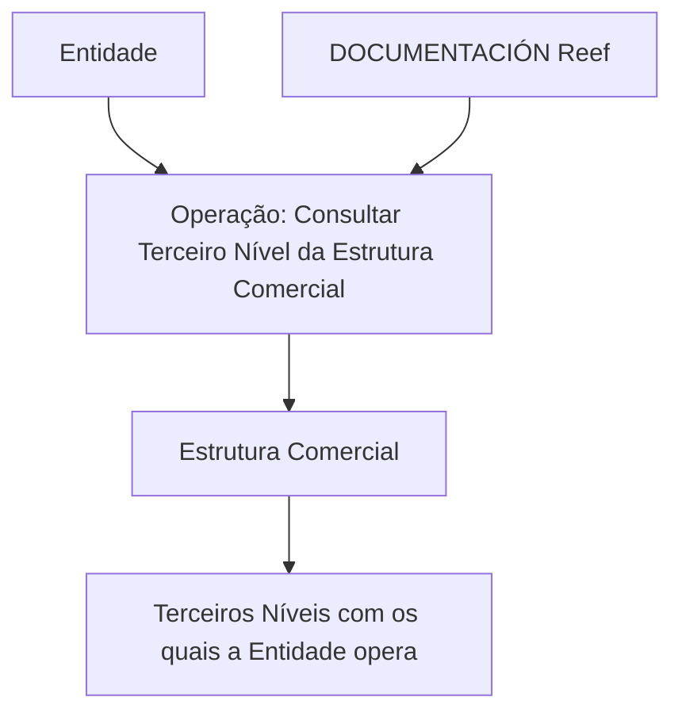

# Operação Consultar Terceiro Nível da Estrutura Comercial — Documentação Reef

## 1. Metadados do Documento
- **Arquivo de Origem:** Não identificado
- **Tipo de Documento:** Documentação funcional resumida
- **Domínio / Sistema:** Reef / Estrutura Comercial
- **Público-Alvo:** Operação, desenvolvedores, arquitetos e analistas funcionais
- **Data/Versão Identificada:** Não identificada

---

## 2. Resumo Executivo & Contexto de Negócio

O conteúdo documenta a operação **“Consultar Tercer Nivel de la Estructura Comercial”**, associada ao domínio Reef. O propósito explicitamente apresentado é consultar os terceiros níveis da Estrutura Comercial com os quais uma entidade opera.

A documentação está publicada ou referenciada em um contexto denominado **DOCUMENTACIÓN Reef**, com navegação corporativa que inclui áreas como Soluções, Arquiteturas, APIs, Componentes, Cloud, Documentação, Zeus, Reef e Ajuda.

O documento identifica o proprietário como `user:agonzalez_mapfre.com` e indica o ciclo de vida como **Approved Source**. Não há detalhamento sobre interfaces, métodos de consulta, critérios de filtro, contratos de API, estruturas de resposta, autenticação ou ambientes.

---

## 3. Arquitetura, Componentes & Tecnologias Envolvidas

Componentes e referências identificados:

| Componente / Termo | Papel identificado |
| :--- | :--- |
| Reef | Domínio ou sistema associado à documentação. |
| Estrutura Comercial | Estrutura organizacional cujos terceiros níveis são consultados. |
| Entidade | Organização que opera com os terceiros níveis da Estrutura Comercial. |
| DOCUMENTACIÓN Reef | Área ou classificação documental apresentada. |
| Zeus | Item presente na navegação corporativa; não há relação técnica detalhada com a operação. |
| Mapfredocument | Termo exibido no conteúdo; não há detalhamento funcional ou técnico. |
| `user:agonzalez_mapfre.com` | Proprietário identificado do documento. |
| Approved Source | Status de ciclo de vida apresentado para o conteúdo. |



**Nota de Análise:** O texto não descreve arquitetura de software, microsserviços, APIs, protocolos, bancos de dados, integrações, tecnologias de implementação ou topologia de ambientes.

---

## 4. Regras de Negócio, Especificações Funcionais & Processos

### Objetivo funcional identificado

A operação consulta os **Terceiros Níveis da Estrutura Comercial** com os quais uma **Entidade** opera.

### Processo extraído

1. Uma entidade é o contexto da consulta.
2. A operação denominada **Consultar Tercer Nivel de la Estructura Comercial** é executada.
3. A consulta retorna ou trata os terceiros níveis pertencentes à Estrutura Comercial com os quais a entidade opera.

### Restrições e ausência de detalhamento

- Não foram identificados parâmetros de entrada.
- Não foram identificados campos de saída.
- Não foram identificados critérios de ordenação, filtros ou paginação.
- Não foram identificadas regras de autorização.
- Não foram identificados métodos HTTP, endpoints, contratos JSON, códigos de retorno ou mensagens de erro.
- Não foram identificadas regras sobre criação, alteração ou exclusão dos níveis comerciais.

**Nota de Análise:** O documento lista a operação de consulta e seu objetivo, mas não detalha a implementação técnica nem as regras funcionais necessárias para reproduzir a consulta.

---

## 5. Tabelas de Parâmetros, Ambientes e Estruturas de Dados

| Item / Parâmetro | Descrição / Função | Tipo / Valores / Formato | Ambiente / Observações |
| :--- | :--- | :--- | :--- |
| Operação | Consulta de terceiro nível da Estrutura Comercial | `Consultar Tercer Nivel de la Estructura Comercial` | Associada à documentação Reef |
| Resultado esperado | Terceiros níveis da Estrutura Comercial com os quais uma entidade opera | Não detalhado | Não são fornecidos campos de resposta |
| Entidade | Contexto organizacional da operação | Não detalhado | A entidade opera com determinados terceiros níveis |
| Owner | Proprietário identificado do documento | `user:agonzalez_mapfre.com` | Conforme conteúdo bruto |
| Lifecycle | Estado de ciclo de vida do documento | `Approved Source` | Conforme conteúdo bruto |
| Idioma de navegação | Idioma exibido | `ES` | A documentação contém texto em espanhol |
| Ambiente | Não identificado | Não informado | Não há URLs, servidores ou nomes de ambientes |
| API / Endpoint | Não identificado | Não informado | Não há método HTTP, rota ou contrato |

---

## 6. Bateria de Perguntas & Respostas para RAG (FAQ Sintético)

### P1: Qual é o objetivo da operação “Consultar Tercer Nivel de la Estructura Comercial”?
**R:** A operação tem como objetivo consultar os terceiros níveis da Estrutura Comercial com os quais uma entidade opera.

### P2: Qual sistema ou domínio está associado à operação de consulta?
**R:** A operação está associada ao domínio ou sistema Reef, conforme as referências a “Documentation / DOCUMENTACIÓN Reef” e “DOCUMENTACIÓN Reef”.

### P3: Quais níveis da Estrutura Comercial são consultados?
**R:** O conteúdo menciona especificamente os **Terceiros Níveis** da Estrutura Comercial. Não são descritos primeiro, segundo ou outros níveis.

### P4: A documentação informa quais campos são retornados pela consulta?
**R:** Não. O conteúdo apenas informa que a consulta trata os terceiros níveis da Estrutura Comercial com os quais a entidade opera; campos, formatos e estruturas de resposta não são detalhados.

### P5: O documento especifica uma API, endpoint ou método HTTP para a consulta?
**R:** Não. Não há endpoint, URL, método HTTP, protocolo, contrato JSON ou código de resposta identificado no conteúdo.

### P6: Quem é o proprietário identificado do documento?
**R:** O proprietário apresentado no conteúdo é `user:agonzalez_mapfre.com`.

### P7: Qual é o status de ciclo de vida indicado para a documentação?
**R:** O ciclo de vida indicado é **Approved Source**.

### P8: O documento identifica ambientes como desenvolvimento, homologação ou produção?
**R:** Não. O conteúdo não informa nomes de ambientes, servidores, URLs, portas ou configurações específicas.

### P9: Existe relação técnica documentada entre Reef e Zeus?
**R:** Não. Zeus aparece apenas como item de navegação, sem descrição de integração, dependência ou fluxo técnico com Reef.

### P10: A documentação apresenta regras de autorização para consultar a Estrutura Comercial?
**R:** Não. Não há informações sobre perfis, permissões, autenticação, autorização ou matriz de acesso.

---

## 7. Glossário de Termos, Siglas & Conceitos-Chave

- **Reef:** Domínio ou sistema associado à documentação e à operação de consulta.
- **Estrutura Comercial:** Estrutura organizacional que contém níveis comerciais; o documento aborda o terceiro nível.
- **Terceiro Nível:** Nível da Estrutura Comercial consultado pela operação documentada.
- **Entidade:** Organização para a qual são consultados os terceiros níveis da Estrutura Comercial com os quais opera.
- **Approved Source:** Estado de ciclo de vida exibido para o conteúdo.
- **Owner:** Proprietário identificado para o documento.
- **Zeus:** Item presente na navegação documental; sem definição adicional no conteúdo.
- **Mapfredocument:** Termo presente no conteúdo bruto; sem definição adicional.

---

## 8. Notas Críticas, Riscos & Limitações

- O conteúdo é resumido e não fornece especificação técnica suficiente para implementar ou integrar a operação.
- Não há definição de parâmetros de entrada, modelo de dados, campos de saída ou exemplos de consulta.
- Não há identificação de API, endpoint, método HTTP, autenticação, autorização ou tratamento de erros.
- Não há dados de ambiente, URLs, servidores, portas ou versões.
- Não há descrição de dependências entre Reef, Zeus, Mapfredocument ou outros componentes de navegação.
- **Nota de Análise:** O documento apresenta a finalidade funcional da consulta, mas não detalha os contratos ou mecanismos necessários para operação técnica.

---

## 9. Conteúdo Bruto Estruturado (Referência Fiel)

```text
--- [PÁGINA 1 DE 1] ---

OPERACIÓN CONSULTAR Tercer Nivel de la Estructura Comercial
Consulta de los Terceros Niveles de la Estructura Comercial con las que opera la Entidad.
Documentation / DOCUMENTACIÓN Reef
DOCUMENTACIÓN Reef
Mapfredocument
DOCUMENTACIÓN Reef
Owner
user:agonzalez_mapfre.com
Lifecycle
Approved Source
 / 
 VL
Buscar Inicio Soluciones Arquitecturas APIs Componentes Cloud Documentación Zeus Reef Ayuda
ES
```
