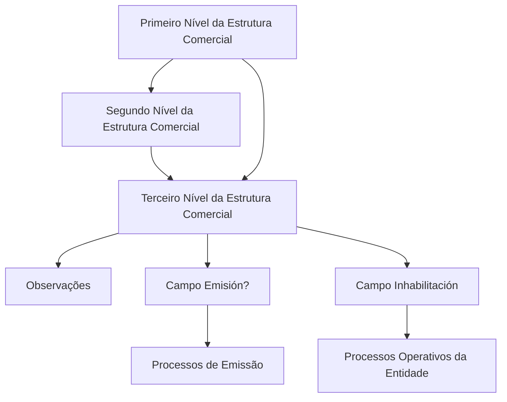

# Operação de Criação de Informação do Terceiro Nível da Estrutura Comercial

## 1. Metadados do Documento
- **Arquivo de Origem:** Não identificado no conteúdo extraído
- **Tipo de Documento:** Procedimento / Manual Operacional
- **Domínio / Sistema:** Reef / Estrutura Comercial
- **Público-Alvo:** Usuários operacionais e administradores do sistema
- **Data/Versão Identificada:** Não identificada

---

## 2. Resumo Executivo & Contexto de Negócio

O documento descreve a operação **CREAR** para registrar no sistema as informações dos **Terceiros Níveis da Estrutura Comercial**, citando como exemplo Pessoas Jurídicas configuradas na companhia. O objetivo explícito é permitir o cadastro dessas entidades no contexto da estrutura comercial corporativa.

A criação de um Terceiro Nível depende da associação com códigos já existentes de Primeiro Nível e Segundo Nível. O Segundo Nível também é dependente do Primeiro Nível, estabelecendo uma hierarquia comercial em três níveis.

O cadastro inclui campos para observações, habilitação para uso em processos de Emissão e inabilitação operacional. O campo **Emisión?** controla se o código de Terceiro Nível pode ser utilizado direta ou indiretamente em processos de emissão.

O campo **Inhabilitación** possui impacto operacional: quando o Terceiro Nível estiver inabilitado, ele não deve ser empregado, contemplado ou considerado nos processos operativos da entidade.

---

## 3. Arquitetura, Componentes & Tecnologias Envolvidas

O conteúdo identifica o sistema **Reef** e a funcionalidade de gestão da **Estrutura Comercial**. Não há detalhamento técnico sobre APIs, banco de dados, interfaces, protocolos, tecnologias de implementação, autenticação ou integrações externas.

Os componentes funcionais explicitamente identificados são:

- Operação **CREAR**.
- Registro de dados do **Tercer Nivel Estructura Comercial**.
- Referência ao **Primer Nivel** da Estrutura Comercial.
- Referência ao **Segundo Nivel** da Estrutura Comercial.
- Controle de uso em processos de **Emisión**.
- Controle de **Inhabilitación** para impedir uso operacional.



> **Nota de Análise:** O documento não descreve mecanismos técnicos de persistência, regras de autorização, métodos HTTP, contratos JSON, fluxos de aprovação ou integrações do sistema Reef.

---

## 4. Regras de Negócio, Especificações Funcionais & Processos

### Operação habilitada

A ação explicitamente habilitada no documento é:

- **CREAR:** operação destinada ao registro das informações dos Terceiros Níveis da Estrutura Comercial configurados na companhia.

### Finalidade do cadastro

A operação permite registrar informações referentes aos Terceiros Níveis da Estrutura Comercial. O texto cita **Pessoas Jurídicas** como exemplo de entidades que podem compor esse nível.

### Sequência de captura

O documento informa que os campos devem ser considerados da esquerda para a direita e de cima para baixo, seguindo a sequência de captura apresentada no bloco de informações.

### Hierarquia comercial

1. O campo **Primer Nivel** deve conter o código do Primeiro Nível da Estrutura Comercial.
2. O código do Primeiro Nível determina a dependência da chave do Terceiro Nível.
3. O campo **Segundo Nivel** deve conter o código do Segundo Nível da Estrutura Comercial.
4. O Segundo Nível é dependente da chave do Primeiro Nível.
5. A chave do Terceiro Nível depende do Primeiro Nível e do Segundo Nível informados.

### Observações

O campo **Observaciones** permite registrar texto esclarecedor ou observações relacionadas ao ato de criação do nível da Estrutura Comercial.

### Regra de utilização em Emissão

O campo **Emisión?** modula o comportamento do sistema para permitir que o código do Terceiro Nível da Estrutura Comercial seja empregado, direta ou indiretamente, nos processos de Emissão.

### Regra de inabilitação

O campo **Inhabilitación** informa ao sistema que o Terceiro Nível da Estrutura Comercial está inabilitado. Quando inabilitado, o Terceiro Nível não deve:

- Ser empregado;
- Ser contemplado;
- Ser considerado;

nos processos operativos da entidade.

---

## 5. Tabelas de Parâmetros, Ambientes e Estruturas de Dados

| Item / Parâmetro | Descrição / Função | Tipo / Valores / Formato | Ambiente / Observações |
| :--- | :--- | :--- | :--- |
| CREAR | Ação habilitada para registrar a informação do Terceiro Nível da Estrutura Comercial. | Operação funcional | O documento não detalha pré-requisitos, permissões ou retorno da operação. |
| Primer Nivel | Contém o código do Primeiro Nível da Estrutura Comercial do qual depende a chave do Terceiro Nível. | Código; formato não especificado | Campo pertencente à hierarquia comercial. |
| Segundo Nivel | Contém o código do Segundo Nível da Estrutura Comercial, dependente da chave do Primeiro Nível, do qual depende a chave do Terceiro Nível. | Código; formato não especificado | Campo pertencente à hierarquia comercial. |
| Observaciones | Permite inserir texto esclarecedor ou observações sobre a criação do nível da Estrutura Comercial. | Texto; tamanho e formato não especificados | Associado ao evento de criação. |
| Emisión? | Modula o comportamento do sistema para permitir o uso direto ou indireto do código do Terceiro Nível nos processos de Emissão. | Indicador; valores não especificados | O documento não define os valores possíveis do campo. |
| Inhabilitación | Indica que o Terceiro Nível está inabilitado no sistema. | Indicador; valores não especificados | Um Terceiro Nível inabilitado não deve ser empregado, contemplado ou considerado em processos operativos. |
| Terceiro Nível da Estrutura Comercial | Entidade cadastrada pela operação CREAR. | Entidade de estrutura comercial | Pessoas Jurídicas são citadas como exemplo. |
| Reef | Sistema ou domínio documental mencionado no conteúdo. | Sistema / plataforma | Não há detalhamento técnico adicional. |

---

## 6. Bateria de Perguntas & Respostas para RAG (FAQ Sintético)

### P1: Qual é o objetivo da operação CREAR na Estrutura Comercial?
**R:** A operação CREAR permite registrar no sistema as informações dos Terceiros Níveis da Estrutura Comercial configurados na companhia. O documento cita Pessoas Jurídicas como exemplo de entidades desse nível.

### P2: Quais níveis da hierarquia comercial são necessários para o Terceiro Nível?
**R:** O Terceiro Nível possui dependência em relação ao Primeiro Nível e ao Segundo Nível da Estrutura Comercial. O Segundo Nível, por sua vez, depende da chave do Primeiro Nível.

### P3: O que deve ser informado no campo Primer Nivel?
**R:** O campo Primer Nivel deve conter o código do Primeiro Nível da Estrutura Comercial do qual dependerá a chave do Terceiro Nível.

### P4: Qual é a função do campo Segundo Nivel?
**R:** O campo Segundo Nivel deve conter o código do Segundo Nível da Estrutura Comercial. Esse Segundo Nível é dependente da chave do Primeiro Nível e constitui uma dependência para a chave do Terceiro Nível.

### P5: Para que serve o campo Observaciones?
**R:** O campo Observaciones permite inserir texto esclarecedor ou observações relacionadas ao fato de criar o nível da Estrutura Comercial.

### P6: Qual é o impacto do campo Emisión? no Terceiro Nível da Estrutura Comercial?
**R:** O campo Emisión? modula o comportamento do sistema, permitindo que o código do Terceiro Nível da Estrutura Comercial possa ser utilizado direta ou indiretamente nos processos de Emissão.

### P7: O que acontece quando um Terceiro Nível está marcado como inabilitado?
**R:** Quando o campo Inhabilitación indica que o Terceiro Nível está inabilitado, esse Terceiro Nível não deve ser empregado, contemplado ou considerado nos processos operativos da entidade.

### P8: O documento define quais valores podem ser selecionados nos campos Emisión? e Inhabilitación?
**R:** Não. O documento descreve a finalidade funcional dos campos Emisión? e Inhabilitación, mas não informa os valores permitidos, o formato de apresentação ou o comportamento padrão desses indicadores.

### P9: O documento informa como os dados do Terceiro Nível são integrados com outros sistemas?
**R:** Não. O conteúdo não apresenta APIs, integrações, contratos de dados, bancos de dados, serviços externos ou mecanismos técnicos de comunicação relacionados ao cadastro do Terceiro Nível.

### P10: Em qual ordem os campos devem ser preenchidos?
**R:** O documento informa que, da esquerda para a direita e de cima para baixo, os campos apresentados definem a sequência de captura no bloco de informações do Terceiro Nível da Estrutura Comercial.

---

## 7. Glossário de Termos, Siglas & Conceitos-Chave

- **CREAR:** Ação habilitada para criar ou registrar informações do Terceiro Nível da Estrutura Comercial.
- **Emisión:** Processos de emissão nos quais o código do Terceiro Nível pode ser utilizado direta ou indiretamente, conforme o campo Emisión?.
- **Estructura Comercial:** Hierarquia comercial composta, no contexto apresentado, por Primeiro Nível, Segundo Nível e Terceiro Nível.
- **Inhabilitación:** Indicador de que o Terceiro Nível está inabilitado e não deve participar dos processos operativos da entidade.
- **Primer Nivel:** Primeiro Nível da Estrutura Comercial; seu código condiciona a chave do Terceiro Nível.
- **Segundo Nivel:** Segundo Nível da Estrutura Comercial; depende da chave do Primeiro Nível e condiciona a chave do Terceiro Nível.
- **Tercer Nivel:** Terceiro Nível da Estrutura Comercial cadastrado pela operação CREAR.
- **Reef:** Nome citado na documentação e no cabeçalho do conteúdo extraído; o documento não detalha a expansão ou arquitetura da plataforma.

---

## 8. Notas Críticas, Riscos & Limitações

- O documento não identifica o nome do arquivo original, data, versão, autor técnico ou histórico de revisões.
- O texto extraído apresenta caracteres corrompidos em alguns trechos, como `Información especíca` e `congurados`; a interpretação foi limitada ao sentido textual claramente recuperável.
- Não há definição de obrigatoriedade dos campos, formatos de código, tamanhos máximos, valores padrão ou mensagens de validação.
- Não há especificação sobre permissões, perfis de acesso, aprovação, auditoria ou trilha de alterações da operação CREAR.
- O documento não define os valores possíveis dos campos **Emisión?** e **Inhabilitación**.
- Não há detalhes sobre persistência de dados, APIs, integrações, contratos de interface ou tratamento de erros.
- Não há detalhamento adicional sobre o exemplo de Pessoas Jurídicas ou sobre outros possíveis tipos de Terceiro Nível.

---

## 9. Conteúdo Bruto Estruturado (Referência Fiel)

```text
--- [PÁGINA 1 DE 2] ---

CREAR Información especíca del Tercer Nivel de la Estructura
Comercial
Objetivo
Esta operación permite registrar en el Sistema la Información de los Terceros Niveles de la Estructura Comercial (como Personas Jurídicas)
congurados en la Compañía.
Acciones habilitadas
 CREAR ( )
Datos Tercer Nivel Estructura Comercial
De Izquierda a Derecha y de Arriba hacia Abajo, los siguientes campos marcan la secuencia de captura en este Bloque de Información.
Primer Nivel (  )
Este dato va a contener el código del primer nivel de la estructura comercial del que dependerá la clave del tercer nivel.
Segundo Nivel (  )
Este dato va a contener el código del segundo nivel de la estructura comercial (dependiente a su vez a la clave del primer nivel) del que
dependerá la clave del tercer nivel.
Observaciones ( )
Este campo permite ingresar un texto aclaratorio u observaciones al hecho de crear el nivel de la estructura comercial.
Emisión? ( )
Este campo modula el comportamiento del sistema permitiendo que el código del tercer nivel de la estructura comercial se pueda emplear,
directa o indirectamente, en los procesos de Emisión.
Inhabilitación ( )
Documentation / DOCUMENTACIÓN Reef
DOCUMENTACIÓN Reef
Mapfredocument
DOCUMENTACIÓN Reef
Owner
user:agonzalez_mapfre.com
Lifecycle
Approved Source
 / 
 VL
Buscar Inicio Soluciones Arquitecturas APIs Componentes Cloud Documentación Zeus Reef Ayuda
ES


--- [PÁGINA 2 DE 2] ---

Este campo le indica al sistema que el tercer nivel de la estructura comercial está inhabilitado en el sistema por lo cual, de estarlo, no debería
ser empleado, contemplado o considerado en los procesos operativos de la entidad.
```
