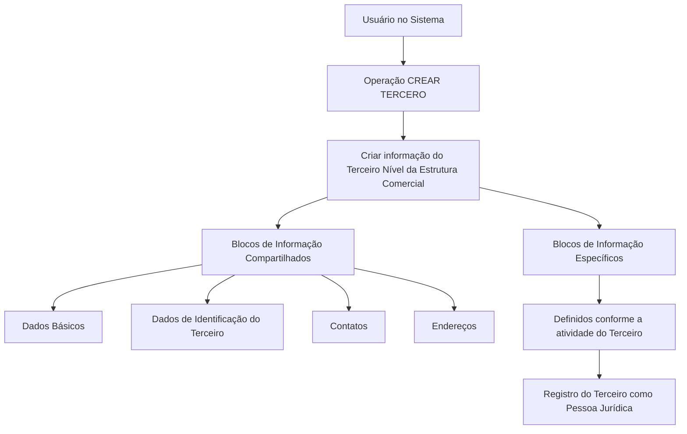

# Procedimento de Criação do Terceiro Nível da Estrutura Comercial

## 1. Metadados do Documento
- **Arquivo de Origem:** Não identificado no conteúdo fornecido
- **Tipo de Documento:** Procedimento
- **Domínio / Sistema:** Operação **CREAR TERCERO**; Estrutura Comercial; documentação Reef
- **Público-Alvo:** Usuários do Sistema; demais públicos não identificados
- **Data/Versão Identificada:** Não identificada

---

## 2. Resumo Executivo & Contexto de Negócio

O conteúdo descreve a operação **CREAR TERCERO**, destinada ao registro, no Sistema, das informações referentes aos Terceiros Níveis da Estrutura Comercial configurados na Companhia. O documento associa esses terceiros a exemplos de **Personas Jurídicas**.

A criação de Terceiros Níveis da Estrutura Comercial depende da premissa de que o Novo Modelo de Dados de Terceros esteja habilitado para uso pela Companhia. O documento determina que os Terceiros Níveis da Estrutura Comercial da Entidade Aseguradora devem sempre ser criados como Pessoas Jurídicas.

O processo de criação contempla blocos de informação compartilhados, incluindo Dados Básicos, Dados de Identificação do Terceiro, Contatos e Endereços. Também existem blocos de informação específicos que variam de acordo com a atividade do terceiro.

A obrigatoriedade e a habilitação de campos podem variar conforme o código de atividade do terceiro. Além disso, modificações implementadas localmente podem afetar o comportamento da aplicação quanto à obrigatoriedade do registro dos Dados do Terceiro. A ordem de captura nos blocos de informação pode variar segundo o critério adotado pelo usuário no Sistema.

---

## 3. Arquitetura, Componentes & Tecnologias Envolvidas

| Componente / Termo | Papel identificado no conteúdo |
| :--- | :--- |
| Sistema | Ambiente no qual ocorre o registro das informações dos Terceiros Níveis da Estrutura Comercial. |
| Operação CREAR TERCERO | Operação utilizada para criar e registrar as informações do terceiro. |
| Novo Modelo de Dados de Terceros | Premissa necessária para utilização da operação pela Companhia. |
| Estrutura Comercial | Estrutura que contém os Terceiros Níveis configurados na Companhia. |
| Entidade Aseguradora | Entidade para a qual os Terceiros Níveis da Estrutura Comercial devem ser criados como Pessoas Jurídicas. |
| Reef | Referência presente na navegação/documentação exibida no conteúdo. |
| Mapfredocument | Referência presente na navegação/documentação exibida no conteúdo. |



**Nota de Análise:** O conteúdo não detalha tecnologias de implementação, APIs, métodos HTTP, contratos JSON, banco de dados, servidores, URLs de ambiente, autenticação ou integrações entre sistemas.

---

## 4. Regras de Negócio, Especificações Funcionais & Processos

### 4.1 Objetivo da operação

A operação **CREAR TERCERO** permite registrar no Sistema a informação dos Terceiros Níveis da Estrutura Comercial configurados na Companhia.

### 4.2 Premissas

1. O Novo Modelo de Dados de Terceros deve estar habilitado para utilização pela Companhia.
2. Os Terceiros Níveis da Estrutura Comercial da Entidade Aseguradora devem ser criados sempre como Pessoas Jurídicas.

### 4.3 Regras de campos e blocos de informação

1. A obrigatoriedade e/ou a habilitação dos campos no registro de dados pode variar conforme o código de atividade do terceiro.
2. Essa variação aplica-se aos blocos ou estruturas de informação compartilhadas.
3. Modificações implementadas localmente podem afetar o comportamento da aplicação relacionado à obrigatoriedade no registro dos Dados do Terceiro.
4. A ordem de captura dos dados em diferentes blocos de informação pode variar conforme o critério seguido pelo usuário no Sistema.

### 4.4 Processo identificado

1. O usuário executa a operação **CREAR TERCERO**.
2. O usuário cria a informação do Terceiro Nível da Estrutura Comercial.
3. O usuário registra os blocos de informação compartilhados:
   - Dados Básicos;
   - Dados de Identificação do Terceiro;
   - Contatos;
   - Endereços.
4. O usuário registra blocos de informação específicos conforme a atividade do terceiro.
5. O terceiro é criado como Pessoa Jurídica, conforme a regra aplicável aos Terceiros Níveis da Estrutura Comercial da Entidade Aseguradora.

---

## 5. Tabelas de Parâmetros, Ambientes e Estruturas de Dados

| Item / Parâmetro | Descrição / Função | Tipo / Valores / Formato | Ambiente / Observações |
| :--- | :--- | :--- | :--- |
| Operação | Permite registrar informação dos Terceiros Níveis da Estrutura Comercial. | `CREAR TERCERO` | Executada no Sistema. |
| Terceiro Nível | Entidade registrada como parte da Estrutura Comercial. | Pessoa Jurídica | Para a Entidade Aseguradora, deve sempre ser criado como Pessoa Jurídica. |
| Modelo de Dados | Modelo que deve estar habilitado para a operação ser utilizada. | Novo Modelo de Dados de Terceros | Premissa para uso pela Companhia. |
| Código de atividade do Terceiro | Critério que pode alterar regras de campos. | Código não detalhado | Pode alterar obrigatoriedade e/ou habilitação dos campos. |
| Dados Básicos | Bloco de informação compartilhado. | Estrutura não detalhada | Conteúdo dos campos não especificado. |
| Dados de Identificação do Terceiro | Bloco de informação compartilhado. | Estrutura não detalhada | Conteúdo dos campos não especificado. |
| Contatos | Bloco de informação compartilhado. | Estrutura não detalhada | Conteúdo dos campos não especificado. |
| Endereços | Bloco de informação compartilhado. | Estrutura não detalhada | Conteúdo dos campos não especificado. |
| Blocos específicos | Estruturas de informação adicionais. | Variável conforme atividade do terceiro | Campos e critérios não detalhados. |
| Modificações locais | Alterações locais que podem afetar a aplicação. | Não detalhado | Podem afetar a obrigatoriedade de registro dos Dados do Terceiro. |
| Ordem de captura | Sequência de preenchimento dos blocos de informação. | Variável | Pode variar conforme o critério do usuário. |

---

## 6. Bateria de Perguntas & Respostas para RAG (FAQ Sintético)

### P1: Qual é a finalidade da operação CREAR TERCERO?
**R:** A operação **CREAR TERCERO** permite registrar no Sistema as informações dos Terceiros Níveis da Estrutura Comercial configurados na Companhia.

### P2: Que tipo de entidade deve ser criado para o Terceiro Nível da Estrutura Comercial da Entidade Aseguradora?
**R:** Os Terceiros Níveis da Estrutura Comercial da Entidade Aseguradora devem sempre ser criados como **Pessoas Jurídicas**.

### P3: Qual premissa deve ser atendida para usar a operação de criação de terceiro?
**R:** O Novo Modelo de Dados de Terceros deve estar habilitado para ser utilizado pela Companhia.

### P4: Quais blocos de informação compartilhados são mencionados para a criação do terceiro?
**R:** Os blocos de informação compartilhados mencionados são Dados Básicos, Dados de Identificação do Terceiro, Contatos e Endereços.

### P5: Os campos dos blocos compartilhados possuem obrigatoriedade fixa?
**R:** Não. A obrigatoriedade e/ou a habilitação dos campos pode variar de acordo com o código de atividade do terceiro.

### P6: Existem informações adicionais além dos blocos compartilhados?
**R:** Sim. O processo inclui blocos de informação específicos definidos de acordo com a atividade do terceiro. O conteúdo fornecido não detalha os campos desses blocos específicos.

### P7: Modificações locais podem afetar o comportamento da criação de terceiros?
**R:** Sim. Modificações implementadas localmente podem afetar o comportamento da aplicação em relação à obrigatoriedade do registro dos Dados do Terceiro.

### P8: A ordem de preenchimento dos blocos de informação é obrigatória?
**R:** O documento informa que a ordem de captura dos dados nos blocos de informação pode variar conforme o critério seguido pelo usuário no Sistema.

### P9: O documento especifica APIs, métodos HTTP ou contratos de integração para CREAR TERCERO?
**R:** Não. O conteúdo fornecido descreve o processo funcional e os blocos de informação, mas não especifica APIs, métodos HTTP, contratos JSON, URLs, tecnologias ou integrações.

### P10: Qual é a relação entre o código de atividade do terceiro e os dados cadastrados?
**R:** O código de atividade do terceiro pode determinar variações na obrigatoriedade e/ou na habilitação dos campos registrados nos blocos ou estruturas de informação compartilhadas.

---

## 7. Glossário de Termos, Siglas & Conceitos-Chave

- **CREAR TERCERO:** Operação utilizada para registrar no Sistema a informação dos Terceiros Níveis da Estrutura Comercial.
- **Terceiro Nível da Estrutura Comercial:** Nível da Estrutura Comercial configurada na Companhia e registrado por meio da operação CREAR TERCERO.
- **Pessoa Jurídica:** Tipo de entidade pelo qual os Terceiros Níveis da Estrutura Comercial da Entidade Aseguradora devem sempre ser criados.
- **Novo Modelo de Dados de Terceros:** Modelo de dados que deve estar habilitado para utilização pela Companhia.
- **Código de atividade do Terceiro:** Critério que pode variar a obrigatoriedade e/ou a habilitação dos campos de informação.
- **Blocos de Informação Compartilhados:** Conjunto de estruturas composto por Dados Básicos, Dados de Identificação do Terceiro, Contatos e Endereços.
- **Blocos de Informação Específicos:** Estruturas de dados que variam de acordo com a atividade do terceiro.
- **Reef:** Termo exibido na navegação e na documentação apresentada no conteúdo.
- **Mapfredocument:** Termo exibido na navegação e na documentação apresentada no conteúdo.

---

## 8. Notas Críticas, Riscos & Limitações

- O conteúdo não identifica o nome do arquivo de origem, data, versão, autor técnico ou responsável funcional.
- O documento não detalha os campos pertencentes a Dados Básicos, Dados de Identificação do Terceiro, Contatos ou Endereços.
- Os valores possíveis para código de atividade do terceiro não são fornecidos.
- Não são especificadas regras concretas de obrigatoriedade por código de atividade.
- Modificações locais podem alterar a obrigatoriedade de registro dos Dados do Terceiro, mas o documento não identifica quais modificações nem seus efeitos.
- Não há detalhamento de mensagens de erro, validações de formato, permissões, perfis de acesso, auditoria ou critérios de aprovação.
- Não são descritos APIs, contratos de integração, URLs, ambientes, servidores, tecnologias ou mecanismos de persistência.
- **Nota de Análise:** O conteúdo apresenta referências a Reef e Mapfredocument, mas não explica a relação técnica ou funcional dessas referências com a operação CREAR TERCERO.

---

## 9. Conteúdo Bruto Estruturado (Referência Fiel)

```text
--- [PÁGINA 1 DE 2] ---

OPERACIÓN CREAR Tercer Nivel de la Estructura Comercial
¿En que consiste?
Esta operación permite registrar en el Sistema la Información de los Terceros Niveles de la Estructura Comercial (como Personas Jurídicas)
congurados en la Compañía.
Premisas
El Nuevo Modelo de Datos de Terceros está habilitado para ser utilizado por la Compañía
Los Terceros Niveles de la Estructura Comercial de la Entidad Aseguradora siempre se crearán como Personas Jurídicas.
La obligatoriedad y/o la habilitación de los campos en el registro de los datos de cada uno de los bloques o estructuras de información
compartidas puede variar de acuerdo con el código de actividad del Tercero:
Las modicaciones que se hubieran podido implementar localmente a su vez pueden afectar el comportamiento de la aplicación en
relación con la obligatoriedad en el registro de los Datos del Tercero.
Por último, el orden de captura de los datos en los distintos bloques de Información puede variar de acuerdo con el criterio seguido por el
Usuario en el Sistema.
Proceso
CREAR
TERCERO
Crear Información
del Tercer Nivel de la Estructura Comercial
Bloques de Información Compartidos (CREAR TERCERO)
 Datos Básicos ( )
 Datos Identicación del Tercero ( )
 Contactos ( )
 Direcciones ( )
Bloques de Información Especícos de acuerdo con la Actividad del Tercero.
Ejemplo:
Documentation / DOCUMENTACIÓN Reef
DOCUMENTACIÓN Reef
Mapfredocument
DOCUMENTACIÓN Reef
Owner
user:agonzalez_mapfre.com
Lifecycle
Approved Source
 / 
 VL
Buscar Inicio Soluciones Arquitecturas APIs Componentes Cloud Documentación Zeus Reef Ayuda
ES


--- [PÁGINA 2 DE 2] ---

Información del Tercer Nivel la Estructura Comercial ( )
```
