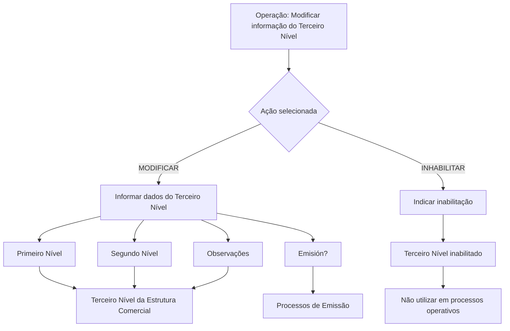

# Modificação e Inabilitação do Terceiro Nível da Estrutura Comercial

## 1. Metadados do Documento
- **Arquivo de Origem:** Não identificado no conteúdo fornecido
- **Tipo de Documento:** Procedimento
- **Domínio / Sistema:** Reef / Estrutura Comercial
- **Público-Alvo:** Operação, Negócio e usuários responsáveis pela manutenção da Estrutura Comercial
- **Data/Versão Identificada:** Não identificada

---

## 2. Resumo Executivo & Contexto de Negócio

O documento descreve uma operação do sistema Reef para modificar informações previamente registradas no **Terceiro Nível da Estrutura Comercial** de uma companhia. A operação também permite inabilitar esse terceiro nível para impedir sua utilização em processos operacionais da entidade.

As ações disponíveis são **MODIFICAR** e **INHABILITAR**. A alteração do terceiro nível considera sua vinculação hierárquica com o Primeiro Nível e o Segundo Nível da Estrutura Comercial, preservando a dependência indicada no texto entre os níveis da estrutura.

O procedimento apresenta campos para informar os códigos dos níveis hierárquicos anteriores, registrar observações, definir o comportamento relacionado a processos de Emissão e indicar a inabilitação do terceiro nível. O documento não detalha validações de formato, obrigatoriedade, regras de persistência, perfis de acesso ou contratos técnicos.

A inabilitação possui impacto operacional explícito: quando o Terceiro Nível da Estrutura Comercial estiver inabilitado, ele não deve ser empregado, contemplado ou considerado nos processos operativos da entidade.

---

## 3. Arquitetura, Componentes & Tecnologias Envolvidas

Os componentes e contextos explicitamente citados são:

| Componente / Termo | Papel identificado no documento |
| :--- | :--- |
| Reef | Sistema ou domínio de documentação no qual a operação é apresentada. |
| Estrutura Comercial | Estrutura hierárquica que contém Primeiro Nível, Segundo Nível e Terceiro Nível. |
| Primeiro Nível | Nível hierárquico cujo código é relacionado à chave do Terceiro Nível. |
| Segundo Nível | Nível hierárquico dependente do Primeiro Nível e relacionado à chave do Terceiro Nível. |
| Terceiro Nível | Entidade da Estrutura Comercial cuja informação pode ser modificada ou inabilitada. |
| Processos de Emissão | Processos que podem utilizar, direta ou indiretamente, o código do Terceiro Nível. |
| Processos operativos da entidade | Processos nos quais um Terceiro Nível inabilitado não deve ser empregado, contemplado ou considerado. |



> **Nota de Análise:** O documento não apresenta microsserviços, APIs, URLs, servidores, tecnologias de implementação, métodos HTTP, contratos JSON, mecanismos de autenticação ou ambientes técnicos.

---

## 4. Regras de Negócio, Especificações Funcionais & Processos

1. A operação permite modificar informações previamente registradas para o **Terceiro Nível da Estrutura Comercial** de uma companhia.
2. A operação também permite inabilitar o Terceiro Nível da Estrutura Comercial.
3. As possíveis ações identificadas no documento são:
   - **MODIFICAR**
   - **INHABILITAR**
4. A sequência de modificação dos campos no bloco de informações segue a leitura “da esquerda para a direita e de cima para baixo”.
5. O campo **Primer Nivel** deve conter o código do Primeiro Nível da Estrutura Comercial do qual dependerá a chave do Terceiro Nível.
6. O campo **Segundo Nivel** deve conter o código do Segundo Nível da Estrutura Comercial. O Segundo Nível é dependente, por sua vez, da chave do Primeiro Nível; dele dependerá a chave do Terceiro Nível.
7. O campo **Observaciones** permite informar texto esclarecedor ou observações relacionadas ao fato de criar o nível da Estrutura Comercial.
8. O campo **Emisión?** modula o comportamento do sistema, permitindo que o código do Terceiro Nível da Estrutura Comercial seja utilizado direta ou indiretamente nos processos de Emissão.
9. O campo **Inhabilitación** informa ao sistema que o Terceiro Nível da Estrutura Comercial está inabilitado.
10. Quando o Terceiro Nível estiver inabilitado, ele não deve ser empregado, contemplado ou considerado nos processos operativos da entidade.

> **Nota de Análise:** O documento não esclarece se os campos Primeiro Nível, Segundo Nível, Observações, Emisión? e Inhabilitación são obrigatórios, quais valores são aceitos, nem quais regras são aplicadas quando uma ação de modificação ou inabilitação é confirmada.

---

## 5. Tabelas de Parâmetros, Ambientes e Estruturas de Dados

| Item / Parâmetro | Descrição / Função | Tipo / Valores / Formato | Ambiente / Observações |
| :--- | :--- | :--- | :--- |
| Ação | Define a operação a realizar sobre o Terceiro Nível da Estrutura Comercial. | `MODIFICAR` ou `INHABILITAR` | O documento apresenta ambas como possíveis ações. |
| Primer Nivel | Contém o código do Primeiro Nível da Estrutura Comercial do qual depende a chave do Terceiro Nível. | Código; formato não detalhado | Relacionado à hierarquia comercial. |
| Segundo Nivel | Contém o código do Segundo Nível da Estrutura Comercial do qual depende a chave do Terceiro Nível. | Código; formato não detalhado | O Segundo Nível depende, por sua vez, da chave do Primeiro Nível. |
| Observaciones | Permite informar texto esclarecedor ou observações relacionadas à criação do nível da Estrutura Comercial. | Texto; formato não detalhado | Não há limite de tamanho ou obrigatoriedade especificados. |
| Emisión? | Modula o comportamento do sistema para permitir uso do código do Terceiro Nível em processos de Emissão. | Valor não detalhado | O uso pode ocorrer direta ou indiretamente nos processos de Emissão. |
| Inhabilitación | Indica que o Terceiro Nível da Estrutura Comercial está inabilitado no sistema. | Valor não detalhado | Um nível inabilitado não deve ser usado nos processos operativos da entidade. |
| Terceiro Nível da Estrutura Comercial | Nível hierárquico objeto da modificação ou inabilitação. | Entidade de Estrutura Comercial | Previamente registrado na companhia, segundo o objetivo descrito. |

---

## 6. Bateria de Perguntas & Respostas para RAG (FAQ Sintético)

### P1: Qual é o objetivo da operação de modificação do Terceiro Nível da Estrutura Comercial?
**R:** A operação permite modificar as informações previamente registradas para o Terceiro Nível da Estrutura Comercial de uma companhia e também permite inabilitar esse terceiro nível.

### P2: Quais ações estão disponíveis para o Terceiro Nível da Estrutura Comercial?
**R:** O documento apresenta duas ações possíveis: **MODIFICAR** e **INHABILITAR**.

### P3: Qual informação deve ser inserida no campo Primer Nivel?
**R:** O campo **Primer Nivel** deve conter o código do Primeiro Nível da Estrutura Comercial do qual dependerá a chave do Terceiro Nível.

### P4: Qual é a relação entre Segundo Nivel, Primeiro Nível e Terceiro Nível?
**R:** O campo **Segundo Nivel** contém o código do Segundo Nível da Estrutura Comercial. Esse Segundo Nível depende da chave do Primeiro Nível e a chave do Terceiro Nível depende do Segundo Nível informado.

### P5: Para que serve o campo Observaciones?
**R:** O campo **Observaciones** permite inserir um texto esclarecedor ou observações relacionadas ao fato de criar o nível da Estrutura Comercial.

### P6: O que o campo Emisión? controla no sistema?
**R:** O campo **Emisión?** modula o comportamento do sistema, permitindo que o código do Terceiro Nível da Estrutura Comercial seja utilizado direta ou indiretamente nos processos de Emissão.

### P7: Qual é o efeito de marcar a inabilitação do Terceiro Nível?
**R:** A inabilitação informa ao sistema que o Terceiro Nível da Estrutura Comercial está inabilitado. Nessa condição, o nível não deve ser empregado, contemplado ou considerado nos processos operativos da entidade.

### P8: Em que ordem os campos do bloco de informações devem ser tratados?
**R:** O documento determina que, da esquerda para a direita e de cima para baixo, os campos indicam a sequência de modificação no bloco de informações.

### P9: O documento informa quais formatos ou tamanhos são aceitos para os códigos dos níveis?
**R:** Não. O documento determina que os campos Primeiro Nível e Segundo Nível devem conter códigos da Estrutura Comercial, mas não detalha formato, tamanho, domínio de valores ou regras de validação.

### P10: O documento descreve APIs, microsserviços ou contratos de integração para essa operação?
**R:** Não. O conteúdo fornecido descreve a operação funcional e seus campos, mas não detalha APIs, microsserviços, métodos HTTP, contratos JSON, servidores ou URLs de integração.

---

## 7. Glossário de Termos, Siglas & Conceitos-Chave

- **Reef:** Nome do sistema ou domínio de documentação identificado no conteúdo.
- **Estrutura Comercial:** Estrutura hierárquica composta por níveis comerciais, incluindo Primeiro Nível, Segundo Nível e Terceiro Nível.
- **Primer Nivel / Primeiro Nível:** Nível da Estrutura Comercial cujo código é relacionado à chave do Terceiro Nível.
- **Segundo Nivel / Segundo Nível:** Nível da Estrutura Comercial dependente do Primeiro Nível e relacionado à chave do Terceiro Nível.
- **Terceiro Nível:** Nível da Estrutura Comercial que pode ter informações modificadas ou ser inabilitado.
- **Emisión / Emissão:** Processos nos quais o código do Terceiro Nível pode ser utilizado direta ou indiretamente.
- **Inhabilitación / Inabilitação:** Condição que informa ao sistema que o Terceiro Nível não deve ser empregado, contemplado ou considerado nos processos operativos da entidade.
- **Procesos operativos / Processos operativos:** Processos da entidade nos quais um Terceiro Nível inabilitado não deve ser utilizado.

---

## 8. Notas Críticas, Riscos & Limitações

- O documento não identifica o nome do arquivo de origem, data, versão, autor formal ou histórico de alterações.
- O texto não especifica o formato, o tamanho, a obrigatoriedade ou as validações dos campos apresentados.
- O documento não informa como a ação de inabilitação é persistida, revertida ou auditada.
- Não há detalhamento sobre permissões, perfis de acesso, trilha de auditoria ou responsáveis pela alteração da Estrutura Comercial.
- Não são apresentados APIs, integrações, serviços, ambientes, URLs, logs, mensagens de erro ou contratos de dados.
- O termo **Emisión?** descreve o efeito funcional sobre processos de Emissão, mas não detalha quais processos específicos são afetados.
- A extração contém caracteres possivelmente corrompidos, como `Modicar`, `especíca` e `información`; esses trechos foram preservados na referência bruta.

---

## 9. Conteúdo Bruto Estruturado (Referência Fiel)

```text
--- [PÁGINA 1 DE 2] ---

MODIFICAR Información especíca del Tercer Nivel de la Estructura
Comercial
Objetivo
Esta Operación permite Modicar la información que tuviera el Tercer Nivel de la Estructura Comercial de la compañía registrada previamente
además de poder Inhabilitarlo.
Posibles Acciones
 MODIFICAR ( )
 INHABILITAR ( )
Datos Tercer Nivel Estructura Comercial
De Izquierda a Derecha y de Arriba hacia Abajo, los siguientes campos marcan la secuencia de Modicación en este Bloque de Información.
Primer Nivel (  )
Este dato va a contener el código del primer nivel de la estructura comercial del que dependerá la clave del tercer nivel.
Segundo Nivel (  )
Este dato va a contener el código del segundo nivel de la estructura comercial (dependiente a su vez a la clave del primer nivel) del que
dependerá la clave del tercer nivel.
Observaciones ( )
Este campo permite ingresar un texto aclaratorio u observaciones al hecho de crear el nivel de la estructura comercial.
Emisión? ( )
Este campo modula el comportamiento del sistema permitiendo que el código del tercer nivel de la estructura comercial se pueda emplear,
directa o indirectamente, en los procesos de Emisión.
Inhabilitación ( )
Documentation / DOCUMENTACIÓN Reef
DOCUMENTACIÓN Reef
Mapfredocument
DOCUMENTACIÓN Reef
Owner
user:agonzalez_mapfre.com
Lifecycle
Approved Source
 / 
 VL
Buscar Inicio Soluciones Arquitecturas APIs Componentes Cloud Documentación Zeus Reef Ayuda
ES


--- [PÁGINA 2 DE 2] ---

Este campo le indica al sistema que el tercer nivel de la estructura comercial está inhabilitado en el sistema por lo cual, de estarlo, no debería
ser empleado, contemplado o considerado en los procesos operativos de la entidad.
```
