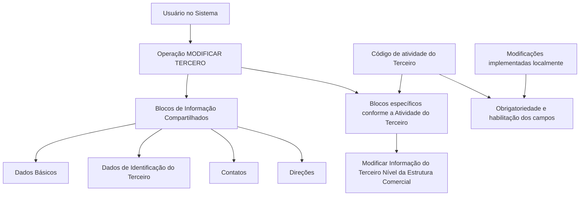

# Operação MODIFICAR — Terceiro Nível da Estrutura Comercial

## 1. Metadados do Documento
- **Arquivo de Origem:** Não identificado no conteúdo fornecido
- **Tipo de Documento:** Procedimento
- **Domínio / Sistema:** Estrutura Comercial / MODIFICAR TERCERO / Reef
- **Público-Alvo:** Usuários do sistema, Operação e áreas responsáveis pela manutenção de dados de Terceiros
- **Data/Versão Identificada:** Não identificada

---

## 2. Resumo Executivo & Contexto de Negócio

O documento descreve a operação **MODIFICAR**, destinada a complementar, modificar e/ou inabilitar informações do **Terceiro Nível da Estrutura Comercial**. A operação pode atuar em qualquer estrutura de dados que contenha e agrupe as informações desse nível da estrutura comercial.

A manutenção das informações é organizada em blocos compartilhados e em blocos específicos conforme a atividade do Terceiro. Os blocos compartilhados apresentados incluem Dados Básicos, Dados de Identificação do Terceiro, Contatos e Direções. O documento também menciona um bloco específico para modificação das informações do Terceiro Nível da Estrutura Comercial.

A obrigatoriedade e a habilitação dos campos podem variar conforme o código de atividade do Terceiro. Além disso, modificações implementadas localmente podem afetar o comportamento da aplicação, especialmente quanto à obrigatoriedade do registro dos Dados do Terceiro.

O processo não estabelece uma ordem fixa de captura de dados entre os blocos de informação. A sequência pode variar conforme o critério adotado pelo Usuário no Sistema. O conteúdo fornecido não detalha telas, campos específicos, validações técnicas, métodos HTTP, contratos de integração ou critérios concretos para habilitar ou inabilitar registros.

---

## 3. Arquitetura, Componentes & Tecnologias Envolvidas

Os componentes e conceitos explicitamente mencionados são:

- **MODIFICAR TERCERO:** contexto operacional que reúne blocos de informação compartilhados.
- **Terceiro Nível da Estrutura Comercial:** informação-alvo da operação MODIFICAR.
- **Dados Básicos:** bloco compartilhado no processo MODIFICAR TERCERO.
- **Dados Identificação Terceiro:** bloco compartilhado no processo MODIFICAR TERCERO.
- **Contatos:** bloco compartilhado no processo MODIFICAR TERCERO.
- **Direções:** bloco compartilhado no processo MODIFICAR TERCERO.
- **Informações específicas conforme a Atividade do Terceiro:** bloco condicionado à atividade do Terceiro.
- **Reef / DOCUMENTACIÓN Reef:** referência de documentação apresentada no conteúdo bruto.
- **Mapfredocument:** termo exibido no contexto de documentação.
- **Zeus:** item de navegação exibido no contexto de documentação.



**Nota de Análise:** o documento apresenta um fluxo funcional entre a operação MODIFICAR TERCERO e os blocos de informação, mas não descreve tecnologias de implementação, bancos de dados, APIs, ambientes, servidores, protocolos, URLs operacionais ou integrações entre sistemas.

---

## 4. Regras de Negócio, Especificações Funcionais & Processos

### Objetivo da operação

A operação **MODIFICAR** consiste em:

1. Complementar informações do Terceiro Nível da Estrutura Comercial.
2. Modificar informações do Terceiro Nível da Estrutura Comercial.
3. Inabilitar informações do Terceiro Nível da Estrutura Comercial.
4. Executar essas ações em qualquer estrutura de dados que contenha e agrupe essas informações.

### Premissas de obrigatoriedade e habilitação

1. A obrigatoriedade dos campos pode variar conforme o código de atividade do Terceiro.
2. A habilitação dos campos pode variar conforme o código de atividade do Terceiro.
3. Alterações implementadas localmente podem afetar o comportamento da aplicação.
4. O comportamento afetado por modificações locais pode incluir a obrigatoriedade do registro dos Dados do Terceiro.
5. O documento não informa quais modificações locais existem, quais campos são afetados nem quais códigos de atividade determinam cada regra.

### Ordem de captura de dados

1. A ordem de captura de dados nos diferentes blocos de informação pode variar.
2. A sequência de preenchimento é determinada pelo critério seguido pelo Usuário no Sistema.
3. O documento não define uma sequência obrigatória entre Dados Básicos, Identificação do Terceiro, Contatos, Direções e Informações da Estrutura Comercial.

### Blocos de informação compartilhados

No contexto de **MODIFICAR TERCERO**, o documento relaciona os seguintes blocos compartilhados:

1. Dados Básicos.
2. Dados Identificação Terceiro.
3. Contatos.
4. Direções.

### Blocos de informação específicos

O documento menciona blocos específicos de acordo com a Atividade do Terceiro, incluindo:

1. Modificar Informação do Terceiro Nível da Estrutura Comercial.

**Nota de Análise:** o conteúdo não especifica os campos pertencentes a cada bloco, regras de formato, regras de persistência, perfis de acesso, mensagens de erro, auditoria ou consequências operacionais da inabilitação.

---

## 5. Tabelas de Parâmetros, Ambientes e Estruturas de Dados

| Item / Parâmetro | Descrição / Função | Tipo / Valores / Formato | Ambiente / Observações |
| :--- | :--- | :--- | :--- |
| Operação MODIFICAR | Permite complementar, modificar e/ou inabilitar a informação do Terceiro Nível da Estrutura Comercial. | Operação funcional. | Associada ao contexto MODIFICAR TERCERO. |
| Terceiro Nível da Estrutura Comercial | Informação que pode ser complementada, modificada ou inabilitada. | Estrutura de informação comercial. | O documento não detalha campos ou estrutura interna. |
| Código de atividade do Terceiro | Critério que pode alterar a obrigatoriedade e/ou habilitação dos campos. | Código de atividade. | Valores não especificados. |
| Obrigatoriedade dos campos | Condição de preenchimento dos campos nos blocos ou estruturas de informação compartilhadas. | Pode variar. | Varia conforme o código de atividade do Terceiro e pode ser afetada por modificações locais. |
| Habilitação dos campos | Disponibilidade dos campos para registro nos blocos ou estruturas de informação compartilhadas. | Pode variar. | Varia conforme o código de atividade do Terceiro. |
| Modificações locais | Alterações que podem ter sido implementadas localmente. | Não detalhado. | Podem afetar o comportamento da aplicação em relação à obrigatoriedade dos Dados do Terceiro. |
| Dados Básicos | Bloco de informação compartilhado. | Bloco funcional. | Não há campos descritos. |
| Dados Identificação Terceiro | Bloco de informação compartilhado. | Bloco funcional. | Não há campos descritos. |
| Contatos | Bloco de informação compartilhado. | Bloco funcional. | Não há campos descritos. |
| Direções | Bloco de informação compartilhado. | Bloco funcional. | Não há campos descritos. |
| Informações específicas conforme a Atividade do Terceiro | Blocos de informação dependentes da atividade do Terceiro. | Bloco funcional condicionado. | O documento não enumera todas as atividades nem todos os blocos. |
| Modificar Informação do Terceiro Nível da Estrutura Comercial | Bloco específico apresentado como parte do processo. | Bloco funcional. | Sem detalhamento de campos, ações ou validações. |
| Ordem de captura | Sequência de preenchimento dos diferentes blocos de informação. | Variável. | Pode variar segundo o critério do Usuário no Sistema. |
| Reef | Referência de documentação exibida no conteúdo. | Nome/termo de documentação. | Não são informados URL, ambiente ou função técnica. |
| Mapfredocument | Termo exibido no conteúdo de documentação. | Não detalhado. | Não há descrição funcional. |
| Zeus | Item exibido na navegação de documentação. | Não detalhado. | Não há descrição funcional. |

---

## 6. Bateria de Perguntas & Respostas para RAG (FAQ Sintético)

### P1: Em que consiste a operação MODIFICAR do Terceiro Nível da Estrutura Comercial?
**R:** A operação MODIFICAR consiste em complementar, modificar e/ou inabilitar as informações do Terceiro Nível da Estrutura Comercial em qualquer estrutura de dados que contenha e agrupe essas informações.

### P2: Quais blocos de informação compartilhados fazem parte do contexto MODIFICAR TERCERO?
**R:** O documento lista quatro blocos de informação compartilhados no contexto MODIFICAR TERCERO: Dados Básicos, Dados Identificação Terceiro, Contatos e Direções.

### P3: O código de atividade do Terceiro influencia o preenchimento dos campos?
**R:** Sim. A obrigatoriedade e/ou a habilitação dos campos no registro de dados dos blocos ou estruturas de informação compartilhadas podem variar de acordo com o código de atividade do Terceiro.

### P4: Modificações locais podem alterar as regras do sistema?
**R:** Sim. O documento informa que modificações implementadas localmente podem afetar o comportamento da aplicação em relação à obrigatoriedade no registro dos Dados do Terceiro.

### P5: Existe uma ordem obrigatória para capturar os dados nos blocos de informação?
**R:** Não. O documento informa que a ordem de captura dos dados nos diferentes blocos de informação pode variar de acordo com o critério seguido pelo Usuário no Sistema.

### P6: A operação MODIFICAR atua somente em informações compartilhadas?
**R:** Não. Além dos blocos de informação compartilhados, o documento menciona blocos de informação específicos conforme a Atividade do Terceiro, incluindo a modificação da informação do Terceiro Nível da Estrutura Comercial.

### P7: Quais ações podem ser aplicadas à informação do Terceiro Nível da Estrutura Comercial?
**R:** A informação do Terceiro Nível da Estrutura Comercial pode ser complementada, modificada e/ou inabilitada.

### P8: O documento define quais campos pertencem ao bloco Dados Básicos?
**R:** Não. O documento apenas identifica Dados Básicos como um bloco de informação compartilhado; não fornece a lista de campos, formatos, obrigatoriedade específica ou validações desse bloco.

### P9: O documento detalha APIs, métodos HTTP ou contratos JSON para MODIFICAR TERCERO?
**R:** Não. O conteúdo fornecido descreve o processo funcional e os blocos de informação, mas não apresenta métodos HTTP, contratos JSON, endpoints, tecnologias de integração ou especificações técnicas de API.

### P10: O que determina quais informações específicas devem ser tratadas na operação?
**R:** O documento indica que existem blocos de informação específicos de acordo com a Atividade do Terceiro. Entretanto, não detalha a relação entre atividades, blocos específicos e regras de tratamento.

---

## 7. Glossário de Termos, Siglas & Conceitos-Chave

- **MODIFICAR:** operação utilizada para complementar, modificar e/ou inabilitar informações do Terceiro Nível da Estrutura Comercial.
- **MODIFICAR TERCERO:** contexto operacional citado como agrupador de blocos de informação compartilhados.
- **Terceiro:** entidade cujos dados e informações comerciais são tratados pela operação descrita.
- **Terceiro Nível da Estrutura Comercial:** nível de informação comercial que pode ser complementado, modificado ou inabilitado.
- **Código de atividade do Terceiro:** critério que pode influenciar a obrigatoriedade e a habilitação dos campos.
- **Blocos de Informação Compartilhados:** grupos de informação apresentados como Dados Básicos, Dados Identificação Terceiro, Contatos e Direções.
- **Dados Básicos:** bloco de informação compartilhado citado no processo.
- **Dados Identificação Terceiro:** bloco de informação compartilhado citado no processo.
- **Contatos:** bloco de informação compartilhado citado no processo.
- **Direções:** bloco de informação compartilhado citado no processo.
- **Reef:** termo apresentado como referência de documentação.
- **Mapfredocument:** termo exibido no contexto de documentação; não há definição adicional no conteúdo.
- **Zeus:** termo exibido como item de navegação; não há definição adicional no conteúdo.

---

## 8. Notas Críticas, Riscos & Limitações

- O documento não identifica o arquivo de origem, a data, a versão, o autor técnico ou o responsável pelo procedimento.
- O documento não detalha campos, tipos de dados, formatos, valores permitidos, mensagens de erro ou regras de validação por bloco.
- Os códigos de atividade do Terceiro que alteram a obrigatoriedade ou habilitação dos campos não são informados.
- As modificações locais capazes de alterar o comportamento da aplicação não são enumeradas nem caracterizadas.
- Não há definição de autorização, perfis de usuário, segregação de funções, rastreabilidade ou auditoria para a modificação ou inabilitação de dados.
- O processo não descreve critérios, impactos ou reversibilidade da inabilitação de informações.
- Não são fornecidos endpoints, APIs, contratos JSON, integrações, tecnologias, ambientes, servidores, URLs ou rotas de logs.
- **Nota de Análise:** o conteúdo apresenta uma descrição funcional resumida. Qualquer detalhamento adicional sobre implementação, dados, integrações ou regras específicas exigiria uma fonte documental adicional.

---

## 9. Conteúdo Bruto Estruturado (Referência Fiel)

```text
--- [PÁGINA 1 DE 1] ---

OPERACIÓN MODIFICAR Tercer Nivel de la Estructura Comercial
¿En que consiste?
Esta operación consiste en Complementar, Modicar y/o Inhabilitar la información del Tercer Nivel de la Estructura Comercial en cualquiera
de las estructuras de datos que la contienen y agrupan.
Premisas
La obligatoriedad y/o la habilitación de los campos en el registro de los datos de cada uno de los bloques o estructuras de información
compartidas puede variar de acuerdo con el código de actividad del Tercero:
Las modicaciones que se hubieran podido implementar localmente a su vez pueden afectar el comportamiento de la aplicación en
relación con la obligatoriedad en el registro de los Datos del Tercero.
Por último, el orden de captura de los datos en los distintos bloques de Información puede variar de acuerdo con el criterio seguido por el
Usuario en el Sistema.
Proceso
MODIFICAR
TERCERO
Modificar Información
del Tercer Nivel Estructura Comercial
Bloques de Información Compartidos (MODIFICAR TERCERO)
 Datos Básicos ( )
 Datos Identicación Tercero ( )
 Contactos (   )
 Direcciones (   )
Bloques de Información Especícos de acuerdo con la Actividad del Tercero.
 Modicar Información del Tercer Nivel de la Estructura Comercial (  )
Ejemplo:
Documentation / DOCUMENTACIÓN Reef
DOCUMENTACIÓN Reef
Mapfredocument
DOCUMENTACIÓN Reef
Owner
user:agonzalez_mapfre.com
Lifecycle
Approved Source
 / 
 VL
Buscar Inicio Soluciones Arquitecturas APIs Componentes Cloud Documentación Zeus Reef Ayuda
ES
```
