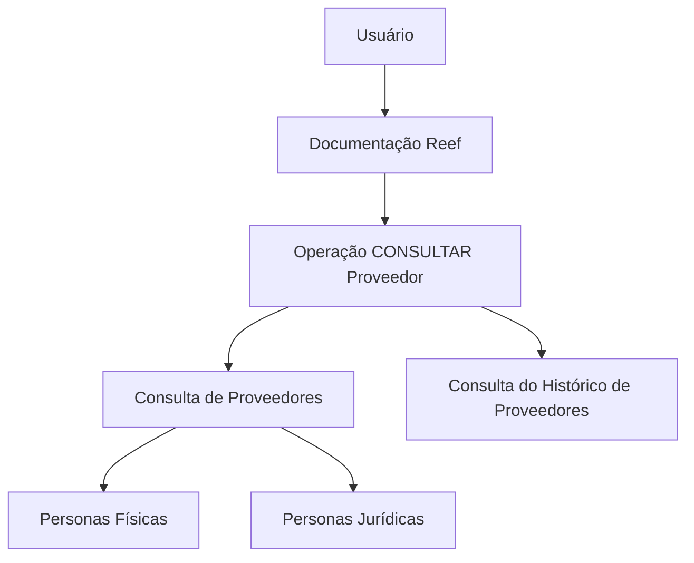

# Operação Consultar Proveedor — Documentação Reef

## 1. Metadados do Documento
- **Arquivo de Origem:** Não identificado
- **Tipo de Documento:** Procedimento
- **Domínio / Sistema:** Reef / Mapfre
- **Público-Alvo:** Negócio e operação
- **Data/Versão Identificada:** Não identificada

---

## 2. Resumo Executivo & Contexto de Negócio

O documento registra a operação **“CONSULTAR Proveedor”** no contexto da documentação Reef. O objetivo explicitamente apresentado é consultar fornecedores e o histórico de fornecedores.

A consulta abrange fornecedores classificados como **Personas Físicas** ou **Personas Jurídicas**. O conteúdo não detalha critérios de busca, campos retornados, permissões, regras de atualização ou navegação específica para executar a consulta.

A página está inserida em um ambiente documental identificado por referências a **Reef**, **Mapfredocument**, **Zeus**, APIs, componentes e Cloud. O documento é marcado com o ciclo de vida **Approved Source**.

O conteúdo disponível é resumido e não descreve arquitetura, contratos técnicos, integrações, tecnologias de implementação ou processos operacionais adicionais.

---

## 3. Arquitetura, Componentes & Tecnologias Envolvidas

Componentes e referências identificados:

- Reef
- Mapfredocument
- Zeus
- APIs
- Componentes
- Cloud
- Documentación
- Operação “CONSULTAR Proveedor”



**Nota de Análise:** O documento cita Reef, Zeus, APIs, Componentes e Cloud na navegação, mas não descreve relações técnicas, chamadas, interfaces, métodos HTTP, contratos JSON ou fluxos de integração entre esses elementos.

---

## 4. Regras de Negócio, Especificações Funcionais & Processos

1. A operação documentada é denominada **“CONSULTAR Proveedor”**.
2. A operação permite a consulta de fornecedores.
3. A operação permite a consulta do histórico de fornecedores.
4. A abrangência declarada inclui fornecedores classificados como **Personas Físicas**.
5. A abrangência declarada inclui fornecedores classificados como **Personas Jurídicas**.
6. O conteúdo não define filtros, chaves de consulta, campos de resultado, ordenação, paginação ou critérios para recuperação do histórico.
7. O conteúdo não especifica se a consulta de fornecedores e a consulta de histórico ocorrem na mesma funcionalidade, em telas distintas ou por meio de APIs diferentes.

---

## 5. Tabelas de Parâmetros, Ambientes e Estruturas de Dados

| Item / Parâmetro | Descrição / Função | Tipo / Valores / Formato | Ambiente / Observações |
| :--- | :--- | :--- | :--- |
| Operação | Funcionalidade documentada | CONSULTAR Proveedor | Documentação Reef |
| Consulta de fornecedores | Consulta de fornecedores | Não detalhado | Abrange pessoas físicas e jurídicas |
| Histórico de fornecedores | Consulta do histórico de fornecedores | Não detalhado | Sem critérios ou estrutura especificados |
| Tipo de fornecedor | Classificação mencionada para fornecedores | Personas Físicas | Sem detalhamento adicional |
| Tipo de fornecedor | Classificação mencionada para fornecedores | Personas Jurídicas | Sem detalhamento adicional |
| Documentação | Referência documental exibida | DOCUMENTACIÓN Reef | Associada a Reef |
| Referência documental | Identificador exibido | Mapfredocument | Sem detalhamento adicional |
| Owner | Responsável exibido | `user:agonzalez_mapfre.com` | Valor preservado conforme conteúdo original |
| Lifecycle | Estado de ciclo de vida | Approved Source | Sem definição adicional |
| Idioma | Idioma exibido na interface | ES | Sem detalhamento adicional |
| Navegação | Opções exibidas | Buscar, Inicio, Soluciones, Arquitecturas, APIs, Componentes, Cloud, Documentación, Zeus, Reef, Ayuda | Itens de navegação; não são especificações funcionais |

---

## 6. Bateria de Perguntas & Respostas para RAG (FAQ Sintético)

### P1: Qual é o objetivo da operação “CONSULTAR Proveedor”?
**R:** A operação “CONSULTAR Proveedor” tem como objetivo consultar fornecedores e consultar o histórico dos fornecedores.

### P2: Quais tipos de fornecedores podem ser consultados?
**R:** O documento informa que a consulta abrange fornecedores que sejam Personas Físicas ou Personas Jurídicas.

### P3: A operação permite consultar o histórico de um fornecedor?
**R:** Sim. O conteúdo declara explicitamente a “Consulta del Histórico de los Proveedores”.

### P4: O documento informa quais campos são retornados pela consulta de fornecedores?
**R:** Não. O documento não descreve campos, atributos, identificadores, filtros ou estrutura de resposta da consulta.

### P5: O documento especifica como pesquisar um fornecedor?
**R:** Não. Embora a navegação apresente a opção “Buscar”, não há detalhamento sobre critérios, filtros ou etapas de pesquisa para a operação “CONSULTAR Proveedor”.

### P6: Há APIs documentadas para a operação “CONSULTAR Proveedor”?
**R:** Não há APIs, endpoints, métodos HTTP, parâmetros ou contratos técnicos descritos. A palavra “APIs” aparece apenas como item de navegação.

### P7: Qual é o sistema ou domínio associado à operação?
**R:** A operação está associada à documentação Reef e também contém a referência “Mapfredocument”. O conteúdo não esclarece a relação técnica entre Reef e Mapfredocument.

### P8: Qual é o status de ciclo de vida apresentado para a documentação?
**R:** O ciclo de vida apresentado é “Approved Source”.

### P9: Quem é o owner indicado no conteúdo?
**R:** O conteúdo apresenta `user:agonzalez_mapfre.com` como owner.

### P10: O documento diferencia o processo para Personas Físicas e Personas Jurídicas?
**R:** Não. O documento apenas afirma que ambos os tipos de fornecedores são abrangidos, sem descrever regras, campos ou etapas distintas.

---

## 7. Glossário de Termos, Siglas & Conceitos-Chave

- **Proveedor:** Fornecedor.
- **Personas Físicas:** Categoria de fornecedor pessoa física mencionada no documento.
- **Personas Jurídicas:** Categoria de fornecedor pessoa jurídica mencionada no documento.
- **Reef:** Nome presente na documentação e na navegação; o papel técnico não é detalhado.
- **Zeus:** Nome presente na navegação; o papel técnico não é detalhado.
- **Mapfredocument:** Referência documental exibida no conteúdo; não há definição adicional.
- **Owner:** Responsável indicado para o conteúdo.
- **Lifecycle:** Campo de ciclo de vida documental.
- **Approved Source:** Valor de ciclo de vida exibido no documento.
- **APIs:** Item de navegação citado, sem especificação de interfaces.
- **Cloud:** Item de navegação citado, sem detalhamento de ambiente ou serviço.

---

## 8. Notas Críticas, Riscos & Limitações

- O conteúdo é resumido e não documenta regras detalhadas para consulta ou histórico de fornecedores.
- Não há informações sobre autenticação, autorização, perfis de acesso ou matriz de permissões.
- Não há campos, formatos, contratos, URLs, ambientes, logs, mensagens de erro ou integrações técnicas especificadas.
- Não há detalhes sobre as diferenças operacionais entre Personas Físicas e Personas Jurídicas.
- **Nota de Análise:** O documento lista Reef, Zeus, APIs, Componentes e Cloud, porém não detalha arquitetura, dependências ou interfaces associadas a esses elementos.

---

## 9. Conteúdo Bruto Estruturado (Referência Fiel)

```text
--- [PÁGINA 1 DE 1] ---

OPERACIÓN CONSULTAR Proveedor
Consulta de los Proveedores y Consulta del Histórico de los Proveedores sean estos Personas Físicas o Personas Jurídicas.
Documentation / DOCUMENTACIÓN Reef
DOCUMENTACIÓN Reef
Mapfredocument
DOCUMENTACIÓN Reef
Owner
user:agonzalez_mapfre.com
Lifecycle
Approved Source
 / 
 VL
Buscar Inicio Soluciones Arquitecturas APIs Componentes Cloud Documentación Zeus Reef Ayuda
ES
```
